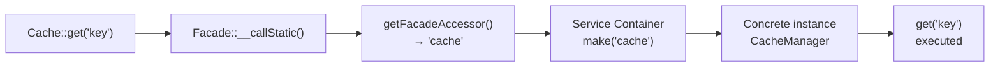

## What are facades?

Facades provide a "static" interface to classes available in the [service container](/en/service-container). Laravel ships with facades that cover almost every feature of the framework, all living in the `Illuminate\Support\Facades` namespace:

```php
use Illuminate\Support\Facades\Cache;
use Illuminate\Support\Facades\Route;

Route::get('/cache', function () {
    return Cache::get('key');
});
```

Laravel facades act as "static proxies" to underlying classes in the service container. You get concise, expressive syntax without losing testability or flexibility.

<Info>
  You don't need to understand every detail of how facades work before using them. Follow the flow, keep learning, and come back to this page when you want to dig deeper.
</Info>

## How facades work

In a Laravel application, a facade is a class that provides access to an object from the container. The mechanism lives in the base `Illuminate\Support\Facades\Facade` class, which every facade extends.

The base class uses PHP's `__callStatic()` magic method to forward calls from your facade to an object resolved from the container. Here's an example:



```php
<?php

namespace App\Http\Controllers;

use Illuminate\Support\Facades\Cache;
use Illuminate\View\View;

class UserController extends Controller
{
    public function showProfile(string $id): View
    {
        $user = Cache::get('user:'.$id);

        return view('profile', ['user' => $user]);
    }
}
```

If you look at the `Cache` facade class, there is no static `get` method defined:

```php
class Cache extends Facade
{
    protected static function getFacadeAccessor(): string
    {
        return 'cache';
    }
}
```

`getFacadeAccessor()` returns the service container binding key. When you call `Cache::get()`, Laravel resolves the `cache` binding from the container and calls `get()` on that object. The static call is just syntactic sugar.

## When to use facades

Facades offer a short, memorable syntax for using Laravel's features without manually injecting or configuring class names. Because PHP's dynamic methods power them behind the scenes, they are easy to test too.

### Watch out for scope creep

The main risk with facades is class "scope creep." Because facades are so easy to use and need no injection, you might keep adding them to a class without noticing it growing too large. With dependency injection, a long constructor serves as a visual warning that a class has too many responsibilities.

<Warning>
  If your class is growing large, consider splitting it into multiple smaller, focused classes.
</Warning>

## Facades vs. dependency injection

A key benefit of dependency injection is the ability to swap implementations during testing—just inject a mock or stub. Since facades proxy calls to objects resolved from the container, you can test them the same way:

```php
use Illuminate\Support\Facades\Cache;

Route::get('/cache', function () {
    return Cache::get('key');
});
```

Write a test that verifies `Cache::get` is called with the right argument:

```php tab=Pest
use Illuminate\Support\Facades\Cache;

test('basic example', function () {
    Cache::shouldReceive('get')
        ->with('key')
        ->andReturn('value');

    $response = $this->get('/cache');

    $response->assertSee('value');
});
```

```php tab=PHPUnit
use Illuminate\Support\Facades\Cache;

public function test_basic_example(): void
{
    Cache::shouldReceive('get')
        ->with('key')
        ->andReturn('value');

    $response = $this->get('/cache');

    $response->assertSee('value');
}
```

## Facades vs. helper functions

Laravel also provides global helper functions for common tasks. In many cases, a helper and its corresponding facade are equivalent:

```php
// Facade
return Illuminate\Support\Facades\View::make('profile');

// Helper function
return view('profile');
```

There is no practical difference. You can test helper-based code via the corresponding facade mock just the same:

```php
use Illuminate\Support\Facades\Cache;

test('cache helper works', function () {
    Cache::shouldReceive('get')
        ->with('key')
        ->andReturn('value');

    $response = $this->get('/cache');

    $response->assertSee('value');
});
```

## Real-time facades

Real-time facades let you treat any class in your application as if it were a facade—without creating a dedicated facade class. To demonstrate, consider a `Podcast` model that needs a `Publisher` to publish itself:

```php
<?php

namespace App\Models;

use App\Contracts\Publisher;
use Illuminate\Database\Eloquent\Model;

class Podcast extends Model
{
    public function publish(Publisher $publisher): void
    {
        $this->update(['publishing' => now()]);

        $publisher->publish($this);
    }
}
```

This works, but every call to `publish` must pass a `Publisher` instance explicitly. With a real-time facade, prefix the imported namespace with `Facades\`:

```php
<?php

namespace App\Models;

use Facades\App\Contracts\Publisher;
use Illuminate\Database\Eloquent\Model;

class Podcast extends Model
{
    public function publish(): void
    {
        $this->update(['publishing' => now()]);

        Publisher::publish($this);
    }
}
```

Laravel resolves the publisher from the container using the portion of the class name after `Facades\`. Testing remains straightforward:

```php tab=Pest
use App\Models\Podcast;
use Facades\App\Contracts\Publisher;
use Illuminate\Foundation\Testing\RefreshDatabase;

pest()->use(RefreshDatabase::class);

test('podcast can be published', function () {
    $podcast = Podcast::factory()->create();

    Publisher::shouldReceive('publish')->once()->with($podcast);

    $podcast->publish();
});
```

```php tab=PHPUnit
use App\Models\Podcast;
use Facades\App\Contracts\Publisher;
use Illuminate\Foundation\Testing\RefreshDatabase;
use Tests\TestCase;

class PodcastTest extends TestCase
{
    use RefreshDatabase;

    public function test_podcast_can_be_published(): void
    {
        $podcast = Podcast::factory()->create();

        Publisher::shouldReceive('publish')->once()->with($podcast);

        $podcast->publish();
    }
}
```

<Tip>
  Real-time facades are ideal when you want to eliminate a constructor parameter while keeping the class easy to mock in tests.
</Tip>

## Testing facades

Use `shouldReceive` to set expectations on a facade. It returns a Mockery mock instance:

```php
use Illuminate\Support\Facades\Cache;

test('show user profile', function () {
    Cache::shouldReceive('get')
        ->once()
        ->with('user:1')
        ->andReturn(['name' => 'Taylor']);

    $response = $this->get('/users/1');

    $response->assertSee('Taylor');
});
```

Common Mockery methods when testing facades:

| Method | Purpose |
|---|---|
| `shouldReceive('method')` | Expect the method to be called |
| `once()` | Expect exactly one call |
| `times(n)` | Expect exactly n calls |
| `with(args)` | Expect specific arguments |
| `andReturn(value)` | Return the given value |
| `andReturnNull()` | Return null |

## Facade class reference

Every built-in facade with its underlying class and service container binding:

| Facade | Class | Binding |
|---|---|---|
| `App` | `Illuminate\Foundation\Application` | `app` |
| `Auth` | `Illuminate\Auth\AuthManager` | `auth` |
| `Cache` | `Illuminate\Cache\CacheManager` | `cache` |
| `Config` | `Illuminate\Config\Repository` | `config` |
| `Cookie` | `Illuminate\Cookie\CookieJar` | `cookie` |
| `Crypt` | `Illuminate\Encryption\Encrypter` | `encrypter` |
| `DB` | `Illuminate\Database\DatabaseManager` | `db` |
| `Event` | `Illuminate\Events\Dispatcher` | `events` |
| `File` | `Illuminate\Filesystem\Filesystem` | `files` |
| `Gate` | `Illuminate\Contracts\Auth\Access\Gate` | — |
| `Hash` | `Illuminate\Contracts\Hashing\Hasher` | `hash` |
| `Http` | `Illuminate\Http\Client\Factory` | — |
| `Log` | `Illuminate\Log\LogManager` | `log` |
| `Mail` | `Illuminate\Mail\Mailer` | `mailer` |
| `Notification` | `Illuminate\Notifications\ChannelManager` | — |
| `Queue` | `Illuminate\Queue\QueueManager` | `queue` |
| `RateLimiter` | `Illuminate\Cache\RateLimiter` | — |
| `Redirect` | `Illuminate\Routing\Redirector` | `redirect` |
| `Request` | `Illuminate\Http\Request` | `request` |
| `Route` | `Illuminate\Routing\Router` | `router` |
| `Schema` | `Illuminate\Database\Schema\Builder` | — |
| `Session` | `Illuminate\Session\SessionManager` | `session` |
| `Storage` | `Illuminate\Filesystem\FilesystemManager` | `filesystem` |
| `URL` | `Illuminate\Routing\UrlGenerator` | `url` |
| `Validator` | `Illuminate\Validation\Factory` | `validator` |
| `View` | `Illuminate\View\Factory` | `view` |

<Card title="Service Container" icon="box" href="/en/service-container">
  Go deeper on how the container resolves classes and manages dependencies.
</Card>
