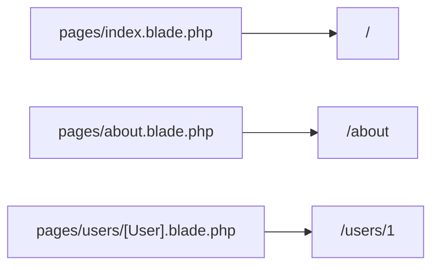

## Introduction

Laravel Folio is a page-based router that lets you define routes by placing Blade files.
Unlike the traditional `routes/web.php`-centered approach, Folio maps your filesystem structure directly to URLs.

It works especially well for content-heavy sites and admin screens where you want to add pages quickly.
For areas that need fine-grained HTTP control, such as APIs, it is practical to combine Folio with standard routing.

## Installation

First, add Folio with Composer.

```bash
composer require laravel/folio
php artisan folio:install
```

`folio:install` registers Folio's service provider.
By default, the page directory is `resources/views/pages/`.
If you want to use multiple page directories or base URIs, configure `Folio::path()` and `uri()` in the service provider's `boot` method.

```php
use Laravel\Folio\Folio;

Folio::path(resource_path('views/pages/guest'))->uri('/');

Folio::path(resource_path('views/pages/admin'))
    ->uri('/admin');
```

## Creating routes

Folio automatically generates URLs from Blade file names under mounted directories.

```text
resources/views/pages/schedule.blade.php -> /schedule
```

```bash
php artisan folio:list
```

### Nested routes

If you nest directories, URLs follow the same nested structure.

```bash
php artisan folio:page user/profile
# pages/user/profile.blade.php -> /user/profile
```

### Index routes

`index.blade.php` maps to the root of its directory.

```bash
php artisan folio:page index
# pages/index.blade.php -> /

php artisan folio:page users/index
# pages/users/index.blade.php -> /users
```

## Route parameters

Use `[]` in file names to capture URL segments.

```bash
php artisan folio:page "users/[id]"
# pages/users/[id].blade.php -> /users/1
```

```blade
<div>User {{ $id }}</div>
```

Use `...` when you need to capture multiple segments.

```bash
php artisan folio:page "users/[...ids]"
# pages/users/[...ids].blade.php -> /users/1/2/3
```

```blade
@foreach ($ids as $id)
    <li>User {{ $id }}</li>
@endforeach
```

## Route model binding

If you use a model name like `[User].blade.php`, the model is resolved automatically.

```bash
php artisan folio:page "users/[User]"
# pages/users/[User].blade.php -> /users/1
```

```blade
<div>User {{ $user->id }}</div>
```

If you also need to handle soft-deleted models, call `withTrashed()` inside the page.

```php
<?php

use function Laravel\Folio\withTrashed;

withTrashed();
```

<Info>
  If you write `[Post:slug].blade.php`, model binding can use a key other than `id` (for example, `slug`).
</Info>

## Middleware

To apply middleware to a specific page, use `middleware()` in the page template.

```php
<?php

use function Laravel\Folio\middleware;

middleware(['auth', 'verified']);
```

To apply middleware to multiple pages at once, use `Folio::path(...)->middleware()`.

```php
<?php

use Laravel\Folio\Folio;

Folio::path(resource_path('views/pages'))->middleware([
    'admin/*' => ['auth', 'verified'],
]);
```

## Named routes

You can also assign route names to Folio pages with `name()`.

```php
<?php

use function Laravel\Folio\name;

name('users.index');
```

<Info>
  If you define `name('users.show')` on a detail page like `users/[User].blade.php`, you can generate parameterized URLs with `route('users.show', ['user' => $user])`.
</Info>

You can generate URLs for assigned route names using the `route()` helper.

```php
route('users.index');
route('users.show', ['user' => $user]);
```

## File-to-URL mapping



## Comparison with traditional routing

| Feature | Standard routing | Folio |
| --- | --- | --- |
| Route definition | `routes/web.php` | Automatic from file names |
| Controller | Required (or closure) | Not required (directly in Blade) |
| Best use cases | APIs, SPAs, complex HTTP control | Content sites, admin screens |

<Tip>
  Even when using Folio, enabling route caching with `php artisan route:cache` helps optimize production performance.
</Tip>
