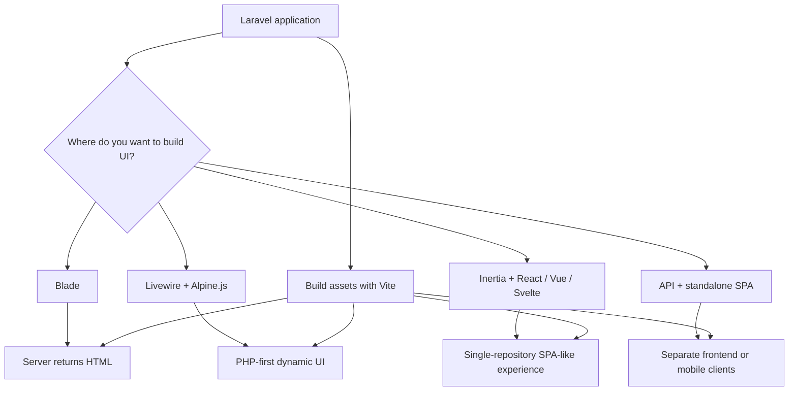

## Overview

Laravel is a backend framework, but it also aims to give you a strong full-stack developer experience. In Laravel 13, you can build the frontend primarily with PHP or pair Laravel with modern JavaScript frameworks such as React, Vue, and Svelte.

To choose the right approach, focus on three questions:

- Do you want to write most UI logic in **PHP**?
- Do you want to write most UI logic in **JavaScript / TypeScript**?
- Do you want one repository, or a separate API and SPA?

## Using PHP

### Blade

[Blade](/en/blade) is Laravel's built-in templating engine. You return views from routes or controllers, and Laravel renders HTML on the server before sending it to the browser.

**Strengths**

- Integrates naturally with Laravel routing, validation, and authentication
- Keeps your stack simple and approachable
- Works well for SEO-focused pages and fast initial render

**Trade-offs**

- Full page reloads are more common during navigation and form submission
- Rich interactions usually need some JavaScript on top

Blade is a strong fit for dashboards, internal tools, content-heavy pages, and form-driven applications.

### Livewire

[Laravel Livewire](https://livewire.laravel.com) lets you build more dynamic interfaces while still working mainly in PHP and Blade. It is a good fit for modals, filtering, inline editing, and other interactive patterns that do not require a full client-side SPA architecture.

**Strengths**

- Lets you stay in PHP while building reactive UI
- Works naturally with Laravel validation and application state
- Pairs well with Alpine.js when you only need a little client-side behavior

**Trade-offs**

- Complex client-side state management is not its primary strength
- Very large SPA-style interfaces may be easier to manage with a JavaScript framework

<Tip>
  For a deeper introduction, see [Livewire introduction](/en/blog/livewire-introduction).
</Tip>

### PHP-first starter kits

Laravel 13's [starter kits](/en/starter-kits) include a **Livewire** option for teams that want a PHP-first path to dynamic UI. You can absolutely start with plain Blade on your own, but Livewire is the PHP-first starter-kit option that ships with authentication, layout scaffolding, and Vite integration out of the box.

## Using JavaScript frameworks

### Inertia + React / Vue / Svelte

[Inertia](https://inertiajs.com) bridges Laravel's routes, controllers, and authentication with a modern React, Vue, or Svelte frontend. You keep Laravel as the application backend while building page components with a JavaScript framework inside the same repository.

**Strengths**

- Gives you the component model and ecosystem of React, Vue, or Svelte
- Keeps routing and authentication anchored in Laravel
- Makes it easier to ship a modern frontend without splitting the codebase

**Trade-offs**

- Adds more tools and concepts than a Blade-only stack
- Usually requires familiarity with Node.js tooling and often TypeScript

Laravel 13's official starter kits let you begin directly with **React / Vue / Svelte + Inertia**.

<Tip>
  See [Inertia introduction](/en/blog/inertia-introduction), [React introduction](/en/blog/react-introduction), [Vue introduction](/en/blog/vue-introduction), and [Svelte introduction](/en/blog/svelte-introduction) for more detail.
</Tip>

### When to choose a separate SPA and API

You can also keep Laravel as an API backend and build a completely separate SPA or mobile client. This is a good fit when multiple clients need to share the same backend.

In that setup, Laravel usually handles:

- API routes
- Authentication and authorisation, often via [Sanctum](/en/sanctum)
- JSON shaping through tools like [Eloquent API resources](/en/eloquent-resources)

**Strengths**

- Easier to support web, mobile, and other clients from one backend
- Lets the frontend evolve independently from the Laravel app

**Trade-offs**

- Authentication, data fetching, and deployment become more involved
- The architecture is more complex than a single Laravel repository

### JavaScript-first starter kits

With Laravel's [starter kits](/en/starter-kits), you can start from a preconfigured Inertia, React / Vue / Svelte, Tailwind CSS, and Vite stack. Authentication screens are already scaffolded, so you can move quickly into product-specific UI work.

## Bundling assets with Vite

No matter which frontend approach you choose, Laravel 13 typically uses [Vite](/en/vite) to build CSS and JavaScript assets. In Blade and Livewire applications, Vite handles styles and progressive enhancements. In Inertia applications, it bundles the full frontend entry point.

Vite gives you:

- Fast local development with HMR
- Bundled and versioned production assets
- Tight integration with Laravel's `@vite()` directive

<Info>
  Laravel 13 starter kits already ship with a Vite-based frontend setup.
</Info>

## Comparing the approaches

| Approach | Best for | Strengths | Trade-offs |
| --- | --- | --- | --- |
| Blade | Content-heavy pages and form-driven dashboards | Simple, approachable, and tightly integrated with Laravel | Rich UI often leads to more full page refreshes |
| Livewire | Business apps that want dynamic UI without leaving PHP | Reactive interfaces while staying in the Laravel mindset | Less ideal for very complex client-side state |
| Inertia + React / Vue / Svelte | Teams that want a modern frontend without splitting the backend | Single-repository SPA-like workflow with Laravel routing and auth | Requires more frontend tooling knowledge |
| API + standalone SPA | Products with multiple clients or mobile apps | Frontend can evolve independently and serve many clients | Authentication, deployment, and operations are more complex |

## Next steps

<CardGroup cols={2}>
  <Card title="Blade templates" icon="file-code-2" href="/en/blade">
    Learn the basics of Laravel's server-rendered view layer.
  </Card>
  <Card title="Starter kits" icon="rocket" href="/en/starter-kits">
    Compare the React, Vue, Svelte, and Livewire starting points.
  </Card>
  <Card title="Vite and Asset Bundling" icon="package" href="/en/vite">
    Review the development server, HMR, and production build workflow.
  </Card>
  <Card title="Inertia introduction" icon="panels-top-left" href="/en/blog/inertia-introduction">
    See how Laravel and a JavaScript framework work together in one app.
  </Card>
</CardGroup>
