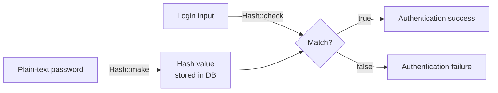
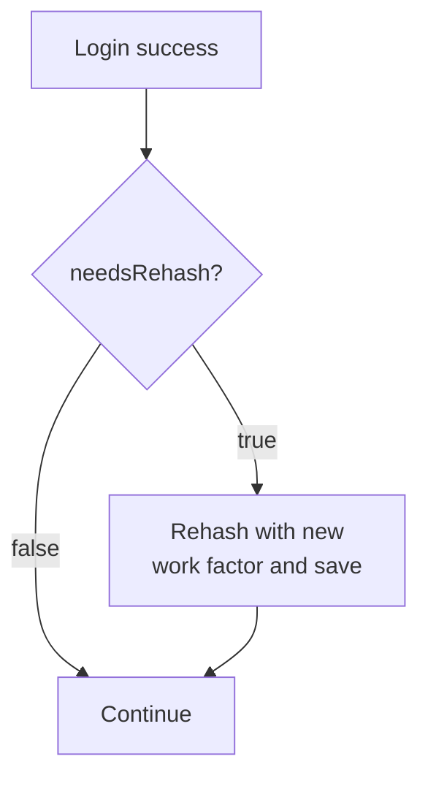

## What is hashing

Hashing converts plain-text data such as passwords into a fixed-length string through a one-way transformation.
The same input always produces the same hash, but you cannot recover the original plain text from a hash.

Laravel's `Hash` facade supports **bcrypt** and **Argon2** hashing algorithms for secure password storage.

### Algorithm comparison

| Algorithm | Characteristics | Recommended use |
| --- | --- | --- |
| **bcrypt** | Work factor (rounds) controls computation cost. Default driver | General web applications |
| **argon2i** | Configurable memory, time, and threads. Resistant to side-channel attacks | High-security scenarios |
| **argon2id** | Hybrid of argon2i and argon2d. Recommended by the PHC | New projects using Argon2 |

<Info>
  The bcrypt "work factor" controls how long it takes to generate a hash. A slower hash increases resistance to brute-force attacks. As hardware becomes faster, you can raise the work factor to maintain security.
</Info>

### Hashing and verification flow



---

## Configuration

By default, Laravel uses the `bcrypt` driver. You can change it with the `HASH_DRIVER` environment variable.

```ini
# .env
HASH_DRIVER=bcrypt  # bcrypt / argon / argon2id
```

To customize hashing options, publish the configuration file with `config:publish`.

```shell
php artisan config:publish hashing
```

After publishing, edit `config/hashing.php` to adjust default work factors and other settings.

---

## Basic usage

### Hashing a password

Pass a plain-text password to `Hash::make()` to get a hash. Store this hash value in your database.

```php
<?php

namespace App\Http\Controllers;

use Illuminate\Http\RedirectResponse;
use Illuminate\Http\Request;
use Illuminate\Support\Facades\Hash;

class PasswordController extends Controller
{
    public function update(Request $request): RedirectResponse
    {
        $request->validate([
            'password' => ['required', 'min:8', 'confirmed'],
        ]);

        $request->user()->fill([
            'password' => Hash::make($request->password),
        ])->save();

        return redirect('/profile');
    }
}
```

<Warning>
  Store hash values in your database. Never store plain-text passwords.
</Warning>

### Adjusting the bcrypt work factor

Use the `rounds` option to control the computation cost of hash generation. Higher values are more secure but slower.
The default value of 12 is appropriate for most applications.

```php
$hashed = Hash::make('plain-text-password', [
    'rounds' => 14,
]);
```

### Adjusting the Argon2 work factor

When using Argon2, adjust the computation cost with the `memory`, `time`, and `threads` options.

```php
$hashed = Hash::make('plain-text-password', [
    'memory'  => 65536, // in KiB
    'time'    => 4,
    'threads' => 2,
]);
```

| Option | Description | Default |
| --- | --- | --- |
| `memory` | Memory to use (KiB) | 65536 |
| `time` | Number of iterations | 4 |
| `threads` | Number of threads | 1 |

<Tip>
  For details on these options, see the [official PHP documentation on password_hash](https://secure.php.net/manual/en/function.password-hash.php).
</Tip>

---

## Verifying a password

Use `Hash::check()` to verify that a plain-text password matches a stored hash.
This is typically used inside login logic.

```php
use Illuminate\Support\Facades\Hash;

if (Hash::check($request->password, $user->password)) {
    // Passwords match
} else {
    // Passwords do not match
}
```

When using `Auth::attempt()`, this comparison happens automatically. You call `Hash::check()` directly when you need to manually verify a password, such as confirming the current password before a change.

```php
// Confirm current password before allowing a password change
if (! Hash::check($request->current_password, $request->user()->password)) {
    return back()->withErrors(['current_password' => 'The current password is incorrect.']);
}
```

---

## Determining if a password needs rehashing

`Hash::needsRehash()` checks whether the work factor used to hash a password differs from the current configuration.
Use this to update existing hashes when you raise the work factor.

```php
use Illuminate\Support\Facades\Hash;

if (Hash::needsRehash($user->password)) {
    $user->update([
        'password' => Hash::make($plainTextPassword),
    ]);
}
```

A common pattern is to rehash on successful login.



```php
// Rehash during login
if (Auth::attempt($credentials)) {
    if (Hash::needsRehash(Auth::user()->password)) {
        Auth::user()->update([
            'password' => Hash::make($credentials['password']),
        ]);
    }

    return redirect()->intended('/dashboard');
}
```

<Tip>
  Review your work factor periodically as hardware improves. Using `needsRehash()` during login lets you update passwords transparently without requiring users to take any action.
</Tip>

---

## Hash algorithm verification

By default, `Hash::check()` verifies that the given hash was generated using the application's configured algorithm.
If the algorithms differ, a `RuntimeException` is thrown.

This protects against hash algorithm manipulation attacks.

If you need to support multiple algorithms simultaneously — for example, during a migration from one algorithm to another — you can disable this verification by setting `HASH_VERIFY` to `false`.

```ini
# .env
HASH_VERIFY=false
```

<Warning>
  Setting `HASH_VERIFY=false` disables algorithm verification. Use this only during a migration period and restore it to `true` (the default) once the migration is complete.
</Warning>

---

## Summary

| Goal | How |
| --- | --- |
| Hash a password | `Hash::make($password)` |
| Verify a hash | `Hash::check($plain, $hash)` |
| Check if rehashing is needed | `Hash::needsRehash($hash)` |
| Change the hashing driver | `HASH_DRIVER` environment variable |
| Disable algorithm verification | `HASH_VERIFY=false` |

## Next steps

<Card title="Authentication" icon="lock" href="/en/authentication">
  Learn how login flows use `Hash::check()` and how Laravel's authentication system works end to end.
</Card>
