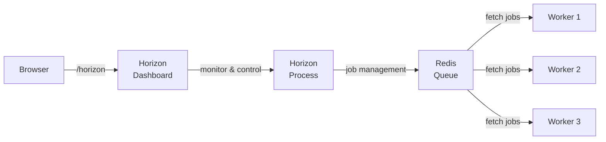

## What is Horizon?

[Laravel Horizon](https://github.com/laravel/horizon) provides a beautiful dashboard and code-driven configuration for Laravel **Redis queues**. It lets you monitor job throughput, runtime, and failures in real time while managing all worker configuration in a single version-controlled file.

<Info>
  Horizon extends Laravel's core queue system. Make sure you are familiar with [Queues & Jobs](/en/queues) before proceeding. A running [Redis](/en/redis) instance is also required.
</Info>



## Installation

<Warning>
  Horizon requires Redis as the queue backend. Ensure `QUEUE_CONNECTION=redis` is set in your `.env` file. Horizon is not compatible with Redis Cluster at this time.
</Warning>

Install Horizon via Composer:

```shell
composer require laravel/horizon
```

Publish Horizon's assets and configuration:

```shell
php artisan horizon:install
```

This generates `config/horizon.php` and `app/Providers/HorizonServiceProvider.php`.

## Configuration

### config/horizon.php overview

All worker configuration lives in `config/horizon.php`. The core option is `environments`, which defines worker process options per environment.

```php
'environments' => [
    'production' => [
        'supervisor-1' => [
            'connection' => 'redis',
            'queue' => ['default', 'notifications'],
            'balance' => 'auto',
            'autoScalingStrategy' => 'time',
            'minProcesses' => 1,
            'maxProcesses' => 10,
            'balanceMaxShift' => 1,
            'balanceCooldown' => 3,
            'tries' => 3,
            'timeout' => 60,
        ],
    ],

    'local' => [
        'supervisor-1' => [
            'maxProcesses' => 3,
        ],
    ],
],
```

<Info>
  Horizon reserves the `horizon` Redis connection name internally. Do not assign this name to another connection in `config/database.php`.
</Info>

### Supervisors

Each environment can contain one or more **supervisors**. A supervisor manages a group of worker processes and handles balancing across queues. You can define multiple supervisors per environment to apply different strategies to different queues.

### Default values

Use the `defaults` option to specify configuration values shared across all supervisors, reducing repetition.

```php
'defaults' => [
    'supervisor-1' => [
        'connection' => 'redis',
        'queue' => ['default'],
        'balance' => 'auto',
        'tries' => 1,
        'timeout' => 60,
        'maxProcesses' => 1,
    ],
],
```

### Maintenance mode

When the application is in maintenance mode, Horizon stops processing jobs by default. To force processing, set `force` to `true`:

```php
'environments' => [
    'production' => [
        'supervisor-1' => [
            'force' => true,
        ],
    ],
],
```

### Max job attempts

```php
'environments' => [
    'production' => [
        'supervisor-1' => [
            'tries' => 10,
        ],
    ],
],
```

Setting `tries` to `0` allows unlimited attempts.

### Job timeout

```php
'environments' => [
    'production' => [
        'supervisor-1' => [
            'timeout' => 60,
        ],
    ],
],
```

<Warning>
  The `timeout` value should always be at least a few seconds shorter than the `retry_after` value in `config/queue.php`. When using the `auto` balance strategy, Horizon force-kills workers that exceed the timeout during scale-down.
</Warning>

### Job backoff

Specify how long Horizon waits before retrying a job that encountered an exception.

```php
// Fixed delay
'backoff' => 10,

// Exponential backoff (1s, 5s, 10s, then 10s for subsequent retries)
'backoff' => [1, 5, 10],
```

## Balancing strategies

Horizon offers three worker balancing strategies.

<AccordionGroup>
  <Accordion title="auto (default)">
    Automatically adjusts the number of worker processes per queue based on current workload. Configure the range with `minProcesses` and `maxProcesses`.

    ```php
    'supervisor-1' => [
        'balance' => 'auto',
        'autoScalingStrategy' => 'time', // or 'size'
        'minProcesses' => 1,
        'maxProcesses' => 10,
        'balanceMaxShift' => 1,
        'balanceCooldown' => 3,
    ],
    ```

    - `time` — scales based on estimated time to clear the queue
    - `size` — scales based on number of jobs in the queue

    <Info>
      With `auto` balancing, queue order does not imply priority. Use multiple supervisors with explicit resource limits to enforce priorities.
    </Info>
  </Accordion>

  <Accordion title="simple">
    Distributes a fixed number of worker processes evenly across the specified queues.

    ```php
    'supervisor-1' => [
        'balance' => 'simple',
        'processes' => 10,
        'queue' => ['default', 'notifications'],
    ],
    ```

    The example above assigns 5 processes to each queue.
  </Accordion>

  <Accordion title="false (no balancing)">
    Processes queues strictly in the listed order, similar to Laravel's default queue system. Horizon still scales worker count as jobs accumulate.

    ```php
    'supervisor-1' => [
        'balance' => false,
        'queue' => ['default', 'notifications'],
        'minProcesses' => 1,
        'maxProcesses' => 10,
    ],
    ```

    Jobs in `default` are always processed before `notifications`.
  </Accordion>
</AccordionGroup>

## Dashboard authorization

The Horizon dashboard is accessible at `/horizon`. In local environments, it is open to everyone by default. In **non-local** environments, access is controlled by the authorization gate in `app/Providers/HorizonServiceProvider.php`.

```php
use App\Models\User;
use Illuminate\Support\Facades\Gate;

protected function gate(): void
{
    Gate::define('viewHorizon', function (User $user) {
        return in_array($user->email, [
            'admin@example.com',
        ]);
    });
}
```

If you secure Horizon via IP restrictions rather than authentication, make the user argument optional:

```php
Gate::define('viewHorizon', function (User $user = null) {
    return true;
});
```

## Running Horizon

### Artisan commands

```shell
# Start Horizon
php artisan horizon

# Pause / resume all workers
php artisan horizon:pause
php artisan horizon:continue

# Pause / resume a specific supervisor
php artisan horizon:pause-supervisor supervisor-1
php artisan horizon:continue-supervisor supervisor-1

# Check status
php artisan horizon:status
php artisan horizon:supervisor-status supervisor-1

# Gracefully terminate (waits for running jobs to finish)
php artisan horizon:terminate
```

### Auto-restart during development

Use `horizon:listen` to automatically restart Horizon when files change.

```shell
npm install --save-dev chokidar
php artisan horizon:listen

# Inside Docker or Vagrant
php artisan horizon:listen --poll
```

### Keeping Horizon running with Supervisor

In production, use Supervisor to ensure Horizon restarts automatically if it stops.

#### Install Supervisor

```shell
sudo apt-get install supervisor
```

#### Supervisor configuration

Create `/etc/supervisor/conf.d/horizon.conf`:

```ini
[program:horizon]
process_name=%(program_name)s
command=php /home/forge/example.com/artisan horizon
autostart=true
autorestart=true
user=forge
redirect_stderr=true
stdout_logfile=/home/forge/example.com/horizon.log
stopwaitsecs=3600
```

<Warning>
  Set `stopwaitsecs` to a value greater than your longest-running job's duration. Otherwise Supervisor will kill the job before it finishes.
</Warning>

#### Start Supervisor

```shell
sudo supervisorctl reread
sudo supervisorctl update
sudo supervisorctl start horizon
```

#### On deployment

Terminate Horizon during each deployment so the process monitor restarts it with your new code:

```shell
php artisan horizon:terminate
```

With `autostart=true` and `autorestart=true` in the Supervisor config, Horizon will start back up automatically.

## Managing jobs

### Tags

Horizon automatically tags jobs based on the Eloquent models they receive.

```php
// Dispatching with Video id=1 automatically adds the tag "App\Models\Video:1"
RenderVideo::dispatch(Video::find(1));
```

Define custom tags by implementing a `tags()` method on the job:

```php
class RenderVideo implements ShouldQueue
{
    /**
     * @return array<int, string>
     */
    public function tags(): array
    {
        return ['render', 'video:'.$this->video->id];
    }
}
```

For queued event listeners, the event instance is automatically passed to `tags()`:

```php
class SendRenderNotifications implements ShouldQueue
{
    public function tags(VideoRendered $event): array
    {
        return ['video:'.$event->video->id];
    }
}
```

### Silencing jobs

Hide specific jobs from the "Completed Jobs" list by adding them to the `silenced` option in `config/horizon.php`.

```php
'silenced' => [
    App\Jobs\ProcessPodcast::class,
],

// Silence by tag
'silenced_tags' => [
    'notifications',
],
```

Alternatively, implement the `Silenced` interface directly on the job class:

```php
use Laravel\Horizon\Contracts\Silenced;

class ProcessPodcast implements ShouldQueue, Silenced
{
    use Queueable;
    // ...
}
```

## Metrics and monitoring

Horizon's metrics dashboard shows job and queue throughput and wait times. Schedule the `horizon:snapshot` command to populate it.

```php
// routes/console.php
use Illuminate\Support\Facades\Schedule;

Schedule::command('horizon:snapshot')->everyFiveMinutes();
```

Clear all metric data with:

```shell
php artisan horizon:clear-metrics
```

## Job failure notifications

Receive notifications when a queue's wait time exceeds a threshold. Configure notification recipients in the `boot()` method of `app/Providers/HorizonServiceProvider.php`.

```php
use Laravel\Horizon\Horizon;

public function boot(): void
{
    parent::boot();

    Horizon::routeMailNotificationsTo('admin@example.com');
    Horizon::routeSlackNotificationsTo('slack-webhook-url', '#ops');
    Horizon::routeSmsNotificationsTo('15556667777');
}
```

### Wait time thresholds

Configure how many seconds constitute a "long wait" in `config/horizon.php`:

```php
'waits' => [
    'redis:critical' => 30,
    'redis:default' => 60,
    'redis:batch' => 120,
],
```

Setting a threshold to `0` disables notifications for that queue.

## Managing failed jobs

Delete a specific failed job by ID or UUID:

```shell
php artisan horizon:forget 5

# Delete all failed jobs
php artisan horizon:forget --all
```

Clear all pending jobs from a queue:

```shell
# Clear the default queue
php artisan horizon:clear

# Clear a specific queue
php artisan horizon:clear --queue=emails
```

## Upgrading Horizon

When upgrading to a new major version, review the [Horizon upgrade guide](https://github.com/laravel/horizon/blob/master/UPGRADE.md) carefully.

## Related pages

<CardGroup cols={2}>
  <Card title="Queues & Jobs" href="/en/queues">
    Laravel queue fundamentals: job creation, dispatch, batches, and failed job handling.
  </Card>
  <Card title="Redis" href="/en/redis">
    Configure and use Redis — the required backend for Horizon.
  </Card>
</CardGroup>
