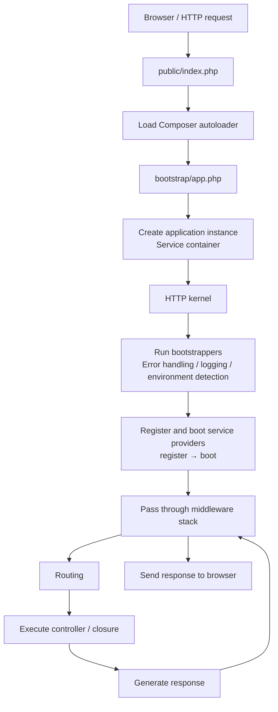
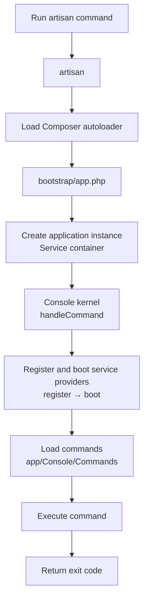

## Introduction

When you use a tool in the real world, you feel more confident when you understand how it works. The same applies to application development. Understanding how your development tools function makes you more comfortable and confident building applications.

This page provides a high-level overview of how the Laravel framework operates. Getting to know the framework at a higher level removes the feeling of "magic" and gives you greater confidence when building applications.

## HTTP request lifecycle

### Overview



### First steps

The entry point for all requests to a Laravel application is the `public/index.php` file. All requests are directed to this file by your web server (Apache or Nginx) configuration. The `index.php` file itself contains little code — it is a starting point for loading the rest of the framework.

The `index.php` file loads the Composer-generated autoloader definition and then retrieves an instance of the Laravel application from `bootstrap/app.php`. The first action Laravel takes is to create an instance of the application / [service container](/en/service-container).

### HTTP kernel

The incoming request is then sent to the HTTP kernel (`Illuminate\Foundation\Http\Kernel`), which is processed via the `handleRequest` method on the application instance.

The HTTP kernel defines an array of **bootstrappers** that run before the request is executed. These bootstrappers:

- Configure error handling
- Configure logging
- [Detect the application environment](/en/installation)
- Perform other tasks that need to happen before the request is handled

The HTTP kernel is also responsible for passing the request through the application's middleware stack. These middlewares handle reading and writing the [HTTP session](/en/session), determining whether the application is in maintenance mode, [verifying the CSRF token](/en/middleware), and more.

The method signature for the HTTP kernel's `handle` method is simple: it receives a `Request` and returns a `Response`. Think of the kernel as a big black box that represents your entire application — feed it HTTP requests and it returns HTTP responses.

### Service providers

One of the most important kernel bootstrapping actions is loading the [service providers](/en/service-providers) for your application. Service providers are responsible for bootstrapping all of the framework's various components, such as the database, queue, validation, and routing components.

Laravel iterates through the list of providers and instantiates each one. After all providers are instantiated, the `register` method is called on each. Then, once all providers are registered, the `boot` method is called on each. This ensures that service providers can rely on every container binding being registered and available by the time their `boot` method executes.

<Info>
  User-defined and third-party service providers are registered in the `bootstrap/providers.php` file.
</Info>

### Routing

Once the application is bootstrapped and all service providers are registered, the `Request` is handed off to the router for dispatching. The router dispatches the request to a route or controller and runs any route-specific middleware.

Middleware provide a convenient mechanism for filtering or inspecting HTTP requests entering your application. For example, Laravel includes a middleware that verifies whether the user is authenticated. If the user is not authenticated, the middleware redirects them to the login screen. If they are authenticated, the request proceeds further into the application.

Once the request passes through all of the middleware assigned to the matched route, the route or controller method is executed and a response is returned.

### Returning the response

Once the route or controller method returns a response, it travels back out through the route's middleware, giving the application a chance to modify or inspect the outgoing response.

Finally, once the response travels back through the middleware, the HTTP kernel's `handle` method returns the response object to the `handleRequest` method on the application instance, which calls `send` on the returned response. The `send` method delivers the response content to the user's web browser. This completes the entire Laravel request lifecycle.

## Console command lifecycle

### Overview



### The artisan entry point

The entry point for console commands is the `artisan` file in the project root. Just like an HTTP request, the Composer autoloader is loaded and a Laravel application instance is created.

The application instance's `handleCommand` method then passes control to the console kernel.

### Console kernel and command execution

The console kernel loads service providers the same way the HTTP kernel does. Once all providers are registered and booted, commands from `app/Console/Commands` are loaded and the specified command is executed.

```shell
php artisan make:controller UserController
```

This command is processed as follows:

1. The `artisan` file loads the Composer autoloader
2. An application instance is created from `bootstrap/app.php`
3. The console kernel loads service providers
4. The `make:controller` command is found and executed
5. An exit code is returned

## Focus on service providers

Service providers are truly the key to bootstrapping a Laravel application. The application instance is created, the service providers are registered, and the request is handed off to the bootstrapped application. It really is that simple.

Having a firm grasp of how a Laravel application is built and bootstrapped via service providers is very valuable. Your application's user-defined service providers are stored in the `app/Providers` directory.

<Info>
  The default `AppServiceProvider` is mostly empty. This provider is a great place to add your application's own bootstrapping and service container bindings. For large applications, you may wish to create several service providers, each with more granular bootstrapping for specific services used by your application.
</Info>

### Difference between register and boot

Service providers have two primary methods:

| Method | Timing | Purpose |
| --- | --- | --- |
| `register` | Called on all providers after instantiation | Only register bindings in the service container |
| `boot` | Called after all `register` methods have completed | View composers, event listeners, and other initialization |

<Warning>
  Do not register event listeners, routes, or other functionality inside the `register` method. You may accidentally use a service provided by a service provider that has not yet been loaded.
</Warning>

## Next steps

<Card title="Service container" icon="box" href="/en/service-container">
  Understand how dependency injection and the service container work.
</Card>

<Card title="Service providers" icon="plug" href="/en/service-providers">
  Learn how to bootstrap your application using service providers.
</Card>
