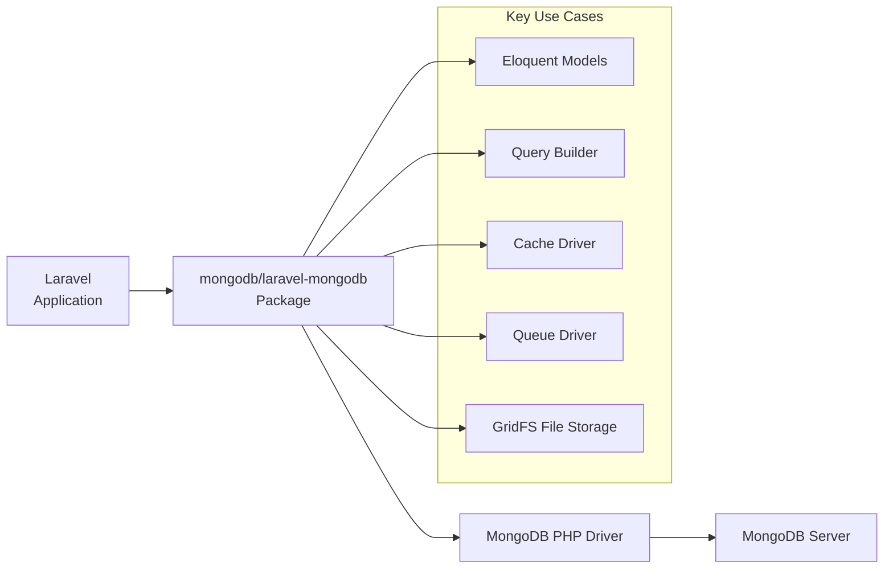
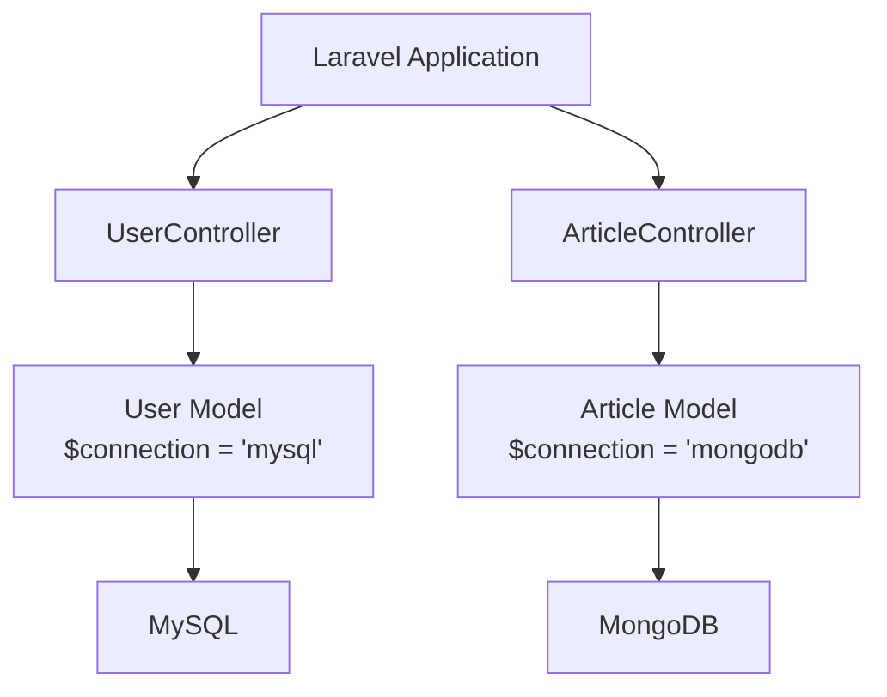

## Introduction

[MongoDB](https://www.mongodb.com/resources/products/fundamentals/why-use-mongodb) is one of the most popular NoSQL document-oriented databases. It features high write performance (ideal for analytics and IoT), high availability (automatic failover with replica sets), horizontal scalability (sharding), and a powerful query language (aggregation, full-text search, geospatial queries).

Unlike SQL databases' row and column format, each record in MongoDB is a document in BSON (Binary JSON) format. Your application retrieves this data in JSON format.



<Info>
  When using MongoDB with Laravel, it is recommended to use the `mongodb/laravel-mongodb` package, which is maintained by MongoDB. This package provides rich integration with Eloquent and various Laravel features.
</Info>

## Installation

### MongoDB PHP Driver

The `mongodb` PHP extension is required to connect to MongoDB. If you're using [Laravel Herd](https://herd.laravel.com) or `php.new`, it's already installed. To install manually, use PECL:

```shell
pecl install mongodb
```

For detailed installation instructions, see the [MongoDB PHP Driver Installation Guide](https://www.php.net/manual/en/mongodb.installation.php).

<Warning>
  Ensure the `mongodb` PHP extension is enabled in both your CLI and web server configurations, as they may differ.
</Warning>

### Starting MongoDB Server

MongoDB Community Server can be used for local development. For installation instructions on Windows, macOS, Linux, and Docker, see the [official installation guide](https://docs.mongodb.com/manual/administration/install-community/).

**Using Docker:**

```yaml
# docker-compose.yml
services:
  mongodb:
    image: mongo:8
    ports:
      - "27017:27017"
    environment:
      MONGO_INITDB_ROOT_USERNAME: root
      MONGO_INITDB_ROOT_PASSWORD: password
      MONGO_INITDB_DATABASE: laravel_app
    volumes:
      - mongodb_data:/data/db

volumes:
  mongodb_data:
```

```shell
docker compose up -d
```

For cloud hosting, [MongoDB Atlas](https://www.mongodb.com/cloud/atlas) is available. To access an Atlas cluster locally, you need to add your IP address to the project's IP access list.

### Installing the laravel-mongodb Package

Install the `mongodb/laravel-mongodb` package using Composer:

```shell
composer require mongodb/laravel-mongodb
```

## Configuration

### Environment Variables

Add MongoDB connection information to your `.env` file:

```ini
MONGODB_URI="mongodb://localhost:27017"
MONGODB_DATABASE="laravel_app"
```

If using MongoDB Atlas, change the connection string to your Atlas connection string:

```ini
MONGODB_URI="mongodb+srv://<username>:<password>@<cluster>.mongodb.net/<dbname>?retryWrites=true&w=majority"
MONGODB_DATABASE="laravel_app"
```

### config/database.php

Add a `mongodb` connection to the `connections` array in `config/database.php`:

```php
'connections' => [

    // ... existing connections ...

    'mongodb' => [
        'driver' => 'mongodb',
        'dsn' => env('MONGODB_URI', 'mongodb://localhost:27017'),
        'database' => env('MONGODB_DATABASE', 'laravel_app'),
    ],

],
```

<Tip>
  If you're using both relational databases like MySQL and MongoDB simultaneously, simply keep the `default` connection unchanged and add the `mongodb` connection. You can switch connections per model.
</Tip>

## Key Features

### Eloquent Models

By extending `MongoDB\Laravel\Eloquent\Model`, you can work with MongoDB using almost the same API as standard Eloquent models:

```php
<?php

namespace App\Models;

use MongoDB\Laravel\Eloquent\Model;

class Article extends Model
{
    protected $connection = 'mongodb';
    protected $collection = 'articles'; // Collection name (auto-generated from class name if omitted)

    protected $fillable = [
        'title',
        'body',
        'tags',
        'published_at',
    ];
}
```

<Info>
  MongoDB is schema-less, so migrations are not required. Collections are created automatically when you save documents.
</Info>

#### Basic CRUD Operations

You can use the same API as standard Eloquent:

```php
use App\Models\Article;

// Create
$article = Article::create([
    'title' => 'Getting Started with MongoDB',
    'body' => 'MongoDB is a document-oriented database.',
    'tags' => ['nosql', 'mongodb', 'laravel'],
    'published_at' => now(),
]);

// Read
$article = Article::find('64f1a2b3c4d5e6f7a8b9c0d1');
$articles = Article::where('tags', 'nosql')->get();

// Update
$article->update(['title' => 'Revised: Getting Started with MongoDB']);

// Delete
$article->delete();
```

#### Arrays and Embedded Documents

You can work directly with MongoDB's arrays and embedded documents:

```php
// Push to array field
$article->push('tags', 'database');

// Pull from array field
$article->pull('tags', 'nosql');

// Query embedded documents
$articles = Article::where('meta.author', 'Taylor')->get();
```

### Query Builder

Use MongoDB's query builder to write complex queries. For details, see the [laravel-mongodb Query Builder documentation](https://www.mongodb.com/docs/drivers/php/laravel-mongodb/current/query-builder/):

```php
use Illuminate\Support\Facades\DB;

// Basic queries
$articles = DB::connection('mongodb')
    ->collection('articles')
    ->where('tags', 'laravel')
    ->orderBy('published_at', 'desc')
    ->limit(10)
    ->get();

// Aggregation pipeline
$stats = DB::connection('mongodb')
    ->collection('orders')
    ->raw(function ($collection) {
        return $collection->aggregate([
            ['$group' => ['_id' => '$status', 'total' => ['$sum' => '$amount']]],
            ['$sort' => ['total' => -1]],
        ]);
    });
```

### Cache Driver

MongoDB's cache driver uses TTL indexes to automatically delete expired entries. For details, see the [Cache Driver documentation](https://www.mongodb.com/docs/drivers/php/laravel-mongodb/current/cache/).

Add a store to `config/cache.php`:

```php
'stores' => [

    'mongodb' => [
        'driver' => 'mongodb',
        'connection' => 'mongodb',
        'collection' => 'cache',
    ],

],
```

Change the cache driver to MongoDB in `.env`:

```ini
CACHE_STORE=mongodb
```

### Queue Driver

You can use MongoDB as a queue driver. For details, see the [Queue Driver documentation](https://www.mongodb.com/docs/drivers/php/laravel-mongodb/current/queues/):

Add a connection to `config/queue.php`:

```php
'connections' => [

    'mongodb' => [
        'driver' => 'mongodb',
        'connection' => 'mongodb',
        'collection' => 'jobs',
        'queue' => env('MONGODB_QUEUE', 'default'),
        'retry_after' => (int) env('MONGODB_QUEUE_RETRY_AFTER', 90),
        'after_commit' => false,
    ],

],
```

Change the queue connection to MongoDB in `.env`:

```ini
QUEUE_CONNECTION=mongodb
```

### File Storage with GridFS

Store files using MongoDB's GridFS. Use the [Flysystem GridFS adapter](https://flysystem.thephpleague.com/docs/adapter/gridfs/). For details, see the [GridFS documentation](https://www.mongodb.com/docs/drivers/php/laravel-mongodb/current/filesystems/):

```shell
composer require league/flysystem-gridfs
```

Add a disk to `config/filesystems.php`:

```php
'disks' => [

    'gridfs' => [
        'driver' => 'gridfs',
        'connection' => 'mongodb',
        'database' => env('MONGODB_DATABASE', 'laravel_app'),
    ],

],
```

```php
use Illuminate\Support\Facades\Storage;

// Upload file
Storage::disk('gridfs')->put('file.pdf', $contents);

// Retrieve file
$contents = Storage::disk('gridfs')->get('file.pdf');
```

## Using MySQL and MongoDB Together

Laravel allows you to use MySQL and MongoDB simultaneously. Specify the connection per model using the `$connection` property:



```php
// Standard Eloquent model using MySQL
class User extends \Illuminate\Database\Eloquent\Model
{
    protected $connection = 'mysql';
}

// Model using MongoDB
class Article extends \MongoDB\Laravel\Eloquent\Model
{
    protected $connection = 'mongodb';
}
```

<Info>
  For relationships between MySQL and MongoDB models, see the [Hybrid Relationships](https://www.mongodb.com/docs/drivers/php/laravel-mongodb/current/eloquent-models/relationships/) documentation.
</Info>

## Summary

<AccordionGroup>
  <Accordion title="Installation Checklist">
    1. Install PHP extension with `pecl install mongodb`
    2. Start MongoDB server (locally, Docker, or Atlas)
    3. Install package with `composer require mongodb/laravel-mongodb`
    4. Set `MONGODB_URI` and `MONGODB_DATABASE` in `.env`
    5. Add `mongodb` connection to `config/database.php`
  </Accordion>

  <Accordion title="MongoDB vs MySQL">
    | Characteristic | MongoDB | MySQL |
    |---|---|---|
    | Data Model | Documents (JSON/BSON) | Tables (rows/columns) |
    | Schema | Schema-less (flexible) | Fixed schema |
    | Scaling | Horizontal scaling (easy) | Vertical scaling (primary) |
    | Transactions | Multi-document support (v4+) | Full ACID support |
    | Best For | Logs, analytics, IoT, flexible structures | Structured data, complex relations |
  </Accordion>

  <Accordion title="Feature Usage">
    | Feature | Configuration |
    |---|---|
    | Eloquent Models | Extend `MongoDB\Laravel\Eloquent\Model` |
    | Query Builder | `DB::connection('mongodb')->collection(...)` |
    | Cache | `config/cache.php` + `CACHE_STORE=mongodb` |
    | Queues | `config/queue.php` + `QUEUE_CONNECTION=mongodb` |
    | File Storage | `config/filesystems.php` + GridFS adapter |
  </Accordion>
</AccordionGroup>

## Next Steps

<CardGroup cols={2}>
  <Card title="laravel-mongodb Official Docs" icon="book" href="https://www.mongodb.com/docs/drivers/php/laravel-mongodb/">
    Full reference for Eloquent, query builder, relationships, and all features
  </Card>
  <Card title="Quick Start" icon="rocket" href="https://www.mongodb.com/docs/drivers/php/laravel-mongodb/current/quick-start/">
    Learn the basics of MongoDB and Laravel quickly
  </Card>
  <Card title="Database Configuration" icon="database" href="/en/database">
    Laravel database connection configuration basics
  </Card>
  <Card title="Eloquent Introduction" icon="table" href="/en/eloquent">
    Introduction to Eloquent ORM basics
  </Card>
</CardGroup>
