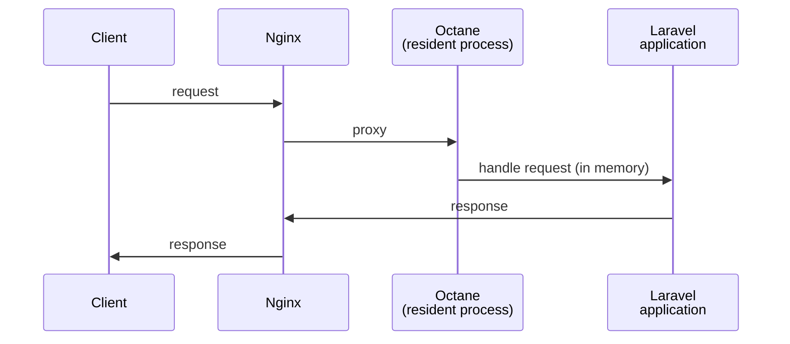
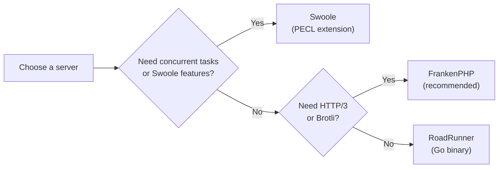
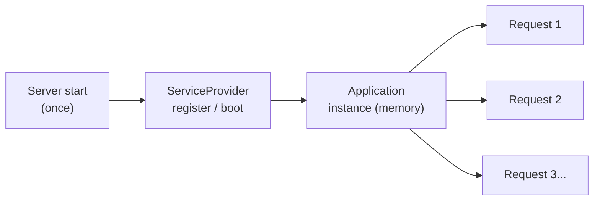

## What is Octane?

[Laravel Octane](https://github.com/laravel/octane) is a package that dramatically improves the performance of your Laravel application by running it on a high-performance application server.

With traditional PHP-FPM, the application boots and shuts down on every request. Octane boots the application once, keeps it in memory, and processes subsequent requests at blazing speed.



The key difference from PHP-FPM is that the application boot process — registering service providers, resolving bindings, etc. — runs only once. After that, every request is handled at maximum speed.

## Supported servers

Octane supports three application servers.



| Server | Language | Installation | Concurrent Tasks | Notes |
|---|---|---|---|---|
| FrankenPHP | Go | Automatic (binary) | — | Recommended. HTTP/3 and Brotli support |
| RoadRunner | Go | Automatic (binary) | — | Simple, easy to configure |
| Swoole | PHP extension | Manual via PECL | ✅ | Concurrent tasks and Octane cache available |

<Info>
  Laravel Cloud recommends running Octane with FrankenPHP and provides full managed support out of the box.
</Info>

## Installation and configuration

### Install the package

```bash
composer require laravel/octane
```

### Run the Octane installer

```bash
php artisan octane:install
```

You will be prompted to choose a server. After selecting one, `config/octane.php` will be generated.

### FrankenPHP

When you choose FrankenPHP, Octane automatically downloads the binary. No additional steps are required.

### RoadRunner

When you choose RoadRunner, Octane automatically downloads the binary.

### Swoole

Swoole is a PHP extension that must be installed via PECL.

```bash
pecl install swoole
```

To use Open Swoole instead, run:

```bash
pecl install openswoole
```

## Running Octane

### Start the server

```bash
php artisan octane:start
```

By default the server listens on port `8000`. Open `http://localhost:8000` in your browser.

### Specify the server

```bash
php artisan octane:start --server=frankenphp
php artisan octane:start --server=roadrunner
php artisan octane:start --server=swoole
```

### Set the number of workers

```bash
php artisan octane:start --workers=4
```

When using Swoole, you can also specify task workers:

```bash
php artisan octane:start --workers=4 --task-workers=6
```

### Watch for file changes

During development, the server must be restarted to pick up code changes. The `--watch` flag restarts it automatically whenever a file changes.

```bash
php artisan octane:start --watch
```

<Warning>
  `--watch` requires [Node.js](https://nodejs.org) and Chokidar.

  ```bash
  npm install --save-dev chokidar
  ```
</Warning>

### Other management commands

```bash
# Reload workers after a deployment
php artisan octane:reload

# Stop the server
php artisan octane:stop

# Check server status
php artisan octane:status
```

## Dependency injection caveats

Because Octane keeps the application in memory, **service provider `register` and `boot` methods run only once** when the server starts. The same application instance is reused across requests, so injecting the container or request into a singleton constructor requires extra care.



### Injecting the container

Injecting the container directly into a singleton constructor can leave you with a stale container.

```php
// ❌ Problematic — stale container is reused
$this->app->singleton(Service::class, function (Application $app) {
    return new Service($app);
});

// ✅ Safe — closure fetches the current container on every call
$this->app->singleton(Service::class, function () {
    return new Service(fn () => Container::getInstance());
});
```

The `app()` global helper and `Container::getInstance()` always return the current container, so they are safe to use.

### Injecting the request

```php
// ❌ Problematic — stale request is reused
$this->app->singleton(Service::class, function (Application $app) {
    return new Service($app['request']);
});

// ✅ Safe — closure fetches the current request on every call
$this->app->singleton(Service::class, function (Application $app) {
    return new Service(fn () => $app['request']);
});

// ✅ Best practice — pass only the value you need to the method
$service->method($request->input('name'));
```

<Info>
  Type-hinting `Illuminate\Http\Request` in a controller method or route closure is always safe. The `request()` global helper also returns the current request.
</Info>

### Injecting the configuration repository

```php
// ❌ Problematic — stale config repository is reused
$this->app->singleton(Service::class, function (Application $app) {
    return new Service($app->make('config'));
});

// ✅ Safe
$this->app->singleton(Service::class, function () {
    return new Service(fn () => Container::getInstance()->make('config'));
});
```

The `config()` global helper always returns the current configuration repository, so it is safe to use.

## Memory leak prevention

Because Octane keeps the application in memory, data accumulated in static properties will grow without bound and eventually exhaust memory.

```php
// ❌ Memory leak — $data grows with every request
class Service
{
    public static array $data = [];
}

public function index(Request $request): array
{
    Service::$data[] = Str::random(10);
    return [];
}
```

### Recycle workers with max-requests

You can mitigate memory leaks by automatically restarting a worker after it handles a certain number of requests. The default is 500 requests.

```bash
php artisan octane:start --max-requests=250
```

### Set a maximum execution time

`config/octane.php` lets you set the maximum execution time per request. The default is 30 seconds.

```php
'max_execution_time' => 30,
```

<Warning>
  Restart the Octane server after changing `max_execution_time`.
</Warning>

## Concurrent tasks (Swoole only)

When using Swoole, you can run multiple operations in parallel with `Octane::concurrently()`.

```php
use App\Models\User;
use App\Models\Server;
use Laravel\Octane\Facades\Octane;

[$users, $servers] = Octane::concurrently([
    fn () => User::all(),
    fn () => Server::all(),
]);
```

Concurrent tasks run in separate Swoole "task workers". Set the task worker count with `--task-workers`.

```bash
php artisan octane:start --workers=4 --task-workers=6
```

<Warning>
  A maximum of 1,024 tasks can be passed to `concurrently()` (Swoole limitation).
</Warning>

## Ticks and intervals (Swoole only)

Swoole lets you schedule a callback to run at a fixed interval. Register it in your service provider's `boot` method.

```php
use Laravel\Octane\Facades\Octane;

// Run every 10 seconds
Octane::tick('delayed-ticker', fn () => ray('Ticking...'))
    ->seconds(10);

// Also run immediately when the server starts
Octane::tick('immediate-ticker', fn () => ray('Ticking...'))
    ->seconds(10)
    ->immediate();
```

## Octane cache (Swoole only)

The Octane cache is an ultra-fast in-memory cache backed by [Swoole tables](https://www.swoole.co.uk/docs/modules/swoole-table), capable of up to 2 million read/write operations per second.

```php
use Illuminate\Support\Facades\Cache;

Cache::store('octane')->put('framework', 'Laravel', 30);
```

### Interval cache

An interval cache entry refreshes its value automatically at a fixed interval.

```php
use Illuminate\Support\Str;

Cache::store('octane')->interval('random', function () {
    return Str::random(10);
}, seconds: 5);
```

<Warning>
  All Octane cache data is cleared when the server restarts.
</Warning>

## Swoole tables (Swoole only)

You can define arbitrary in-memory tables that are accessible from every worker process. Configure them in `config/octane.php` under the `tables` key.

```php
'tables' => [
    'example:1000' => [
        'name' => 'string:1000',
        'votes' => 'int',
    ],
],
```

Access a table with the `Octane::table()` method.

```php
use Laravel\Octane\Facades\Octane;

Octane::table('example')->set('uuid', [
    'name' => 'Nuno Maduro',
    'votes' => 1000,
]);

$row = Octane::table('example')->get('uuid');
```

<Warning>
  Swoole tables support only `string`, `int`, and `float` column types. Data is lost when the server restarts.
</Warning>

## Production deployment

### Nginx + Octane

In production, Octane typically runs behind Nginx. Nginx handles static file serving and SSL termination, then proxies dynamic requests to Octane.

```nginx
map $http_upgrade $connection_upgrade {
    default upgrade;
    ''      close;
}

server {
    listen 80;
    server_name example.com;
    root /home/forge/example.com/public;

    location /index.php {
        try_files /not_exists @octane;
    }

    location / {
        try_files $uri $uri/ @octane;
    }

    location @octane {
        set $suffix "";

        if ($uri = /index.php) {
            set $suffix ?$query_string;
        }

        proxy_http_version 1.1;
        proxy_set_header Host $http_host;
        proxy_set_header Scheme $scheme;
        proxy_set_header SERVER_PORT $server_port;
        proxy_set_header REMOTE_ADDR $remote_addr;
        proxy_set_header X-Forwarded-For $proxy_add_x_forwarded_for;
        proxy_set_header Upgrade $http_upgrade;
        proxy_set_header Connection $connection_upgrade;

        proxy_pass http://127.0.0.1:8000$suffix;
    }
}
```

### Keep Octane running with Supervisor

Use Supervisor in production to ensure Octane stays running continuously.

```ini
[program:octane]
process_name=%(program_name)s_%(process_num)02d
command=php /home/forge/example.com/artisan octane:start --server=frankenphp --host=127.0.0.1 --port=8000
autostart=true
autorestart=true
user=forge
redirect_stderr=true
stdout_logfile=/home/forge/example.com/storage/logs/octane.log
stopwaitsecs=3600
```

### Enable HTTPS

To generate HTTPS URLs through Octane, add the following to your `.env` file.

```ini
OCTANE_HTTPS=true
```

### Laravel Cloud integration

[Laravel Cloud](https://cloud.laravel.com) provides fully managed Octane support using FrankenPHP. No Nginx or Supervisor configuration is needed — just two steps to enable Octane.

<Steps>
  <Step title="Install the package">
    Install Octane. Running `octane:install` is optional but harmless.

    ```bash
    composer require laravel/octane
    ```
  </Step>
  <Step title="Enable Octane in Laravel Cloud">
    Open your environment's App compute cluster settings, turn on **"Use Octane as runtime"**, then save and deploy. Laravel Cloud automatically builds and starts your application with FrankenPHP + Octane.
  </Step>
</Steps>

See the [Laravel Cloud documentation](https://cloud.laravel.com/docs/compute#laravel-octane) for details.

### Reload workers after deployment

After deploying new code, reload the workers so the updated code is loaded into memory.

```bash
php artisan octane:reload
```
