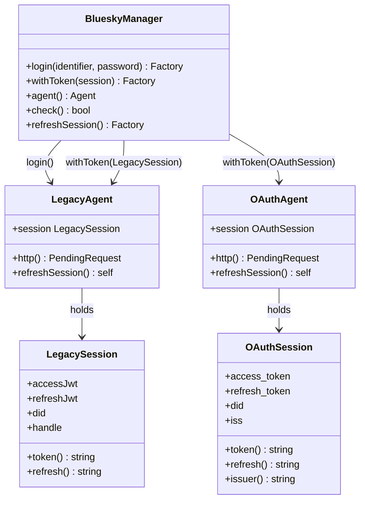
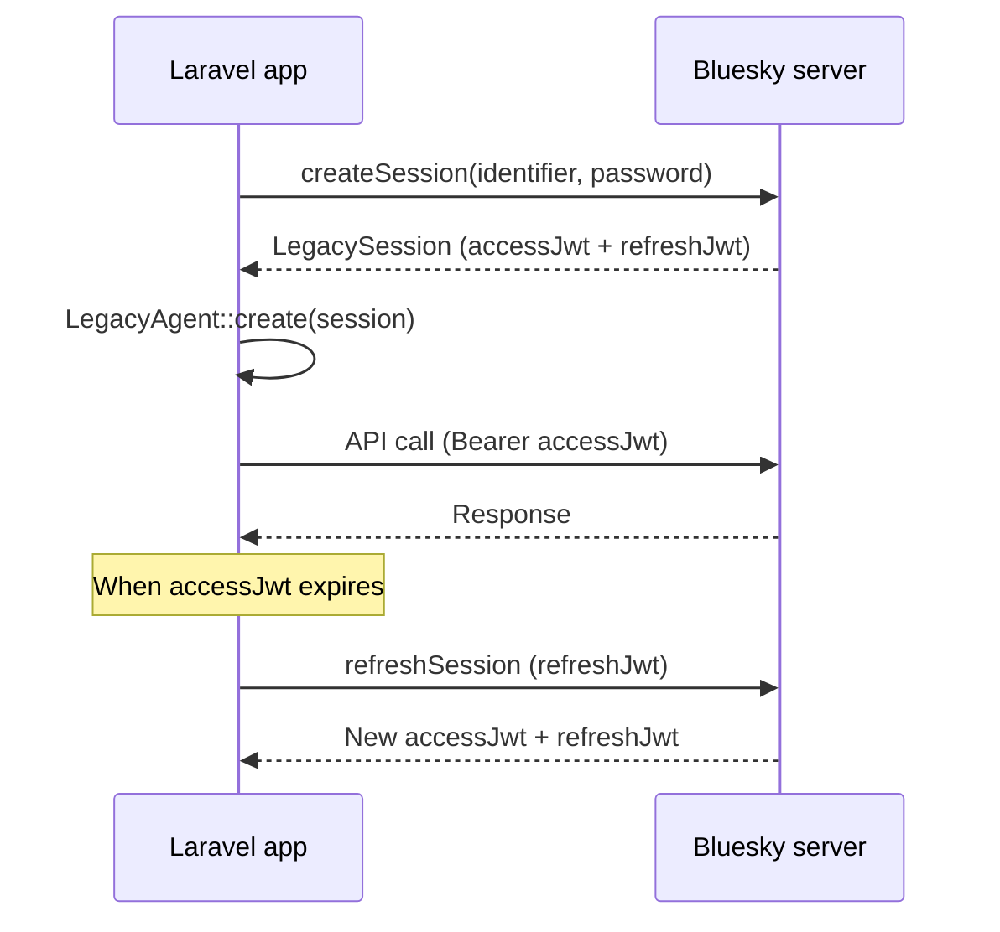
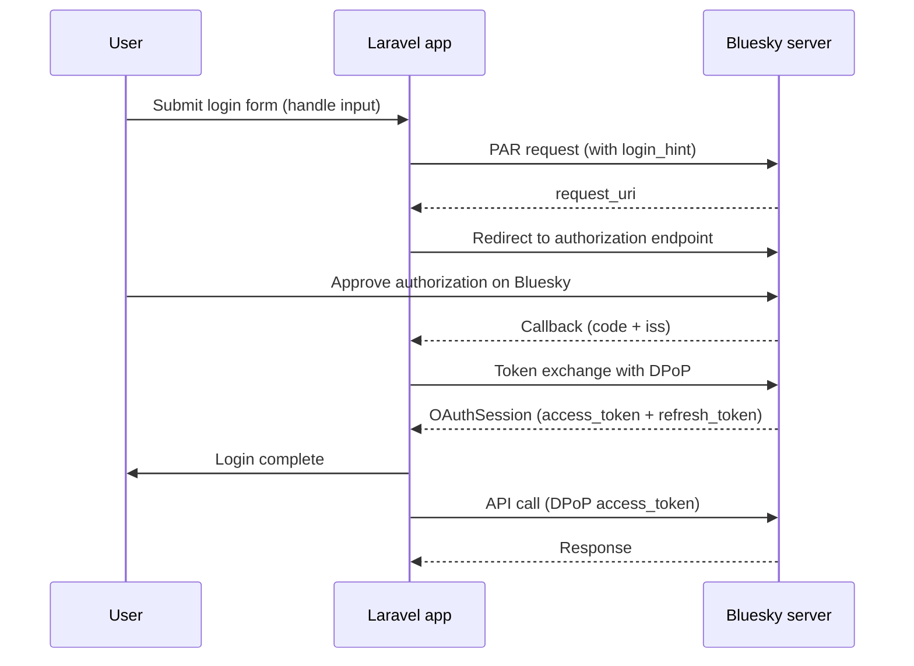
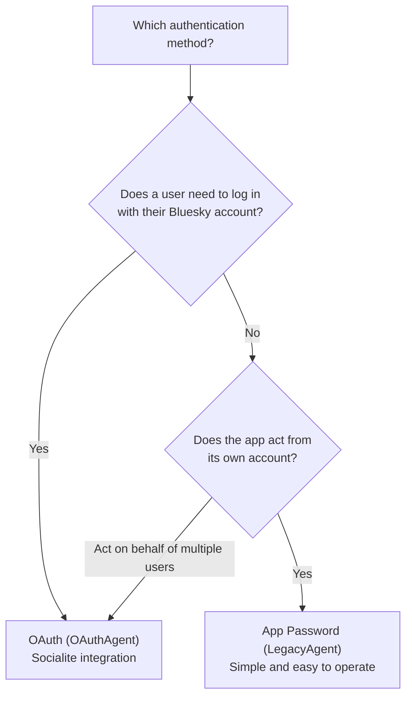

## Overview

Laravel Bluesky supports two authentication methods. All API calls after authentication share the same interface regardless of which method you use.

| Item | App Password | OAuth |
|---|---|---|
| Internal classes | `LegacyAgent` / `LegacySession` | `OAuthAgent` / `OAuthSession` |
| Entry point | `Bluesky::login()` | `Bluesky::withToken(OAuthSession)` |
| Private key required | No | Yes (`BLUESKY_OAUTH_PRIVATE_KEY`) |
| User authorization step | Not required | Required (browser approval) |
| Background execution | ✅ Simple | ✅ Possible (save refresh_token) |
| Session keys | `accessJwt` / `refreshJwt` | `access_token` / `refresh_token` |
| Deprecated | **No** | — |
| Primary use cases | Automated posts, notifications, batch | User-delegated actions, Socialite login |

<Info>
`LegacyAgent` is named for the "pre-OAuth" authentication style, but App Password itself is not deprecated. For scenarios that do not involve user interaction — such as notifications and automated posting — App Password is simpler and often preferable.
</Info>

## Architecture



`BlueskyManager` is the implementation behind the `Bluesky` facade. You set an agent via `login()` or `withToken()`, and all subsequent API calls work identically regardless of which agent is active.

## App Password (LegacyAgent)

### Authentication flow



### Bluesky::login()

Set your App Password in `.env` and call `login()`.

```dotenv
BLUESKY_IDENTIFIER=your-handle.bsky.social
BLUESKY_APP_PASSWORD=xxxx-xxxx-xxxx-xxxx
```

```php
use Revolution\Bluesky\Facades\Bluesky;

$response = Bluesky::login(
    identifier: config('bluesky.identifier'),
    password: config('bluesky.password'),
)->post('Hello Bluesky');
```

### Resuming a LegacySession

Calling `login()` on every request makes an API call each time. Cache the session data to avoid this.

```php
use Revolution\Bluesky\Facades\Bluesky;
use Revolution\Bluesky\Session\LegacySession;

// Log in and persist the session
Bluesky::login(
    identifier: config('bluesky.identifier'),
    password: config('bluesky.password'),
);
cache()->put('bluesky_session', Bluesky::agent()->session()->toArray(), now()->addDay());

// Restore from cache on subsequent calls
$session = LegacySession::create(cache('bluesky_session', []));
Bluesky::withToken($session);

// Refresh if the access token has expired
if (! Bluesky::check()) {
    Bluesky::refreshSession();
}

$response = Bluesky::post('Hello from cached session');
```

### LegacySession keys

| Key | Content | Method |
|---|---|---|
| `accessJwt` | Access token | `token()` |
| `refreshJwt` | Refresh token | `refresh()` |
| `did` | Bluesky DID | `did()` |
| `handle` | Handle | `handle()` |
| `email` | Email address | `email()` |
| `active` | Whether the account is active | `active()` |

### When to use App Password

- Background jobs and queue workers for automated posting
- Laravel Notification channel
- Scheduled tasks and batch processing
- When posting from the application's own account

## OAuth (OAuthAgent)

### Authentication flow



### Bluesky::withToken()

Pass the `OAuthSession` obtained from Socialite to `withToken()`.

```php
use Revolution\Bluesky\Facades\Bluesky;
use Revolution\Bluesky\Session\OAuthSession;

// Restore from Laravel session (web request)
$session = OAuthSession::create(session('bluesky_session'));
$timeline = Bluesky::withToken($session)->getTimeline();
```

In background jobs or console commands where Laravel sessions are unavailable, build an `OAuthSession` from database values.

```php
use Revolution\Bluesky\Facades\Bluesky;
use Revolution\Bluesky\Session\OAuthSession;

$session = OAuthSession::create([
    'did'           => $user->did,
    'refresh_token' => $user->refresh_token,
    // Include iss for accounts outside bsky.social
    // 'iss'        => $user->iss,
]);

$response = Bluesky::withToken($session)
                   ->refreshSession()
                   ->post('Hello from OAuth');
```

### OAuthSession keys

| Key | Content | Method |
|---|---|---|
| `access_token` | Access token | `token()` |
| `refresh_token` | Refresh token (single use) | `refresh()` |
| `did` / `sub` | Bluesky DID | `did()` |
| `iss` | Authorization server URL | `issuer()` |
| `profile.handle` | Handle | `handle()` |
| `profile.displayName` | Display name | `displayName()` |

<Warning>
The OAuth `refresh_token` can only be used once. Use the `OAuthSessionUpdated` event to save the new token to your database after each refresh. See [Socialite](/en/packages/laravel-bluesky/socialite) for details.
</Warning>

### When to use OAuth

- User login via Socialite
- Performing actions on behalf of a user
- When different users need to act from their own accounts

## API calls are identical after authentication

After authenticating with either method, you call the same API methods on the `Bluesky` facade.

```php
use Revolution\Bluesky\Facades\Bluesky;
use Revolution\Bluesky\Session\LegacySession;
use Revolution\Bluesky\Session\OAuthSession;

// App Password
Bluesky::login(config('bluesky.identifier'), config('bluesky.password'));

// OR OAuth
$session = OAuthSession::create(session('bluesky_session'));
Bluesky::withToken($session);

// ↓ All API calls below are identical regardless of method ↓

Bluesky::post('Hello Bluesky');
Bluesky::getTimeline();
Bluesky::getProfile();
Bluesky::searchPosts(q: '#laravel');
```

`BlueskyManager` switches between `LegacyAgent` and `OAuthAgent` internally, but the calling code is unaffected.

## Choosing between the two



| Situation | Recommendation |
|---|---|
| Automated posts, notifications, batch | App Password |
| User login feature | OAuth |
| Background jobs only | App Password |
| User-delegated operations | OAuth |
| Simplicity preferred | App Password |
| Fine-grained permission control | OAuth |

<Tip>
You can use both methods together. A common pattern is to use App Password for notifications and scheduled tasks while using OAuth for user-facing login. There is no conflict between the two.
</Tip>

## Related pages

- [Basic client](/en/packages/laravel-bluesky/basic-client) — API operations after authentication
- [Socialite](/en/packages/laravel-bluesky/socialite) — full OAuth flow details
- [Notification channel](/en/packages/laravel-bluesky/notification) — notifications with App Password / OAuth
- Source: [invokable/laravel-bluesky](https://github.com/invokable/laravel-bluesky)
