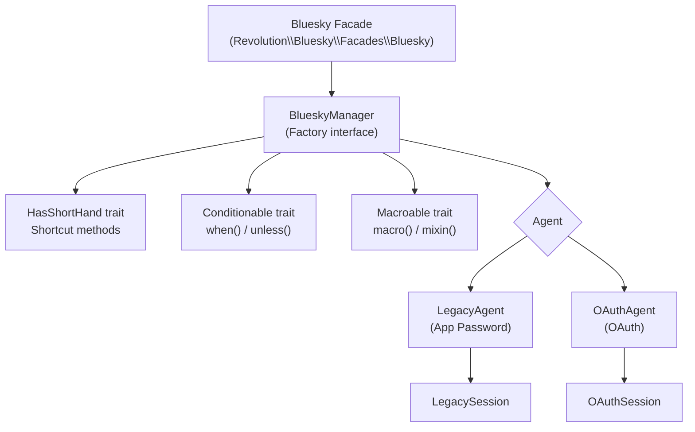

## Overview

The `Bluesky` facade is a thin wrapper over `BlueskyManager`. `BlueskyManager` manages the active Agent (either `LegacyAgent` or `OAuthAgent`) and delegates commonly used API calls through the `HasShortHand` trait.

## Architecture



`BlueskyServiceProvider` registers `Factory::class` bound to `BlueskyManager` as a scoped singleton (one instance per request lifecycle).

```php
// BlueskyServiceProvider::register()
$this->app->scoped(Factory::class, BlueskyManager::class);
```

The facade's `getFacadeAccessor()` resolves this binding.

```php
// Facades/Bluesky.php
protected static function getFacadeAccessor(): string
{
    return Factory::class;
}
```

## BlueskyManager core methods

The following methods are defined directly on `BlueskyManager`, separate from the `HasShortHand` trait methods.

### Authentication

| Method | Description |
|---|---|
| `login(string $identifier, string $password, ?string $service = null)` | Authenticate with App Password; sets a `LegacyAgent` |
| `withToken(?AbstractSession $token)` | Set an agent from an `OAuthSession` or `LegacySession` |
| `check(): bool` | Returns true if authenticated and the token has not expired |
| `refreshSession()` | Refresh the current session token |
| `logout()` | Clear the current agent |

### Agent management

| Method | Description |
|---|---|
| `agent(): ?Agent` | Return the current agent |
| `withAgent(?Agent $agent)` | Set an agent directly |
| `assertDid(): string` | Return the authenticated DID, or throw `AuthenticationException` |

### HTTP clients

| Method | Description |
|---|---|
| `client(bool $auth = true): AtpClient` | Return an authenticated (or anonymous) XRPC client |
| `public(): BskyClient` | Return a public endpoint client (no authentication required) |
| `send(BackedEnum\|string $api, string $method, bool $auth, ?array $params, ?callable $callback)` | Call any AT Protocol API directly |

### Utilities

| Method | Description |
|---|---|
| `identity(): Identity` | Return the Identity service (DID resolution, etc.) |
| `pds(): PDS` | Return the PDS service |
| `entryway(?string $path): string` | Return the service URL (e.g., `bsky.social`) |
| `publicEndpoint(): string` | Return the public endpoint URL |

## The HasShortHand trait

The `HasShortHand` trait wraps low-level AT Protocol APIs into readable PHP methods. Adding `use HasShortHand;` to `BlueskyManager` makes all of these methods directly accessible via `Bluesky::`.

```php
// BlueskyManager.php
class BlueskyManager implements Factory
{
    use Conditionable;
    use HasShortHand;
    use Macroable;
    // ...
}
```

<Info>
Separating the shortcuts into a trait keeps `BlueskyManager` focused on session and agent management while still exposing a rich API surface. It also makes individual methods easier to test or override.
</Info>

### Posts and feeds

| Method | Description |
|---|---|
| `post(Post\|string\|array $text)` | Create a new post |
| `getPost(string $uri)` | Retrieve a post by AT-URI |
| `getPosts(array $uris)` | Retrieve multiple posts at once |
| `deletePost(string $uri)` | Delete a post |
| `getTimeline(?string $algorithm, ?int $limit, ?string $cursor)` | Get the home timeline |
| `getAuthorFeed(?string $actor, ...)` | Get an account's feed |
| `searchPosts(string $q, ...)` | Search posts |

### Engagement

| Method | Description |
|---|---|
| `like(Like\|StrongRef $subject)` | Like a post |
| `deleteLike(string $uri)` | Remove a like |
| `repost(Repost\|StrongRef $subject)` | Repost |
| `deleteRepost(string $uri)` | Remove a repost |
| `getActorLikes(?string $actor, ...)` | Get an account's likes |

### Follows

| Method | Description |
|---|---|
| `follow(Follow\|string $did)` | Follow an account |
| `deleteFollow(string $uri)` | Unfollow an account |
| `getFollowers(?string $actor, ...)` | Get followers |
| `getFollows(?string $actor, ...)` | Get following list |

### Profile and account

| Method | Description |
|---|---|
| `getProfile(?string $actor)` | Get a profile |
| `upsertProfile(callable $callback)` | Update your profile |
| `resolveHandle(string $handle)` | Resolve a handle to a DID |

### Media

| Method | Description |
|---|---|
| `uploadBlob(StreamInterface\|string $data, string $type)` | Upload an image or other blob |
| `uploadVideo(StreamInterface\|string $data, string $type)` | Upload a video |
| `getJobStatus(string $jobId)` | Check the status of a video upload job |
| `getUploadLimits()` | Get video upload limits |

### Notifications

| Method | Description |
|---|---|
| `listNotifications(...)` | List notifications |
| `countUnreadNotifications(...)` | Count unread notifications |
| `updateSeenNotifications(string $seenAt)` | Mark notifications as seen |

### AT Protocol record operations

| Method | Description |
|---|---|
| `createRecord(string $repo, string $collection, ...)` | Create a record |
| `getRecord(string $repo, string $collection, string $rkey, ...)` | Retrieve a record |
| `listRecords(string $repo, string $collection, ...)` | List records |
| `putRecord(string $repo, string $collection, string $rkey, ...)` | Upsert a record |
| `deleteRecord(string $repo, string $collection, string $rkey, ...)` | Delete a record |

### Feed generators and labelers

| Method | Description |
|---|---|
| `publishFeedGenerator(BackedEnum\|string $name, Generator $generator)` | Publish a feed generator |
| `createThreadGate(string $post, ?array $allow)` | Create a thread gate |
| `upsertLabelDefinitions(callable $callback)` | Upsert label definitions |
| `deleteLabelDefinitions()` | Delete label definitions |
| `createLabels(RepoRef\|StrongRef\|array $subject, array $labels)` | Add labels to a subject |
| `deleteLabels(RepoRef\|StrongRef\|array $subject, array $labels)` | Remove labels from a subject |

## Common shortcut examples

### Create a post

```php
use Revolution\Bluesky\Facades\Bluesky;

$response = Bluesky::login(
    identifier: config('bluesky.identifier'),
    password: config('bluesky.password'),
)->post('Hello Bluesky');
```

### Reply to a post

There is no dedicated `reply()` method in `HasShortHand`. You build the reply with `Post::build()` and pass a `StrongRef` for the parent, then call the regular `post()` shortcut.

```php
use Revolution\Bluesky\Facades\Bluesky;
use Revolution\Bluesky\Record\Post;
use Revolution\Bluesky\Types\StrongRef;

$parent = StrongRef::to(uri: 'at://did:plc:.../app.bsky.feed.post/...', cid: 'bafyrei...');

$reply = Post::create('Reply text here')
    ->reply(root: $parent, parent: $parent);

Bluesky::login(config('bluesky.identifier'), config('bluesky.password'))
    ->post($reply);
```

### Like and repost

```php
use Revolution\Bluesky\Facades\Bluesky;
use Revolution\Bluesky\Types\StrongRef;

$ref = StrongRef::to(uri: 'at://did:plc:.../app.bsky.feed.post/...', cid: 'bafyrei...');

// Like
Bluesky::withToken($session)->like($ref);

// Repost
Bluesky::withToken($session)->repost($ref);
```

### Call any API directly

When `HasShortHand` does not have a shortcut for what you need, use `send()` or `client()`.

```php
use Revolution\Bluesky\Facades\Bluesky;

// Use send() to call any XRPC method
$response = Bluesky::withToken($session)
    ->send(
        api: 'app.bsky.actor.getProfiles',
        method: 'get',
        params: ['actors' => ['did:plc:...', 'did:plc:...']],
    );

// Use client() for finer-grained access
$response = Bluesky::withToken($session)
    ->client()
    ->bsky()
    ->getProfiles(actors: ['did:plc:...']);
```

## Facade vs. direct container access

`Bluesky::post()` and `app(Factory::class)->post()` operate on the same `BlueskyManager` instance.

```php
use Revolution\Bluesky\Facades\Bluesky;
use Revolution\Bluesky\Contracts\Factory;

// Via facade (the standard approach)
Bluesky::login(config('bluesky.identifier'), config('bluesky.password'))
    ->post('Hello');

// Resolved directly from the container
$manager = app(Factory::class);
$manager->login(config('bluesky.identifier'), config('bluesky.password'))
        ->post('Hello');

// Injected through a constructor
class MyService
{
    public function __construct(private Factory $bluesky) {}

    public function doPost(): void
    {
        $this->bluesky->login(
            config('bluesky.identifier'),
            config('bluesky.password'),
        )->post('Hello from DI');
    }
}
```

Because the binding uses `scoped`, the session state set by `login()` is preserved for the rest of the current request.

## Conditionable and Macroable

`BlueskyManager` includes the `Conditionable` and `Macroable` traits from Laravel.

### Conditionable: when() / unless()

```php
use Revolution\Bluesky\Facades\Bluesky;

Bluesky::login(config('bluesky.identifier'), config('bluesky.password'))
    ->when(config('app.env') === 'production', function ($bluesky) {
        $bluesky->post('Posted from production');
    });
```

### Macroable: adding custom methods

You can extend `BlueskyManager` with your own methods using `macro()`. A common place to register macros is in `AppServiceProvider::boot()`.

```php
use Revolution\Bluesky\Facades\Bluesky;

Bluesky::macro('postWithHashtag', function (string $text, string $tag) {
    /** @var \Revolution\Bluesky\BlueskyManager $this */
    return $this->post("{$text} #{$tag}");
});

// Usage
Bluesky::login(config('bluesky.identifier'), config('bluesky.password'))
    ->postWithHashtag('Hello', 'laravel');
```

## Injecting a custom agent

Use `withAgent()` to set any `Agent` implementation directly.

```php
use Revolution\Bluesky\Facades\Bluesky;
use Revolution\Bluesky\Contracts\Agent;

// Implement the Agent interface for your custom agent
class MyCustomAgent implements Agent
{
    // ...
}

Bluesky::withAgent(new MyCustomAgent());
```

<Info>
In practice, `withAgent()` is most useful in tests. Normal application code should use `login()` or `withToken()`, which set the agent automatically.
</Info>

## Related pages

- [Authentication methods](/en/packages/laravel-bluesky/authentication) — App Password vs. OAuth details
- [Basic client](/en/packages/laravel-bluesky/basic-client) — API operation examples after authentication
- [Testing](/en/packages/laravel-bluesky/testing) — Using the fake for tests
- Source: [src/BlueskyManager.php](https://github.com/invokable/laravel-bluesky/blob/main/src/BlueskyManager.php)
- Source: [src/HasShortHand.php](https://github.com/invokable/laravel-bluesky/blob/main/src/HasShortHand.php)
