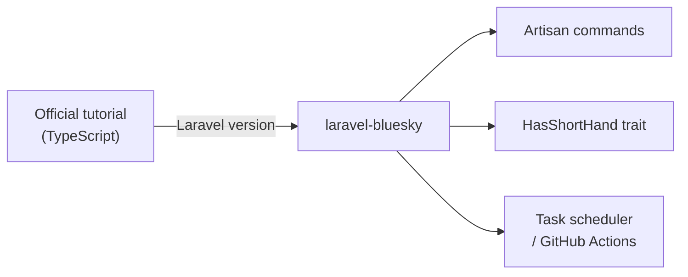

## Overview

This page is the Laravel version of the [AT Protocol official bot tutorial](https://atproto.com/guides/bot-tutorial). It covers how to implement the same functionality in PHP/Laravel using the `laravel-bluesky` package instead of TypeScript.

The official tutorial uses the `lex` command to download Lexicon files. With `laravel-bluesky`, all Lexicons are already bundled via [atproto-lexicon-contracts](https://github.com/invokable/atproto-lexicon-contracts), so this step is not needed. You can accomplish nearly everything through Artisan commands and the `HasShortHand` trait methods.



## Prerequisites

- The `laravel-bluesky` package is installed
- A Bluesky account and app password are ready

See [Laravel Bluesky](/en/packages/laravel-bluesky/index) for installation instructions.

```dotenv
BLUESKY_IDENTIFIER=yourbot.bsky.social
BLUESKY_APP_PASSWORD=xxxx-xxxx-xxxx-xxxx
```

---

## Part 1: Basic bot (posting)

### Create an Artisan command

Use `php artisan make:command` to create a bot command.

```bash
php artisan make:command BotPostCommand
```

Edit the generated `app/Console/Commands/BotPostCommand.php`.

```php
<?php

namespace App\Console\Commands;

use Illuminate\Console\Command;
use Revolution\Bluesky\Facades\Bluesky;

class BotPostCommand extends Command
{
    protected $signature = 'bot:post';

    protected $description = 'Post to Bluesky';

    public function handle(): void
    {
        Bluesky::login(
            identifier: config('bluesky.identifier'),
            password: config('bluesky.password'),
        )->post('🙂');

        $this->info('Posted successfully.');
    }
}
```

### Run manually

```bash
php artisan bot:post
```

### Schedule with task scheduler

Add a schedule entry to `routes/console.php`.

```php
use Illuminate\Support\Facades\Schedule;

// Post every three hours
Schedule::command('bot:post')->everyThreeHours();
```

To enable the scheduler, add this cron entry to your server.

```bash
* * * * * cd /path-to-your-project && php artisan schedule:run >> /dev/null 2>&1
```

### Run with GitHub Actions

If you don't have a server, you can run the bot automatically with GitHub Actions.

```yaml
# .github/workflows/bot.yml
name: Bot Post

on:
  schedule:
    - cron: '0 */3 * * *'  # Every three hours
  workflow_dispatch:

jobs:
  post:
    runs-on: ubuntu-latest
    steps:
      - uses: actions/checkout@v4
      - uses: shivammathur/setup-php@v2
        with:
          php-version: '8.4'
      - run: composer install --no-dev --optimize-autoloader
      - run: php artisan bot:post
        env:
          BLUESKY_IDENTIFIER: ${{ secrets.BLUESKY_IDENTIFIER }}
          BLUESKY_APP_PASSWORD: ${{ secrets.BLUESKY_APP_PASSWORD }}
```

<Tip>
Add `BLUESKY_IDENTIFIER` and `BLUESKY_APP_PASSWORD` to your repository secrets in GitHub.
</Tip>

---

## Part 2: Reply bot (mention monitoring)

Build a bot that automatically replies to mentions. This section also shows how to generate AI replies.

### Fetch notifications and reply to mentions

```bash
php artisan make:command BotReplyCommand
```

```php
<?php

namespace App\Console\Commands;

use Illuminate\Console\Command;
use Revolution\Bluesky\Facades\Bluesky;
use Revolution\Bluesky\Record\Post;
use Revolution\Bluesky\Types\ReplyRef;
use Revolution\Bluesky\Types\StrongRef;

class BotReplyCommand extends Command
{
    protected $signature = 'bot:reply';

    protected $description = 'Reply to mentions on Bluesky';

    public function handle(): void
    {
        Bluesky::login(
            identifier: config('bluesky.identifier'),
            password: config('bluesky.password'),
        );

        $notifications = Bluesky::listNotifications(limit: 20)->json('notifications', []);

        foreach ($notifications as $notification) {
            // Process mention notifications only
            if (data_get($notification, 'reason') !== 'mention') {
                continue;
            }

            // Skip already-read notifications
            if (data_get($notification, 'isRead')) {
                continue;
            }

            $uri = data_get($notification, 'uri');
            $cid = data_get($notification, 'cid');

            if (! $uri || ! $cid) {
                continue;
            }

            $ref = StrongRef::to(uri: $uri, cid: $cid);
            $reply = ReplyRef::to(root: $ref, parent: $ref);

            $post = Post::create('Hello! Thanks for the mention. 🙂')
                ->reply($reply);

            Bluesky::post($post);

            $this->info("Replied to: {$uri}");
        }

        // Mark notifications as read
        Bluesky::updateSeenNotifications(now()->toISOString());
    }
}
```

<Info>
When the thread root differs from the parent post, fetch the thread using `app.bsky.feed.getPostThread` and set the correct `root`. This simplified example uses the parent post as the root.
</Info>

### Schedule polling

```php
// routes/console.php
use Illuminate\Support\Facades\Schedule;

Schedule::command('bot:reply')->everyFiveMinutes();
```

### Generate AI replies

You can combine the `laravel/ai` package with the `laravel-amazon-bedrock` driver to generate context-aware AI replies.

```bash
composer require laravel/ai revolution/laravel-amazon-bedrock
```

Create an AI agent.

```php
<?php

namespace App\Ai\Agents;

use Laravel\Ai\Contracts\Agent;
use Laravel\Ai\Promptable;

class BotReplyAgent implements Agent
{
    use Promptable;

    public function instructions(): string
    {
        return 'You are a friendly bot on Bluesky. '
            . 'Generate a short, friendly reply to the user\'s message. '
            . 'Keep the reply under 200 characters.';
    }
}
```

Use the AI agent in the reply command.

```php
<?php

namespace App\Console\Commands;

use App\Ai\Agents\BotReplyAgent;
use Illuminate\Console\Command;
use Revolution\Bluesky\Facades\Bluesky;
use Revolution\Bluesky\Record\Post;
use Revolution\Bluesky\Types\ReplyRef;
use Revolution\Bluesky\Types\StrongRef;

class BotReplyCommand extends Command
{
    protected $signature = 'bot:reply';

    protected $description = 'Reply to mentions on Bluesky using AI';

    public function handle(): void
    {
        Bluesky::login(
            identifier: config('bluesky.identifier'),
            password: config('bluesky.password'),
        );

        $notifications = Bluesky::listNotifications(limit: 20)->json('notifications', []);

        foreach ($notifications as $notification) {
            if (data_get($notification, 'reason') !== 'mention') {
                continue;
            }

            if (data_get($notification, 'isRead')) {
                continue;
            }

            $uri = data_get($notification, 'uri');
            $cid = data_get($notification, 'cid');
            $mentionText = data_get($notification, 'record.text', '');

            if (! $uri || ! $cid) {
                continue;
            }

            // Generate reply with AI
            $replyText = (new BotReplyAgent)->prompt($mentionText)->text;

            $ref = StrongRef::to(uri: $uri, cid: $cid);
            $reply = ReplyRef::to(root: $ref, parent: $ref);

            $post = Post::create($replyText)->reply($reply);

            Bluesky::post($post);

            $this->info("AI replied to: {$uri}");
        }

        Bluesky::updateSeenNotifications(now()->toISOString());
    }
}
```

<Tip>
See [Amazon Bedrock driver](/en/packages/laravel-amazon-bedrock) for configuration details.
</Tip>

---

## Part 3: Label bot

This corresponds to the `labelAsBot` function in the official tutorial. Add a self-label to the bot account's profile to identify it as an automated account.

<Info>
Run this command once during initial setup. It is independent from the Part 1 and Part 2 commands.
</Info>

### Create the label command

```bash
php artisan make:command BotLabelCommand
```

```php
<?php

namespace App\Console\Commands;

use Illuminate\Console\Command;
use Revolution\Bluesky\Facades\Bluesky;
use Revolution\Bluesky\Record\Profile;
use Revolution\Bluesky\Types\SelfLabels;

class BotLabelCommand extends Command
{
    protected $signature = 'bot:label';

    protected $description = 'Add bot self-label to the Bluesky profile';

    public function handle(): void
    {
        Bluesky::login(
            identifier: config('bluesky.identifier'),
            password: config('bluesky.password'),
        )->upsertProfile(function (Profile $profile) {
            // Set the !bot self-label
            $profile->labels(SelfLabels::make(['!bot']));
        });

        $this->info('Bot label applied successfully.');
    }
}
```

### Run the command

```bash
php artisan bot:label
```

Run this command once when you first set up your bot. The label persists on your profile.

<Warning>
`!bot` is a standard Bluesky self-label. It is recommended for all bot accounts so users and moderation tools can recognize automated accounts.
</Warning>

---

## Other official tutorials

The AT Protocol official tutorials cover several other topics. Here is a summary of how `laravel-bluesky` covers each one.

### Custom feeds

[feed-generator.mdx](/en/packages/laravel-bluesky/feed-generator) covers building a custom feed generator with Laravel in detail.

### OAuth authentication

[socialite.mdx](/en/packages/laravel-bluesky/socialite) explains how to implement OAuth authentication using Laravel Socialite. This is simpler than the official approach.

### Social app (statusphere)

A Laravel version of statusphere is available at [invokable/statusphere](https://github.com/invokable/statusphere). It is based on an earlier version of statusphere that does not use the `lex` or `tap` commands, so it differs slightly from the latest official tutorial.

## References

- [AT Protocol official bot tutorial](https://atproto.com/guides/bot-tutorial)
- [laravel-bluesky](https://github.com/invokable/laravel-bluesky)
- [BlueskyManager and HasShortHand](/en/packages/laravel-bluesky/bluesky-manager)
- [Notification channel](/en/packages/laravel-bluesky/notification)
- [Amazon Bedrock driver](/en/packages/laravel-amazon-bedrock)
