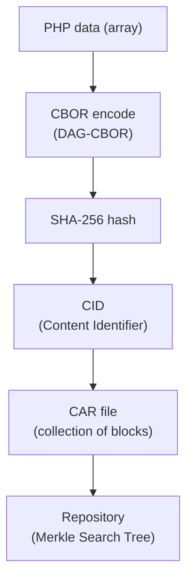
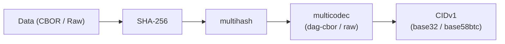
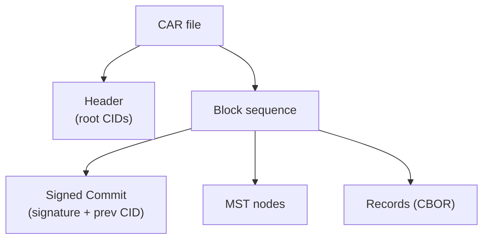
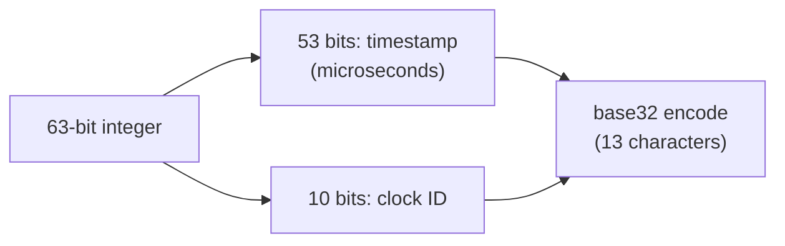

<Warning>
Core is an advanced internal implementation. You do not need it for typical usage such as posting, fetching feeds, or notifications. Refer to this page when working directly with AT Protocol data structures.
</Warning>

## AT Protocol data model overview

AT Protocol repositories use a content-addressed data structure. The following elements are involved in storage, transfer, and verification:



| Class | Role |
|---|---|
| `CBOR` | Binary serialization |
| `CID` | Content address (hash identifier) |
| `CAR` | Repository archive read/write |
| `TID` | Time-ordered record keys |
| `Varint` | Variable-length integer encoding (internal) |

---

## CBOR

The `CBOR` class provides encoding and decoding for the [DAG-CBOR](https://ipld.io/specs/codecs/dag-cbor/spec/) format used by AT Protocol. It extends standard CBOR with support for CID links (tag 42).

### Encode

```php
use Revolution\Bluesky\Core\CBOR;

$record = [
    '$type'     => 'app.bsky.feed.post',
    'text'      => 'Hello, Bluesky!',
    'createdAt' => '2025-01-01T00:00:00.000Z',
];

$bytes = CBOR::encode($record); // binary string
```

### Decode

```php
use Revolution\Bluesky\Core\CBOR;

// Decode a single item
$data = CBOR::decode($bytes);

// Decode the first item from a stream and return the remainder
[$item, $remainder] = CBOR::decodeFirst($bytes);

// Decode all items from a stream
$items = CBOR::decodeAll($bytes);
```

### Use case

When you need to compute or verify the CID of a record manually, CBOR encoding is required (see also the [verify page](/en/packages/laravel-bluesky/verify)).

```php
use Revolution\Bluesky\Core\CBOR;
use Revolution\Bluesky\Core\CID;

$record = data_get($block, 'value');
$cbor   = CBOR::encode($record);
$bool   = CID::verify($cbor, data_get($block, 'cid'));
```

---

## CID (Content Identifier)

A CID is a self-describing hash-based identifier for content. AT Protocol uses a SHA-256 hash wrapped in multihash, then encoded with multicodec and multibase.



### CIDv0 vs CIDv1

| Version | Encoding | Prefix | Use |
|---|---|---|---|
| v0 | base58btc | `Qm...` | Older spec (blobs) |
| v1 | base32 | `bafy...` | Current spec (records) |

### Main API

```php
use Revolution\Bluesky\Core\CID;

// Generate a CID from data
$cid = CID::encode($data, CID::DAG_CBOR); // for records
$cid = CID::encode($data, CID::RAW);      // for binary (images, etc.)

// Verify data against a CID
$bool = CID::verify($data, $cid, CID::DAG_CBOR);
$bool = CID::verify($file, $cid, CID::RAW);

// Parse a CID
$decoded = CID::decode($cid); // ['version', 'codec', 'hash']

// Detect CID version
$version = CID::version($cid); // 0 or 1

// Convert between CID string and raw bytes
$bytes = CID::decodeBytes($cid);
$cid   = CID::encodeBytes($bytes);
```

---

## CAR (Content Addressable aRchive)

A CAR file stores an AT Protocol repository as a sequence of CBOR-encoded blocks. Data retrieved by `com.atproto.sync.getRepo` is in this format.



### Decode

```php
use Revolution\Bluesky\Core\CAR;

// Decode the entire CAR file (roots + all blocks)
['roots' => $roots, 'blocks' => $blocks] = CAR::decode($carData);

// Get only the root CIDs
$roots = CAR::decodeRoots($carData);

// Iterate over blocks
foreach (CAR::blockIterator($carData) as [$cid, $block]) {
    // $cid: CID string, $block: binary data
}

// Get records as a map
foreach (CAR::blockMap($carData) as $key => $record) {
    // $key: record key, $record: decoded array
}
```

### Verify the signed commit

To confirm that a CAR file belongs to a specific user, verify the Signed Commit signature against the public key in the DID Document.

```php
use Revolution\Bluesky\Core\CAR;
use Revolution\Bluesky\Crypto\DidKey;
use Revolution\Bluesky\Facades\Bluesky;
use Revolution\Bluesky\Support\DidDocument;

$did = 'did:plc:***';

$didDoc    = DidDocument::make(Bluesky::identity()->resolveDID($did)->json());
$publicKey = DidKey::parse($didDoc->publicKey());

$signed = CAR::signedCommit($carData);
$bool   = CAR::verifySignedCommit($signed, $publicKey);
```

See also: [DownloadRepoCommand](https://github.com/invokable/laravel-bluesky/blob/main/src/Console/DownloadRepoCommand.php)

---

## TID (Timestamp Identifier)

TID is a time-ordered unique ID used as record keys in AT Protocol. It encodes a microsecond timestamp plus a clock ID into a 13-character base32 string.

```
Example: 3jujm55ngfc24
```

### Generate and convert

```php
use Revolution\Bluesky\Core\TID;

// Generate the next TID
$tid = TID::next();
echo $tid->toString(); // e.g. "3jujm55ngfc24"

// Create a TID from a string
$tid = TID::fromStr('3jujm55ngfc24');

// Create a TID from a timestamp (microseconds) and clock ID
$tid = TID::fromTime(microtime(true) * 1000000, 0);
```

### TID structure



`TID::s32encode()` and `TID::s32decode()` convert between the integer representation and the string form.

---

## Varint (variable-length integer)

`Varint` is an internal utility used for parsing CAR and CBOR binary formats. You normally do not need to use it directly.

```php
use Revolution\Bluesky\Core\Varint;

// Encode an integer
$bytes = Varint::encode(1234);

// Decode from a stream (returns value and bytes consumed)
[$value, $bytesRead] = Varint::decodeStream($stream);
```

---

## Testing with Core classes

Core classes (CBOR / CID / CAR / TID) do not make any external network calls, so no mocking is needed in tests.

```php
// Can be used directly in tests
$bytes = CBOR::encode(['text' => 'Hello']);
$cid   = CID::encode($bytes, CID::DAG_CBOR);
$bool  = CID::verify($bytes, $cid);
```

---

## References

- [AT Protocol: Repository spec](https://atproto.com/specs/repository)
- [AT Protocol: CID formats](https://atproto.com/specs/data-model#cid-formats)
- [IPLD: DAG-CBOR spec](https://ipld.io/specs/codecs/dag-cbor/spec/)
- [DeepWiki: invokable/laravel-bluesky — Binary Data Formats](https://deepwiki.com/invokable/laravel-bluesky#9)

<Info>
Source: [src/Core/](https://github.com/invokable/laravel-bluesky/tree/main/src/Core)
</Info>
