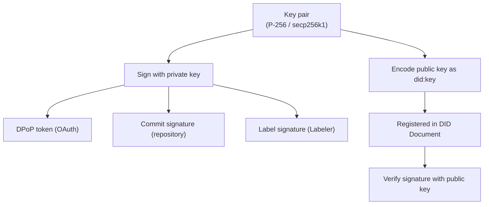
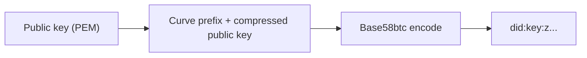
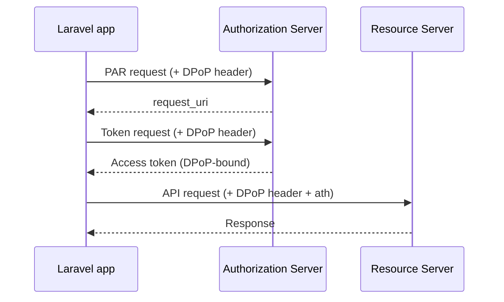

<Warning>
Crypto is an advanced internal implementation. You do not need it for typical usage such as posting, fetching feeds, or notifications. Refer to this page when building low-level signature verification or custom OAuth flows on top of AT Protocol.
</Warning>

## Overview of cryptography in AT Protocol

AT Protocol relies on elliptic-curve cryptography (ECC) throughout its stack. The main uses are:



| Curve | Algorithm | Primary use |
|---|---|---|
| secp256r1 (P-256) | ES256 | OAuth (DPoP, Client Assertion) |
| secp256k1 (K256) | ES256K | Feed Generator, Labeler signature verification |

---

## Key pair classes

### AbstractKeypair

`AbstractKeypair` is the shared base class for P256 and K256. It uses [phpseclib3](https://phpseclib.com/) internally.

```php
// Generate a new key pair
$keypair = P256::create();
$keypair = K256::create();

// Load from a URL-safe Base64-encoded private key
$keypair = P256::load($base64PrivateKey);

// Export in PEM format
$privatePem = $keypair->privatePEM();
$publicPem  = $keypair->publicPEM();

// Convert to JWK (JSON Web Key)
$jwk = $keypair->toJWK();
```

### P256 (secp256r1)

```php
use Revolution\Bluesky\Crypto\P256;

$keypair = P256::create();
```

Used for OAuth (DPoP and Client Assertion). `OAuthKey` extends P256 and loads the private key from `config('bluesky.oauth.private_key')`.

An Artisan command is provided to generate a new OAuth private key:

```bash
php artisan bluesky:new-private-key
```

### K256 (secp256k1)

```php
use Revolution\Bluesky\Crypto\K256;

$keypair = K256::create();
```

Used for authentication in Feed Generators and Labelers. The Bluesky PDS and Relay verify signatures using this curve.

---

## DidKey

The `DidKey` class encodes and decodes public keys in the `did:key` format.

### What is did:key?

AT Protocol represents public keys as `did:key:z...` strings. A curve identifier prefix is prepended to the compressed public key, then the result is multibase-encoded with Base58btc.



### Encode a public key as did:key

```php
use Revolution\Bluesky\Crypto\DidKey;
use Revolution\Bluesky\Crypto\K256;

$keypair   = K256::create();
$publicPem = $keypair->publicPEM();

// Convert to did:key format
$didKey = DidKey::format($publicPem);
// => "did:key:zQ3s..."
```

### Parse a public key from a DID Document

```php
use Revolution\Bluesky\Crypto\DidKey;
use Revolution\Bluesky\Facades\Bluesky;
use Revolution\Bluesky\Support\DidDocument;

$didDoc = DidDocument::make(
    Bluesky::identity()->resolveDID('did:plc:***')->json()
);

// Parse the multibase public key from the DID Document into a phpseclib3 public key object
$publicKey = DidKey::parse($didDoc->publicKey());
```

---

## JsonWebToken (JWT)

The `JsonWebToken` class provides JWT encode and decode operations.

```php
use Revolution\Bluesky\Crypto\JsonWebToken;

// Create a signed JWT (private key in PEM format)
$token = JsonWebToken::encode(
    payload: ['iss' => 'did:plc:***', 'aud' => 'https://bsky.social', 'exp' => time() + 60],
    key: $privatePem,
    alg: 'ES256',
);

// Decode a JWT (no signature verification)
$payload = JsonWebToken::decode($token);
```

---

## DPoP (Demonstrated Proof of Possession)

DPoP is an OAuth security mechanism that binds an access token to a specific client key pair, preventing token replay attacks.



The `DPoP` class is used internally. You normally do not need to call it directly — the `OAuthAgent` middleware injects DPoP headers automatically.

```php
// Generate a DPoP proof for an OAuth token request
$proof = DPoP::authProof(
    jwk: $jsonWebKey,
    url: 'https://bsky.social/oauth/token',
    method: 'POST',
    nonce: $nonce,
);

// Generate a DPoP proof for an API request (includes ath)
$proof = DPoP::apiProof(
    jwk: $jsonWebKey,
    url: 'https://api.bsky.app/xrpc/...',
    method: 'GET',
    token: $accessToken,
    nonce: $nonce,
);
```

---

## Signature (format conversion)

AT Protocol uses a 64-byte compact signature format, but phpseclib3 produces ASN.1 DER signatures. The `Signature` class handles the conversion.

```php
use Revolution\Bluesky\Crypto\Signature;

// ASN.1 DER → compact (64 bytes)
$compact = Signature::toCompact($derSignature);

// Compact → ASN.1 DER
$der = Signature::fromCompact($compactSignature);
```

---

## JsonWebKey

`JsonWebKey` represents a JWK (JSON Web Key). It is used when generating DPoP proofs.

```php
use Revolution\Bluesky\Crypto\JsonWebKey;

// Create a JWK from a key pair
$jwk = $keypair->toJWK();

// Or instantiate directly from an array
$jwk = JsonWebKey::load(['kty' => 'EC', 'crv' => 'P-256', ...]);
```

---

## OAuthKey

`OAuthKey` extends P256 and is the OAuth-specific key class. It reads the private key from `config('bluesky.oauth.private_key')`.

```php
use Revolution\Bluesky\Crypto\OAuthKey;

// Load the private key from config
$oauthKey = OAuthKey::load();

// Used internally to sign Client Assertion JWTs
$jwk = $oauthKey->toJWK();
```

This is handled automatically by the Bluesky Socialite integration.

---

## References

- [AT Protocol: Identity](https://atproto.com/guides/identity)
- [AT Protocol: Cryptography spec](https://atproto.com/specs/cryptography)
- [phpseclib3](https://phpseclib.com/)
- [DeepWiki: invokable/laravel-bluesky — Cryptographic Operations](https://deepwiki.com/invokable/laravel-bluesky#9.4)

<Info>
Source: [src/Crypto/](https://github.com/invokable/laravel-bluesky/tree/main/src/Crypto)
</Info>
