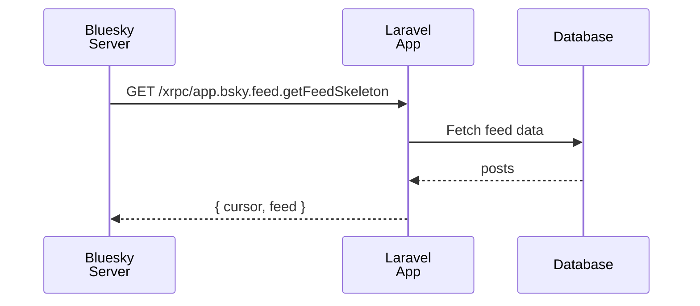

## Overview

A Feed Generator is Bluesky's mechanism for algorithmic feeds. You can publish a custom feed tailored to specific keywords, user conditions, or any logic you choose. With `laravel-bluesky`, building a Feed Generator on a Laravel application is straightforward.

<Info>
Official starter kit: [bluesky-social/feed-generator](https://github.com/bluesky-social/feed-generator)
</Info>



## Register a FeedGenerator algorithm

The simplest approach is to register an algorithm closure in `AppServiceProvider::boot()`.

```php
// Register in AppServiceProvider::boot()

use Illuminate\Http\Request;
use Revolution\Bluesky\Facades\Bluesky;
use Revolution\Bluesky\FeedGenerator\FeedGenerator;

FeedGenerator::register(name: 'artisan', algo: function(int $limit, ?string $cursor, ?string $user, Request $request): array {
    // The implementation is entirely up to you.

    // Authentication is required due to a temporary API restriction
    $response = Bluesky::login(identifier: config('bluesky.identifier'), password: config('bluesky.password'))
                       ->searchPosts(q: '#laravel', until: $cursor, limit: $limit);

    $cursor = data_get($response->collect('posts')->last(), 'indexedAt');

    $feed = $response->collect('posts')->map(function(array $post) {
        return ['post' => data_get($post, 'uri')];
    })->toArray();

    // Use the Request object to vary results based on the requesting user.
    info('user: '.$user); // Requesting user's DID — 'did:plc:***'
    info('header', $request->header());

    return compact('cursor', 'feed');
});
```

`name` must be a URL-safe string.

The algorithm must return an array containing `cursor` and `feed`.

```php
[
    'cursor' => '',
    'feed' => [
       ['post' => 'at://'],
       ['post' => 'at://'],
    ],
]
```

All required routes are registered automatically by the package.

- `http://localhost/xrpc/app.bsky.feed.getFeedSkeleton?feed=at://did:web:example.com/app.bsky.feed.generator/artisan`
- `http://localhost/xrpc/app.bsky.feed.describeFeedGenerator`
- `http://localhost/.well-known/did.json`
- The service DID is derived from the current URL (e.g. `did:web:example.com`).

<Tip>
The only things you decide are the feed `name` and the algorithm implementation.
</Tip>

## Publish the feed generator

Implementing the Feed Generator in your Laravel app doesn't make it visible on Bluesky. You need to create and run a command that calls `publishFeedGenerator`.

<Steps>
  <Step title="Generate the command">
    ```bash
    php artisan make:command PublishGeneratorCommand
    ```
  </Step>
  <Step title="Implement the command">
    ```php
    namespace App\Console\Commands;

    use Illuminate\Console\Command;
    use Revolution\Bluesky\Facades\Bluesky;
    use Revolution\Bluesky\Record\Generator;

    class PublishGeneratorCommand extends Command
    {
        protected $signature = 'bluesky:publish-generator';

        protected $description = 'Publish the feed generator to Bluesky';

        public function handle()
        {
            $generator = Generator::create(did: 'did:web:example.com', displayName: 'Feed name')
                                  ->description('Feed description');

            $res = Bluesky::login(identifier: config('bluesky.identifier'), password: config('bluesky.password'))
                          ->publishFeedGenerator(name: 'artisan', generator: $generator);

            dump($res->json());

            return 0;
        }
    }
    ```
  </Step>
  <Step title="Run the command">
    ```bash
    php artisan bluesky:publish-generator
    ```

    On success, the feed link appears on your Bluesky profile page. You can run `publishFeedGenerator` any number of times — it simply updates the existing record.
  </Step>
</Steps>

## Create multiple feed generators

Register as many feeds as you need by using a different `name` each time.

```php
// AppServiceProvider::boot()

use Revolution\Bluesky\FeedGenerator\FeedGenerator;

FeedGenerator::register(name: 'feed1', algo: function() {
    // feed1 implementation
});

FeedGenerator::register(name: 'feed2', algo: function() {
    // feed2 implementation
});
```

Call `publishFeedGenerator` once for each feed in your publish command.

```php
// PublishGeneratorCommand

Bluesky::login(identifier: config('bluesky.identifier'), password: config('bluesky.password'));

$generator1 = Generator::create(did: 'did:web:example.com', displayName: 'Feed 1')
                       ->description('Feed 1');
Bluesky::publishFeedGenerator(name: 'feed1', generator: $generator1);

$generator2 = Generator::create(did: 'did:web:example.com', displayName: 'Feed 2')
                       ->description('Feed 2');
Bluesky::publishFeedGenerator(name: 'feed2', generator: $generator2);
```

## Separate algorithm class

Instead of a closure, you can implement a dedicated callable class. This keeps your `AppServiceProvider` clean and makes each algorithm independently testable.

```php
// Place this anywhere in your application

namespace App\FeedGenerator;

use Illuminate\Http\Request;
use Revolution\Bluesky\Facades\Bluesky;
use Revolution\Bluesky\Contracts\FeedGeneratorAlgorithm;

class ArtisanFeed implements FeedGeneratorAlgorithm
{
    public function __invoke(int $limit, ?string $cursor, ?string $user, Request $request): array
    {
        // Authentication is required due to a temporary API restriction
        $response = Bluesky::login(identifier: config('bluesky.identifier'), password: config('bluesky.password'))
            ->searchPosts(q: '#laravel', until: $cursor, limit: $limit);

        $cursor = data_get($response->collect('posts')->last(), 'indexedAt');

        $feed = $response->collect('posts')->map(function (array $post) {
            return ['post' => data_get($post, 'uri')];
        })->toArray();

        info('user: '.$user);
        info('header', $request->header());

        return compact('cursor', 'feed');
    }
}
```

```php
// AppServiceProvider::boot()

use Revolution\Bluesky\FeedGenerator\FeedGenerator;
use App\FeedGenerator\ArtisanFeed;

FeedGenerator::register(name: 'artisan', algo: ArtisanFeed::class);
```

## Authentication

The authentication check from the official starter kit is enabled by default. To disable it, pass a closure to `validateAuthUsing` that simply returns the user DID.

```php
// AppServiceProvider::boot()

use Illuminate\Http\Request;
use Revolution\Bluesky\Crypto\JsonWebToken;
use Revolution\Bluesky\FeedGenerator\FeedGenerator;

FeedGenerator::validateAuthUsing(function (?string $jwt, Request $request): ?string {
    [, $payload] = JsonWebToken::explode($jwt);
    return data_get($payload, 'iss');
});
```

<Warning>
Feed visibility on Bluesky is affected by your account's language settings. If your Feed Generator is returning posts but the feed does not appear on Bluesky, check your account language settings.
</Warning>

## Advanced usage

Use Artisan commands and task scheduling to save posts to a database. Your algorithm then only needs to query the DB, giving you fast feed responses without live API calls.

```php
// Return feed from the database

FeedGenerator::register(name: 'cached-feed', algo: function(int $limit, ?string $cursor): array {
    $query = \App\Models\Post::query()
        ->orderByDesc('indexed_at')
        ->limit($limit);

    if ($cursor) {
        $query->where('indexed_at', '<', $cursor);
    }

    $posts = $query->get();

    $cursor = $posts->last()?->indexed_at;

    $feed = $posts->map(fn ($post) => ['post' => $post->uri])->toArray();

    return compact('cursor', 'feed');
});
```

```php
// Schedule periodic post collection (routes/console.php)

use Illuminate\Support\Facades\Schedule;

Schedule::command('bluesky:collect-posts')->everyFiveMinutes();
```

<Info>
Source: [docs/feed-generator.md](https://github.com/invokable/laravel-bluesky/blob/main/docs/feed-generator.md)
</Info>
