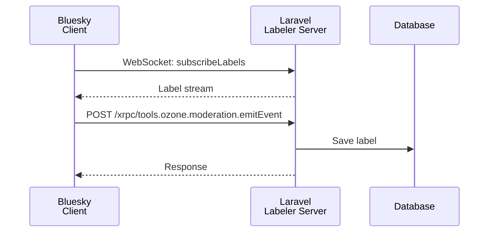

<Warning>
Labeler is an advanced feature. Because the server must run continuously, it is intended for developers who use Laravel Forge or can configure their own production server. It is not recommended for Laravel beginners. No support is provided.

**Laravel Cloud is not supported.** A Labeler must run as a persistent WebSocket server, which is not possible within Laravel Cloud's constraints.
</Warning>

## What is a Labeler?

A Labeler is a service on the AT Protocol (Bluesky) that attaches labels to content. Labels can be used for moderation, content classification, and custom filtering.

You should understand the Labeler concept before proceeding.

- [AT Protocol: Label spec](https://atproto.com/specs/label)
- [Bluesky's Moderation Architecture](https://docs.bsky.app/blog/blueskys-moderation-architecture)

Starter kits for other languages are also useful for reference.

- [skyware.js.org — Labeler guide](https://skyware.js.org/guides/labeler/introduction/getting-started/)
- [aliceisjustplaying/labeler-starter-kit-bsky](https://github.com/aliceisjustplaying/labeler-starter-kit-bsky)

Sample implementation:

- [laralabeler.bsky.social](https://bsky.app/profile/laralabeler.bsky.social)
- [invokable/laralabeler](https://github.com/invokable/laralabeler)



## Preparation

To run a Labeler you need:

- **A new Bluesky account dedicated to the Labeler** — do not use your regular account.
- **A new Laravel project dedicated to the Labeler** — keeping projects separate is strongly recommended.
- **A (sub)domain**
- **A production Linux server** such as a VPS or AWS EC2. Laravel Cloud, Laravel Vapor, and Vercel will not work.

<Info>
If you can only use a shared server, running a Labeler will not be practical.
</Info>

## Install additional packages

```bash
composer require workerman/workerman revolt/event-loop
```

## Configuration

First, generate a private key.

```bash
php artisan bluesky:labeler:new-private-key
```

Add the private key and the other values to your `.env` file.

```dotenv
BLUESKY_LABELER_DID=did:plc:***
BLUESKY_LABELER_IDENTIFIER=***.bsky.social
BLUESKY_LABELER_APP_PASSWORD=

BLUESKY_LABELER_PRIVATE_KEY=""
```

## Create a Labeler class

Create a class that extends `AbstractLabeler`. You can place the file anywhere in your application.

```php
namespace App\Labeler;

use Revolution\Bluesky\Labeler\AbstractLabeler;

readonly class ArtisanLabeler extends AbstractLabeler
{
    // Implement the required methods
}
```

The package handles most of the Labeler processing, so you only implement the parts that require customization.

<Info>
Sample implementation: [ArtisanLabeler.php](https://github.com/invokable/laralabeler/blob/main/app/Labeler/ArtisanLabeler.php)
</Info>

### labels()

Returns the label definitions for your Labeler. The constants in the skyware starter kit are a useful reference.

```php
use Revolution\Bluesky\Labeler\LabelDefinition;
use Revolution\Bluesky\Labeler\LabelLocale;

public function labels(): array
{
    return [
        new LabelDefinition(
            identifier: 'artisan',
            locales: [
                new LabelLocale(
                    lang: 'en',
                    name: 'artisan',
                    description: 'Web artisan',
                ),
            ],
            severity: 'inform',
            blurs: 'none',
            defaultSetting: 'warn',
            adultOnly: false,
        ),
    ];
}
```

### subscribeLabels()

Called immediately after a client connects via WebSocket. Returns `SubscribeLabelResponse` as an iterator.

```php
use Revolution\Bluesky\Labeler\Labeler;
use Revolution\Bluesky\Labeler\LabelerException;
use Revolution\Bluesky\Labeler\Response\SubscribeLabelResponse;

/**
 * @return iterable<SubscribeLabelResponse>
 */
public function subscribeLabels(?int $cursor): iterable
{
    if (is_null($cursor)) {
        return null;
    }

    // Always throw a LabelerException when returning an error response.
    if ($cursor > Label::max('id')) {
        throw new LabelerException('FutureCursor', 'Cursor is in the future');
    }

    foreach (Label::oldest()->where('id', '>', $cursor)->lazy() as $label) {
        $arr = $label->toArray();
        $arr = Labeler::formatLabel($arr);

        yield new SubscribeLabelResponse(
            seq: $label->id,
            labels: [$arr],
        );
    }
}
```

### emitEvent()

Called when a label is added or removed. Returns `UnsignedLabel` as an iterator.

```php
use Illuminate\Http\Request;
use Revolution\Bluesky\Labeler\LabelerException;
use Revolution\Bluesky\Labeler\UnsignedLabel;

/**
 * @return iterable<UnsignedLabel>
 *
 * @link https://docs.bsky.app/docs/api/tools-ozone-moderation-emit-event
 */
public function emitEvent(Request $request, ?string $did, ?string $token): iterable
{
    $type = data_get($request->input('event'), '$type');
    if ($type !== 'tools.ozone.moderation.defs#modEventLabel') {
        throw new LabelerException('InvalidRequest', 'Unsupported event type');
    }

    $subject = $request->input('subject');
    $uri = data_get($subject, 'uri', data_get($subject, 'did'));
    $cid = data_get($subject, 'cid');

    $createLabelVals = (array) data_get($request->input('event'), 'createLabelVals');
    $negateLabelVals = (array) data_get($request->input('event'), 'negateLabelVals');

    foreach ($createLabelVals as $val) {
        yield new UnsignedLabel(
            uri: $uri,
            cid: $cid,
            val: $val,
            src: config('bluesky.labeler.did'),
            cts: now()->micro(0)->toISOString(),
        );
    }

    foreach ($negateLabelVals as $val) {
        yield new UnsignedLabel(
            uri: $uri,
            cid: $cid,
            val: $val,
            src: config('bluesky.labeler.did'),
            cts: now()->micro(0)->toISOString(),
            neg: true,
        );
    }
}
```

### saveLabel()

Persists a signed label to the database. Returns a `SavedLabel`.

```php
use Revolution\Bluesky\Labeler\SavedLabel;
use Revolution\Bluesky\Labeler\SignedLabel;

public function saveLabel(SignedLabel $signed, string $sign): ?SavedLabel
{
    // App\Models\Label is your own Eloquent model
    $saved = Label::create($signed->toArray());

    return new SavedLabel(
        $saved->id,
        $signed,
    );
}
```

Reference migration and Eloquent model from the package:

- [Migration](https://github.com/invokable/laravel-bluesky/blob/main/workbench/database/migrations/2024_12_31_000000_create_labels_table.php)
- [Eloquent model](https://github.com/invokable/laravel-bluesky/blob/main/workbench/app/Models/Label.php)

### createReport()

Called when a user submits an appeal or report.

```php
use Illuminate\Http\Request;

/**
 * @link https://docs.bsky.app/docs/api/com-atproto-moderation-create-report
 */
public function createReport(Request $request): array
{
    // Process the report and return the required fields.

    return [
        'id' => 1,
        'reasonType' => $request->input('reasonType'),
        'reason' => $request->input('reason', ''),
        'subject' => $request->input('subject'),
        'reportedBy' => '',
        'createdAt' => now()->toISOString(),
    ];
}
```

### queryLabels()

Serves labels via the HTTP API instead of WebSocket. Bluesky itself does not use this endpoint; third-party clients do. Return an empty array if you don't need it.

```php
use Illuminate\Http\Request;

/**
 * @link https://docs.bsky.app/docs/api/com-atproto-label-query-labels
 */
public function queryLabels(Request $request): array
{
    return [];
}
```

## Register the Labeler class in AppServiceProvider

Register your Labeler class in `AppServiceProvider::boot()`.

```php
use Revolution\Bluesky\Labeler\Labeler;
use App\Labeler\ArtisanLabeler;

class AppServiceProvider extends ServiceProvider
{
    public function boot(): void
    {
        Labeler::register(ArtisanLabeler::class);
    }
}
```

## Account setup

Initialize your account as a Labeler.

<Warning>
This command requires your real account password, not an app password. A "PLC Update Operation Requested" email confirmation will arrive during the process — enter the code when prompted.
</Warning>

```bash
php artisan bluesky:labeler:setup
```

This command can also be run locally as long as the endpoint URL is configured correctly.

## Declare label definitions

Register your label definitions on the Labeler account.

```bash
php artisan bluesky:labeler:declare-labels
```

This command can also be run locally.

## Additional commands

Delete label definitions:

```bash
php artisan bluesky:labeler:delete-labels
```

Restore the Labeler account to a regular account:

```bash
php artisan bluesky:labeler:restore
```

## Running on Laravel Forge

Once SSL is enabled, configure the server using the instructions below.

### nginx configuration

Add three `location` blocks to the Forge nginx configuration.

```nginx
# WebSocket: label subscription stream
location /xrpc/com.atproto.label.subscribeLabels
{
    proxy_pass http://127.0.0.1:7000;
    proxy_http_version 1.1;
    proxy_set_header Upgrade $http_upgrade;
    proxy_set_header Connection "Upgrade";
    proxy_set_header X-Real-IP $remote_addr;
}

# HTTP: emit label events
location /xrpc/tools.ozone.moderation.emitEvent
{
    proxy_pass http://127.0.0.1:7001;
    proxy_http_version 1.1;
    proxy_set_header X-Real-IP $remote_addr;
    proxy_set_header Connection "";
}

# Health check
location /xrpc/_health
{
    proxy_pass http://127.0.0.1:7001;
    proxy_http_version 1.1;
    proxy_set_header X-Real-IP $remote_addr;
    proxy_set_header Connection "";
}
```

### Deploy script

Stop the Labeler server during deployment. Supervisor will restart it automatically afterward.

```bash
# Stop before deployment completes
$FORGE_PHP artisan bluesky:labeler:server stop

# If the stop command does not work, restart the daemon directly.
sudo -S supervisorctl restart daemon-{id}:*
```

### Background process (daemon) configuration

On the Forge background process screen, select the **Custom** tab instead of the Queue Worker tab.

**Command:**

```bash
php artisan bluesky:labeler:server start
```

To run the Labeler together with a Jetstream or Firehose WebSocket server, pass the appropriate option.
The Labeler server cannot run simultaneously with the standalone `bluesky:ws` or `bluesky:firehose` commands.

```bash
# Run with Jetstream
php artisan bluesky:labeler:server start --jetstream

# Filter specific collections
php artisan bluesky:labeler:server start --jetstream -C app.bsky.graph.follow -C app.bsky.feed.like

# Run with Firehose
php artisan bluesky:labeler:server start --firehose
```

## Adding labels

How you actually label content is entirely up to your application. The sample implementation uses Laravel's event system to label users when they follow the Labeler account.

```php
// Example listener: label a user when they follow you

use Revolution\Bluesky\Facades\Bluesky;

public function handle(object $event): void
{
    $followerDid = $event->did;

    Bluesky::login(
        identifier: config('bluesky.labeler.identifier'),
        password: config('bluesky.labeler.password'),
    )->addLabels(
        subject: $followerDid,
        labels: ['artisan'],
    );
}
```

To handle missed events, the sample also labels followers on a scheduled task as a fallback.

<Info>
Source: [docs/labeler.md](https://github.com/invokable/laravel-bluesky/blob/main/docs/labeler.md)  
Sample: [invokable/laralabeler](https://github.com/invokable/laralabeler)
</Info>
