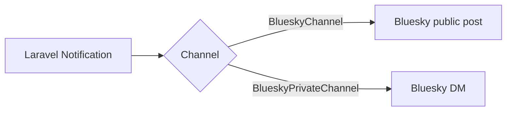

## Overview

`laravel-bluesky` integrates with Laravel's built-in notification system. Use `BlueskyChannel` to publish posts and `BlueskyPrivateChannel` to send direct messages (DMs).



## Available channels

| Channel | Purpose |
|---|---|
| `BlueskyChannel` | Notify as a normal published post |
| `BlueskyPrivateChannel` | Notify via private chat / DM to the receiver |

## Notification class

### BlueskyChannel

Return `BlueskyChannel::class` from `via()` and build the post in `toBluesky()`.

```php
use Illuminate\Notifications\Notification;
use Revolution\Bluesky\Notifications\BlueskyChannel;
use Revolution\Bluesky\Record\Post;
use Revolution\Bluesky\RichText\TextBuilder;
use Revolution\Bluesky\Embed\External;

class TestNotification extends Notification
{
    public function via(object $notifiable): array
    {
        return [
            BlueskyChannel::class
        ];
    }

    public function toBluesky(object $notifiable): Post
    {
        $external = External::create(title: 'Title', description: 'test', uri: 'https://');

        return Post::build(function (TextBuilder $builder) {
                   $builder->text('test')
                           ->newLine()
                           ->tag('#Laravel');
        })->embed($external);
    }
}
```

The `Post` API is identical to the [Basic client](/en/packages/laravel-bluesky/basic-client), so TextBuilder, Embed, and all other helpers work the same way.

### BlueskyPrivateChannel

`BlueskyPrivateMessage` is similar to `Post` but only supports text, facets, and embed. The only supported embed type is `QuoteRecord`.

```php
use Illuminate\Notifications\Notification;
use Revolution\Bluesky\Notifications\BlueskyPrivateChannel;
use Revolution\Bluesky\Notifications\BlueskyPrivateMessage;
use Revolution\Bluesky\RichText\TextBuilder;
use Revolution\Bluesky\Embed\QuoteRecord;
use Revolution\Bluesky\Types\StrongRef;

class TestNotification extends Notification
{
    public function via(object $notifiable): array
    {
        return [
            BlueskyPrivateChannel::class
        ];
    }

    public function toBlueskyPrivate(object $notifiable): BlueskyPrivateMessage
    {
        $quote = QuoteRecord::create(StrongRef::to(uri: 'at://', cid: 'cid'));

        return BlueskyPrivateMessage::build(function (TextBuilder $builder) {
                   $builder->text('test')
                           ->newLine()
                           ->tag('#Laravel');
        })->embed($quote);
    }
}
```

## On-demand notifications

Send a notification without a notifiable model by using `Notification::route()`.

### BlueskyChannel

```php
use Illuminate\Support\Facades\Notification;
use Revolution\Bluesky\Notifications\BlueskyRoute;
use Revolution\Bluesky\Session\OAuthSession;
use App\Models\User;

// App password
Notification::route('bluesky', BlueskyRoute::to(identifier: config('bluesky.identifier'), password: config('bluesky.password')))
            ->notify(new TestNotification());

// OAuth
$user = User::find(1);
$session = OAuthSession::create([
    'did' => $user->did,
    'iss' => $user->iss,
    'refresh_token' => $user->refresh_token,
]);
Notification::route('bluesky', BlueskyRoute::to(oauth: $session))
            ->notify(new TestNotification());
```

### BlueskyPrivateChannel

A `receiver` (DID or handle) is required for private channel notifications. The receiver must have DM reception enabled.

- App password requires DM-sending privileges.
- OAuth requires the `transition:chat.bsky` scope.

```php
use Illuminate\Support\Facades\Notification;
use Revolution\Bluesky\Notifications\BlueskyRoute;
use Revolution\Bluesky\Session\OAuthSession;
use App\Models\User;

// App password
Notification::route('bluesky-private', BlueskyRoute::to(identifier: config('bluesky.identifier'), password: config('bluesky.password'), receiver: 'did or handle'))
            ->notify(new TestNotification());

// OAuth
$user = User::find(1);
$session = OAuthSession::create([
    'did' => $user->did,
    'iss' => $user->iss,
    'refresh_token' => $user->refresh_token,
]);
Notification::route('bluesky-private', BlueskyRoute::to(oauth: $session, receiver: 'did or handle'))
            ->notify(new TestNotification());
```

<Info>
Bluesky does not allow sending a DM to yourself. If you want to receive notifications on your own account, create a dedicated sender account.
</Info>

```php
// Send a private message to yourself

use Illuminate\Support\Facades\Notification;
use Revolution\Bluesky\Notifications\BlueskyRoute;

Notification::route('bluesky-private', BlueskyRoute::to(identifier: 'sender identifier', password: 'sender password', receiver: 'your did or handle'))
            ->notify(new TestNotification());
```

For personal-use notifications where the sender and receiver are always the same, configure them in `.env` with a dedicated sender account.

```dotenv
BLUESKY_SENDER_IDENTIFIER=sender did or handle
BLUESKY_SENDER_APP_PASSWORD=sender password
BLUESKY_RECEIVER=your did or handle
```

```php
Notification::route('bluesky-private', BlueskyRoute::to(
    identifier: config('bluesky.notification.private.sender.identifier'),
    password: config('bluesky.notification.private.sender.password'),
    receiver: config('bluesky.notification.private.receiver'),
))->notify(new TestNotification());
```

## User notifications

Define routing methods on your notifiable model.

### BlueskyChannel

```php
use Illuminate\Notifications\Notifiable;
use Revolution\Bluesky\Notifications\BlueskyRoute;
use Revolution\Bluesky\Session\OAuthSession;

class User
{
    use Notifiable;

    public function routeNotificationForBluesky($notification): BlueskyRoute
    {
        // App password
        return BlueskyRoute::to(identifier: $this->bluesky_identifier, password: $this->bluesky_password);

        // OAuth
        $session = OAuthSession::create([
            'did' => $this->did,
            'iss' => $this->iss,
            'refresh_token' => $this->refresh_token,
        ]);
        return BlueskyRoute::to(oauth: $session);
    }
}

$user->notify(new TestNotification());
```

### BlueskyPrivateChannel

```php
use Illuminate\Notifications\Notifiable;
use Revolution\Bluesky\Notifications\BlueskyRoute;
use Revolution\Bluesky\Session\OAuthSession;

class User
{
    use Notifiable;

    public function routeNotificationForBlueskyPrivate($notification): BlueskyRoute
    {
        // App password
        return BlueskyRoute::to(identifier: $this->bluesky_identifier, password: $this->bluesky_password, receiver: $this->receiver);

        // OAuth
        $session = OAuthSession::create([
            'did' => $this->did,
            'iss' => $this->iss,
            'refresh_token' => $this->refresh_token,
        ]);
        return BlueskyRoute::to(oauth: $session, receiver: $this->receiver);
    }
}

$user->notify(new TestNotification());
```

You can also specify the user model itself as the receiver.

```php
public function routeNotificationForBlueskyPrivate($notification): BlueskyRoute
{
    return BlueskyRoute::to(identifier: 'sender identifier', password: 'sender password', receiver: $this->did);
}
```

## BlueskyRoute

The parameters differ depending on whether you use App password or OAuth authentication. Always use named arguments.

```php
use Revolution\Bluesky\Notifications\BlueskyRoute;
use Revolution\Bluesky\Session\OAuthSession;

// App password
BlueskyRoute::to(identifier: config('bluesky.identifier'), password: config('bluesky.password'))

// OAuth
$session = OAuthSession::create([
    'did' => '...',
    'iss' => '...',
    'refresh_token' => '...',
]);
BlueskyRoute::to(oauth: $session);
```

<Tip>
For notifying your own account, **App password** is the simpler option. You do not need to manage refresh token rotation — just set the values in `.env`.

```dotenv
BLUESKY_IDENTIFIER=
BLUESKY_APP_PASSWORD=
```
</Tip>

## Checking notification results

Use the `NotificationSent` event to inspect the response after the notification is dispatched, just like standard Laravel notifications.

```php
use Illuminate\Notifications\Events\NotificationSent;
use Illuminate\Http\Client\Response;

class Listener
{
    public function handle(NotificationSent $event): void
    {
        // $event->channel  BlueskyChannel
        // $event->notifiable
        // $event->notification
        // $event->response  null|Response
    }
}
```

<Info>
Source: [docs/notification.md](https://github.com/invokable/laravel-bluesky/blob/main/docs/notification.md)
</Info>
