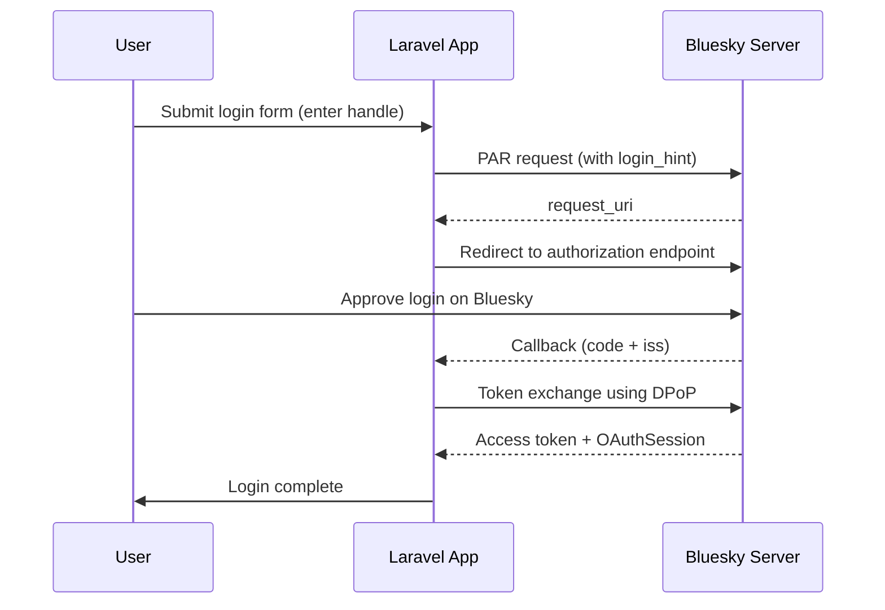

## Overview

Bluesky's OAuth is based on the AT Protocol and differs significantly from standard Socialite providers such as GitHub or Google.

<Warning>
Bluesky OAuth is fundamentally different from other Socialite providers. It uses DPoP (Demonstrated Proof of Possession) and PAR (Pushed Authorization Requests) endpoints. No `client_secret` is needed — you use a private key instead.
</Warning>

### Differences from standard OAuth

| Item | Standard Socialite | Bluesky Socialite |
| --- | --- | --- |
| Auth method | OAuth 2.0 | AT Protocol OAuth (DPoP) |
| Client identity | `client_id` + `client_secret` | Private key + `client-metadata.json` URL |
| `client_id` | Registered fixed string | URL of `client-metadata.json` |
| User identifier | Email address etc. | DID (`did:plc:...`) or handle |
| Login hint | Not required | Handle / DID / PDS URL |

### Authentication flow



## Installation and configuration

### Create a private key

Generate a private key. No Bluesky account registration is required.

```bash
php artisan bluesky:new-private-key
```

```
Please set this private key in .env

BLUESKY_OAUTH_PRIVATE_KEY="...url-safe base64 encoded key..."
```

Copy the output into your `.env` file.

```dotenv
BLUESKY_OAUTH_PRIVATE_KEY="..."
```

<Info>
For Bluesky, you don't need to register a `client_id` or `client_secret`. Setting the private key is the only required step.
</Info>

### Local development

By default, `http://localhost` and `http://127.0.0.1:8000/` are preconfigured, so no additional `.env` settings are needed for local development.

```dotenv
# Only set if you use a different port
BLUESKY_CLIENT_ID=
BLUESKY_REDIRECT=http://127.0.0.1:8080/
```

### Production

If the route named `bluesky.oauth.redirect` exists, no `.env` configuration is needed. Set it only if you have changed the default route name.

```dotenv
BLUESKY_REDIRECT=/bluesky/callback
```

## Route setup

Use `bluesky.oauth.redirect` as the callback route name — the package uses this name internally.

```php
// routes/web.php

use Illuminate\Support\Facades\Route;
use App\Http\Controllers\SocialiteController;

Route::get('login', [SocialiteController::class, 'login'])->name('login');
Route::match(['get', 'post'], 'redirect', [SocialiteController::class, 'redirect']);
Route::get('bluesky/callback', [SocialiteController::class, 'callback'])
     ->name('bluesky.oauth.redirect');
```

### Handling callbacks in local development

During local development, the callback URL returned by Bluesky is fixed to `http://127.0.0.1:8000/`. Redirect it at the route level.

```php
use Illuminate\Http\Request;
use Illuminate\Support\Facades\Route;

Route::get('/', function (Request $request) {
    if (app()->isLocal() && $request->has('iss')) {
        return to_route('bluesky.oauth.redirect', $request->query());
    }

    // ...
});
```

## Controller implementation

```php
<?php

namespace App\Http\Controllers;

use App\Models\User;
use Illuminate\Http\Request;
use Laravel\Socialite\Facades\Socialite;
use Revolution\Bluesky\Session\OAuthSession;

class SocialiteController extends Controller
{
    public function login(Request $request)
    {
        // A form page to submit a login hint
        return view('login');
    }

    public function redirect(Request $request)
    {
        // You can pass a handle, DID, or PDS URL as a login hint (optional)
        $hint = $request->input('login_hint');
        $request->session()->put('hint', $hint);

        return Socialite::driver('bluesky')
                        ->hint($hint)
                        ->redirect();
    }

    public function callback(Request $request)
    {
        if ($request->missing('code')) {
            // For debugging during development. Replace with proper error handling in production.
            dd($request);
        }

        $hint = $request->session()->pull('hint');

        /** @var \Laravel\Socialite\Two\User $user */
        $user = Socialite::driver('bluesky')
                         ->hint($hint)
                         ->user();

        /** @var OAuthSession $session */
        $session = $user->session;

        // Save the OAuthSession into the Laravel session
        $request->session()->put('bluesky_session', $session->toArray());

        $loginUser = User::updateOrCreate([
            'did' => $session->did(),
        ], [
            'iss'           => $session->issuer(),
            'handle'        => $session->handle(),
            'name'          => $session->displayName(),
            'avatar'        => $session->avatar(),
            'access_token'  => $session->token(),
            'refresh_token' => $session->refresh(),
        ]);

        auth()->login($loginUser, true);

        return to_route('bluesky.dashboard');
    }
}
```

## User information (OAuthSession)

Key methods available on the `OAuthSession` retrieved from `$user->session`.

| Method | Description | Example |
| --- | --- | --- |
| `did()` | Bluesky DID | `did:plc:xxxxxx` |
| `handle()` | Bluesky handle | `alice.bsky.social` |
| `displayName()` | Display name | `Alice` |
| `avatar()` | Avatar URL | `https://...` |
| `issuer()` | PDS URL | `https://bsky.social` |
| `token()` | Access token | |
| `refresh()` | Refresh token | |

Use `toArray()` to inspect all properties.

```php
/** @var OAuthSession $session */
dump($session->toArray());
```

## Database setup

Add Bluesky-specific columns to the `users` table. The DID is the unique identifier for a Bluesky user.

```php
// database/migrations/xxxx_add_bluesky_columns_to_users_table.php

Schema::table('users', function (Blueprint $table) {
    $table->string('did')->nullable()->unique();
    $table->string('iss')->nullable();
    $table->string('handle')->nullable();
    $table->string('avatar')->nullable();
    $table->text('access_token')->nullable();
    $table->text('refresh_token')->nullable();
});
```

## Reusing the OAuthSession

Use the OAuthSession stored in the session to call APIs.

```php
use Revolution\Bluesky\Facades\Bluesky;
use Revolution\Bluesky\Session\OAuthSession;

$session = OAuthSession::create(session('bluesky_session'));

$timeline = Bluesky::withToken($session)->getTimeline();
```

In Jobs or Console commands where the Laravel session is unavailable, build an OAuthSession from the database.

```php
use Revolution\Bluesky\Facades\Bluesky;
use Revolution\Bluesky\Session\OAuthSession;

$session = OAuthSession::create([
    'did'           => $user->did,
    'refresh_token' => $user->refresh_token,
    // For accounts not on bsky.social, also specify iss
    // 'iss'        => $user->iss,
]);

$timeline = Bluesky::withToken($session)
                   ->refreshSession()
                   ->getTimeline();
```

## Automatic token refresh

Refresh tokens can only be used once, so you must save the updated token after each refresh. Use the `OAuthSessionUpdated` event.

```bash
php artisan make:listener OAuthSessionUpdatedListener
```

```php
namespace App\Listeners;

use App\Models\User;
use Revolution\Bluesky\Events\OAuthSessionUpdated;

class OAuthSessionUpdatedListener
{
    public function handle(OAuthSessionUpdated $event): void
    {
        if (empty($event->session->did())) {
            return;
        }

        session()->put('bluesky_session', $event->session->toArray());

        User::firstWhere('did', $event->session->did())
            ->fill([
                'iss'           => $event->session->issuer(),
                'handle'        => $event->session->handle(),
                'name'          => $event->session->displayName(),
                'avatar'        => $event->session->avatar(),
                'access_token'  => $event->session->token(),
                'refresh_token' => $event->session->refresh(),
            ])->save();
    }
}
```

The `OAuthSessionRefreshing` event fires when a refresh starts. Clear the refresh token from the database here, since it becomes invalid at this point.

```php
use Revolution\Bluesky\Events\OAuthSessionRefreshing;

public function handle(OAuthSessionRefreshing $event): void
{
    if (empty($event->session->did())) {
        return;
    }

    User::firstWhere('did', $event->session->did())
        ->fill(['refresh_token' => ''])
        ->save();
}
```

## WithBluesky trait

Add the `WithBluesky` trait to your User model and implement `tokenForBluesky()` to get an authenticated Bluesky client via `$user->bluesky()`.

```php
namespace App\Models;

use Illuminate\Foundation\Auth\User as Authenticatable;
use Revolution\Bluesky\Session\OAuthSession;
use Revolution\Bluesky\Traits\WithBluesky;

class User extends Authenticatable
{
    use WithBluesky;

    protected function tokenForBluesky(): OAuthSession
    {
        return OAuthSession::create([
            'did'           => $this->did,
            'refresh_token' => $this->refresh_token,
            'iss'           => $this->iss,
        ]);
    }
}
```

```php
$profile = auth()->user()
                 ->bluesky()
                 ->refreshSession()
                 ->getProfile();
```

## Customizing client-metadata

The package automatically registers `bluesky.oauth.client-metadata` and `bluesky.oauth.jwks` routes. Changes are rarely needed, but you can customize them with `OAuthConfig`.

```php
// AppServiceProvider

use Revolution\Bluesky\Socialite\OAuthConfig;

public function boot(): void
{
    OAuthConfig::clientMetadataUsing(function () {
        return collect(config('bluesky.oauth.metadata'))
            ->merge([
                'client_id'     => route('bluesky.oauth.client-metadata'),
                'jwks_uri'      => route('bluesky.oauth.jwks'),
                'redirect_uris' => [url('bluesky/callback')],
            ])
            ->reject(fn ($item) => is_null($item))
            ->toArray();
    });
}
```

## Unauthenticated behavior

If `OAuthSession` is null or has no refresh token, an `Unauthenticated` exception is thrown and the user is redirected to the `login` route.

```php
// bootstrap/app.php
->withMiddleware(function (Middleware $middleware) {
    $middleware->redirectGuestsTo('/bluesky/login');
})
```

<Info>
Source: [docs/socialite.md](https://github.com/invokable/laravel-bluesky/blob/main/docs/socialite.md)
</Info>
