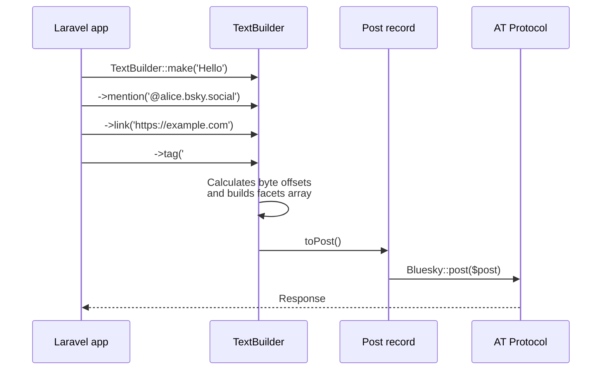

## What is TextBuilder?

`TextBuilder` is a fluent builder class for constructing AT Protocol **facets** — the rich-text annotations that power mentions, links, and hashtags in Bluesky posts.

A Bluesky post body is plain text, but to render mentions, links, and hashtags the API also requires a `facets` array describing each annotation's byte offset range and type. `TextBuilder` handles the offset calculation and array construction automatically.



## Basic text creation

### TextBuilder::make()

Call `TextBuilder::make()` with an optional initial string to create an instance.

```php
use Revolution\Bluesky\RichText\TextBuilder;

$builder = TextBuilder::make(text: 'Hello Bluesky');
```

### text()

Append more text to the current content.

```php
$builder = TextBuilder::make()
    ->text('Hello ')
    ->text('Bluesky');

// $builder->text === 'Hello Bluesky'
```

### newLine()

Append one or more newlines. The `count` parameter defaults to `1`.

```php
$builder = TextBuilder::make('Line 1')
    ->newLine()
    ->text('Line 2')
    ->newLine(count: 2)
    ->text('Line 4');
```

### toPost()

Convert the builder to a `Post` record ready to pass to `Bluesky::post()`.

```php
use Revolution\Bluesky\Facades\Bluesky;
use Revolution\Bluesky\RichText\TextBuilder;

$post = TextBuilder::make('Simple post')->toPost();

$response = Bluesky::withToken()->post($post);
```

### Post::build()

You can also use `Post::build()` with a closure. The return value is a `Post`.

```php
use Revolution\Bluesky\Facades\Bluesky;
use Revolution\Bluesky\Record\Post;
use Revolution\Bluesky\RichText\TextBuilder;

$post = Post::build(function (TextBuilder $builder) {
    $builder->text('Hello Bluesky');
});

$response = Bluesky::withToken()->post($post);
```

## Adding mentions (`@mention`)

Use `mention()` to add a mention facet.

```php
$builder->mention(text: '@alice.bsky.social');
```

### Automatic DID resolution

If `did` is omitted, the DID is resolved automatically from the handle via `Bluesky::resolveHandle()`.

```php
// DID resolved automatically (triggers an API call)
$builder->mention('@alice.bsky.social');
```

### Explicit DID

Provide the DID directly to skip the resolution API call.

```php
// Explicit DID (recommended — no extra API call)
$builder->mention(text: '@alice.bsky.social', did: 'did:plc:xxxxxxxxxxxxxxxxxxxx');
```

<Tip>
Cache resolved DIDs in production to reduce the number of `resolveHandle` API calls when mentions appear frequently.
</Tip>

## Embedding links (URLs)

Use `link()` to add a link facet.

```php
// URL as both display text and URI
$builder->link('https://laravel.com');

// Different display text and URI
$builder->link(text: 'Laravel official site', uri: 'https://laravel.com');
```

When `uri` is omitted, `text` is used as the URI.

## Adding hashtags

Use `tag()` to add a hashtag facet.

```php
// Leading # is stripped automatically
$builder->tag('#Laravel');

// Explicit tag string (without #)
$builder->tag(text: '#Laravel', tag: 'Laravel');
```

## Composing rich text

Combine multiple facets to build a fully annotated post.

```php
use Revolution\Bluesky\Facades\Bluesky;
use Revolution\Bluesky\RichText\TextBuilder;

$post = TextBuilder::make('New article published!')
    ->newLine(count: 2)
    ->mention('@alice.bsky.social', did: 'did:plc:xxxx')
    ->text(' I think you would enjoy this one.')
    ->newLine()
    ->link(text: 'Read the article', uri: 'https://example.com/article/1')
    ->newLine()
    ->tag('#Laravel')
    ->text(' ')
    ->tag('#PHP')
    ->toPost();

$response = Bluesky::withToken()->post($post);
```

### Using Post::build()

```php
use Revolution\Bluesky\Facades\Bluesky;
use Revolution\Bluesky\Record\Post;
use Revolution\Bluesky\RichText\TextBuilder;

$post = Post::build(function (TextBuilder $builder) {
    $builder->text('New article published!')
            ->newLine(count: 2)
            ->mention('@alice.bsky.social', did: 'did:plc:xxxx')
            ->text(' I think you would enjoy this one.')
            ->newLine()
            ->link(text: 'Read the article', uri: 'https://example.com/article/1')
            ->newLine()
            ->tag('#Laravel')
            ->text(' ')
            ->tag('#PHP');
});

$response = Bluesky::withToken()->post($post);
```

## Integration with posts and notifications

### With Bluesky::post()

```php
use Revolution\Bluesky\Facades\Bluesky;
use Revolution\Bluesky\RichText\TextBuilder;

$post = TextBuilder::make('test')
    ->newLine()
    ->link('https://bsky.app/')
    ->toPost();

$response = Bluesky::withToken()->post($post);
```

### With notification channels

Use `Post::build()` inside the `toBluesky()` method of a notification class.

```php
use Illuminate\Notifications\Notification;
use Revolution\Bluesky\Notifications\BlueskyChannel;
use Revolution\Bluesky\Record\Post;
use Revolution\Bluesky\RichText\TextBuilder;

class DeployedNotification extends Notification
{
    public function __construct(
        private string $url,
    ) {}

    public function via(object $notifiable): array
    {
        return [BlueskyChannel::class];
    }

    public function toBluesky(object $notifiable): Post
    {
        return Post::build(function (TextBuilder $builder) {
            $builder->text('Deployment complete')
                    ->newLine()
                    ->link(text: 'View deployment', uri: $this->url)
                    ->newLine()
                    ->tag('#Laravel');
        });
    }
}
```

## Automatic facet detection

`detectFacets()` scans the current text for `@mentions`, URLs, and `#hashtags` and populates `facets` automatically.

```php
use Revolution\Bluesky\RichText\TextBuilder;

$builder = TextBuilder::make('@alice.bsky.social test https://example.com #alice')
    ->detectFacets();

// You can still add more facets after detection
$builder->newLine()->tag('#bob');

$post = $builder->toPost();
```

<Warning>
`detectFacets()` uses regex-based detection. For guaranteed linking, use `link()`, `mention()`, and `tag()` explicitly.
</Warning>

## Custom facets

Use `facet()` to append an arbitrary facet array directly.

```php
use Revolution\Bluesky\RichText\TextBuilder;

$builder = TextBuilder::make();

$builder->facet([
    'index' => [
        'byteStart' => 0,
        'byteEnd' => 5,
    ],
    'features' => [
        [
            '$type' => 'app.bsky.richtext.facet#link',
            'uri' => 'https://example.com',
        ],
    ],
]);
```

## Character limits and important notes

### Byte offsets vs. grapheme clusters

AT Protocol facet indices use **UTF-8 byte offsets**. `TextBuilder` uses `strlen()` internally to calculate these byte positions.

Multi-byte characters (Japanese, emoji, etc.) consume more than one byte per visible character, so offsets are based on bytes, not displayed characters.

```php
// 'Hello' is 5 bytes in UTF-8
// '日本語' is 9 bytes in UTF-8 (3 bytes per character)
$builder = TextBuilder::make('日本語');
// strlen($builder->text) === 9
```

### Post character limit

Bluesky limits posts to **300 grapheme clusters** (visible characters), not bytes. Japanese and emoji characters still count as individual graphemes, so you can write 300 Japanese characters just as you can 300 ASCII characters.

```php
use Illuminate\Support\Str;

$text = 'Your post text here.';

// Count graphemes (equivalent to mb_strlen())
$length = Str::length($text);
```

<Info>
`TextBuilder` does not validate character count. If you exceed 300 graphemes, the AT Protocol API returns an error.
</Info>

## Method reference

| Method | Description |
|---|---|
| `TextBuilder::make(string $text = '')` | Create a new instance |
| `text(string $text)` | Append plain text |
| `newLine(int $count = 1)` | Append newline(s) |
| `mention(string $text, ?string $did = null)` | Add a mention facet |
| `link(string $text, ?string $uri = null)` | Add a link facet |
| `tag(string $text, ?string $tag = null)` | Add a hashtag facet |
| `detectFacets()` | Auto-detect facets from current text |
| `facet(array $facet)` | Append a custom facet |
| `resetFacets()` | Remove all facets |
| `toPost()` | Convert to a `Post` record |
| `toArray()` | Convert to `['text' => ..., 'facets' => ...]` array |

<Info>
Source: [src/RichText/TextBuilder.php](https://github.com/invokable/laravel-bluesky/blob/main/src/RichText/TextBuilder.php)
</Info>
