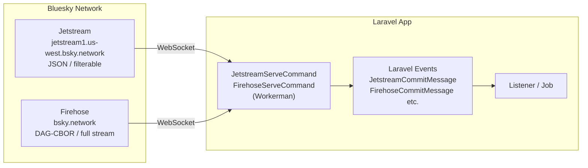

## Overview

`laravel-bluesky` provides two WebSocket commands for connecting to Bluesky's real-time streams.

- **Jetstream** — Bluesky's own filtered WebSocket endpoint. Delivers JSON messages and supports collection and DID filtering.
- **Firehose** — The raw AT Protocol event stream. Delivers every event on the network in DAG-CBOR binary format.



<Warning>
WebSocket commands are long-running processes that require a **VPS, EC2, or any always-on server**, or a **Laravel Cloud custom worker**. They do not work on serverless platforms such as Laravel Vapor or Vercel.
</Warning>

## Installation

WebSocket support requires [Workerman](https://github.com/walkor/workerman).

```bash
composer require workerman/workerman
```

## Jetstream

### Overview

Jetstream is Bluesky's managed WebSocket service. You can filter by collection type or user DID, so your process only receives the events you care about.

| Feature | Details |
|---------|---------|
| Format | JSON |
| Filtering | Filter by collection and DID |
| Volume | Low to moderate (depending on filters) |
| Use case | Monitor posts, likes, follows, etc. |

### Start the command

```bash
# Receive all messages (no filter)
php artisan bluesky:ws start

# Debug: print every received message
php artisan bluesky:ws start -v
```

### Collection filter

Use `-C` to restrict which collections you receive. Pass the flag multiple times for multiple collections.

```bash
# Receive only posts and likes
php artisan bluesky:ws start -C app.bsky.feed.post -C app.bsky.feed.like

# Receive only follows
php artisan bluesky:ws start -C app.bsky.graph.follow
```

Common collections:

| Collection | Content |
|-----------|---------|
| `app.bsky.feed.post` | Post create / delete |
| `app.bsky.feed.like` | Likes |
| `app.bsky.feed.repost` | Reposts |
| `app.bsky.graph.follow` | Follows |
| `app.bsky.graph.block` | Blocks |

### DID filter

Use `-D` to receive events from specific users only.

```bash
# Receive posts from specific users only
php artisan bluesky:ws start -C app.bsky.feed.post -D did:plc:xxx -D did:plc:yyy
```

### Event handling

The Jetstream command fires Laravel events based on the message kind.

| Event class | When fired |
|------------|-----------|
| `JetstreamMessageReceived` | Every received message |
| `JetstreamCommitMessage` | Record create, update, or delete |
| `JetstreamIdentityMessage` | Identity events (handle changes, etc.) |
| `JetstreamAccountMessage` | Account activation or deactivation |

Create a listener to handle events.

```bash
php artisan make:listener JetstreamPostListener
```

```php
namespace App\Listeners;

use Revolution\Bluesky\Events\Jetstream\JetstreamCommitMessage;

class JetstreamPostListener
{
    public function handle(JetstreamCommitMessage $event): void
    {
        // Check the collection type
        $collection = data_get($event->message, 'commit.collection');

        if ($collection !== 'app.bsky.feed.post') {
            return;
        }

        // Operation: create / update / delete
        $operation = $event->operation;

        // Author's DID
        $did = $event->message['did'];

        // Record content
        $record = data_get($event->message, 'commit.record');
        $text = data_get($record, 'text', '');

        info("[$operation] $did: $text");
    }
}
```

## Firehose

### Overview

Firehose is the raw AT Protocol event stream. It delivers every record operation on the Bluesky network as a binary DAG-CBOR payload. The package decodes the binary data automatically, so your listeners receive standard PHP arrays.

| Feature | Details |
|---------|---------|
| Format | DAG-CBOR binary (decoded automatically) |
| Filtering | None — receives all events |
| Volume | Very high |
| Use case | Full data collection, archiving |

<Info>
DAG-CBOR decoding is handled by the package. Your event listeners receive decoded PHP arrays.
</Info>

### Start the command

```bash
php artisan bluesky:firehose start

# Debug: print received messages
php artisan bluesky:firehose start -v
```

### Event handling

The Firehose command fires the following Laravel events.

| Event class | When fired |
|------------|-----------|
| `FirehoseMessageReceived` | Every received message (includes raw binary) |
| `FirehoseCommitMessage` | Record create, update, or delete |
| `FirehoseIdentityMessage` | Identity events |
| `FirehoseAccountMessage` | Account events |
| `FirehoseSyncMessage` | Repository sync events |

```bash
php artisan make:listener FirehosePostListener
```

```php
namespace App\Listeners;

use Revolution\Bluesky\Events\Firehose\FirehoseCommitMessage;

class FirehosePostListener
{
    public function handle(FirehoseCommitMessage $event): void
    {
        // Check the collection type
        if ($event->collection !== 'app.bsky.feed.post') {
            return;
        }

        // Operation: create / update / delete
        $action = $event->action;

        // Author's DID
        $did = $event->did;

        // Record content (decoded array)
        $record = $event->record;
        $text = data_get($record, 'value.text', '');

        info("[$action] $did: $text");
    }
}
```

## Configuration

Adjust the host and logging settings in `config/bluesky.php`.

```php
// Jetstream
'jetstream' => [
    'host' => env('BLUESKY_JETSTREAM_HOST', 'jetstream1.us-west.bsky.network'),
    'max' => env('BLUESKY_JETSTREAM_MAX', 0), // maxMessageSizeBytes (0 = unlimited)
    'logging' => [
        'driver' => env('BLUESKY_JETSTREAM_LOG_DRIVER', 'daily'),
        'days' => 7,
        'path' => env('BLUESKY_JETSTREAM_LOG_PATH', storage_path('logs/jetstream.log')),
    ],
],

// Firehose
'firehose' => [
    'host' => env('BLUESKY_FIREHOSE_HOST', 'bsky.network'),
    'logging' => [
        'driver' => env('BLUESKY_FIREHOSE_LOG_DRIVER', 'daily'),
        'days' => 7,
        'path' => env('BLUESKY_FIREHOSE_LOG_PATH', storage_path('logs/firehose.log')),
    ],
],
```

Example `.env` overrides:

```ini
BLUESKY_JETSTREAM_HOST=jetstream2.us-east.bsky.network
BLUESKY_JETSTREAM_MAX=1000000
```

## Combining with Labeler

You can run the Labeler server alongside Jetstream or Firehose to feed incoming events directly into your labeling logic.

```bash
# Labeler + Jetstream (monitor follow events)
php artisan bluesky:labeler:server start --jetstream -C app.bsky.graph.follow

# Labeler + Firehose (receive full stream)
php artisan bluesky:labeler:server start --firehose
```

## Running as a long-lived process

WebSocket commands must run continuously. Use a process manager such as Supervisor to keep them alive.

### Supervisor configuration

`/etc/supervisor/conf.d/bluesky-jetstream.conf`:

```ini
[program:bluesky-jetstream]
process_name=%(program_name)s_%(process_num)02d
command=php /var/www/html/artisan bluesky:ws start -C app.bsky.feed.post
autostart=true
autorestart=true
stopasgroup=true
killasgroup=true
user=www-data
numprocs=1
redirect_stderr=true
stdout_logfile=/var/www/html/storage/logs/jetstream-worker.log
stopwaitsecs=3600
```

```bash
sudo supervisorctl reread
sudo supervisorctl update
sudo supervisorctl start bluesky-jetstream:*
```

### Laravel Forge daemon

In Laravel Forge, add a daemon from the **Daemons** section.

- **Command**: `php artisan bluesky:ws start -C app.bsky.feed.post`
- **Directory**: `/var/www/html`
- **User**: `forge`

### Laravel Cloud background process

Because these commands act as **WebSocket clients** that connect to Bluesky's streams (rather than WebSocket servers), they run on Laravel Cloud. Configure them as custom workers in the Laravel Cloud background processes settings.

Add a **Custom Worker** for each command you want to run.

**For Jetstream:**

```bash
php artisan bluesky:ws start
```

**For Firehose:**

```bash
php artisan bluesky:firehose start
```

<Info>
Laravel Cloud automatically handles process lifecycle during deployments. No additional configuration beyond adding the background process is required.
</Info>

### Tips

- With `autorestart=true`, Supervisor restarts the process automatically if it crashes.
- Consider periodic restarts to prevent memory growth over time.
- For the high-volume Firehose stream, dispatch a Queue Job from your listener instead of processing inline.

```php
// Dispatch a queue job from the listener

namespace App\Listeners;

use App\Jobs\ProcessFirehosePost;
use Revolution\Bluesky\Events\Firehose\FirehoseCommitMessage;

class FirehosePostListener
{
    public function handle(FirehoseCommitMessage $event): void
    {
        if ($event->collection !== 'app.bsky.feed.post') {
            return;
        }

        // Offload heavy processing to a queue
        ProcessFirehosePost::dispatch($event->did, $event->record, $event->action);
    }
}
```

<Info>
Source: [src/Console/WebSocket](https://github.com/invokable/laravel-bluesky/tree/main/src/Console/WebSocket)
</Info>
