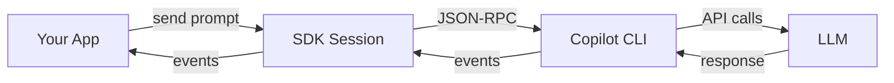
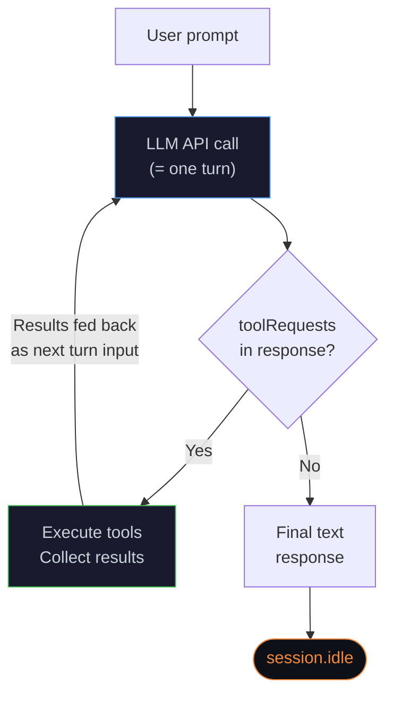
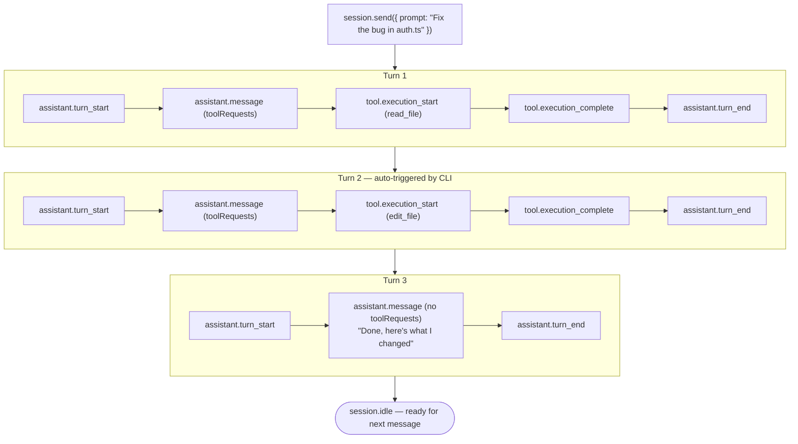

## Agent loop

This page explains how Copilot CLI processes a user message end-to-end, from prompt submission to `session.idle`.

## Architecture



The **SDK** is the transport layer. It sends prompts to **Copilot CLI** over JSON-RPC and relays events to your app. The **CLI** runs the agentic tool-use loop and orchestrates one or more LLM API calls until the task is done.

## Tool-use loop

When you call `session.send({ prompt })`, the CLI enters this loop:



On every call, the model sees the **full conversation history** (system prompt, user message, and all prior tool calls and results).

**Important:** One loop iteration exactly matches one LLM API call and appears as one `assistant.turn_start` / `assistant.turn_end` pair in the event log. There are no hidden calls.

## What a turn means

A **turn** is one LLM API call and its result.

1. The CLI sends conversation history to the LLM.
2. The LLM responds, sometimes with tool requests.
3. If tool requests exist, the CLI executes them.
4. `assistant.turn_end` is emitted.

A single user message usually triggers **multiple turns**. For example, a prompt like “How does X work in this codebase?” often looks like this:

| Turn | Model behavior | toolRequests? |
|---|---|---|
| 1 | Search with `grep` and `glob` | ✅ Yes |
| 2 | Read specific files based on search results | ✅ Yes |
| 3 | Read more for deeper context | ✅ Yes |
| 4 | Generate final text answer | ❌ No → loop ends |

On each turn, the model decides whether to continue with tools or finish with a final response.

## Event flow across multiple turns



## Who starts each turn

| Actor | Responsibility |
|---|---|
| **Your app** | Sends the initial prompt with `session.send()` |
| **Copilot CLI** | Runs the tool-use loop and feeds tool results into the next turn |
| **LLM** | Decides whether to request tools again or return a final response |
| **SDK** | Relays events only. It does not control the loop |

CLI behavior is mechanical (“model requests tools → execute tools → call model again”). The **model** decides when to stop.

## `session.idle` vs `session.task_complete`

Both are completion signals, but they have different guarantees.

### `session.idle`

- **Always emitted** when the tool-use loop ends
- **Ephemeral** (not persisted, not replayed on resume)
- Means: “The agent has stopped processing and is ready for the next message”
- Use this as your reliable completion signal

`sendAndWait()` waits for this event.

```typescript
// Wait until session.idle is emitted
const response = await session.sendAndWait({ prompt: "Fix the bug" });
```

### `session.task_complete`

- **Optional** (only emitted if the model explicitly signals it)
- **Persisted** in session logs
- Means: “The agent judged the overall task as complete”
- Can include an optional `summary`

```typescript
session.on("session.task_complete", (event) => {
    console.log("Task done:", event.data.summary);
});
```

### Autopilot mode and `task_complete`

In **autopilot mode** (headless/autonomous), the CLI tracks whether the model called `task_complete`. If the loop ends without it, the CLI injects a synthetic user message:

> *"You have not yet marked the task as complete using the task_complete tool. If you were planning, stop planning and start implementing. You aren't done until you have fully completed the task."*

This effectively restarts the loop. The model then continues work or calls `task_complete`.

In autopilot, completion is effectively two-stage:
1. The model calls `task_complete` (with summary) → CLI emits `session.task_complete`.
2. If not called, CLI nudges the model → model continues or calls `task_complete`.

### Why `task_complete` may be missing

In **interactive mode** (normal chat), the CLI does not nudge for `task_complete`. So it may be absent when:

- The interaction is conversational Q&A without a discrete “task done” state.
- The model returns final text without calling `task_complete`.
- The session ends before reaching completion.

By contrast, `session.idle` is always emitted as a mechanical loop-end signal.

### Which signal to use

| Use case | Signal |
|---|---|
| Wait for agent processing to finish | `session.idle` ✅ |
| Detect that a coding task is completed | `session.task_complete` (best effort) |
| Handle timeout/error workflows | `session.idle` + `session.error` ✅ |

## Count LLM calls

The number of `assistant.turn_start` / `assistant.turn_end` pairs equals total LLM API calls. There are no hidden planning/evaluation calls.

Example:

```bash
# Count turns in the session event log
grep -c "assistant.turn_start" ~/.copilot/session-state/<sessionId>/events.jsonl
```

## Related docs

- [Streaming events](/en/packages/laravel-copilot-sdk/streaming-events) — Field-level reference for event types and payloads.
- [Resume session](/en/packages/laravel-copilot-sdk/resume) — Session persistence and resume patterns.
- [Session hooks](/en/packages/laravel-copilot-sdk/hooks) — Intercept loop events for permissions and tool behavior.
