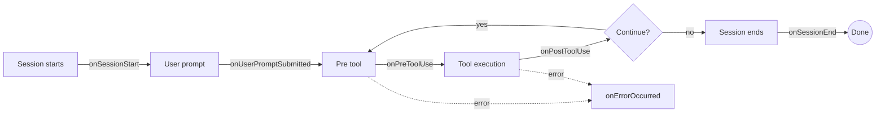

## Session hooks

With `hooks`, you can insert logic at each stage of a Copilot session lifecycle.
You can add tool execution control, audit logging, prompt enrichment, and error handling without changing core implementation.

## Hook flow



## Basic usage

```php
use Revolution\Copilot\Contracts\CopilotSession;
use Revolution\Copilot\Facades\Copilot;
use Revolution\Copilot\Types\SessionHooks;
use Revolution\Copilot\Types\Hooks\ErrorOccurredHookInput;
use Revolution\Copilot\Types\Hooks\ErrorOccurredHookOutput;
use Revolution\Copilot\Types\Hooks\PostToolUseHookInput;
use Revolution\Copilot\Types\Hooks\PostToolUseHookOutput;
use Revolution\Copilot\Types\Hooks\PreToolUseHookInput;
use Revolution\Copilot\Types\Hooks\PreToolUseHookOutput;
use Revolution\Copilot\Types\Hooks\SessionEndHookInput;
use Revolution\Copilot\Types\Hooks\SessionEndHookOutput;
use Revolution\Copilot\Types\Hooks\SessionStartHookInput;
use Revolution\Copilot\Types\Hooks\SessionStartHookOutput;
use Revolution\Copilot\Types\Hooks\UserPromptSubmittedHookInput;
use Revolution\Copilot\Types\Hooks\UserPromptSubmittedHookOutput;

Copilot::start(function (CopilotSession $session) {
    $response = $session->sendAndWait(prompt: 'Summarize the key points of this README');
    dump($response->content());
}, config: [
    'model' => 'gpt-5',
    'hooks' => new SessionHooks(
        onSessionStart: function (SessionStartHookInput $input): ?SessionStartHookOutput {
            return new SessionStartHookOutput(
                additionalContext: "Project root: {$input->cwd}",
            );
        },

        onUserPromptSubmitted: function (UserPromptSubmittedHookInput $input): ?UserPromptSubmittedHookOutput {
            if (str_starts_with($input->prompt, '/fix')) {
                return new UserPromptSubmittedHookOutput(
                    modifiedPrompt: 'Fix the current error and summarize what changed.',
                );
            }

            return null;
        },

        onPreToolUse: function (PreToolUseHookInput $input): ?PreToolUseHookOutput {
            $blocked = ['bash', 'shell', 'delete_file'];

            if (in_array($input->toolName, $blocked, true)) {
                return new PreToolUseHookOutput(
                    permissionDecision: 'deny',
                    permissionDecisionReason: "{$input->toolName} is not allowed in this environment",
                );
            }

            return new PreToolUseHookOutput(permissionDecision: 'allow');
        },

        onPostToolUse: function (PostToolUseHookInput $input): ?PostToolUseHookOutput {
            if ($input->toolName === 'read_file') {
                return new PostToolUseHookOutput(
                    additionalContext: 'If needed, explore related files and compare them.',
                );
            }

            return null;
        },

        onErrorOccurred: function (ErrorOccurredHookInput $input): ?ErrorOccurredHookOutput {
            if ($input->errorContext === 'model_call' && $input->recoverable) {
                return new ErrorOccurredHookOutput(
                    errorHandling: 'retry',
                    retryCount: 2,
                    userNotification: 'Retrying due to a temporary model error.',
                );
            }

            return null;
        },

        onSessionEnd: function (SessionEndHookInput $input): ?SessionEndHookOutput {
            if ($input->reason !== 'complete') {
                return new SessionEndHookOutput(
                    sessionSummary: "Session ended with reason: {$input->reason}",
                );
            }

            return null;
        },
    ),
]);
```

## Available hooks

| Hook | Trigger timing | Primary use |
|---|---|---|
| `onSessionStart` | Session start (`new` / `resume` / `startup`) | Inject initial context, override config |
| `onUserPromptSubmitted` | User prompt submission | Prompt enrichment, template expansion, input filtering |
| `onPreToolUse` | Before tool execution | Allow/deny/ask, modify args, suppress output |
| `onPostToolUse` | After tool execution | Modify result, mask secrets, audit logging |
| `onErrorOccurred` | Error inside session | Retry, notify user, classify errors |
| `onSessionEnd` | Session end | Cleanup, metrics, summary |

Returning `null` keeps default behavior.

## Typical use cases

### 1) Permission control

- Use `onPreToolUse` with allow-list policies.
- Require human approval for destructive actions with `permissionDecision: 'ask'`.
- Use `permissionDecisionReason` for explicit denial reasons.
- See [Tools](/en/packages/laravel-copilot-sdk/tools) for tool name candidates such as `view`, `glob`, and `bash`.

### 2) Auditing and compliance

- Combine lifecycle hooks to collect audit events.
- Persist collected records by session ID.

### 3) Prompt enrichment

- Add project context in `onSessionStart` (`language`, framework, conventions).
- Expand shortcuts such as `/fix` and `/test` in `onUserPromptSubmitted`.

### 4) Result filtering

- Mask API keys, tokens, and passwords in `onPostToolUse`.
- Summarize oversized results and return details only when needed.

### 5) Error recovery

- Retry only when `errorContext` is `model_call` and `recoverable=true`.
- Provide concise user notifications for non-recoverable paths.

### 6) Session metrics

- Record start time in `onSessionStart`.
- Update counters in `onPreToolUse` and `onUserPromptSubmitted`.
- Emit duration, tool counts, and termination reason in `onSessionEnd`.

## Hook input and output types

### Common input (`BaseHookInput`)

| Property | Type | Description |
|---|---|---|
| `timestamp` | `int` | Hook timestamp (Unix ms) |
| `cwd` | `string` | Current working directory |

### `PreToolUseHookInput`

| Property | Type | Description |
|---|---|---|
| `toolName` | `string` | Tool name to execute |
| `toolArgs` | `mixed` | Planned tool arguments |

### `PreToolUseHookOutput`

| Property | Type | Description |
|---|---|---|
| `permissionDecision` | `?string` | `allow` / `deny` / `ask` |
| `permissionDecisionReason` | `?string` | Reason for deny/ask |
| `modifiedArgs` | `mixed` | Overridden tool arguments |
| `additionalContext` | `?string` | Additional context |
| `suppressOutput` | `?bool` | Suppress tool output |

### `PostToolUseHookInput`

| Property | Type | Description |
|---|---|---|
| `toolName` | `string` | Executed tool name |
| `toolArgs` | `mixed` | Runtime tool arguments |
| `toolResult` | `ToolResultObject\|array` | Tool result |

### `PostToolUseHookOutput`

| Property | Type | Description |
|---|---|---|
| `modifiedResult` | `ToolResultObject\|array\|null` | Modified result |
| `additionalContext` | `?string` | Additional context |
| `suppressOutput` | `?bool` | Suppress result output |

### `UserPromptSubmittedHookInput`

| Property | Type | Description |
|---|---|---|
| `prompt` | `string` | User prompt |

### `UserPromptSubmittedHookOutput`

| Property | Type | Description |
|---|---|---|
| `modifiedPrompt` | `?string` | Modified prompt |
| `additionalContext` | `?string` | Additional context |
| `suppressOutput` | `?bool` | Suppress response output |

### `SessionStartHookInput`

| Property | Type | Description |
|---|---|---|
| `source` | `string` | `startup` / `resume` / `new` |
| `initialPrompt` | `?string` | Initial prompt |

### `SessionStartHookOutput`

| Property | Type | Description |
|---|---|---|
| `additionalContext` | `?string` | Initial session context |
| `modifiedConfig` | `?array` | Partial session config override |

### `SessionEndHookInput`

| Property | Type | Description |
|---|---|---|
| `reason` | `string` | `complete` / `error` / `abort` / `timeout` / `user_exit` |
| `finalMessage` | `?string` | Final message |
| `error` | `?string` | Final error |

### `SessionEndHookOutput`

| Property | Type | Description |
|---|---|---|
| `suppressOutput` | `?bool` | Suppress final output |
| `cleanupActions` | `?array` | Cleanup details |
| `sessionSummary` | `?string` | Session summary |

### `ErrorOccurredHookInput`

| Property | Type | Description |
|---|---|---|
| `error` | `string` | Error message |
| `errorContext` | `?string` | One of `model_call`, `tool_execution`, `system`, or `user_input` |
| `recoverable` | `bool` | Whether it is recoverable |

### `ErrorOccurredHookOutput`

| Property | Type | Description |
|---|---|---|
| `suppressOutput` | `?bool` | Suppress error output |
| `errorHandling` | `?string` | `retry` / `skip` / `abort` |
| `retryCount` | `?int` | Retry count |
| `userNotification` | `?string` | Message shown to user |

## ToolResultObject

Standard object for tool execution results.

| Property | Type | Description |
|---|---|---|
| `textResultForLlm` | `?string` | Text result passed to the LLM |
| `resultType` | `?string` | `success` / `failure` / `rejected` / `denied` |
| `resultForAssistant` | `?array` | Assistant-facing result data |

## Best practices

1. Avoid heavy sync work inside hooks. Offload when needed.
2. Return `null` when no customization is required.
3. Make `permissionDecision` explicit whenever possible.
4. Do not over-suppress critical errors. Keep logs and notifications.
5. Manage session state by session ID and clean up in `onSessionEnd`.

<Info>
For the latest updates, see the [GitHub repository](https://github.com/invokable/laravel-copilot-sdk).
</Info>
