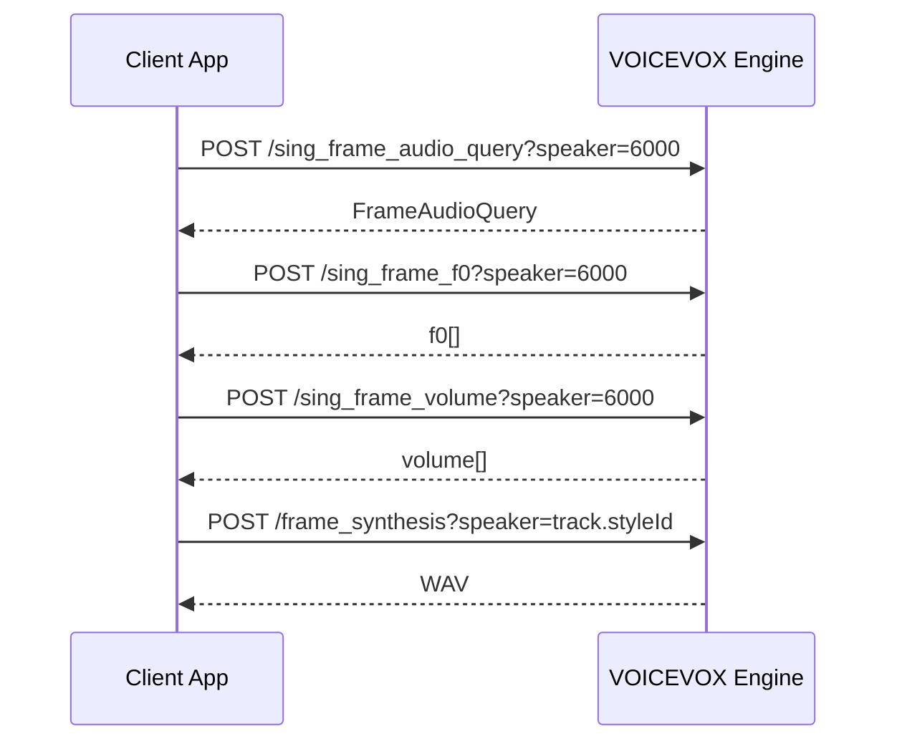

# Guide to Building Apps with VOICEVOX Engine API

<Frame caption="Song app">
    
</Frame>

<Info>
  **What is VOICEVOX?** VOICEVOX is a free, open-source Japanese text-to-speech (TTS) and singing voice synthesis software. It features a collection of fictional characters, each with a unique voice. The most famous character is **Zundamon** (ずんだもん) — a green soybean-themed mascot whose voice has been used in countless YouTube videos, games, and other content in Japan. VOICEVOX provides both an official desktop editor and an HTTP API engine, making it accessible to developers building external applications.
</Info>

This page is a practical implementation guide for building client applications that call the VOICEVOX Engine API. Based on experience developing a macOS singing application, it covers how to use the API reliably as an external app rather than replicating the internals of the official VOICEVOX editor.

General design principles are presented first, with Xcode/Swift-specific notes at the end of each section. The guidance applies to any technology stack.

<Info>
  This page is based on the [original guide](https://github.com/invokable/laravel-voicevox/blob/main/docs/develop/voicevox-engine-api-app-guide.md) and documents all content without omission.
</Info>

## 1. Register Engines by URL First

<Frame caption="Engine settings screen">
    
</Frame>

The official VOICEVOX editor launches engine executables directly, managing them through `engine_manifest.json` and engine-specific configuration. For an external client application, the simpler and more robust approach is to register the URL of an **already-running HTTP API server**.

Typical engine URLs:

| Engine | Example |
|---|---|
| Official VOICEVOX Engine | `http://127.0.0.1:50021` |
| Laravel Engine | `http://127.0.0.1:50513` |

The official engine has automatic port adjustment — if port 50021 is occupied it tries 50022, 50023, and so on. The Laravel engine behaves similarly when using the default port 8000, but if you specify `--port=50513` explicitly, the adjustment is disabled.

When registering an engine, don't save just the URL string. Call these APIs as a connectivity check and store the returned metadata alongside the URL:

| API | Purpose |
|---|---|
| `GET /engine_manifest` | Retrieve `uuid`, engine name, `frame_rate`, default sampling rate, etc. |
| `GET /version` | Retrieve the version string for display and compatibility checks |
| `GET /singers` | Retrieve the list of available singing styles |
| `GET /singer_info?speaker_uuid=...&resource_format=...` | Retrieve icons and additional singer details |

Critically, **store `engineId` and `styleId` in your projects and tracks — not the URL.** URLs change per user environment, but `engineId` corresponds to the `uuid` in `/engine_manifest` and aligns well with the `singer.engineId` field in `.vvproj` files.

**Xcode note:** In a song app, store `baseURL`, `engineID`, `name`, `frameRate`, `defaultSamplingRate`, `version`, and `singers` in a `RegisteredEngine` struct and persist it to `UserDefaults`. Normalize URLs by stripping trailing slashes, query strings, and fragments so that `http://127.0.0.1:50021/` and `http://127.0.0.1:50021` are treated as the same engine. For macOS apps using local HTTP connections, also check your sandbox entitlements and App Transport Security settings.

## 2. Don't Replicate "Engine Launching" from the Official App

Implementing the same engine-launch management as the official editor from the start means dealing with OS-specific process spawning, bundled binaries, port conflicts, updates, and log management. This is especially awkward when using alternative engine implementations, since pointing to an executable path doesn't map cleanly to a Laravel-based engine.

Start with this simpler workflow instead:

1. The user launches the engine beforehand.
2. The user enters the URL in your app.
3. Your app fetches metadata and registers the engine.
4. At render time, resolve the registered `engineId` to its URL.

With this approach, the official engine, the Laravel engine, a Docker-hosted engine, and a remote engine are all handled through the same abstraction. When a connection fails, show a clear message like "Please start the engine and reconnect" so the user knows what to do next.

**Xcode note:** In SwiftUI, make the "Engine Connection" screen a standalone view with a `TextField` for the URL, a "Register / Reconnect" button, preset buttons for the official and Laravel engines, and a list of registered engines. Show a `ProgressView` during async connection, and prefix error messages with a user-friendly explanation rather than surfacing raw `LocalizedError` strings.

## 3. Let Users Select Singers and Styles After Engine Registration

In the VOICEVOX API, the voice used for synthesis is determined by the style ID passed in the `speaker` query parameter. For song tracks, each track holds a singer style, so your UI should expand the `singers` list from registered engines and present singer names, style names, and style IDs as choices.

Two fields are sufficient to save per track:

```json
{
  "singer": {
    "engineId": "engine-uuid",
    "styleId": 6000
  }
}
```

This structure keeps song data compatible with `.vvproj` format and supports multi-engine setups naturally. If you open a project and the `engineId` is not registered, display it as "Unregistered Engine" and prompt the user to add the URL.

**Xcode note:** In Swift, attach a `Singer(engineId: String, styleId: Int)` to each track. For display, flatten `RegisteredEngine.singers` into a `SingerStyleOption` array for use in ViewModels. When the user changes the assigned singer, invalidate any previously rendered audio for that track.

## 4. Use Tick-Based Song Model for `.vvproj` Compatibility

The VOICEVOX editor stores notes and tempos in tick units. While the engine API ultimately requires frame lengths, keeping your internal editing model in tick units is better suited for piano roll editing, tempo changes, time signatures, undo/redo, and `.vvproj` read/write.

Minimum required structure:

| Element | Key Fields |
|---|---|
| Song | `tpqn`, `tempos`, `timeSignatures`, `tracks`, `trackOrder` |
| Track | `name`, `singer`, `notes`, `gain`, `pan`, `solo`, `mute` |
| Note | `id`, `position`, `duration`, `noteNumber`, `lyric` |
| Tempo | `position`, `bpm` |
| TimeSignature | `measureNumber`, `beats`, `beatType` |

Convert ticks to seconds using a tempo map only at render time, then calculate `frame_length` from the engine's `frame_rate`.

**Xcode note:** When implementing `Codable` for `.vvproj`-style JSON, store `tracks` as a dictionary keyed by ID and `trackOrder` as a separate ordered array. Before saving, validate that `trackOrder` has no duplicates, no missing IDs, and no unsorted tracks — this prevents UI corruption when loading the file.

## 5. Implement Song Synthesis as a Four-Stage API Pipeline

Song rendering involves more steps than the talk pipeline (`/audio_query` → `/synthesis`). The basic pipeline has four stages:



For `/sing_frame_audio_query`, `/sing_frame_f0`, and `/sing_frame_volume`, use style ID `6000` (the singing teacher). Only the final `/frame_synthesis` call uses the actual singer's `styleId` chosen for the track. This convention applies to both the official engine and the Laravel engine.

Keeping the relationship between `Score` and `FrameAudioQuery` consistent across requests is essential. Calculate `Score.notes[].frame_length` from the engine's `frame_rate`, and represent silence as `key: null`, `lyric: ""`.

**Xcode note:** Create a `VoicevoxEngineSongAPI` protocol and back it with a `URLSession` client for easy testing. Set `Content-Type` and `Accept` to `application/json` for JSON endpoints. Treat the response from `/frame_synthesis` as binary WAV `Data`. Map any non-2xx response to an error that includes the status code and response body.

## 6. Split and Cache by Phrase

Synthesizing the entire song on every edit causes full track re-generation for any small change, making the UI feel sluggish. Like the official editor, split consecutive note groups into phrases at rests and cache results per phrase.

Cache these stages per phrase:

| Cache | Input to include |
|---|---|
| AudioQuery | Engine ID, frame rate, tempo, Score, key range adjustment |
| F0 | AudioQuery, pitch edits, phrase position |
| Volume | AudioQuery, F0, values affecting volume generation |
| Voice/WAV | Synthesis query, final style ID |

In an early implementation, it's fine to invalidate all rendered audio for a track when any edit occurs. Build your cache keys from an input hash so you can later add phrase-level differential invalidation.

**Xcode note:** Use a Swift `actor` to hold the rendering cache, which naturally handles state management under Swift Concurrency. Advance a generation counter when a new render starts and discard stale API responses from previous generations. Combine `Task.checkCancellation()` with generation checks to handle both cancellation and re-render correctly.

## 7. Determine Frame Rate and Rests from Engine Metadata

`ScoreNote.frame_length` is computed from duration in seconds and `frame_rate`. Don't hardcode `frame_rate` — fetch it from `/engine_manifest` at registration time and store it alongside the engine record.

Song synthesis requires silence (rests) at the start and end of each phrase. A rest that is too short at the start can destabilize phoneme generation, so balance "actual rest duration," "one quarter note," and "minimum seconds back-calculated from tick" for the leading rest. Add a short silence at the end and optionally fade it out.

Also ensure that frame lengths never round down to zero or below. Short notes or notes immediately after a tempo change are especially prone to rounding errors producing zero frames.

**Xcode note:** Implement `tickToSecond` and `secondToTick` as pure functions with unit tests — these conversions are shared between the piano roll, the playback head, rendering, and video export. After computing `frameLength = Int(round(seconds * frameRate))`, guarantee a minimum of 1 frame by distributing any shortfall to adjacent notes.

## 8. Distinguish Between "Pre-Generation" and "Pre-Synthesis" Parameter Editing

In song mode, key range, volume range, pitch, volume, and phoneme timing edits each affect a different stage of the pipeline:

| Edit | When It Takes Effect |
|---|---|
| `keyRangeAdjustment` | Key applied during Score generation; pitch shift applied after F0 generation |
| `volumeRangeAdjustment` | Applied to the volume array before `/frame_synthesis` |
| Pitch edit | Applied to the F0 array after `/sing_frame_f0` |
| Volume edit | Applied to the volume array after `/sing_frame_volume` |
| Phoneme timing edit | Applied to `FrameAudioQuery.phonemes` |

Deciding early which edits invalidate which cache entries prevents rendering results from breaking when you add UI editing features later.

**Xcode note:** Centralise parameter-edit application in a pure-logic type like `SongParameterEditApplicator` rather than scattering it across ViewModels. Handle out-of-bounds array access and negative volumes explicitly with correction or errors.

## 9. Use Consistent Track Logic for Playback, Mixing, and Export

After rendering, phrase WAV files are placed on a timeline for playback. With multi-track support, if the logic for solo/mute/gain/pan differs between normal playback, full-mix WAV export, and stem export, users get unexpected results.

Apply this consistent rule:
- If any track is soloed, output only soloed tracks.
- If no track is soloed, output all non-muted tracks.
- For stem export, output the target track alone, independent of the current solo/mute state.

**Xcode note:** On macOS, build a playback graph with `AVAudioEngine`, `AVAudioPlayerNode`, and `AVAudioMixerNode`. Keep the export path separate from the playback path using offline rendering, and share WAV encoding logic between them. If an edit invalidates rendered audio during playback, stop playback and display the updated state clearly.

## 10. Distinguish Between "Unregistered," "Unassigned," and "Not Rendered" in UI

A VOICEVOX engine API app can fail for several distinct reasons:

| State | Message to Show |
|---|---|
| No engine registered | Register a URL on the engine connection screen |
| Engine not running | Start the engine and reconnect |
| Project's `engineId` not registered | Add the matching engine URL |
| No singer assigned to track | Choose a registered singer style |
| Audio is stale after editing | Re-render is required |
| Rendering in progress | Allow the user to cancel |

Collapsing all of these into "Cannot play" makes the cause invisible. Surface distinct states and show the next action in the UI.

**Xcode note:** In a SwiftUI ViewModel, model `renderingState` as an enum — `idle`, `rendering`, `rendered`, `stale`, `failed` — to keep button disabled state and status display consistent. Expose errors in both a status bar and an alert so users can see them regardless of where they are in the UI.

## 11. Separate Lifetimes of "URL" and "engineId" in Multi-Engine Setups

Multi-engine support is confusing because URL and `engineId` play very different roles:

| Value | Lifetime | Usage |
|---|---|---|
| URL | Changes per user environment | Used as the API call target |
| `engineId` | Stable identifier tied to the engine implementation | Used as a reference inside project files |
| `styleId` | Style identifier within an engine | Used as the `speaker` parameter |

Do not embed URLs in project files. Store `engineId` and `styleId` in the project, and keep the `engineId → URL` mapping in app settings. This means a project received from another user can be rendered on your machine by registering the same engine with your local URL.

**Xcode note:** Before rendering, resolve `engineId` to a `RegisteredEngine` with something like `Dictionary(uniqueKeysWithValues: registeredEngines.map { ($0.engineID, $0) })`. If the engine is not found, fail early with "The engine for this singer is not registered" rather than attempting an HTTP request.

## 12. Separate HTTP Client, Model Transformation, and Rendering Plan in Tests

Running the VOICEVOX engine itself for every automated test is expensive. In unit tests, mock HTTP and verify request generation and state transitions on the app side.

Priority test targets:

| Target | What to Verify |
|---|---|
| URL normalization | Trailing slashes and path-prefixed URLs are handled correctly |
| Engine registration | `/engine_manifest`, `/version`, `/singers`, `/singer_info` are called and the saved model is constructed correctly |
| `.vvproj` I/O | Consistency of `trackOrder` and `tracks`; handling of old and future versions |
| tick/second conversion | Conversion round-trips correctly across tempo changes |
| Score generation | Rests, `frame_length`, default lyrics, key range adjustment |
| Rendering plan | Unregistered engine, unassigned singer, and `engineId` mismatch are detected before any API call |
| Cache | Same input reuses cached result; cache is invalidated after editing |

**Xcode note:** Use `URLSessionConfiguration.ephemeral` with a `URLProtocol` stub to test `URLSession`-based clients without a real HTTP server. Inject the API into renderers through a protocol. Provide a snapshot method on the `actor` cache state to make it easy to assert in tests.

## Recommended Implementation Order

Start with the minimal working configuration and expand from there:

<Steps>
  <Step title="Engine URL Registration and Metadata Storage">
    Register a URL and store the metadata fetched from `/engine_manifest` and `/version`.
  </Step>
  <Step title="Singer Style List and Assignment">
    Display the list of singer styles and assign `engineId + styleId` to each track.
  </Step>
  <Step title="Tick-Based Song Model">
    Finalize the tick-based Song/Track/Note model first.
  </Step>
  <Step title="Four-Stage API Client">
    Implement `Score` generation and the four-stage song API client.
  </Step>
  <Step title="Phrase-Level Rendering">
    Introduce phrase-level rendering and caching.
  </Step>
  <Step title="Playback">
    Enable playback of rendered WAV files on a timeline.
  </Step>
  <Step title="Multi-Track Logic">
    Unify solo/mute/gain/pan logic across all tracks.
  </Step>
  <Step title="Export">
    Add full-mix WAV export and stem export.
  </Step>
  <Step title="Parameter Editing">
    Add pitch, volume, and phoneme timing editing.
  </Step>
  <Step title="Advanced Features">
    Move on to `.vvproj` compatible read/write, video export, and other advanced features.
  </Step>
</Steps>

Rather than chasing every feature of the official editor from day one, solidifying URL registration, singer assignment, the four-stage API, and re-render state management first makes it straightforward to support both the official engine and the Laravel engine.

## Related Links

- [VOICEVOX Core for PHP Package](/en/packages/voicevox-core-php/index)
- [Engine API Mode: Talk](/en/packages/laravel-voicevox/engine-talk)
- [Engine API Mode: Song](/en/packages/laravel-voicevox/engine-song)
- [Score and Note Details](/en/packages/laravel-voicevox/song-score-note)
- [.vvproj File Specification](/en/packages/laravel-voicevox/vvproj)
