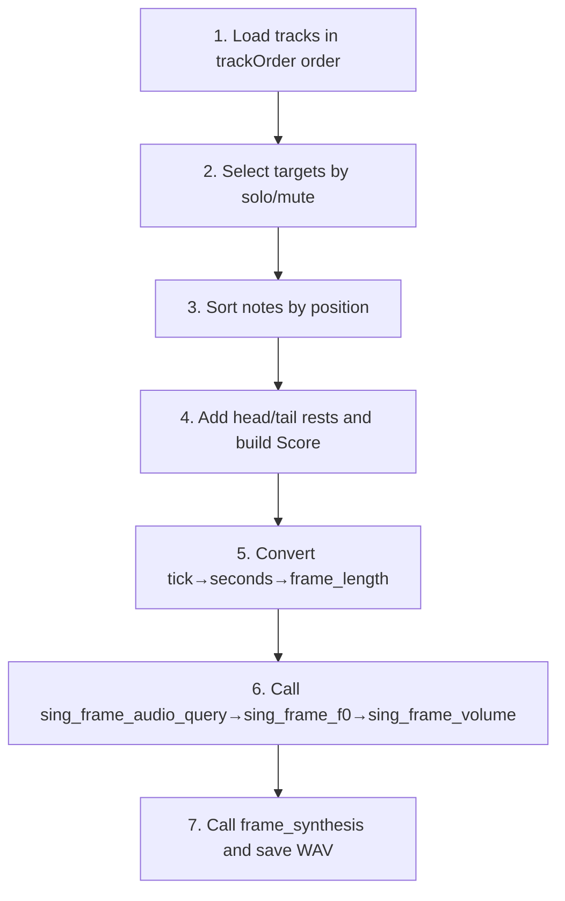

## Goal

Use VOICEVOX Editor `.vvproj` data directly in Laravel so you can regenerate both talk and song output.

<Info>
  VOICEVOX is a Japanese text-to-speech and singing synthesis software. This page focuses on interoperability with the official VOICEVOX Editor project file.
</Info>

## Top-level structure

`.vvproj` is UTF-8 JSON. One file can include both talk and song data.

```json
{
  "appVersion": "0.25.2",
  "talk": {
    "audioKeys": [],
    "audioItems": {}
  },
  "song": {
    "tpqn": 480,
    "tempos": [],
    "timeSignatures": [],
    "tracks": {},
    "trackOrder": []
  }
}
```

| Key | Description |
| --- | --- |
| `appVersion` | VOICEVOX Editor version used to save the project |
| `talk` | Talk data (`audioKeys` + `audioItems`) |
| `song` | Song data (tempo, meter, tracks) |

## `talk` section

`talk.audioKeys` defines order. `talk.audioItems` is a record keyed by the same IDs.

```json
{
  "audioKeys": ["audio-item-uuid"],
  "audioItems": {
    "audio-item-uuid": {
      "text": "ずんだもんなのだ",
      "voice": {
        "engineId": "engine-uuid",
        "speakerId": "speaker-uuid",
        "styleId": 3
      },
      "query": {
        "accentPhrases": [],
        "speedScale": 1,
        "pitchScale": 0
      },
      "presetKey": "preset-uuid"
    }
  }
}
```

### TalkAudioItem

| Key | Description |
| --- | --- |
| `text` | Input text |
| `voice.engineId` | Engine ID (matches `/engine_manifest`) |
| `voice.speakerId` | Speaker UUID |
| `voice.styleId` | Style ID passed directly to `/synthesis?speaker={styleId}` |
| `query` | `AudioQuery`-equivalent payload |
| `presetKey` | Editor preset ID. For Laravel-side presets, see [Presets](/en/packages/laravel-voicevox/presets) |

If `query` is already stored in `.vvproj`, you can skip `/audio_query` and synthesize directly.

### `accentPhrases`

| Key | Description |
| --- | --- |
| `moras` | Mora array (`consonant` fields may be omitted) |
| `accent` | Accent position (1-based) |
| `pauseMora` | Optional pause mora |
| `isInterrogative` | Question sentence flag |

## `song` section

```json
{
  "tpqn": 480,
  "tempos": [{ "position": 0, "bpm": 120 }],
  "timeSignatures": [{ "measureNumber": 1, "beats": 4, "beatType": 4 }],
  "tracks": {
    "track-uuid": {
      "name": "Untitled Track",
      "singer": { "engineId": "engine-uuid", "styleId": 3003 },
      "notes": []
    }
  },
  "trackOrder": ["track-uuid"]
}
```

| Key | Description |
| --- | --- |
| `tpqn` | Ticks per quarter note. Default is 480 |
| `tempos` | Tempo map (`position` in ticks) |
| `timeSignatures` | Time-signature map |
| `tracks` | Record keyed by track ID |
| `trackOrder` | Playback/display order. Must match `tracks` key set |

### Track

| Key | Description |
| --- | --- |
| `singer.styleId` | Final style ID for `/frame_synthesis?speaker={styleId}` |
| `notes` | Note array |
| `keyRangeAdjustment` | Semitone key adjustment |
| `volumeRangeAdjustment` | Volume adjustment |
| `pitchEditData` / `volumeEditData` | Frame-level edit data |
| `phonemeTimingEditData` | Phoneme timing overrides by note ID |
| `solo` / `mute` | Track-selection flags |

### Note

| Key | Description |
| --- | --- |
| `id` | Unique note ID |
| `position` | Start tick |
| `duration` | Length in ticks |
| `noteNumber` | MIDI note number |
| `lyric` | Lyric |

## Tick/seconds/frame conversion

For a single tempo:

```text
seconds = ticks / tpqn * 60 / bpm
frames = round(seconds * frameRate)
```

With tempo changes, sum each segment in `tempos` order:

```php
function ticksToSeconds(int $targetTick, int $tpqn, array $tempos): float
{
    $seconds = 0.0;
    $currentTick = 0;

    foreach ($tempos as $index => $tempo) {
        $nextTick = $tempos[$index + 1]['position'] ?? $targetTick;
        $segmentEnd = min($targetTick, $nextTick);

        if ($segmentEnd <= $currentTick) {
            break;
        }

        $bpm = $tempo['bpm'];
        $seconds += (($segmentEnd - $currentTick) / $tpqn) * (60 / $bpm);
        $currentTick = $segmentEnd;
    }

    return $seconds;
}
```

For `Note::len()` helper usage (tick-to-frame workflow), see [Score and Note Deep Dive](/en/packages/laravel-voicevox/song-score-note).

## Song synthesis flow



## Notes for direct JSON editing

- Keep `tracks` keys and `trackOrder` perfectly aligned
- Keep `talk.audioKeys` aligned with `talk.audioItems`
- Validate `position >= 0`, `duration >= 1`, `noteNumber` in `0..127`
- Prefer `tempos[0].position = 0` and `timeSignatures[0].measureNumber = 1`
- Preserve unknown keys when possible for forward compatibility

## Laravel code example

Minimal example to load `.vvproj` and render both talk and song outputs:

```php
use Illuminate\Support\Facades\Storage;
use Revolution\Voicevox\Client\TalkAudioQuery;
use Revolution\Voicevox\Song\Note;
use Revolution\Voicevox\Song\Score;
use Revolution\Voicevox\Voicevox;

$project = json_decode(
    Storage::disk('local')->get('voicevox/sample.vvproj'),
    true,
    flags: JSON_THROW_ON_ERROR,
);

// Talk: synthesize from stored query
foreach ($project['talk']['audioKeys'] as $audioKey) {
    $item = $project['talk']['audioItems'][$audioKey];

    Voicevox::talk($item['text'], id: $item['voice']['styleId'])
        ->tap(fn (TalkAudioQuery $talk) => $talk->audioQuery = array_replace($talk->audioQuery, $item['query']))
        ->generate(id: $item['voice']['styleId'])
        ->storeAs('vvproj/talk', "{$audioKey}.wav");
}

// Song: convert first-track durations into frame_length
$trackId = $project['song']['trackOrder'][0];
$track = $project['song']['tracks'][$trackId];
$bpm = $project['song']['tempos'][0]['bpm'] ?? 120;

$score = Score::make([
    Note::make(length: 15, lyric: '', key: null),
    ...collect($track['notes'])->map(
        fn (array $note) => Note::make(
            length: Note::len(ticks: $note['duration'], bpm: $bpm),
            lyric: $note['lyric'] ?? 'ら',
            key: $note['noteNumber'],
            id: $note['id'] ?? null,
        ),
    )->all(),
    Note::make(length: 2, lyric: '', key: null),
]);

Voicevox::song($score, teacher: 6000)
    ->generate(id: $track['singer']['styleId'])
    ->storeAs('vvproj/song', "{$trackId}.wav");
```
