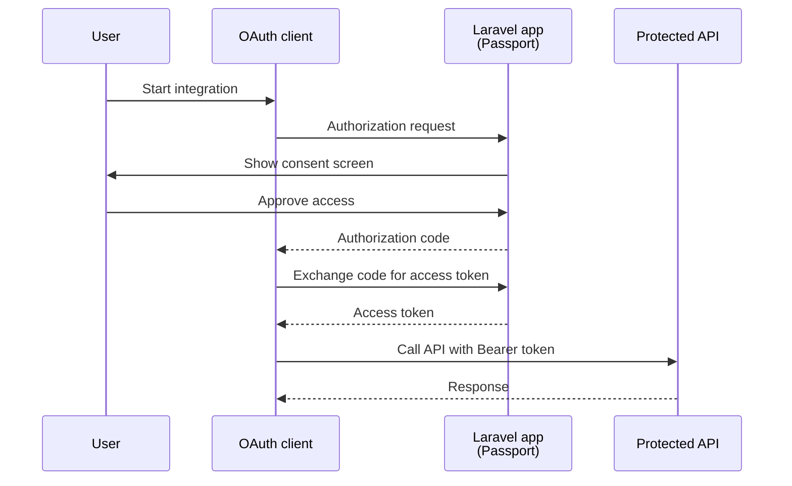

## What is Passport

Laravel Passport is Laravel's official package for running your app as an OAuth2 authorization server.
Use it when your API must support standard OAuth2 flows for third-party clients.



## Passport vs Sanctum

Choose Passport only when you need OAuth2.
Choose Sanctum for simpler API token auth, SPA auth, or mobile auth.

| Criteria | Passport | Sanctum |
| --- | --- | --- |
| Primary goal | OAuth2 server | Simple API authentication |
| Best fit | Third-party app integrations, OAuth2 compliance | First-party SPAs, mobile apps, personal tokens |
| Complexity | Higher | Lower |

## Installation

On Laravel 13, the official recommended setup is:

```shell
php artisan install:api --passport
```

For manual setup in an existing app, you can also use:

```shell
composer require laravel/passport
php artisan passport:install
```

For first deployment scenarios where you only need keys:

```shell
php artisan passport:keys
```

## Configuration

### User model

Add the `HasApiTokens` trait and `OAuthenticatable` interface to your `User` model.

```php
use Laravel\Passport\Contracts\OAuthenticatable;
use Laravel\Passport\HasApiTokens;

class User extends Authenticatable implements OAuthenticatable
{
    use HasApiTokens, HasFactory, Notifiable;
}
```

### Auth guard

Configure the `api` guard in `config/auth.php` to use the `passport` driver.

```php
'guards' => [
    'api' => [
        'driver' => 'passport',
        'provider' => 'users',
    ],
],
```

### Service provider configuration

In `AppServiceProvider::boot()`, you can define scopes and token lifetimes.

```php
use Carbon\CarbonInterval;
use Laravel\Passport\Passport;

public function boot(): void
{
    Passport::tokensCan([
        'orders:read' => 'Read orders',
        'orders:create' => 'Create orders',
    ]);

    Passport::defaultScopes(['orders:read']);

    Passport::tokensExpireIn(CarbonInterval::days(15));
    Passport::refreshTokensExpireIn(CarbonInterval::days(30));
    Passport::personalAccessTokensExpireIn(CarbonInterval::months(6));
}
```

## Client management

### Authorization code grant client

```shell
php artisan passport:client
```

Use this client for the standard OAuth2 flow with user consent.

### Client credentials grant client

```shell
php artisan passport:client --client
```

For machine-to-machine routes, use `EnsureClientIsResourceOwner`.

```php
use Laravel\Passport\Http\Middleware\EnsureClientIsResourceOwner;

Route::get('/orders', function () {
    // ...
})->middleware(EnsureClientIsResourceOwner::using('orders:read'));
```

## Token management

### Assign scopes

```php
$accessToken = $user->createToken(
    'dashboard-token',
    ['orders:read', 'orders:create']
)->accessToken;
```

### Check scopes

```php
use Laravel\Passport\Http\Middleware\CheckToken;

Route::get('/orders', function () {
    // ...
})->middleware(['auth:api', CheckToken::using('orders:read')]);
```

### Revoke tokens

```php
use Laravel\Passport\Passport;

$token = Passport::token()->find($tokenId);
$token?->revoke();
```

## Protecting API routes

Use `auth:api` on routes that require a valid user access token.

```php
Route::middleware('auth:api')->group(function () {
    Route::get('/user', fn (Request $request) => $request->user());
    Route::get('/orders', [OrderController::class, 'index']);
});
```

<Warning>
  For client credentials grant routes, use `EnsureClientIsResourceOwner` instead of `auth:api`.
</Warning>

## Personal access token

This is useful when users need to issue tokens for themselves without the full OAuth2 redirect flow.

```shell
php artisan passport:client --personal
```

```php
$token = $request->user()->createToken('cli-token', ['orders:read'])->accessToken;
```

<Info>
  If your main use case is personal access tokens only, the Laravel docs recommend considering Sanctum.
</Info>

## Related links

- [Laravel official docs: Passport](https://laravel.com/docs/13.x/passport)
- [Laravel official docs: Sanctum](https://laravel.com/docs/13.x/sanctum)
