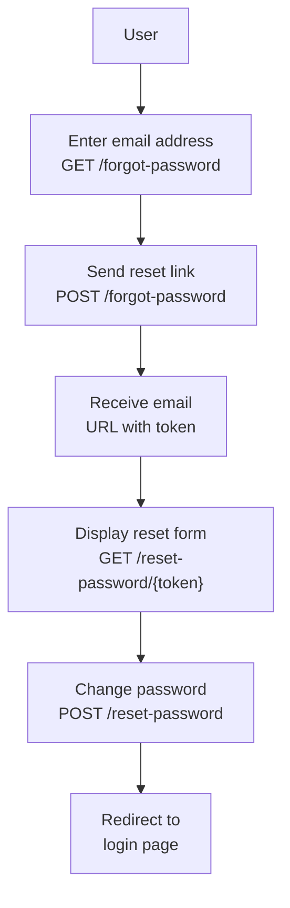

## Introduction

Password reset is an essential authentication flow for any web application. If you use a starter kit, this feature is scaffolded automatically. For API-only projects, SPAs, or applications with a custom UI, you need to implement it manually.

**When manual implementation is required:**

- API-only backends (frontend is a SPA or mobile app)
- Building authentication UI without a starter kit
- Fully customizing the email notification or reset URL

<Info>
  If you created your project with a starter kit (`laravel new`), password reset is already implemented. This page explains how to implement it without a starter kit.
</Info>

The complete password reset flow looks like this:



## Configuration

Password reset configuration lives in the `passwords` key of `config/auth.php`.

```php
// config/auth.php

'passwords' => [
    'users' => [
        'driver' => 'database',
        'provider' => 'users',
        'table' => env('AUTH_PASSWORD_RESET_TOKEN_TABLE', 'password_reset_tokens'),
        'expire' => 60,
        'throttle' => 60,
    ],
],
```

- `driver` — storage backend (`database` or `cache`)
- `expire` — token lifetime in minutes. Defaults to 60
- `throttle` — seconds a user must wait before requesting another link

## Drivers

### database driver

The default driver. Password reset tokens are stored in the `password_reset_tokens` database table. This table is created by Laravel's default migration (`0001_01_01_000000_create_users_table.php`).

```php
'passwords' => [
    'users' => [
        'driver' => 'database',
        'provider' => 'users',
        'table' => env('AUTH_PASSWORD_RESET_TOKEN_TABLE', 'password_reset_tokens'),
        'expire' => 60,
        'throttle' => 60,
    ],
],
```

### cache driver

<Tip>
  Available since Laravel 11. The `cache` driver requires no database table, keeping your setup simpler.
</Tip>

The `cache` driver stores tokens in a cache store, eliminating the need for the `password_reset_tokens` table. Tokens are keyed by the user's email address, so make sure you are not using email addresses as cache keys elsewhere in your application.

```php
'passwords' => [
    'users' => [
        'driver' => 'cache',
        'provider' => 'users',
        'store' => 'passwords', // Optional: dedicated cache store
        'expire' => 60,
        'throttle' => 60,
    ],
],
```

Specifying a dedicated `store` prevents `php artisan cache:clear` from wiping your reset tokens. The value must match a store name defined in `config/cache.php`.

## Model preparation

Your `App\Models\User` model requires two traits for password reset to work:

```php
<?php

namespace App\Models;

use Illuminate\Auth\Passwords\CanResetPassword;
use Illuminate\Foundation\Auth\User as Authenticatable;
use Illuminate\Notifications\Notifiable;

class User extends Authenticatable
{
    use Notifiable, CanResetPassword;

    // ...
}
```

- `Notifiable` — required to send email notifications
- `CanResetPassword` — provides the implementation of the `CanResetPassword` contract

<Info>
  Laravel's default `User` model already includes both traits. No changes are required for a fresh installation.
</Info>

## Routing

Password reset requires four routes.

### 1. Reset link request form

Display the form where the user enters their email address.

```php
// routes/web.php

Route::get('/forgot-password', function () {
    return view('auth.forgot-password');
})->middleware('guest')->name('password.request');
```

Corresponding Blade view:

```blade
{{-- resources/views/auth/forgot-password.blade.php --}}

<form method="POST" action="/forgot-password">
    @csrf

    <div>
        <label for="email">Email address</label>
        <input id="email" type="email" name="email" value="{{ old('email') }}" required autofocus>
        @error('email')
            <span>{{ $message }}</span>
        @enderror
    </div>

    @if (session('status'))
        <div>{{ session('status') }}</div>
    @endif

    <button type="submit">Send reset link</button>
</form>
```

### 2. Send the reset link

Accept the form submission and send the reset email using `Password::sendResetLink()`.

```php
use Illuminate\Http\Request;
use Illuminate\Support\Facades\Password;

Route::post('/forgot-password', function (Request $request) {
    $request->validate(['email' => 'required|email']);

    $status = Password::sendResetLink(
        $request->only('email')
    );

    return $status === Password::ResetLinkSent
        ? back()->with(['status' => __($status)])
        : back()->withErrors(['email' => __($status)]);
})->middleware('guest')->name('password.email');
```

`Password::sendResetLink()` returns a status string:

| Status constant | Meaning |
| --- | --- |
| `Password::ResetLinkSent` | Reset link was sent successfully |
| `Password::INVALID_USER` | No user found with that email address |
| `Password::RESET_THROTTLED` | Request is being throttled |

### 3. Display the reset form

Show the new password form to users who click the link in their email.

```php
Route::get('/reset-password/{token}', function (string $token) {
    return view('auth.reset-password', ['token' => $token]);
})->middleware('guest')->name('password.reset');
```

Corresponding Blade view:

```blade
{{-- resources/views/auth/reset-password.blade.php --}}

<form method="POST" action="/reset-password">
    @csrf

    <input type="hidden" name="token" value="{{ $token }}">

    <div>
        <label for="email">Email address</label>
        <input id="email" type="email" name="email" value="{{ old('email') }}" required autofocus>
        @error('email')
            <span>{{ $message }}</span>
        @enderror
    </div>

    <div>
        <label for="password">New password</label>
        <input id="password" type="password" name="password" required>
        @error('password')
            <span>{{ $message }}</span>
        @enderror
    </div>

    <div>
        <label for="password_confirmation">Confirm password</label>
        <input id="password_confirmation" type="password" name="password_confirmation" required>
    </div>

    <button type="submit">Reset password</button>
</form>
```

### 4. Handle the reset submission

Accept the form and update the password using `Password::reset()`.

```php
use App\Models\User;
use Illuminate\Auth\Events\PasswordReset;
use Illuminate\Http\Request;
use Illuminate\Support\Facades\Hash;
use Illuminate\Support\Facades\Password;
use Illuminate\Support\Str;

Route::post('/reset-password', function (Request $request) {
    $request->validate([
        'token' => 'required',
        'email' => 'required|email',
        'password' => 'required|min:8|confirmed',
    ]);

    $status = Password::reset(
        $request->only('email', 'password', 'password_confirmation', 'token'),
        function (User $user, string $password) {
            $user->forceFill([
                'password' => Hash::make($password),
            ])->setRememberToken(Str::random(60));

            $user->save();

            event(new PasswordReset($user));
        }
    );

    return $status === Password::PasswordReset
        ? redirect()->route('login')->with('status', __($status))
        : back()->withErrors(['email' => [__($status)]]);
})->middleware('guest')->name('password.update');
```

`Password::reset()` status constants:

| Status constant | Meaning |
| --- | --- |
| `Password::PasswordReset` | Password was reset successfully |
| `Password::INVALID_TOKEN` | Token is invalid or expired |
| `Password::INVALID_USER` | No user found with that email address |

## Token expiration

The `expire` option in `config/auth.php` sets the token lifetime in minutes. The default is 60 minutes.

```php
'passwords' => [
    'users' => [
        'driver' => 'database',
        'expire' => 60, // expires after 60 minutes
        'throttle' => 60,
    ],
],
```

When using the `database` driver, expired tokens remain in the database. Clean them up with:

```shell
php artisan auth:clear-resets
```

You can automate this with the scheduler:

```php
use Illuminate\Support\Facades\Schedule;

Schedule::command('auth:clear-resets')->everyFifteenMinutes();
```

## Customization

### Custom notification

To customize the password reset email, override `sendPasswordResetNotification` on the `User` model.

```php
use App\Notifications\ResetPasswordNotification;

class User extends Authenticatable
{
    use Notifiable, CanResetPassword;

    /**
     * Send a password reset notification to the user.
     */
    public function sendPasswordResetNotification($token): void
    {
        $url = 'https://example.com/reset-password?token='.$token;

        $this->notify(new ResetPasswordNotification($url));
    }
}
```

### Custom reset link URL

Use `ResetPassword::createUrlUsing()` in your `AppServiceProvider` to change the reset URL. This is useful when your frontend lives on a different origin, such as a SPA.

```php
use App\Models\User;
use Illuminate\Auth\Notifications\ResetPassword;

public function boot(): void
{
    ResetPassword::createUrlUsing(function (User $user, string $token) {
        return 'https://example.com/reset-password?token='.$token;
    });
}
```

### Configuring trusted hosts

Password reset links are generated using the `Host` header of the incoming HTTP request. Configure trusted hosts in `bootstrap/app.php` to prevent host header injection attacks.

```php
->withMiddleware(function (Middleware $middleware) {
    $middleware->trustHosts(at: ['example.com']);
})
```

<Warning>
  Always configure trusted hosts when implementing password reset. Without it, attackers could manipulate the `Host` header to redirect reset links to a malicious domain.
</Warning>

## Summary

| Goal | How |
| --- | --- |
| Send a reset link | `Password::sendResetLink(['email' => $email])` |
| Reset the password | `Password::reset($credentials, $callback)` |
| Reset without a database table | Use the `cache` driver |
| Delete expired tokens | `php artisan auth:clear-resets` |
| Customize the email | Override `sendPasswordResetNotification` |
| Customize the reset URL | `ResetPassword::createUrlUsing()` |

## Next steps

<Columns cols={2}>
  <Card title="Authentication" icon="lock" href="/en/authentication">
    Learn how Laravel's full authentication system works.
  </Card>
  <Card title="Notifications" icon="bell" href="/en/notifications">
    Customize email notifications in depth.
  </Card>
</Columns>
