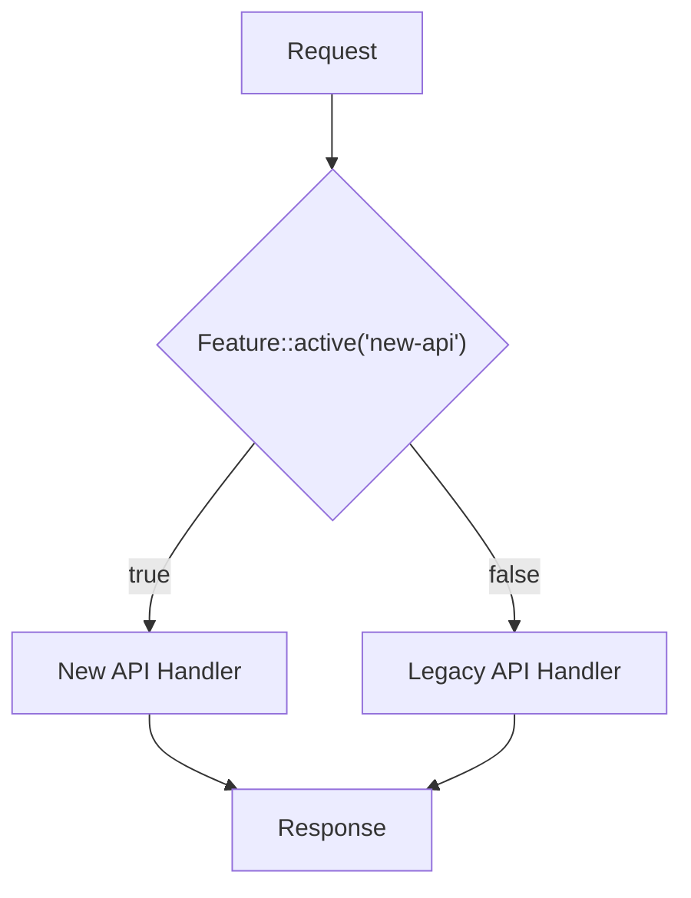

## What is Laravel Pennant?

[Laravel Pennant](https://github.com/laravel/pennant) is a simple, lightweight feature flag package. Feature flags let you incrementally roll out new application features with confidence, run A/B tests on new interface designs, complement trunk-based development strategies, and more.

### Feature Flag Flow



Feature flags decouple deployment from release — deploy code to production without exposing it to users until you're ready.

---

## Installation

<Steps>
  <Step title="Install the package">
    Install Pennant via Composer:

    ```bash
    composer require laravel/pennant
    ```
  </Step>

  <Step title="Publish configuration and migrations">
    Publish Pennant's config file and database migrations:

    ```bash
    php artisan vendor:publish --provider="Laravel\Pennant\PennantServiceProvider"
    ```
  </Step>

  <Step title="Run migrations">
    Create the `features` table used by the database driver:

    ```bash
    php artisan migrate
    ```
  </Step>
</Steps>

---

## Configuration

After publishing, the config file is located at `config/pennant.php`. You can set the default storage driver here.

| Driver | Description |
| --- | --- |
| `database` | Persists resolved values in a relational database (default) |
| `array` | Stores values in-memory only (useful for testing) |

```php
// config/pennant.php
'default' => env('PENNANT_STORE', 'database'),
```

---

## Defining Features

### Closure-based Features

Define features using the `Feature` facade's `define` method, typically in a service provider's `boot` method. The closure receives the feature's "scope" — usually the authenticated user.

```php
<?php

namespace App\Providers;

use App\Models\User;
use Illuminate\Support\Lottery;
use Illuminate\Support\ServiceProvider;
use Laravel\Pennant\Feature;

class AppServiceProvider extends ServiceProvider
{
    public function boot(): void
    {
        Feature::define('new-api', fn (User $user) => match (true) {
            $user->isInternalTeamMember() => true,
            $user->isHighTrafficCustomer() => false,
            default => Lottery::odds(1 / 100),
        });
    }
}
```

The feature logic above:
- Always ON for internal team members
- Always OFF for high-traffic customers
- Randomly enabled for 1% of everyone else

The first time a feature is checked for a given scope, the result is stored. Subsequent checks retrieve the stored value.

<Info>
  If a feature definition only returns a Lottery, you can omit the closure entirely:

  ```php
  Feature::define('site-redesign', Lottery::odds(1, 1000));
  ```
</Info>

### Class-based Features

Class-based features do not need to be registered in a service provider. Generate one with the Artisan command:

```bash
php artisan pennant:feature NewApi
```

The class is placed in `app/Features`. Implement the `resolve` method:

```php
<?php

namespace App\Features;

use App\Models\User;
use Illuminate\Support\Lottery;

class NewApi
{
    /**
     * Resolve the feature's initial value.
     */
    public function resolve(User $user): mixed
    {
        return match (true) {
            $user->isInternalTeamMember() => true,
            $user->isHighTrafficCustomer() => false,
            default => Lottery::odds(1 / 100),
        };
    }
}
```

#### Customizing the Stored Feature Name

By default, Pennant stores the fully qualified class name. Use the `Name` attribute to decouple the stored name from the class name:

```php
use Laravel\Pennant\Attributes\Name;

#[Name('new-api')]
class NewApi
{
    // ...
}
```

#### Intercepting Feature Checks (`before` method)

Class-based features may define a `before` method that runs in-memory before the stored value is retrieved. If a non-`null` value is returned, it overrides the stored value for the duration of the request.

```php
class NewApi
{
    public function before(User $user): mixed
    {
        if (Config::get('features.new-api.disabled')) {
            return $user->isInternalTeamMember();
        }
    }

    public function resolve(User $user): mixed
    {
        // ...
    }
}
```

<Tip>
  The `before` method is useful for emergency kill switches or scheduling a global rollout on a specific date.
</Tip>

---

## Checking Features

### `Feature::active()` / `Feature::inactive()`

Use the `active` method to check whether a feature is active. By default, the currently authenticated user is used as the scope.

```php
use Laravel\Pennant\Feature;

if (Feature::active('new-api')) {
    // Use the new API
}
```

For class-based features, pass the class name:

```php
use App\Features\NewApi;

if (Feature::active(NewApi::class)) {
    // ...
}
```

Additional helper methods are available:

```php
// All of the given features are active
Feature::allAreActive(['new-api', 'site-redesign']);

// Any of the given features are active
Feature::someAreActive(['new-api', 'site-redesign']);

// Feature is inactive
Feature::inactive('new-api');

// All features are inactive
Feature::allAreInactive(['new-api', 'site-redesign']);

// Any feature is inactive
Feature::someAreInactive(['new-api', 'site-redesign']);
```

### Conditional Execution (`when` / `unless`)

Use `when` to fluently execute a closure when a feature is active:

```php
return Feature::when(NewApi::class,
    fn () => $this->resolveNewApiResponse($request),
    fn () => $this->resolveLegacyApiResponse($request),
);
```

`unless` is the inverse — the first closure runs when the feature is inactive:

```php
return Feature::unless(NewApi::class,
    fn () => $this->resolveLegacyApiResponse($request),
    fn () => $this->resolveNewApiResponse($request),
);
```

### The `HasFeatures` Trait

Add `HasFeatures` to your `User` model to check features directly from the model:

```php
use Laravel\Pennant\Concerns\HasFeatures;

class User extends Authenticatable
{
    use HasFeatures;
}
```

```php
if ($user->features()->active('new-api')) {
    // ...
}

// Retrieve values
$value = $user->features()->value('purchase-button');

// Conditional execution
$user->features()->when('new-api',
    fn () => /* ... */,
    fn () => /* ... */,
);
```

### Blade Directive

Pennant provides `@feature` and `@featureany` Blade directives:

```blade
@feature('site-redesign')
    {{-- 'site-redesign' is active --}}
@else
    {{-- 'site-redesign' is inactive --}}
@endfeature

@featureany(['site-redesign', 'beta'])
    {{-- at least one is active --}}
@endfeatureany
```

### Middleware

Use `EnsureFeaturesAreActive` to require features to be active before a route can be accessed. If any listed feature is inactive, a `400 Bad Request` response is returned.

```php
use Laravel\Pennant\Middleware\EnsureFeaturesAreActive;

Route::get('/api/servers', function () {
    // ...
})->middleware(EnsureFeaturesAreActive::using('new-api', 'servers-api'));
```

Customize the response using `whenInactive`:

```php
EnsureFeaturesAreActive::whenInactive(
    function (Request $request, array $features) {
        return new Response(status: 403);
    }
);
```

### In-Memory Cache

Pennant caches resolved feature values in memory for the duration of a request. The same feature will not trigger additional database queries when checked multiple times.

Manually flush the cache with:

```php
Feature::flushCache();
```

---

## Scope

### Specifying the Scope

Use the `for` method to check a feature against a specific scope:

```php
// Check for a specific user
Feature::for($user)->active('new-api');

// Check for a team
Feature::for($user->team)->active('billing-v2');
```

Example: rolling out a billing feature to teams based on their age:

```php
Feature::define('billing-v2', function (Team $team) {
    if ($team->created_at->isAfter(new Carbon('1st Jan, 2023'))) {
        return true;
    }

    if ($team->created_at->isAfter(new Carbon('1st Jan, 2019'))) {
        return Lottery::odds(1 / 100);
    }

    return Lottery::odds(1 / 1000);
});
```

### Default Scope

Customize the default scope using `Feature::resolveScopeUsing`:

```php
Feature::resolveScopeUsing(fn ($driver) => Auth::user()?->team);
```

Now calling `Feature::active('billing-v2')` automatically uses the team scope.

### Nullable Scope

If the scope is `null` (unauthenticated routes, Artisan commands, queued jobs) and the feature definition does not handle `null`, Pennant returns `false`. Use nullable types to handle this:

```php
Feature::define('new-api', fn (User|null $user) => match (true) {
    $user === null => true,
    $user->isInternalTeamMember() => true,
    $user->isHighTrafficCustomer() => false,
    default => Lottery::odds(1 / 100),
});
```

---

## Rich Feature Values

Features can return values other than booleans. This is useful for A/B testing:

```php
Feature::define('purchase-button', fn (User $user) => Arr::random([
    'blue-sapphire',
    'seafoam-green',
    'tart-orange',
]));
```

Retrieve the value using the `value` method:

```php
$color = Feature::value('purchase-button');
```

Use Blade to render content based on the value:

```blade
@feature('purchase-button', 'blue-sapphire')
    {{-- blue-sapphire is active --}}
@elsefeature('purchase-button', 'seafoam-green')
    {{-- seafoam-green is active --}}
@elsefeature('purchase-button', 'tart-orange')
    {{-- tart-orange is active --}}
@endfeature
```

<Info>
  When using rich values, a feature is considered "active" when it has any value other than `false`.
</Info>

The rich value is passed to the first closure of `when`:

```php
Feature::when('purchase-button',
    fn ($color) => /* $color contains the value */,
    fn () => /* inactive */,
);
```

---

## Retrieving Multiple Features

Use `values` to retrieve multiple features at once:

```php
Feature::values(['billing-v2', 'purchase-button']);

// [
//     'billing-v2' => false,
//     'purchase-button' => 'blue-sapphire',
// ]
```

Use `all` to retrieve all defined features:

```php
Feature::all();
```

To include class-based features in `all` results, call `discover` in a service provider:

```php
Feature::discover();
```

This registers all feature classes in `app/Features`.

---

## Eager Loading

Avoid N+1 queries when checking features in a loop by using `load`:

```php
// Without eager loading: one query per user
foreach ($users as $user) {
    if (Feature::for($user)->active('notifications-beta')) {
        $user->notify(new RegistrationSuccess);
    }
}

// With eager loading: single query
Feature::for($users)->load(['notifications-beta']);

foreach ($users as $user) {
    if (Feature::for($user)->active('notifications-beta')) {
        $user->notify(new RegistrationSuccess);
    }
}
```

Load only values that haven't been loaded yet:

```php
Feature::for($users)->loadMissing([
    'new-api',
    'purchase-button',
    'notifications-beta',
]);
```

---

## Updating Values

### Manual Updates

Toggle a feature on or off using `activate` and `deactivate`:

```php
// Activate for the default scope
Feature::activate('new-api');

// Deactivate for a specific scope
Feature::for($user->team)->deactivate('billing-v2');

// Set a rich value
Feature::activate('purchase-button', 'seafoam-green');
```

To forget a stored value so the feature resolves from its definition again:

```php
Feature::forget('purchase-button');
```

### Bulk Updates

Apply a value to all scopes at once:

```php
Feature::activateForEveryone('new-api');
Feature::activateForEveryone('purchase-button', 'seafoam-green');
Feature::deactivateForEveryone('new-api');
```

### Purging Features

Remove all stored values for a feature using `purge`:

```php
// Purge a single feature
Feature::purge('new-api');

// Purge multiple features
Feature::purge(['new-api', 'purchase-button']);

// Purge all features
Feature::purge();
```

Use the Artisan command to purge from the command line:

```bash
php artisan pennant:purge new-api

# Multiple features
php artisan pennant:purge new-api purchase-button

# Purge all except specified features
php artisan pennant:purge --except=new-api --except=purchase-button

# Purge all except registered features
php artisan pennant:purge --except-registered
```

---

## Testing

### Re-defining Features

The easiest way to control feature values in tests is to re-define the feature:

```php tab=Pest
use Laravel\Pennant\Feature;

test('it can control feature values', function () {
    Feature::define('purchase-button', 'seafoam-green');

    expect(Feature::value('purchase-button'))->toBe('seafoam-green');
});
```

```php tab=PHPUnit
use Laravel\Pennant\Feature;

public function test_it_can_control_feature_values(): void
{
    Feature::define('purchase-button', 'seafoam-green');

    $this->assertSame('seafoam-green', Feature::value('purchase-button'));
}
```

Class-based features work the same way:

```php tab=Pest
test('it can control feature values', function () {
    Feature::define(NewApi::class, true);

    expect(Feature::value(NewApi::class))->toBeTrue();
});
```

```php tab=PHPUnit
use App\Features\NewApi;

public function test_it_can_control_feature_values(): void
{
    Feature::define(NewApi::class, true);

    $this->assertTrue(Feature::value(NewApi::class));
}
```

### Test Store Configuration

Configure the Pennant store for testing in `phpunit.xml`:

```xml
<?xml version="1.0" encoding="UTF-8"?>
<phpunit colors="true">
    <php>
        <env name="PENNANT_STORE" value="array"/>
    </php>
</phpunit>
```

---

## Custom Drivers

If the built-in drivers don't meet your needs, implement the `Laravel\Pennant\Contracts\Driver` interface:

```php
<?php

namespace App\Extensions;

use Laravel\Pennant\Contracts\Driver;

class RedisFeatureDriver implements Driver
{
    public function define(string $feature, callable $resolver): void {}
    public function defined(): array {}
    public function getAll(array $features): array {}
    public function get(string $feature, mixed $scope): mixed {}
    public function set(string $feature, mixed $scope, mixed $value): void {}
    public function setForAllScopes(string $feature, mixed $value): void {}
    public function delete(string $feature, mixed $scope): void {}
    public function purge(array|null $features): void {}
}
```

Register it using `Feature::extend` in a service provider:

```php
Feature::extend('redis', function (Application $app) {
    return new RedisFeatureDriver($app->make('redis'), $app->make('events'), []);
});
```

Then set the driver in `config/pennant.php`:

```php
'stores' => [
    'redis' => [
        'driver' => 'redis',
        'connection' => null,
    ],
],
```

---

## Summary

| Task | How |
| --- | --- |
| Install | `composer require laravel/pennant` |
| Define a feature | `Feature::define('name', fn ($user) => ...)` |
| Check a feature | `Feature::active('name')` |
| Check in Blade | `@feature('name') ... @endfeature` |
| Update a value | `Feature::activate('name')` / `deactivate` |
| Apply to all scopes | `Feature::activateForEveryone('name')` |
| Control in tests | Re-define with `Feature::define('name', true)` |
| Remove from storage | `Feature::purge('name')` |

## Next Steps

<Columns cols={2}>
  <Card title="Error Handling" icon="circle-x" href="/en/error-handling">
    Learn how Laravel handles and reports exceptions.
  </Card>
  <Card title="Laravel Pulse" icon="chart-line" href="/en/pulse">
    Add a performance monitoring dashboard to your application.
  </Card>
</Columns>
