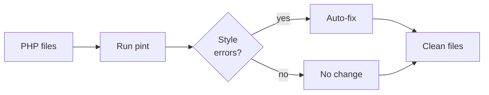

## What is Laravel Pint?

[Laravel Pint](https://github.com/laravel/pint) is an opinionated PHP code style fixer built on top of [PHP CS Fixer](https://github.com/FriendsOfPHP/PHP-CS-Fixer). It fixes code style issues automatically, following Laravel's opinionated coding style by default.

Pint removes the need for style-related review comments, so your team can focus on what matters in code review.



## Installation

Pint is automatically installed with all new Laravel applications. For older projects, install it via Composer:

```shell
composer require laravel/pint --dev
```

## Running Pint

### Basic usage

Fix code style issues in all `.php` files in your project:

```shell
./vendor/bin/pint
```

Target a specific file or directory:

```shell
./vendor/bin/pint app/Models
./vendor/bin/pint app/Models/User.php
```

### Options

| Option | Description |
| --- | --- |
| `--test` | Inspect without making changes. Returns a non-zero exit code if errors are found |
| `--dirty` | Only inspect files with uncommitted changes according to Git |
| `--diff=[branch]` | Only inspect files that differ from the given branch |
| `--repair` | Fix errors but also exit with a non-zero code if any fixes were applied |
| `--parallel` | Run in parallel mode (experimental) for better performance |
| `--max-processes=4` | Limit the number of parallel processes (used with `--parallel`) |
| `-v` | Show a detailed list of all changes made |
| `--config` | Path to a custom `pint.json` configuration file |
| `--preset` | Preset to use for this run |

```shell
# Check only, no changes
./vendor/bin/pint --test

# Only uncommitted files
./vendor/bin/pint --dirty

# Run in parallel
./vendor/bin/pint --parallel
```

## Configuring Pint

Create a `pint.json` file in the project root to customize behavior:

```json
{
    "preset": "laravel"
}
```

Pass a config path explicitly when running Pint:

```shell
./vendor/bin/pint --config vendor/my-company/coding-style/pint.json
```

### Presets

A preset is a predefined collection of rules. The default is the `laravel` preset.

| Preset | Description |
| --- | --- |
| `laravel` | Laravel's opinionated coding style (default) |
| `psr12` | PSR-12 coding standard |
| `per` | PER Coding Style |
| `symfony` | Symfony coding style |
| `empty` | No rules — define everything from scratch |

```shell
./vendor/bin/pint --preset psr12
```

### Rules

Override or add individual rules in `pint.json`. Browse available rules at the [PHP CS Fixer Configurator](https://mlocati.github.io/php-cs-fixer-configurator).

```json
{
    "preset": "laravel",
    "rules": {
        "simplified_null_return": true,
        "array_indentation": false,
        "new_with_parentheses": {
            "anonymous_class": true,
            "named_class": true
        }
    }
}
```

### Excluding files and folders

Exclude entire directories:

```json
{
    "exclude": [
        "my-specific/folder"
    ]
}
```

Exclude files matching a name pattern:

```json
{
    "notName": [
        "*-my-file.php"
    ]
}
```

Exclude a specific file by path:

```json
{
    "notPath": [
        "path/to/excluded-file.php"
    ]
}
```

## Recommended configuration

A practical `pint.json` used in real projects:

```json
{
    "preset": "laravel",
    "rules": {
        "no_unused_imports": true,
        "strict_comparison": true,
        "declare_strict_types": true
    }
}
```

Why each rule is worth enabling:

| Rule | Effect |
| --- | --- |
| `no_unused_imports` | Removes unused `use` statements automatically, keeping files clean |
| `strict_comparison` | Replaces `==` with `===` and `!=` with `!==`, preventing unexpected type-coercion bugs |
| `declare_strict_types` | Adds `declare(strict_types=1);` to the top of every file, enforcing type safety |

<Tip>
  `strict_comparison` and `declare_strict_types` can produce a large initial diff when added to an existing project. Start with these rules on new projects to avoid the one-time cleanup cost.
</Tip>

<Info>
  **Be careful with `no_unused_imports` in package development.** Some packages import a trait or interface as a way to toggle a feature on or off, making those imports intentional even though they appear unused. If you develop packages, consider removing this rule or setting it to `false`. For standard Laravel applications, `true` is safe.
</Info>

## Adding scripts to composer.json

Register Pint as a Composer script so you can run it with `composer pint`:

```json
{
    "scripts": {
        "pint": "./vendor/bin/pint",
        "pint:test": "./vendor/bin/pint --test"
    }
}
```

Run the scripts:

```shell
# Fix code style
composer pint

# Check only, no changes
composer pint:test
```

<Info>
  Use `composer pint:test` in CI pipelines to detect style violations without modifying files. The `--test` option returns a non-zero exit code on failure, so your CI check will fail if any violations are found.
</Info>

## CI/CD with GitHub Actions

Automatically fix and commit code style on every push using GitHub Actions.

<Steps>
  <Step title="Enable workflow permissions">
    In your GitHub repository, go to **Settings > Actions > General > Workflow permissions** and enable **Read and write permissions**.
  </Step>

  <Step title="Create the workflow file">
    Create `.github/workflows/lint.yml`:

    ```yaml
    name: Fix Code Style

    on: [push]

    jobs:
      lint:
        runs-on: ubuntu-latest
        strategy:
          fail-fast: true
          matrix:
            php: [8.4]

        steps:
          - name: Checkout code
            uses: actions/checkout@v5

          - name: Setup PHP
            uses: shivammathur/setup-php@v2
            with:
              php-version: ${{ matrix.php }}
              tools: pint

          - name: Run Pint
            run: pint

          - name: Commit linted files
            uses: stefanzweifel/git-auto-commit-action@v6
    ```
  </Step>
</Steps>

This workflow runs Pint on every push and automatically commits any fixed files back to the branch.

<Tip>
  To avoid a large initial commit, run Pint locally across your entire codebase before adding the workflow. This separates the style cleanup from ongoing feature work.
</Tip>
