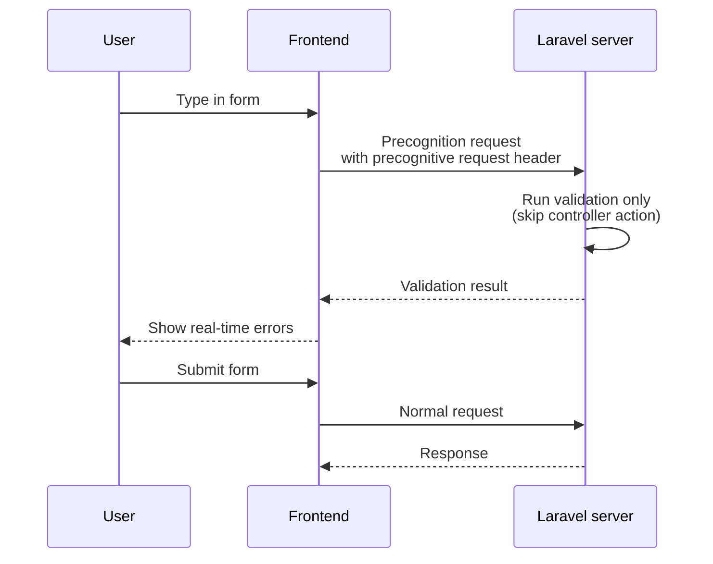

## What is Precognition

Precognition runs your Laravel validation rules before a form is submitted.
You can keep validation logic on the server without duplicating rules in your frontend.

Unlike a normal request, a Precognition request runs route middleware and form request validation, but skips your controller action.
This is why it works well for real-time feedback while users are typing.

## Installation

On Laravel 13, you do not need to install `laravel/precognition` on the backend.
You only install the frontend helper package for your stack.

- Vue: `laravel-precognition-vue`
- React: `laravel-precognition-react`
- Alpine.js: `laravel-precognition-alpine`

```shell
npm install laravel-precognition-vue
```

```shell
npm install laravel-precognition-react
```

```shell
npm install laravel-precognition-alpine
```

<Info>
  Current Inertia versions include built-in Precognition support. When you use Inertia forms, you usually do not need to add `laravel-precognition-vue` or `laravel-precognition-react`.
</Info>

## Backend setup

<Steps>
  <Step title="Add the middleware to your route">
    Add `HandlePrecognitiveRequests` to the route where you want live validation.
  </Step>
  <Step title="Keep validation rules in a form request">
    Centralize rules in a form request so your final submit and Precognition checks share the same rules.
  </Step>
  <Step title="Guard side effects in custom middleware">
    If your middleware causes side effects, skip them during precognitive requests using `isPrecognitive()`.
  </Step>
</Steps>

```php
use App\Http\Requests\StoreUserRequest;
use Illuminate\Foundation\Http\Middleware\HandlePrecognitiveRequests;
use Illuminate\Support\Facades\Route;

Route::post('/users', function (StoreUserRequest $request) {
    // This only runs on normal form submission.
})->middleware([HandlePrecognitiveRequests::class]);
```

```php
public function handle(Request $request, Closure $next): mixed
{
    if (! $request->isPrecognitive()) {
        Interaction::incrementFor($request->user());
    }

    return $next($request);
}
```

## Frontend integration

### Alpine.js (Blade)

```html
<form x-data="{
    form: $form('post', '/users', { name: '', email: '' }),
}">
    @csrf
    <input x-model="form.name" @change="form.validate('name')" />
    <template x-if="form.invalid('name')">
        <div x-text="form.errors.name"></div>
    </template>
</form>
```

### Vue (Inertia.js)

```vue
<script setup>
import { useForm } from 'laravel-precognition-vue';

const form = useForm('post', '/users', {
    name: '',
    email: '',
});
</script>

<template>
    <input v-model="form.name" @change="form.validate('name')" />
    <div v-if="form.invalid('name')">{{ form.errors.name }}</div>
</template>
```

### React (Inertia.js)

```jsx
import { useForm } from 'laravel-precognition-react';

const form = useForm('post', '/users', {
    name: '',
    email: '',
});

<input
    value={form.data.name}
    onChange={(e) => form.setData('name', e.target.value)}
    onBlur={() => form.validate('name')}
/>
```

### Vanilla JavaScript with Axios

Precognition uses Axios under the hood.
If you already have an Axios instance, register it with `client.use()`.

```js
import Axios from 'axios';
import { client } from 'laravel-precognition-vue';

window.axios = Axios.create();
window.axios.defaults.headers.common['Authorization'] = authToken;

client.use(window.axios);
```

## Control validation timing

Use `validate()` to trigger validation for specific fields while users type.

```js
form.validate('email');
```

Use `setValidationTimeout()` to adjust the debounce duration.

```js
form.setValidationTimeout(3000);
```

Use `validateFiles()` if you want file inputs to be included in each validation request.

```js
form.validateFiles();
```

For array inputs, validate with wildcard paths.

```js
form.validate('users.*.email');
```

## Form helper

`useForm()` keeps validation and submission state in one place.

- `validating`: Validation request in progress
- `processing`: Form submission in progress
- `errors`: Validation errors
- `valid('field')` / `invalid('field')`: Per-field validation state
- `submit()`: Normal form submission

```js
const submit = () => form.submit()
    .then(() => form.reset());
```

## Compare normal and precognitive requests

The diagram below shows the difference between a normal submission flow and a precognitive validation flow.



## Related links

- [Laravel docs: Precognition](https://laravel.com/docs/precognition)
- [Laravel docs: Validation](https://laravel.com/docs/validation)

## Next steps

<Columns cols={2}>
  <Card title="Validation" icon="check-circle" href="/en/validation">
    Learn how to define form request rules and custom validation messages.
  </Card>
  <Card title="Requests" icon="file-input" href="/en/requests">
    Understand how Laravel handles incoming HTTP data and request lifecycle behavior.
  </Card>
</Columns>
