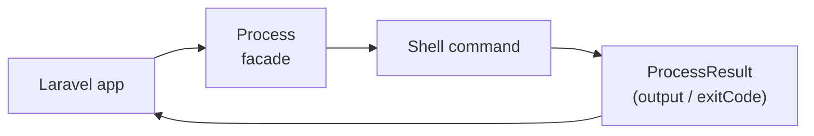

## Introduction

Laravel's `Process` facade is a thin wrapper around the [Symfony Process component](https://symfony.com/doc/current/components/process.html). It provides a clean, expressive API for invoking external processes from your application.



## Invoking processes

Use `Process::run()` to execute a command synchronously and wait for it to finish.

```php
use Illuminate\Support\Facades\Process;

$result = Process::run('ls -la');

return $result->output();
```

The returned `ProcessResult` instance exposes several inspection methods:

```php
$result = Process::run('ls -la');

$result->command();       // The command that was run
$result->successful();    // true if exit code is 0
$result->failed();        // true if exit code is non-zero
$result->output();        // Standard output (stdout)
$result->errorOutput();   // Standard error output (stderr)
$result->exitCode();      // The exit code
```

### Throwing on failure

To throw an `Illuminate\Process\Exceptions\ProcessFailedException` when a process fails, use `throw()` or `throwIf()`. If the process succeeded, the `ProcessResult` instance is returned.

```php
$result = Process::run('ls -la')->throw();

$result = Process::run('ls -la')->throwIf($condition);
```

## Process options

### Working directory

Use `path()` to set the working directory. If omitted, the process inherits the directory of the currently executing PHP script.

```php
$result = Process::path(__DIR__)->run('ls -la');
```

### Standard input

Pass data to the process via standard input using `input()`.

```php
$result = Process::input('Hello World')->run('cat');
```

### Timeouts

Processes time out after 60 seconds by default, throwing a `ProcessTimedOutException`. Override with `timeout()`.

```php
$result = Process::timeout(120)->run('bash import.sh');
```

You can also pass a `CarbonInterval` helper function:

```php
use function Illuminate\Support\minutes;

$result = Process::timeout(minutes(2))->run('bash import.sh');
```

To disable the timeout entirely, use `forever()`.

```php
$result = Process::forever()->run('bash import.sh');
```

Set an idle timeout (maximum seconds with no output) with `idleTimeout()`.

```php
$result = Process::timeout(60)->idleTimeout(30)->run('bash import.sh');
```

### Environment variables

Provide environment variables with `env()`. The process also inherits all system environment variables.

```php
$result = Process::forever()
    ->env(['IMPORT_PATH' => __DIR__])
    ->run('bash import.sh');
```

Pass `false` to remove an inherited variable.

```php
$result = Process::forever()
    ->env(['LOAD_PATH' => false])
    ->run('bash import.sh');
```

### Disabling output

When you don't need the output, call `quietly()` to conserve memory.

```php
$result = Process::quietly()->run('bash import.sh');
```

### Real-time output

Pass a closure as the second argument to `run()` to receive output as it is produced.

```php
$result = Process::run('ls -la', function (string $type, string $output) {
    echo $output;
});
```

## Pipelines

`Process::pipe()` lets you chain commands so that the output of one becomes the input of the next. The result of the last command in the pipeline is returned.

```php
use Illuminate\Process\Pipe;
use Illuminate\Support\Facades\Process;

$result = Process::pipe(function (Pipe $pipe) {
    $pipe->command('cat example.txt');
    $pipe->command('grep -i "laravel"');
});

if ($result->successful()) {
    // ...
}
```

You can also pass an array of command strings.

```php
$result = Process::pipe([
    'cat example.txt',
    'grep -i "laravel"',
]);
```

Assign string keys with `as()` to identify each process's output in the closure.

```php
$result = Process::pipe(function (Pipe $pipe) {
    $pipe->as('first')->command('cat example.txt');
    $pipe->as('second')->command('grep -i "laravel"');
}, function (string $type, string $output, string $key) {
    // $key is 'first' or 'second'
});
```

## Asynchronous processes

`Process::start()` launches a process without waiting for it to finish, allowing your application to do other work in the meantime.

```php
$process = Process::timeout(120)->start('bash import.sh');

while ($process->running()) {
    // do other work
}

$result = $process->wait();
```

### Process IDs and signals

Retrieve the OS-assigned process ID with `id()`.

```php
$process = Process::start('bash import.sh');

return $process->id();
```

Send a signal to the running process with `signal()`.

```php
$process->signal(SIGUSR2);
```

### Asynchronous output

While the process is running, use `latestOutput()` and `latestErrorOutput()` to read new output since the last check.

```php
$process = Process::timeout(120)->start('bash import.sh');

while ($process->running()) {
    echo $process->latestOutput();
    echo $process->latestErrorOutput();

    sleep(1);
}
```

Wait until a specific string appears in the output using `waitUntil()`.

```php
$process = Process::start('bash import.sh');

$process->waitUntil(function (string $type, string $output) {
    return $output === 'Ready...';
});
```

### Checking for timeouts

Call `ensureNotTimedOut()` inside a loop to throw a timeout exception if the process has exceeded its timeout.

```php
$process = Process::timeout(120)->start('bash import.sh');

while ($process->running()) {
    $process->ensureNotTimedOut();

    sleep(1);
}
```

## Concurrent processes

`Process::pool()` runs multiple processes in parallel.

```php
use Illuminate\Process\Pool;
use Illuminate\Support\Facades\Process;

$pool = Process::pool(function (Pool $pool) {
    $pool->path(__DIR__)->command('bash import-1.sh');
    $pool->path(__DIR__)->command('bash import-2.sh');
    $pool->path(__DIR__)->command('bash import-3.sh');
})->start(function (string $type, string $output, int $key) {
    // ...
});

while ($pool->running()->isNotEmpty()) {
    // ...
}

$results = $pool->wait();
```

`Process::concurrently()` is a shorthand that starts the pool and immediately waits for all results.

```php
[$first, $second, $third] = Process::concurrently(function (Pool $pool) {
    $pool->path(__DIR__)->command('ls -la');
    $pool->path(app_path())->command('ls -la');
    $pool->path(storage_path())->command('ls -la');
});

echo $first->output();
```

### Naming pool processes

Use `as()` to assign string keys and access results by name.

```php
$pool = Process::pool(function (Pool $pool) {
    $pool->as('first')->command('bash import-1.sh');
    $pool->as('second')->command('bash import-2.sh');
    $pool->as('third')->command('bash import-3.sh');
})->start(function (string $type, string $output, string $key) {
    // ...
});

$results = $pool->wait();

return $results['first']->output();
```

Send a signal to every process in the pool at once.

```php
$pool->signal(SIGUSR2);
```

## Testing

### Faking processes

Call `Process::fake()` to prevent any real processes from running during tests.

```php
use Illuminate\Support\Facades\Process;

Process::fake();

$response = $this->get('/import');

Process::assertRan('bash import.sh');
```

Specify output and exit codes for faked processes.

```php
Process::fake([
    '*' => Process::result(
        output: 'Test output',
        errorOutput: 'Test error output',
        exitCode: 1,
    ),
]);
```

### Faking specific processes

Use command patterns as keys to fake individual commands differently.

```php
Process::fake([
    'cat *'  => Process::result(output: 'file contents'),
    'ls -la' => Process::result(output: 'file listing'),
]);
```

### Faking sequences

Return different results for repeated calls to the same command.

```php
Process::fake([
    'ls *' => [
        Process::result('first time'),
        Process::result('second time'),
    ],
]);
```

### Assertions

| Method | Description |
| --- | --- |
| `Process::assertRan('command')` | Assert the command was run |
| `Process::assertNotRan('command')` | Assert the command was not run |
| `Process::assertRan(fn)` | Assert using a closure for detailed inspection |
| `Process::assertRanTimes('command', 3)` | Assert the command ran a specific number of times |

### Preventing stray processes

Call `Process::preventStrayProcesses()` to throw an exception when a process runs without a matching fake.

```php
Process::preventStrayProcesses();

Process::fake([
    'ls *' => Process::result('file listing'),
]);

// Exception: no fake defined for 'bash import.sh'
Process::run('bash import.sh');
```

## Related pages

<Columns cols={2}>
  <Card title="Artisan console" icon="terminal" href="/en/artisan">
    Create custom commands that invoke processes
  </Card>
  <Card title="Queues" icon="list" href="/en/queues">
    Compare with queue-based async processing
  </Card>
</Columns>
