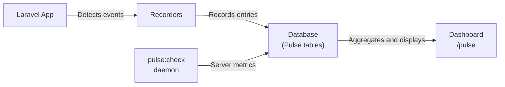

## What is Laravel Pulse

[Laravel Pulse](https://github.com/laravel/pulse) delivers at-a-glance insights into your application's performance and usage.
With Pulse, you can track down bottlenecks like slow jobs and endpoints, find your most active users, and more.

### Pulse vs Telescope

| Feature | Laravel Pulse | Laravel Telescope |
| --- | --- | --- |
| Purpose | Aggregate trends and metrics across the whole app | Deep debugging of individual requests and events |
| Data | Pre-aggregated metrics | Per-event logs |
| Best for | Production monitoring | Development and staging debugging |

<Info>
  For in-depth debugging of individual events, check out [Laravel Telescope](/en/blog/telescope-introduction).
</Info>

### Data flow



---

## Installation

<Warning>
  Pulse's first-party storage implementation requires a MySQL, MariaDB, or PostgreSQL database. If you are using a different database engine, you will need a separate MySQL, MariaDB, or PostgreSQL database for your Pulse data.
</Warning>

<Steps>
  <Step title="Install the package">
    Install Pulse via Composer.

    ```shell
    composer require laravel/pulse
    ```
  </Step>

  <Step title="Publish configuration and migrations">
    Publish the Pulse service provider assets.

    ```shell
    php artisan vendor:publish --provider="Laravel\Pulse\PulseServiceProvider"
    ```
  </Step>

  <Step title="Run migrations">
    Create the tables needed to store Pulse data.

    ```shell
    php artisan migrate
    ```
  </Step>
</Steps>

Once migrations have run, access the Pulse dashboard at the `/pulse` route.

### Publishing the configuration file

You can publish the configuration file separately to customize recorders and advanced options.

```shell
php artisan vendor:publish --tag=pulse-config
```

---

## Dashboard access

### Authorization

By default, the Pulse dashboard is only accessible in the `local` environment.
For production, configure the `viewPulse` authorization gate in your `AppServiceProvider`.

```php
use App\Models\User;
use Illuminate\Support\Facades\Gate;

/**
 * Bootstrap any application services.
 */
public function boot(): void
{
    Gate::define('viewPulse', function (User $user) {
        return $user->isAdmin();
    });
}
```

### Customizing the dashboard

Publish the dashboard view to customize cards and layout.

```shell
php artisan vendor:publish --tag=pulse-dashboard
```

The published file is at `resources/views/vendor/pulse/dashboard.blade.php`.
The dashboard is powered by [Livewire](https://livewire.laravel.com/), so no JavaScript rebuild is required for customization.

```blade
{{-- Span the full screen width --}}
<x-pulse full-width>
    ...
</x-pulse>

{{-- Change the column count --}}
<x-pulse cols="16">
    ...
</x-pulse>
```

Control each card's size and position with `cols` and `rows` props.

```blade
<livewire:pulse.usage cols="4" rows="2" />
<livewire:pulse.slow-queries expand />
```

---

## Recorders

Recorders capture entries from your application and write them to the Pulse database.
Configure them in the `recorders` section of `config/pulse.php`.

### Requests and slow requests

The `Requests` recorder captures information about incoming requests.
Configure the slow route threshold (default: 1000ms), sample rate, and ignored paths.

```php
Recorders\SlowRequests::class => [
    // ...
    'threshold' => [
        '#^/admin/#' => 5000,
        'default' => env('PULSE_SLOW_REQUESTS_THRESHOLD', 1000),
    ],
],
```

### Slow jobs

The `SlowJobs` recorder captures jobs that exceed the configured threshold (default: 1000ms).
You can set per-job thresholds using regular expressions.

```php
Recorders\SlowJobs::class => [
    // ...
    'threshold' => [
        '#^App\\Jobs\\GenerateYearlyReports$#' => 5000,
        'default' => env('PULSE_SLOW_JOBS_THRESHOLD', 1000),
    ],
],
```

### Exceptions

The `Exceptions` recorder captures reportable exceptions occurring in your application.
Exceptions are grouped by class and the location where they occurred.

### Cache

The `CacheInteractions` recorder captures cache hits and misses.
You can normalize similar keys into groups using regular expressions.

```php
Recorders\CacheInteractions::class => [
    // ...
    'groups' => [
        '/:\d+/' => ':*',
    ],
],
```

### Queues

The `Queues` recorder tracks queue throughput: queued, processing, processed, released, and failed jobs.

### Servers

The `Servers` recorder captures CPU, memory, and storage usage of your servers.
You must run the `pulse:check` command on each server you want to monitor.

```shell
php artisan pulse:check
```

By default, Pulse uses PHP's `gethostname()` as the server name. Override it with an environment variable.

```ini
PULSE_SERVER_NAME=load-balancer
```

### Users

The `UserRequests` and `UserJobs` recorders capture which users are making requests and dispatching jobs.
This data appears in the Application Usage card.

### Redis ingest

For high-traffic applications, you can send entries to a Redis stream and process them asynchronously.

```ini
PULSE_INGEST_DRIVER=redis
```

When using Redis ingest, run the `pulse:work` command to move entries from Redis into the database.

```shell
php artisan pulse:work
```

---

## Sampling

For high-traffic applications, capturing every event can result in millions of database rows.
Enable **sampling** to record only a fraction of events. The dashboard scales values up and marks approximations with `~`.

```php
// config/pulse.php
Recorders\UserRequests::class => [
    'sample_rate' => 0.1, // record ~10% of requests
],
```

The more entries you have for a metric, the lower you can set the sample rate while maintaining accuracy.

---

## Environment variables

Key configuration values can be set via environment variables.

| Variable | Description | Default |
| --- | --- | --- |
| `PULSE_ENABLED` | Enable or disable Pulse | `true` |
| `PULSE_DB_CONNECTION` | Database connection for Pulse data | App default |
| `PULSE_INGEST_DRIVER` | Ingest driver (`redis`, etc.) | `storage` |
| `PULSE_SERVER_NAME` | Server display name | `gethostname()` value |
| `PULSE_SLOW_REQUESTS_THRESHOLD` | Slow request threshold (ms) | `1000` |
| `PULSE_SLOW_JOBS_THRESHOLD` | Slow job threshold (ms) | `1000` |
| `PULSE_SLOW_QUERIES_THRESHOLD` | Slow query threshold (ms) | `1000` |

---

## Custom cards

You can build custom Pulse cards to display data specific to your application.
Cards are implemented as [Livewire](https://livewire.laravel.com/) components.

```php
namespace App\Livewire\Pulse;

use Laravel\Pulse\Livewire\Card;
use Livewire\Attributes\Lazy;

#[Lazy]
class TopSellers extends Card
{
    public function render()
    {
        return view('livewire.pulse.top-sellers');
    }
}
```

Use Pulse's Blade components in your card view for a consistent look and feel.

```blade
<x-pulse::card :cols="$cols" :rows="$rows" :class="$class" wire:poll.5s="">
    <x-pulse::card-header name="Top Sellers">
        <x-slot:icon>
            ...
        </x-slot:icon>
    </x-pulse::card-header>

    <x-pulse::scroll :expand="$expand">
        ...
    </x-pulse::scroll>
</x-pulse::card>
```

Capture custom data with the `Pulse::record` method.

```php
use Laravel\Pulse\Facades\Pulse;

Pulse::record('user_sale', $user->id, $sale->amount)
    ->sum()
    ->count();
```

Once your component and template are defined, include the card in your dashboard view.

```blade
<x-pulse>
    ...
    <livewire:pulse.top-sellers cols="4" />
</x-pulse>
```

---

## Summary

| Goal | How |
| --- | --- |
| Install Pulse | `composer require laravel/pulse` |
| Access the dashboard | `/pulse` route |
| Restrict access in production | Define the `viewPulse` gate |
| Enable server monitoring | Run `php artisan pulse:check` as a daemon |
| Reduce database load | Set `sample_rate` on recorders |

## Next steps

<Columns cols={2}>
  <Card title="Error handling" icon="circle-x" href="/en/error-handling">
    Learn how Laravel handles and reports exceptions.
  </Card>
  <Card title="Logging" icon="file-text" href="/en/logging">
    Configure and use Laravel's logging system.
  </Card>
</Columns>
