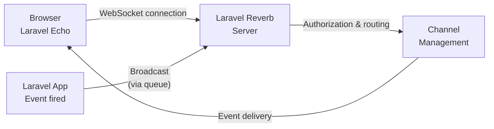
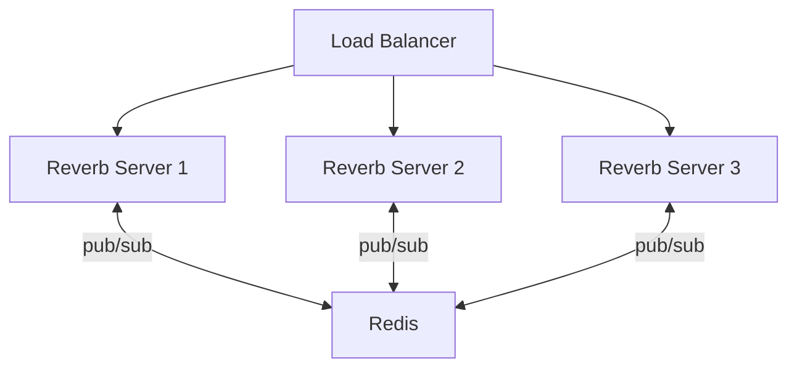

<Info>
  This page focuses on setting up and operating the Reverb server itself.
  For creating broadcast events and configuring Laravel Echo, see [Broadcasting](/en/broadcasting).
</Info>

## What is Reverb?

[Laravel Reverb](https://github.com/laravel/reverb) is Laravel's official self-hosted WebSocket server. It brings blazing-fast and scalable real-time WebSocket communication directly to your Laravel application — no third-party service account required.

Reverb sits on top of Laravel's [broadcasting](/en/broadcasting) infrastructure, routing server-side events to connected browsers over persistent WebSocket connections.



## Installation

The `install:broadcasting` Artisan command installs Reverb along with all required dependencies in one step:

```shell
php artisan install:broadcasting
```

Select Reverb when prompted, or pass `--reverb` to skip the prompt:

```shell
php artisan install:broadcasting --reverb
```

This command:

- Installs the Composer package (`laravel/reverb`)
- Installs NPM packages (`laravel-echo`, `pusher-js`)
- Adds environment variables to `.env`
- Publishes `config/reverb.php`

To install manually:

```shell
composer require laravel/reverb
php artisan reverb:install
```

## Configuration

### Application credentials

Reverb uses a set of application credentials to authenticate connections between the client and server. Set these in your `.env` file:

```ini
REVERB_APP_ID=my-app-id
REVERB_APP_KEY=my-app-key
REVERB_APP_SECRET=my-app-secret
```

These values are referenced in the `apps` section of `config/reverb.php`.

### Allowed origins

Restrict which origins can connect to Reverb by setting `allowed_origins` in `config/reverb.php`:

```php
'apps' => [
    [
        'app_id' => 'my-app-id',
        'allowed_origins' => ['laravel.com'],
        // ...
    ]
]
```

Use `*` to allow all origins.

### Additional applications

A single Reverb installation can serve multiple applications. Add additional entries to the `apps` array in `config/reverb.php`:

```php
'apps' => [
    [
        'app_id' => 'my-app-one',
        // ...
    ],
    [
        'app_id' => 'my-app-two',
        // ...
    ],
],
```

### SSL

In most production setups, SSL termination is handled by a web server (e.g., Nginx) that proxies requests to Reverb. For local development with secure WebSockets, you can use a certificate from Laravel Herd or Valet:

```shell
php artisan reverb:start --host="0.0.0.0" --port=8080 --hostname="laravel.test"
```

To specify a certificate manually, configure `tls` options in `config/reverb.php`:

```php
'options' => [
    'tls' => [
        'local_cert' => '/path/to/cert.pem'
    ],
],
```

## Running the server

Start the Reverb server with the `reverb:start` Artisan command:

```shell
php artisan reverb:start
```

By default, the server listens on `0.0.0.0:8080`. Specify a custom host or port with the `--host` and `--port` options:

```shell
php artisan reverb:start --host=127.0.0.1 --port=9000
```

You can also set these via environment variables:

```ini
REVERB_SERVER_HOST=0.0.0.0
REVERB_SERVER_PORT=8080
```

<Info>
  `REVERB_SERVER_HOST` / `REVERB_SERVER_PORT` define where the Reverb process listens.
  `REVERB_HOST` / `REVERB_PORT` tell Laravel where to send broadcast messages (the public-facing address).
  In production, these pairs are often different — for example, Reverb listens on port 8080 internally while the public hostname uses port 443.
</Info>

### Debugging

Reverb suppresses debug output by default for performance. To see the stream of data passing through the server, add `--debug`:

```shell
php artisan reverb:start --debug
```

### Restarting

Because Reverb is a long-running process, code changes won't take effect until you restart it. The `reverb:restart` command gracefully terminates all active connections before stopping:

```shell
php artisan reverb:restart
```

When running under a process manager like Supervisor, the manager will automatically restart Reverb after it stops.

## Monitoring

Reverb integrates with [Laravel Pulse](https://laravel.com/docs/pulse) to display connection and message metrics on your dashboard.

Add Reverb's recorders to `config/pulse.php`:

```php
use Laravel\Reverb\Pulse\Recorders\ReverbConnections;
use Laravel\Reverb\Pulse\Recorders\ReverbMessages;

'recorders' => [
    ReverbConnections::class => [
        'sample_rate' => 1,
    ],

    ReverbMessages::class => [
        'sample_rate' => 1,
    ],

    // ...
],
```

Add the cards to your Pulse dashboard template:

```blade
<x-pulse>
    <livewire:reverb.connections cols="full" />
    <livewire:reverb.messages cols="full" />
    ...
</x-pulse>
```

Run the `pulse:check` daemon on your Reverb server to keep metrics up to date. In a horizontally scaled setup, run this daemon on only one server.

## Running Reverb in production

### Open files

Each WebSocket connection consumes one file descriptor. Check the current limit with:

```shell
ulimit -n
```

Raise the limit in `/etc/security/limits.conf`:

```ini
# /etc/security/limits.conf
forge        soft  nofile  10000
forge        hard  nofile  10000
```

### Event loop (ext-uv)

Reverb uses PHP's `stream_select` by default, which caps out at roughly 1,024 open files. For more than 1,000 concurrent connections, install `ext-uv` via PECL:

```shell
pecl install uv
```

Reverb automatically uses the `ext-uv` event loop when it's available.

### Nginx reverse proxy

In production, run Reverb behind a reverse proxy. Example Nginx configuration:

```nginx
server {
    ...

    location / {
        proxy_http_version 1.1;
        proxy_set_header Host $http_host;
        proxy_set_header Scheme $scheme;
        proxy_set_header SERVER_PORT $server_port;
        proxy_set_header REMOTE_ADDR $remote_addr;
        proxy_set_header X-Forwarded-For $proxy_add_x_forwarded_for;
        proxy_set_header Upgrade $http_upgrade;
        proxy_set_header Connection "Upgrade";

        proxy_pass http://0.0.0.0:8080;
    }

    ...
}
```

<Warning>
  Reverb handles WebSocket connections at `/app` and API requests at `/apps`. Make sure your web server configuration allows both URIs through to Reverb.
</Warning>

To increase the number of allowed connections, update `worker_rlimit_nofile` and `worker_connections` in `nginx.conf`:

```nginx
user forge;
worker_processes auto;
pid /run/nginx.pid;
include /etc/nginx/modules-enabled/*.conf;
worker_rlimit_nofile 10000;

events {
  worker_connections 10000;
  multi_accept on;
}
```

### Process management (Supervisor)

Use Supervisor to keep Reverb running in production. Set `minfds` in `supervisord.conf` to ensure enough file descriptors are available:

```ini
[supervisord]
...
minfds=10000
```

Example program configuration:

```ini
[program:reverb]
process_name=%(program_name)s
command=php /path/to/artisan reverb:start
autostart=true
autorestart=true
user=forge
redirect_stderr=true
stdout_logfile=/path/to/reverb.log
```

### Scaling

When a single server can't handle the required connection count, scale Reverb horizontally using Redis pub/sub:



Enable scaling in `.env`:

```env
REVERB_SCALING_ENABLED=true
```

Reverb uses your application's default Redis connection to relay messages between servers. Start `reverb:start` on each server and place them behind a load balancer that distributes incoming requests evenly.

<Info>
  [Laravel Cloud](https://cloud.laravel.com) provides fully managed WebSocket infrastructure powered by Reverb clusters, so you can deploy Reverb-enabled applications without managing servers yourself.
</Info>

## Events

Reverb dispatches the following events during the connection and message lifecycle. [Listen for these events](/en/events) to hook into Reverb's internals:

| Event | Description |
|---|---|
| `ChannelCreated` | Dispatched when a channel is created (first subscriber) |
| `ChannelRemoved` | Dispatched when a channel is removed (last subscriber leaves) |
| `ConnectionPruned` | Dispatched when a stale connection is pruned by the server |
| `MessageReceived` | Dispatched when a message is received from a client |
| `MessageSent` | Dispatched when a message is sent to a client |

All events live in the `Laravel\Reverb\Events` namespace.

## Next steps

<Card title="Broadcasting" href="/en/broadcasting">
  Learn how to create broadcast events, authorize channels, and configure Laravel Echo
</Card>

<Card title="Events and listeners" href="/en/events">
  Use Laravel's event system to listen for the events Reverb dispatches during its lifecycle
</Card>
