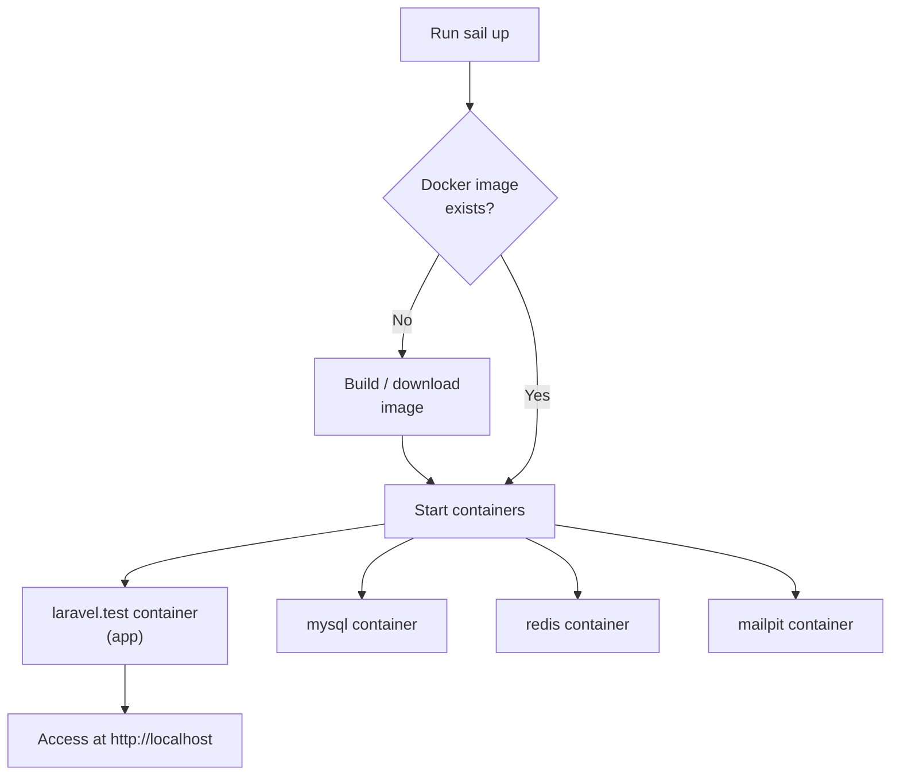

## Introduction

[Laravel Sail](https://github.com/laravel/sail) is a light-weight command-line interface for interacting with Laravel's default Docker development environment.
Sail provides a great starting point for building a Laravel application using PHP, MySQL, and Redis without requiring prior Docker experience.

At its heart, Sail is the `compose.yaml` file and the `sail` script stored at the root of your project.
The `sail` script provides a CLI with convenient methods for interacting with the Docker containers defined by the `compose.yaml` file.

Laravel Sail is supported on macOS, Linux, and Windows (via [WSL2](https://docs.microsoft.com/en-us/windows/wsl/about)).

<Info>
  Sail is intended for local development only. It is not designed for production use.
  For production deployments, consider Laravel Cloud, Forge, or your own Docker / Kubernetes setup.
</Info>

---

## Installation

### Install in an Existing Project

Install the package via Composer and configure your environment.

<Steps>
  <Step title="Require the Sail package">
    ```shell
    composer require laravel/sail --dev
    ```
  </Step>
  <Step title="Publish the configuration">
    Run the `sail:install` Artisan command. It publishes a `compose.yaml` file to your project root and updates `.env` with the required environment variables.

    ```shell
    php artisan sail:install
    ```

    An interactive prompt lets you choose services such as MySQL, Redis, and Mailpit.
  </Step>
  <Step title="Start Sail">
    ```shell
    ./vendor/bin/sail up
    ```

    The first run downloads Docker images and may take a few minutes.
    Once running, access your application at `http://localhost`.
  </Step>
</Steps>

<Warning>
  If you are using Docker Desktop for Linux, run `docker context use default` to use the `default` context.
  If you encounter file permission errors inside containers, set the `SUPERVISOR_PHP_USER` environment variable to `root`.
</Warning>

### Add More Services

To add a service to an existing Sail installation, use the `sail:add` command.

```shell
php artisan sail:add
```

### Using Devcontainers

To develop inside a [Devcontainer](https://code.visualstudio.com/docs/remote/containers), pass the `--devcontainer` flag.

```shell
php artisan sail:install --devcontainer
```

---

## Configuration

### Shell Alias

By default every Sail command requires typing `./vendor/bin/sail`. Configure a shell alias to save keystrokes.

```shell
alias sail='sh $([ -f sail ] && echo sail || echo vendor/bin/sail)'
```

Add this line to `~/.zshrc` or `~/.bashrc`, then restart your shell.

```shell
sail up
```

<Tip>
  Once the alias is configured you can replace `./vendor/bin/sail` with `sail` throughout all examples in this guide.
</Tip>

### Rebuild Images

To ensure all packages are up to date, rebuild your Sail images with the `build` command.

```shell
docker compose down -v

sail build --no-cache

sail up
```

---

## Starting and Stopping Sail

Start all containers defined in `compose.yaml` with the `up` command.

```shell
# Start in the foreground
sail up

# Start in the background (detached mode)
sail up -d
```

Stop running containers with the `stop` command or press `Ctrl + C` if running in the foreground.

```shell
sail stop
```

### Startup Flow



---

## Executing Commands

When using Sail, your application runs inside a Docker container isolated from your local machine.
Use `sail` as the prefix for all PHP, Artisan, Composer, and Node / NPM commands.

<Info>
  The Laravel documentation often shows commands like `php artisan`, `composer`, and `npm`.
  When using Sail, prefix them with `sail` so they run inside the container.
</Info>

### PHP Commands

```shell
sail php --version

sail php script.php
```

### Composer Commands

```shell
sail composer require laravel/sanctum
```

### Artisan Commands

```shell
sail artisan migrate

sail artisan queue:work
```

### Node / NPM Commands

```shell
sail node --version

sail npm run dev

# Using Yarn instead
sail yarn
```

### Container Shell

Open a Bash session directly inside the application container.

```shell
sail shell

# Connect as root
sail root-shell
```

Start a Tinker REPL session.

```shell
sail tinker
```

---

## Services

The services below are available when running `sail:install` or `sail:add`.

### MySQL

Included by default in `compose.yaml`. Data is persisted in a Docker Volume.
On first startup, Sail creates two databases: one for development and a dedicated `testing` database.

Set `DB_HOST=mysql` in your `.env` file to connect from the application.

```ini
DB_HOST=mysql
DB_PORT=3306
```

Connect from your local machine using [TablePlus](https://tableplus.com) or any MySQL client on port `3306`.

### Redis

Set `REDIS_HOST=redis` in your `.env` file.

```ini
REDIS_HOST=redis
REDIS_PORT=6379
```

### Valkey

[Valkey](https://valkey.io/) is a Redis-compatible alternative. Set `REDIS_HOST=valkey` in your `.env` file.

### Mailpit

Mailpit intercepts emails sent during local development and provides a web UI for preview.

```ini
MAIL_HOST=mailpit
MAIL_PORT=1025
MAIL_ENCRYPTION=null
```

Access the Mailpit web UI at `http://localhost:8025` while Sail is running.

### Meilisearch / Typesense

Both integrate with [Laravel Scout](/en/scout) for full-text search.

- **Meilisearch**: set `MEILISEARCH_HOST=http://meilisearch:7700`
- **Typesense**: set `TYPESENSE_HOST=typesense`, `TYPESENSE_PORT=8108`, etc.

### RustFS (S3-compatible storage)

Use RustFS to emulate Amazon S3 locally without creating real S3 buckets.

```ini
FILESYSTEM_DISK=s3
AWS_ACCESS_KEY_ID=sail
AWS_SECRET_ACCESS_KEY=password
AWS_DEFAULT_REGION=us-east-1
AWS_BUCKET=local
AWS_ENDPOINT=http://rustfs:9000
AWS_USE_PATH_STYLE_ENDPOINT=true
```

---

## Running Tests

```shell
sail test

sail test --group orders
```

`sail test` is equivalent to `sail artisan test`. Sail creates a dedicated `testing` database so your tests never interfere with development data.

### Laravel Dusk

Run Dusk browser tests without installing Selenium locally.
Uncomment the Selenium service in `compose.yaml`.

```yaml
selenium:
    image: 'selenium/standalone-chrome'
    extra_hosts:
      - 'host.docker.internal:host-gateway'
    volumes:
        - '/dev/shm:/dev/shm'
    networks:
        - sail
```

<Tip>
  On Apple Silicon (M1/M2/M3), use the `selenium/standalone-chromium` image instead.
</Tip>

Then run your Dusk test suite.

```shell
sail dusk
```

---

## PHP and Node Versions

### Changing the PHP Version

Update the `build.context` for the `laravel.test` container in `compose.yaml`.

```yaml
# PHP 8.5 (default)
context: ./vendor/laravel/sail/runtimes/8.5

# PHP 8.4
context: ./vendor/laravel/sail/runtimes/8.4

# PHP 8.3
context: ./vendor/laravel/sail/runtimes/8.3
```

Rebuild after making changes.

```shell
sail build --no-cache
sail up
```

### Changing the Node Version

Update `build.args` in `compose.yaml`.

```yaml
build:
    args:
        WWWGROUP: '${WWWGROUP}'
        NODE_VERSION: '20'
```

---

## Sharing Your Site

Share your local site publicly for colleague previews or webhook testing.

```shell
sail share
```

A random `laravel-sail.site` URL is generated. Configure trusted proxies in `bootstrap/app.php` to ensure URL helpers work correctly.

```php
->withMiddleware(function (Middleware $middleware): void {
    $middleware->trustProxies(at: '*');
})
```

Choose a custom subdomain with the `--subdomain` option.

```shell
sail share --subdomain=my-sail-site
```

---

## Debugging With Xdebug

### Enable Xdebug

Publish the Sail configuration first, then add the following to your `.env` file.

```ini
SAIL_XDEBUG_MODE=develop,debug,coverage
```

Verify that the published `php.ini` contains the following configuration.

```ini
[xdebug]
xdebug.mode=${XDEBUG_MODE}
```

Rebuild your images to apply the changes.

```shell
sail build --no-cache
```

### CLI Debugging

```shell
# Run without Xdebug
sail artisan migrate

# Run with Xdebug
sail debug migrate
```

### Browser Debugging

Follow the [instructions from Xdebug](https://xdebug.org/docs/step_debug#web-application) to start a debug session from your browser.
PhpStorm users should refer to JetBrains' [zero-configuration debugging](https://www.jetbrains.com/help/phpstorm/zero-configuration-debugging.html) guide.

<Warning>
  Sail relies on `artisan serve` to serve your application. The `XDEBUG_CONFIG` and `XDEBUG_MODE` variables are only supported in Laravel 8.53.0 and later.
  Earlier versions will not accept debug connections.
</Warning>

---

## Customization

Publish Sail's Dockerfiles and configuration files to customize your environment.

```shell
sail artisan sail:publish
```

The files are placed in a `docker/` directory at your application root.
After making changes, rebuild your containers.

```shell
sail build --no-cache
```

---

## Sail vs. Production

<Warning>
  Sail is for local development only. Do not use it in production.
  For production deployments, consider Laravel Cloud, Forge, Ploi, or a custom Docker / Kubernetes configuration.
</Warning>

| Aspect | Sail (local) | Production |
| --- | --- | --- |
| Purpose | Development and debugging | Serving users |
| Xdebug | Can be enabled | Should be disabled |
| Mailpit | Captures emails for preview | Real mail server |
| Data persistence | Docker Volume | Managed database service |
| Performance | Not optimized | Optimization required |
