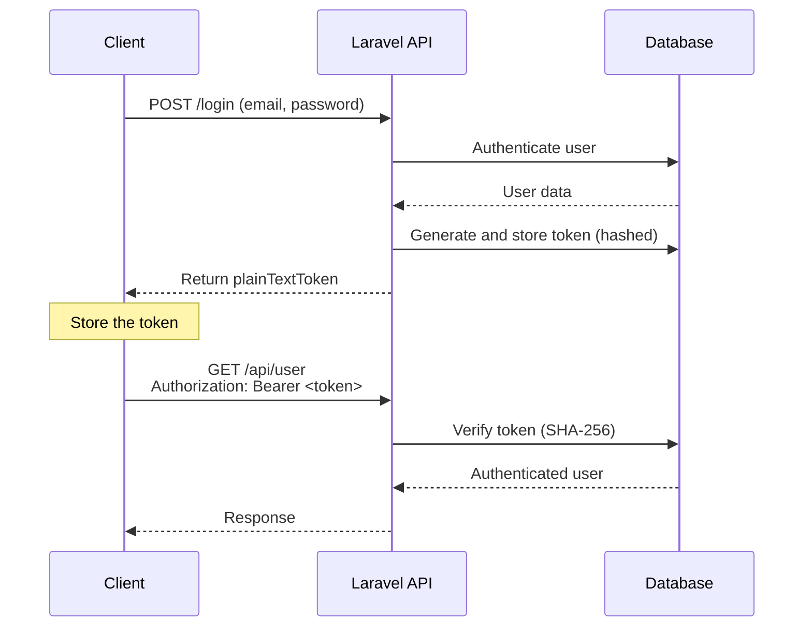
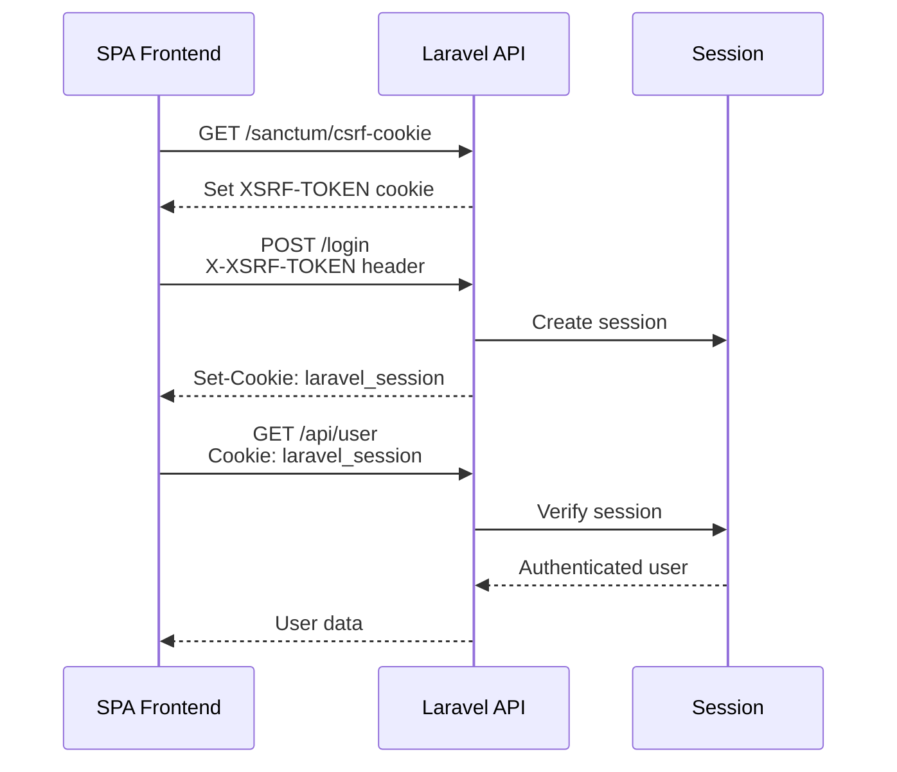

## What is Sanctum?

Laravel Sanctum is a lightweight authentication package for SPAs (single-page applications), mobile apps, and simple APIs. Without needing deep knowledge of OAuth, you can issue and manage multiple API tokens per user.

Sanctum solves two authentication problems:

| Authentication mode | How it works | Primary use cases |
| --- | --- | --- |
| **API token authentication** | `Authorization: Bearer <token>` header | Mobile apps, third-party integrations |
| **SPA authentication** | Session cookie + CSRF protection | First-party frontends (Vue, React, etc.) |

<Info>
  Use SPA authentication when calling your API from your own SPA. Use API token authentication when mobile apps or third-party clients need to access your API. You can use either mode independently or both together.
</Info>

### Sanctum vs. Passport

| | Sanctum | Passport |
| --- | --- | --- |
| **Complexity** | Simple | Full OAuth2 |
| **Best for** | First-party SPAs and mobile apps | Acting as an OAuth2 provider for external apps |
| **Token type** | Personal access tokens | OAuth2 access tokens |

Choose Passport only when you need to act as an OAuth2 provider for external services. For most applications, Sanctum is the right choice.

---

## Installation and configuration

### Install

Run the `install:api` Artisan command to set up Sanctum in one step:

```shell
php artisan install:api
```

This command automatically:

- Installs the `laravel/sanctum` package
- Publishes the `personal_access_tokens` table migration
- Runs the migration

### Add the HasApiTokens trait

Add the `HasApiTokens` trait to your `User` model:

```php
// app/Models/User.php

use Laravel\Sanctum\HasApiTokens;

class User extends Authenticatable
{
    use HasApiTokens, HasFactory, Notifiable;
}
```

This gives you access to methods like `$user->createToken()` and `$user->tokens`.

---

## API token authentication

### Token flow



### Issue a token

Use the `createToken()` method to issue a token. Retrieve the plain-text token value from the `plainTextToken` property. **The plain-text token is never stored in the database**, so you must return it to the user immediately after creation.

```php
use Illuminate\Http\Request;

Route::post('/tokens/create', function (Request $request) {
    $token = $request->user()->createToken($request->token_name);

    return ['token' => $token->plainTextToken];
})->middleware('auth');
```

The database stores a SHA-256 hashed version of the token.

### Set scopes (abilities)

Assign abilities (scopes) to a token to restrict which operations it can perform:

```php
// Issue a token with specific abilities
$token = $user->createToken('mobile-app', ['server:update', 'server:read']);

return $token->plainTextToken;
```

Check token abilities when handling requests:

```php
if ($request->user()->tokenCan('server:update')) {
    // Perform update operation
}

if ($request->user()->tokenCant('server:update')) {
    abort(403);
}
```

#### Check abilities with middleware

Register middleware aliases in `bootstrap/app.php`:

```php
use Laravel\Sanctum\Http\Middleware\CheckAbilities;
use Laravel\Sanctum\Http\Middleware\CheckForAnyAbility;

->withMiddleware(function (Middleware $middleware): void {
    $middleware->alias([
        'abilities' => CheckAbilities::class,     // requires all abilities
        'ability'   => CheckForAnyAbility::class, // requires any one ability
    ]);
})
```

Apply the middleware to your routes:

```php
// Only tokens with both check-status and place-orders are allowed
Route::get('/orders', function () {
    // ...
})->middleware(['auth:sanctum', 'abilities:check-status,place-orders']);

// Tokens with either check-status or place-orders are allowed
Route::get('/orders', function () {
    // ...
})->middleware(['auth:sanctum', 'ability:check-status,place-orders']);
```

### Token expiration

By default, Sanctum tokens do not expire. Set an expiration time (in minutes) via the `expiration` option in `config/sanctum.php`:

```php
// config/sanctum.php
'expiration' => 525600, // 365 days (in minutes)
```

You can also set per-token expiration:

```php
$token = $user->createToken(
    'token-name',
    ['*'],
    now()->addWeeks(1) // expires in one week
)->plainTextToken;
```

When using token expiration, schedule a command to prune expired tokens regularly:

```php
use Illuminate\Support\Facades\Schedule;

Schedule::command('sanctum:prune-expired --hours=24')->daily();
```

### Revoke tokens

```php
// Delete all tokens
$user->tokens()->delete();

// Delete the token used in the current request
$request->user()->currentAccessToken()->delete();

// Delete a specific token
$user->tokens()->where('id', $tokenId)->delete();
```

---

## SPA authentication

SPA authentication uses session cookies, so there is no need to issue or manage tokens. It is ideal when calling your API from a first-party frontend (Vue, React, Next.js, etc.).

<Warning>
  SPA authentication requires the SPA and API to share the same top-level domain (subdomains are fine). Requests must include an `Accept: application/json` header as well as a `Referer` or `Origin` header.
</Warning>

### Enable the Sanctum middleware

Enable the `statefulApi()` middleware in `bootstrap/app.php`:

```php
->withMiddleware(function (Middleware $middleware): void {
    $middleware->statefulApi();
})
```

### Configure first-party domains

Set your SPA's domain in the `stateful` option in `config/sanctum.php`:

```php
// config/sanctum.php
'stateful' => explode(',', env('SANCTUM_STATEFUL_DOMAINS', sprintf(
    '%s%s',
    'localhost,localhost:3000,127.0.0.1,127.0.0.1:8000,::1',
    Sanctum::currentApplicationUrlWithPort()
))),
```

### Configure CORS

If the SPA is on a different subdomain, configure CORS:

```shell
php artisan config:publish cors
```

Set `supports_credentials` to `true` in `config/cors.php`:

```php
// config/cors.php
'supports_credentials' => true,
```

Configure axios on the frontend as well:

```js
// resources/js/bootstrap.js
axios.defaults.withCredentials = true;
axios.defaults.withXSRFToken = true;
```

Also configure the session cookie domain:

```php
// config/session.php
'domain' => '.example.com', // note the leading dot
```

### SPA authentication flow



<Steps>
  <Step title="Retrieve the CSRF cookie">
    Before logging in, call the `/sanctum/csrf-cookie` endpoint to initialize CSRF protection:

    ```js
    await axios.get('/sanctum/csrf-cookie');
    ```
  </Step>

  <Step title="Send the login request">
    POST your credentials to the `/login` endpoint:

    ```js
    await axios.post('/login', {
        email: 'user@example.com',
        password: 'password',
    });
    ```
  </Step>

  <Step title="Make authenticated requests">
    After login, subsequent requests are automatically authenticated via the session cookie:

    ```js
    const response = await axios.get('/api/user');
    console.log(response.data); // authenticated user data
    ```
  </Step>
</Steps>

---

## Protecting authenticated routes

Apply the `auth:sanctum` middleware to your routes. Unauthenticated requests will receive a `401 Unauthorized` response. This single middleware handles both API token authentication and SPA authentication.

```php
use Illuminate\Http\Request;

// Protect a single route
Route::get('/user', function (Request $request) {
    return $request->user();
})->middleware('auth:sanctum');

// Protect a group of routes
Route::middleware('auth:sanctum')->group(function () {
    Route::get('/profile', [ProfileController::class, 'show']);
    Route::put('/profile', [ProfileController::class, 'update']);
    Route::get('/posts', [PostController::class, 'index']);
});
```

---

## Practical example: login API with token response

A complete API token authentication example for a mobile app:

<Steps>
  <Step title="Create the login endpoint">
    ```php
    // routes/api.php

    use App\Models\User;
    use Illuminate\Http\Request;
    use Illuminate\Support\Facades\Hash;
    use Illuminate\Validation\ValidationException;

    Route::post('/sanctum/token', function (Request $request) {
        $request->validate([
            'email'       => ['required', 'email'],
            'password'    => ['required'],
            'device_name' => ['required', 'string'],
        ]);

        $user = User::where('email', $request->email)->first();

        if (! $user || ! Hash::check($request->password, $user->password)) {
            throw ValidationException::withMessages([
                'email' => ['The provided credentials are incorrect.'],
            ]);
        }

        return response()->json([
            'token' => $user->createToken($request->device_name)->plainTextToken,
        ]);
    });
    ```
  </Step>

  <Step title="Create authenticated routes">
    ```php
    // routes/api.php

    Route::middleware('auth:sanctum')->group(function () {
        // Return current user data
        Route::get('/user', function (Request $request) {
            return $request->user();
        });

        // Revoke current token and log out
        Route::post('/logout', function (Request $request) {
            $request->user()->currentAccessToken()->delete();

            return response()->json(['message' => 'Logged out successfully.']);
        });

        // Log out from all devices
        Route::post('/logout/all', function (Request $request) {
            $request->user()->tokens()->delete();

            return response()->json(['message' => 'Logged out from all devices.']);
        });
    });
    ```
  </Step>

  <Step title="Send requests from the client">
    ```js
    // Log in
    const { data } = await axios.post('/api/sanctum/token', {
        email: 'user@example.com',
        password: 'password',
        device_name: 'My iPhone',
    });

    const token = data.token;

    // Authenticated request
    const response = await axios.get('/api/user', {
        headers: {
            Authorization: `Bearer ${token}`,
        },
    });
    ```
  </Step>
</Steps>

---

## Testing

Use `Sanctum::actingAs()` in your tests to authenticate a user and specify which abilities to grant.

<Tabs>
  <Tab title="Pest">
    ```php
    use App\Models\User;
    use Laravel\Sanctum\Sanctum;

    test('can retrieve task list', function () {
        Sanctum::actingAs(
            User::factory()->create(),
            ['view-tasks']
        );

        $response = $this->get('/api/tasks');

        $response->assertOk();
    });

    test('token with all abilities can access the endpoint', function () {
        Sanctum::actingAs(
            User::factory()->create(),
            ['*']
        );

        $response = $this->get('/api/tasks');

        $response->assertOk();
    });
    ```
  </Tab>
  <Tab title="PHPUnit">
    ```php
    use App\Models\User;
    use Laravel\Sanctum\Sanctum;

    public function test_task_list_can_be_retrieved(): void
    {
        Sanctum::actingAs(
            User::factory()->create(),
            ['view-tasks']
        );

        $response = $this->get('/api/tasks');

        $response->assertOk();
    }
    ```
  </Tab>
</Tabs>

---

## Summary

<AccordionGroup>
  <Accordion title="Installation steps">
    ```shell
    # Install Sanctum and run migrations
    php artisan install:api
    ```

    Add the `HasApiTokens` trait to your `User` model:

    ```php
    use Laravel\Sanctum\HasApiTokens;

    class User extends Authenticatable
    {
        use HasApiTokens, HasFactory, Notifiable;
    }
    ```
  </Accordion>

  <Accordion title="Common API reference">
    ```php
    // Issue a token
    $token = $user->createToken('token-name')->plainTextToken;

    // Issue a token with abilities
    $token = $user->createToken('token-name', ['read', 'write'])->plainTextToken;

    // Check abilities
    $user->tokenCan('read');   // true/false
    $user->tokenCant('write'); // true/false

    // Revoke tokens
    $user->tokens()->delete();                        // all tokens
    $request->user()->currentAccessToken()->delete(); // current token
    $user->tokens()->where('id', $id)->delete();      // specific token
    ```
  </Accordion>

  <Accordion title="Choosing between API token auth and SPA auth">
    - **API token authentication**: Use when clients without a session — such as mobile apps, third-party services, or CLI tools — need to access your API.
    - **SPA authentication**: Use when your first-party Vue, React, or Next.js frontend calls the API from the same domain (or subdomain). More secure and requires no token management.
  </Accordion>
</AccordionGroup>
