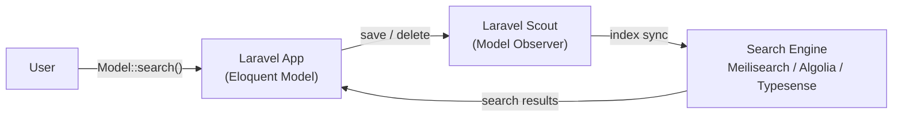

## Introduction

**Laravel Scout** provides a simple, driver-based solution for adding full-text search to your [Eloquent models](/en/eloquent). Using model observers, Scout will automatically keep your search indexes in sync with your Eloquent records.

Scout ships with a built-in `database` engine that uses MySQL / PostgreSQL full-text indexes and `LIKE` clauses to search your existing database — no external service required. For large-scale production workloads requiring typo tolerance, faceted filtering, or geo-search, external engines are available.

### Supported engines

| Engine | Characteristics | Use case |
|---|---|---|
| `database` | MySQL / PostgreSQL full-text indexes | Most applications |
| `collection` | PHP-based filtering (SQLite compatible) | Local dev and testing |
| Meilisearch | Open source, typo tolerant, fast | Production |
| Algolia | Cloud SaaS, advanced features | Production |
| Typesense | Open source, vector search support | Production |



## Installation

Install Scout via Composer:

```shell
composer require laravel/scout
```

After installing, publish the Scout configuration file. This command publishes `scout.php` to your application's `config` directory:

```shell
php artisan vendor:publish --provider="Laravel\Scout\ScoutServiceProvider"
```

Finally, add the `Laravel\Scout\Searchable` trait to the model you want to make searchable. This trait registers a model observer that keeps the model in sync with your search driver:

```php
<?php

namespace App\Models;

use Illuminate\Database\Eloquent\Model;
use Laravel\Scout\Searchable;

class Post extends Model
{
    use Searchable;
}
```

### Queueing

When using an engine other than `database` or `collection`, you should strongly consider configuring a [queue driver](/en/queues) before using Scout. Running a queue worker allows Scout to queue all index sync operations in the background, providing much better response times for your web interface.

Set the `queue` option in `config/scout.php` to `true`:

```php
'queue' => true,
```

You can also specify the connection and queue name:

```php
'queue' => [
    'connection' => 'redis',
    'queue' => 'scout'
],
```

Then run a queue worker for the dedicated queue:

```shell
php artisan queue:work redis --queue=scout
```

## Driver prerequisites

### Algolia

When using the Algolia driver, configure your `id` and `secret` credentials in `config/scout.php` and install the Algolia PHP SDK:

```shell
composer require algolia/algoliasearch-client-php
```

Add your credentials to the `.env` file:

```ini
ALGOLIA_APP_ID=your-app-id
ALGOLIA_SECRET=your-secret-key
```

#### Index settings

You can manage Algolia index settings directly in `config/scout.php`:

```php
use App\Models\User;

'algolia' => [
    'id' => env('ALGOLIA_APP_ID', ''),
    'secret' => env('ALGOLIA_SECRET', ''),
    'index-settings' => [
        User::class => [
            'searchableAttributes' => ['id', 'name', 'email'],
            'attributesForFaceting' => ['filterOnly(email)'],
        ],
    ],
],
```

After configuring, sync the settings to Algolia:

```shell
php artisan scout:sync-index-settings
```

### Meilisearch

[Meilisearch](https://www.meilisearch.com) is a fast, open source search engine. For local development, the easiest way is to use [Laravel Sail](https://laravel.com/docs/sail#meilisearch)'s Docker environment.

```shell
# With Laravel Sail
./vendor/bin/sail up -d meilisearch
```

Without Sail, you can start Meilisearch directly with Docker:

```shell
docker run -it --rm \
    -p 7700:7700 \
    getmeili/meilisearch:latest \
    meilisearch --master-key="masterKey"
```

Install the Meilisearch PHP SDK:

```shell
composer require meilisearch/meilisearch-php http-interop/http-factory-guzzle
```

Set the driver and host in your `.env` file:

```ini
SCOUT_DRIVER=meilisearch
MEILISEARCH_HOST=http://127.0.0.1:7700
MEILISEARCH_KEY=masterKey
```

<Warning>
  When upgrading Scout on an application that uses Meilisearch, always review any [breaking changes](https://github.com/meilisearch/Meilisearch/releases) to the Meilisearch service itself.
</Warning>

#### Index settings (Meilisearch)

Meilisearch requires you to pre-define `filterableAttributes` for columns you plan to use with Scout's `where` method, and `sortableAttributes` for columns you plan to sort by:

```php
use App\Models\User;

'meilisearch' => [
    'host' => env('MEILISEARCH_HOST', 'http://localhost:7700'),
    'key' => env('MEILISEARCH_KEY', null),
    'index-settings' => [
        User::class => [
            'filterableAttributes' => ['id', 'name', 'email'],
            'sortableAttributes' => ['created_at'],
        ],
    ],
],
```

Pay attention to data types — Meilisearch only performs filter operations (`>`, `<`, etc.) on data of the correct type:

```php
public function toSearchableArray(): array
{
    return [
        'id' => (int) $this->id,
        'name' => $this->name,
        'price' => (float) $this->price,
    ];
}
```

After configuring, sync the settings:

```shell
php artisan scout:sync-index-settings
```

### Typesense

[Typesense](https://typesense.org) is a lightning-fast, open source search engine with support for keyword, semantic, geo, and vector search.

```shell
composer require typesense/typesense-php
```

Set the connection details in your `.env` file:

```ini
SCOUT_DRIVER=typesense
TYPESENSE_API_KEY=masterKey
TYPESENSE_HOST=localhost
TYPESENSE_PORT=8108
TYPESENSE_PATH=
TYPESENSE_PROTOCOL=http
```

When using Typesense, your `toSearchableArray` method must cast the model's primary key to a string and creation date to a UNIX timestamp:

```php
public function toSearchableArray(): array
{
    return array_merge($this->toArray(), [
        'id' => (string) $this->id,
        'created_at' => $this->created_at->timestamp,
    ]);
}
```

### Database / collection engines

These built-in engines require no external service.

The **database engine** uses MySQL / PostgreSQL full-text indexes and `LIKE` clauses. It is the recommended starting point for most applications:

```ini
SCOUT_DRIVER=database
```

The **collection engine** retrieves all records from your database and filters them in PHP, so it works with any database Laravel supports, including SQLite. It is intended for local development, small datasets, and tests:

```ini
SCOUT_DRIVER=collection
```

<Info>
  The database engine searches your database tables directly — no separate indexing step is required.
</Info>

## The Searchable trait

### Customizing toSearchableArray()

By default, the entire `toArray` form of a model is persisted to its search index. Override `toSearchableArray` to control which data is synchronized:

```php
<?php

namespace App\Models;

use Illuminate\Database\Eloquent\Model;
use Laravel\Scout\Searchable;

class Post extends Model
{
    use Searchable;

    /**
     * Get the indexable data array for the model.
     *
     * @return array<string, mixed>
     */
    public function toSearchableArray(): array
    {
        $array = $this->toArray();

        // Customize the data array...

        return $array;
    }
}
```

### Customizing the index name

By default, the model's table name (plural) is used as the index name. Override `searchableAs` to customize it:

```php
public function searchableAs(): string
{
    return 'posts_index';
}
```

### Database engine search strategies

For the database engine, you can assign PHP attributes to specify more efficient per-column search strategies:

```php
use Laravel\Scout\Attributes\SearchUsingFullText;
use Laravel\Scout\Attributes\SearchUsingPrefix;

#[SearchUsingPrefix(['id', 'email'])]
#[SearchUsingFullText(['bio'])]
public function toSearchableArray(): array
{
    return [
        'id' => $this->id,
        'name' => $this->name,
        'email' => $this->email,
        'bio' => $this->bio,
    ];
}
```

<Warning>
  Before using `SearchUsingFullText`, ensure the column has a [full-text index](/en/migrations).
</Warning>

### Conditionally searchable models

To make a model searchable only under certain conditions, define a `shouldBeSearchable` method:

```php
/**
 * Determine if the model should be searchable.
 */
public function shouldBeSearchable(): bool
{
    return $this->isPublished();
}
```

<Warning>
  `shouldBeSearchable` is not applicable when using the database engine. Use [where clauses](#filtering-and-sorting) instead.
</Warning>

## Index management

<Info>
  The commands in this section are primarily relevant when using a third-party engine (Algolia, Meilisearch, or Typesense). The database engine does not require manual index management.
</Info>

### Batch import

If you are adding Scout to an existing project, import existing database records into your indexes:

```shell
php artisan scout:import "App\Models\Post"
```

To import using queued jobs in the background:

```shell
php artisan scout:queue-import "App\Models\Post" --chunk=500
```

### Flushing the index

Remove all records for a model from its search index:

```shell
php artisan scout:flush "App\Models\Post"
```

### Pausing indexing

To perform a batch of Eloquent operations without syncing to the search index, use `withoutSyncingToSearch`:

```php
use App\Models\Order;

Order::withoutSyncingToSearch(function () {
    // Model operations here are not synced to the index
});
```

### Manually adding and removing records

Add a collection of models to the index via an Eloquent query:

```php
// Add via query
Order::where('price', '>', 100)->searchable();

// Add via relationship
$user->orders()->searchable();
```

Remove records from the index using `unsearchable`:

```php
Order::where('price', '>', 100)->unsearchable();
```

Deleting a model removes it from the search index automatically.

## Searching

Use the `search` method to search a model. Chain `get` to retrieve the matching Eloquent models:

```php
use App\Models\Order;

$orders = Order::search('Star Trek')->get();
```

You can return search results directly from a route or controller — they will be converted to JSON automatically:

```php
use Illuminate\Http\Request;

Route::get('/search', function (Request $request) {
    return Order::search($request->search)->get();
});
```

To get the raw search results before they are converted to Eloquent models, use `raw`:

```php
$orders = Order::search('Star Trek')->raw();
```

### Pagination

Paginate search results with the `paginate` method, which returns an `Illuminate\Pagination\LengthAwarePaginator`:

```php
$orders = Order::search('Star Trek')->paginate();

// Specify results per page
$orders = Order::search('Star Trek')->paginate(15);
```

The database engine also supports `simplePaginate`, which skips the total count query for better performance on large datasets:

```php
$orders = Order::search('Star Trek')->simplePaginate(15);
```

Render results and pagination links in a Blade template:

```html
<div class="container">
    @foreach ($orders as $order)
        {{ $order->price }}
    @endforeach
</div>

{{ $orders->links() }}
```

## Filtering and sorting

Add filter conditions to your search query with `where`:

```php
use App\Models\Order;

// Equality filter
$orders = Order::search('Star Trek')->where('user_id', 1)->get();

// Match any value in array
$orders = Order::search('Star Trek')->whereIn('status', ['open', 'paid'])->get();

// Exclude values in array
$orders = Order::search('Star Trek')->whereNotIn('status', ['closed'])->get();
```

<Warning>
  When using Meilisearch, you must configure [filterable attributes](#index-settings-meilisearch) before using Scout's `where` clauses.
</Warning>

Customize the Eloquent query for the results using `query`:

```php
use Illuminate\Database\Eloquent\Builder;

$orders = Order::search('Star Trek')
    ->query(fn (Builder $query) => $query->with('invoices'))
    ->get();
```

## Eager loading

Scout retrieves IDs from the search engine and then fetches the models via Eloquent. To avoid N+1 queries, use the `query` method to eager load relationships:

```php
use App\Models\Order;
use Illuminate\Database\Eloquent\Builder;

$orders = Order::search('Star Trek')
    ->query(fn (Builder $query) => $query->with(['invoices', 'user']))
    ->get();
```

To eager load relationships during batch import, define `makeAllSearchableUsing` on the model:

```php
use Illuminate\Database\Eloquent\Builder;

protected function makeAllSearchableUsing(Builder $query): Builder
{
    return $query->with('author');
}
```

<Warning>
  `makeAllSearchableUsing` may not be applicable when using a queue to batch import models, because relationships are not restored when model collections are processed by jobs.
</Warning>

## Soft deleting

If your indexed models use [soft deletes](/en/eloquent) and you need to search soft deleted records, set `soft_delete` to `true` in `config/scout.php`:

```php
'soft_delete' => true,
```

You can then use `withTrashed` or `onlyTrashed` when searching:

```php
// Include trashed records
$orders = Order::search('Star Trek')->withTrashed()->get();

// Only trashed records
$orders = Order::search('Star Trek')->onlyTrashed()->get();
```

## Custom engines

If the built-in engines don't meet your needs, you can write your own. Extend the `Laravel\Scout\Engines\Engine` abstract class and implement its eight required methods:

```php
use Laravel\Scout\Builder;

abstract public function update($models);
abstract public function delete($models);
abstract public function search(Builder $builder);
abstract public function paginate(Builder $builder, $perPage, $page);
abstract public function mapIds($results);
abstract public function map(Builder $builder, $results, $model);
abstract public function getTotalCount($results);
abstract public function flush($model);
```

Review `Laravel\Scout\Engines\AlgoliaEngine` for a reference implementation.

Register your custom engine in the `boot` method of `App\Providers\AppServiceProvider`:

```php
use App\ScoutExtensions\MySqlSearchEngine;
use Laravel\Scout\EngineManager;

public function boot(): void
{
    resolve(EngineManager::class)->extend('mysql', function () {
        return new MySqlSearchEngine;
    });
}
```

Then specify it as the driver in `config/scout.php`:

```php
'driver' => 'mysql',
```

## Related pages

<Card title="Eloquent ORM" icon="database" href="/en/eloquent">
  Learn the fundamentals of working with Eloquent models.
</Card>

<Card title="Eloquent relationships" icon="link" href="/en/eloquent-relationships">
  Learn how to define relationships and use eager loading.
</Card>

<Card title="Queues" icon="clock" href="/en/queues">
  Scout can use queues to update indexes in the background.
</Card>
