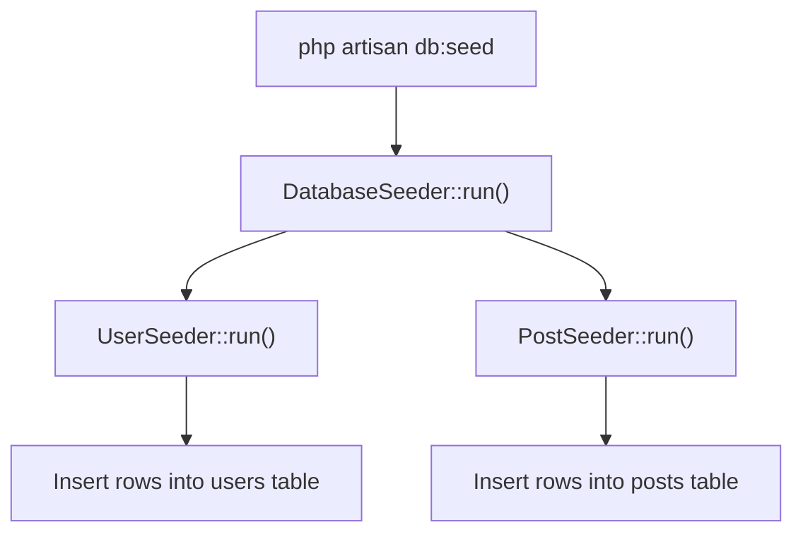

## What is seeding?

Seeding is the process of populating your database with sample or initial data.

Development environments and automated tests often require data to already exist. Entering data manually every time is tedious, so seeders let you define that data once and run it repeatedly.

Seeder classes are stored in the `database/seeders` directory. Laravel provides a `DatabaseSeeder` class by default.



## Creating a seeder

Use the `make:seeder` Artisan command to generate a new seeder class:

```shell
php artisan make:seeder UserSeeder
```

The generated file is placed at `database/seeders/UserSeeder.php`:

```php
<?php

namespace Database\Seeders;

use Illuminate\Database\Seeder;

class UserSeeder extends Seeder
{
    /**
     * Run the database seeders.
     */
    public function run(): void
    {
        // Add your data insertion logic here
    }
}
```

## Implementing a seeder

Write your data insertion logic inside the `run()` method. You can use the DB facade or Eloquent models.

### Using the DB facade

```php
<?php

namespace Database\Seeders;

use Illuminate\Database\Seeder;
use Illuminate\Support\Facades\DB;
use Illuminate\Support\Facades\Hash;

class UserSeeder extends Seeder
{
    public function run(): void
    {
        DB::table('users')->insert([
            [
                'name' => 'Alice Smith',
                'email' => 'alice@example.com',
                'password' => Hash::make('password'),
                'created_at' => now(),
                'updated_at' => now(),
            ],
            [
                'name' => 'Bob Jones',
                'email' => 'bob@example.com',
                'password' => Hash::make('password'),
                'created_at' => now(),
                'updated_at' => now(),
            ],
        ]);
    }
}
```

### Using Eloquent models

```php
use App\Models\User;
use Illuminate\Support\Facades\Hash;

public function run(): void
{
    User::create([
        'name' => 'Admin',
        'email' => 'admin@example.com',
        'password' => Hash::make('password'),
    ]);
}
```

<Info>
  Mass assignment protection is automatically disabled during database seeding, so you don't need to worry about `$fillable` or `$guarded` settings.
</Info>

## Using model factories

When you need large amounts of test data, combine seeders with [model factories](/en/eloquent). Factories generate realistic fake data in bulk.

```php
use App\Models\User;
use App\Models\Post;

public function run(): void
{
    // Create 10 users
    User::factory(10)->create();

    // Create 5 users, each with 3 related posts
    User::factory(5)
        ->hasPosts(3)
        ->create();
}
```

<Tip>
  See the Eloquent factory documentation for details on defining and customizing factories.
</Tip>

## Using DatabaseSeeder

`DatabaseSeeder` is the entry point that coordinates multiple seeders. Use the `call()` method to specify which seeders to run:

```php
<?php

namespace Database\Seeders;

use Illuminate\Database\Seeder;

class DatabaseSeeder extends Seeder
{
    public function run(): void
    {
        $this->call([
            UserSeeder::class,
            PostSeeder::class,
            CommentSeeder::class,
        ]);
    }
}
```

Seeders run in the order you list them. When foreign key constraints exist, seed the referenced table first (for example, `users` before `posts`).

## Running seeders

### Run all seeders

```shell
php artisan db:seed
```

This calls `DatabaseSeeder`, which in turn runs all seeders registered with `call()`.

### Run a specific seeder

Use the `--class` option to run a single seeder class:

```shell
php artisan db:seed --class=UserSeeder
```

## Running with migrations

Combine the `migrate:fresh` command with the `--seed` option to drop all tables, re-run every migration, and then seed in one step:

```shell
php artisan migrate:fresh --seed
```

To run a specific seeder instead of `DatabaseSeeder`:

```shell
php artisan migrate:fresh --seed --seeder=UserSeeder
```

<Warning>
  `migrate:fresh` drops and recreates all tables, destroying any existing data. Never run this in production.
</Warning>

## Running seeders in production

Running seeders in the `production` environment prompts you to confirm. To skip the prompt, use the `--force` flag:

```shell
php artisan db:seed --force
```

<Warning>
  Seeding in production can overwrite or destroy data. Always take a backup before running seeders against a production database.
</Warning>

## Muting model events

To prevent model events (`creating`, `created`, etc.) from firing during seeding, apply the `WithoutModelEvents` trait:

```php
<?php

namespace Database\Seeders;

use Illuminate\Database\Seeder;
use Illuminate\Database\Console\Seeds\WithoutModelEvents;

class DatabaseSeeder extends Seeder
{
    use WithoutModelEvents;

    public function run(): void
    {
        $this->call([
            UserSeeder::class,
        ]);
    }
}
```

This also applies to any child seeders called via `call()`.

## Practical example: blog application

Here is a complete seeding setup for an application with users and posts:

```php
// database/seeders/UserSeeder.php
class UserSeeder extends Seeder
{
    public function run(): void
    {
        User::factory(10)->create();
    }
}

// database/seeders/PostSeeder.php
class PostSeeder extends Seeder
{
    public function run(): void
    {
        // Create 2–5 posts for each user
        User::all()->each(function ($user) {
            Post::factory(rand(2, 5))->create([
                'user_id' => $user->id,
            ]);
        });
    }
}

// database/seeders/DatabaseSeeder.php
class DatabaseSeeder extends Seeder
{
    public function run(): void
    {
        $this->call([
            UserSeeder::class,
            PostSeeder::class, // Run after UserSeeder
        ]);
    }
}
```

Then reset and seed everything at once:

```shell
php artisan migrate:fresh --seed
```

## Next steps

<Card title="Eloquent ORM" icon="database" href="/en/eloquent">
  Learn how to query and work with the data you seeded using Eloquent.
</Card>
