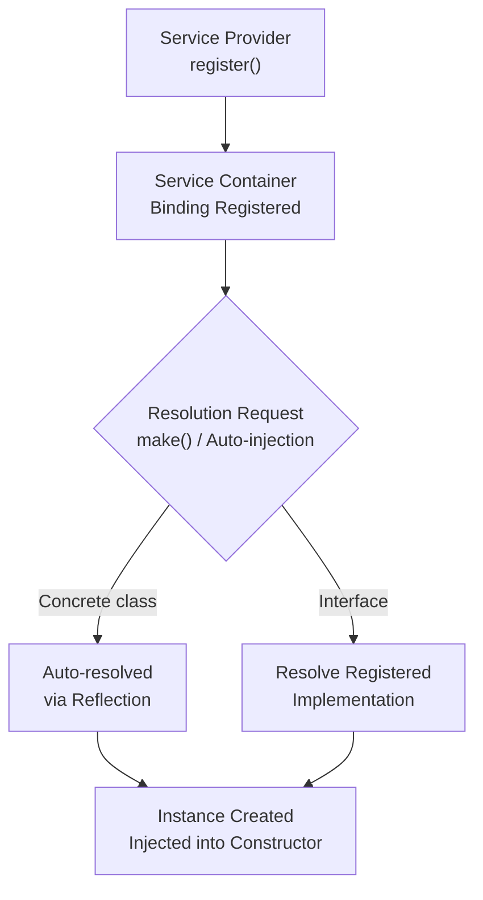

## What is the service container?

Laravel's service container is a powerful tool for managing class dependencies and performing dependency injection. Dependency injection means that class dependencies are "injected" into the class through its constructor or, in some cases, setter methods.

Consider this example:

```php
<?php

namespace App\Http\Controllers;

use App\Services\AppleMusic;
use Illuminate\View\View;

class PodcastController extends Controller
{
    public function __construct(
        protected AppleMusic $apple,
    ) {}

    public function show(string $id): View
    {
        return view('podcasts.show', [
            'podcast' => $this->apple->findPodcast($id)
        ]);
    }
}
```

The `PodcastController` needs to retrieve podcasts from a data source. By **injecting** an `AppleMusic` service, you can swap in a mock during tests without changing the controller code.

<Info>
  A deep understanding of the service container is essential for building large Laravel applications and contributing to the Laravel core.
</Info>



## Zero configuration resolution

When a class has no dependencies on interfaces—only concrete classes—you don't need to tell the container how to resolve it. For example:

```php
<?php

class Service
{
    // ...
}

Route::get('/', function (Service $service) {
    dd($service::class);
});
```

Laravel automatically resolves the `Service` class and injects it into the route handler. No configuration needed.

Most classes you write in a Laravel application—controllers, event listeners, middleware—have their dependencies automatically injected by the container.

## Binding

### Basic bindings

Register most bindings inside a [service provider](/en/installation). Inside a provider, access the container via `$this->app`.

#### bind

Use `bind` to register a class or interface with a resolver closure:

```php
use App\Services\Transistor;
use App\Services\PodcastParser;
use Illuminate\Contracts\Foundation\Application;

$this->app->bind(Transistor::class, function (Application $app) {
    return new Transistor($app->make(PodcastParser::class));
});
```

The closure receives the container itself, so you can resolve sub-dependencies from within it.

To interact with the container outside a service provider, use the `App` facade:

```php
use App\Services\Transistor;
use Illuminate\Contracts\Foundation\Application;
use Illuminate\Support\Facades\App;

App::bind(Transistor::class, function (Application $app) {
    // ...
});
```

<Info>
  You only need to bind a class if it depends on an interface. Classes that depend only on concrete types are resolved automatically through reflection.
</Info>

#### singleton

Use `singleton` to bind a class or interface that should only be resolved once. Subsequent calls to the container return the same instance:

```php
use App\Services\Transistor;
use App\Services\PodcastParser;
use Illuminate\Contracts\Foundation\Application;

$this->app->singleton(Transistor::class, function (Application $app) {
    return new Transistor($app->make(PodcastParser::class));
});
```

#### instance

Bind an existing object instance to the container. Every subsequent resolution returns the exact same object:

```php
use App\Services\Transistor;
use App\Services\PodcastParser;

$service = new Transistor(new PodcastParser);

$this->app->instance(Transistor::class, $service);
```

### Binding interfaces to implementations

One of the container's most powerful features is binding an interface to a concrete implementation:

```php
use App\Contracts\EventPusher;
use App\Services\RedisEventPusher;

$this->app->bind(EventPusher::class, RedisEventPusher::class);
```

Now whenever the container needs an `EventPusher`, it injects a `RedisEventPusher`. Type-hint the interface in your constructor and the container handles the rest:

```php
use App\Contracts\EventPusher;

public function __construct(
    protected EventPusher $pusher,
) {}
```

<Tip>
  Depending on interfaces rather than concrete classes means you can swap implementations without touching the consumer code—a huge win for testability.
</Tip>

### Contextual binding

Sometimes you want two classes that use the same interface to receive different implementations. Use `when` to configure this:

```php
use App\Http\Controllers\PhotoController;
use App\Http\Controllers\VideoController;
use App\Services\Filesystem\LocalFilesystem;
use App\Services\Filesystem\CloudFilesystem;
use App\Contracts\Filesystem;

$this->app->when(PhotoController::class)
    ->needs(Filesystem::class)
    ->give(LocalFilesystem::class);

$this->app->when(VideoController::class)
    ->needs(Filesystem::class)
    ->give(CloudFilesystem::class);
```

`PhotoController` gets a `LocalFilesystem` while `VideoController` gets a `CloudFilesystem`, even though both type-hint the same `Filesystem` interface.

## Resolving from the container

### The make method

Resolve a class instance directly using `make`:

```php
use App\Services\Transistor;

$transistor = app()->make(Transistor::class);
```

When a dependency cannot be resolved by the container, pass extra arguments with `makeWith`:

```php
$transistor = $this->app->makeWith(Transistor::class, ['id' => 1]);
```

### Automatic injection

In practice, you rarely call `make` directly. Instead, type-hint dependencies in your constructors and let the container inject them automatically when it resolves controllers, jobs, listeners, and other framework-managed classes.

## Constructor injection in practice

Here's a complete example showing how to wire up a payment gateway with the container:

<Steps>
  <Step title="Define an interface">
    ```php
    <?php

    namespace App\Contracts;

    interface PaymentGateway
    {
        public function charge(int $amount, string $token): bool;
    }
    ```
  </Step>
  <Step title="Create a concrete implementation">
    ```php
    <?php

    namespace App\Services;

    use App\Contracts\PaymentGateway;

    class StripePaymentGateway implements PaymentGateway
    {
        public function charge(int $amount, string $token): bool
        {
            // Call the Stripe API...
            return true;
        }
    }
    ```
  </Step>
  <Step title="Bind in a service provider">
    ```php
    use App\Contracts\PaymentGateway;
    use App\Services\StripePaymentGateway;

    $this->app->singleton(PaymentGateway::class, StripePaymentGateway::class);
    ```
  </Step>
  <Step title="Inject into a controller">
    ```php
    <?php

    namespace App\Http\Controllers;

    use App\Contracts\PaymentGateway;
    use Illuminate\Http\Request;

    class OrderController extends Controller
    {
        public function __construct(
            protected PaymentGateway $payment,
        ) {}

        public function store(Request $request)
        {
            $this->payment->charge(
                $request->amount,
                $request->payment_token
            );

            // ...
        }
    }
    ```
  </Step>
</Steps>

To switch from Stripe to a different provider, change the binding in one place. Every class that depends on `PaymentGateway` gets the new implementation automatically.

## Container events

The container fires an event each time it resolves an object. Listen to this event using `resolving`:

```php
use App\Services\Transistor;
use Illuminate\Contracts\Foundation\Application;

$this->app->resolving(Transistor::class, function (Transistor $transistor, Application $app) {
    // Called whenever the container resolves a Transistor instance...
});
```

You can also listen to all resolved objects:

```php
$this->app->resolving(function (mixed $object, Application $app) {
    // Called whenever the container resolves any type...
});
```

## Facades and the container

Laravel's facades provide a static interface to objects held in the container. For example, `Cache::get()` internally retrieves the `Cache` service from the container:

```php
use Illuminate\Support\Facades\Cache;

// Via facade
Cache::get('key');

// Equivalent direct container call
app('cache')->get('key');
```

Facades are convenient wrappers around the container. During tests, you can replace them with mocks:

```php
use Illuminate\Support\Facades\Cache;

Cache::shouldReceive('get')
    ->once()
    ->with('key')
    ->andReturn('value');
```

<Card title="Facades" icon="layer-group" href="/en/facades">
  Learn how facades work under the hood and when to use them.
</Card>
