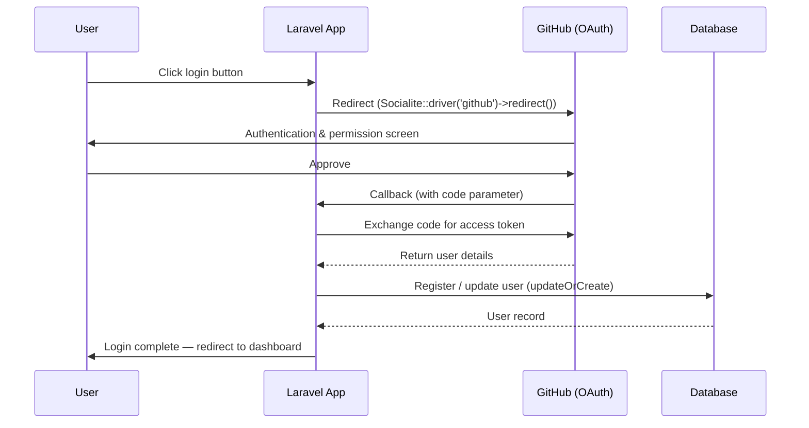

## What is Laravel Socialite?

Laravel Socialite is an official package that makes it simple to implement social login via OAuth 2.0. It supports major providers such as GitHub, Google, Facebook, X (Twitter), LinkedIn, and more — turning what would otherwise be complex OAuth flows into just a few lines of code.

The following providers are supported out of the box:

| Provider | Key |
| --- | --- |
| Bitbucket | `bitbucket` |
| Facebook | `facebook` |
| GitHub | `github` |
| GitLab | `gitlab` |
| Google | `google` |
| LinkedIn (OpenID) | `linkedin-openid` |
| Slack | `slack` / `slack-openid` |
| Spotify | `spotify` |
| Twitch | `twitch` |
| X (Twitter) | `x` |

<Info>
  Adapters for other platforms are available via the community-driven [Socialite Providers](https://socialiteproviders.com/) website.
</Info>

### Social login flow



---

## Installation

Add the package via Composer:

```shell
composer require laravel/socialite
```

<Info>
  When upgrading Socialite to a new major version, be sure to review the [upgrade guide](https://github.com/laravel/socialite/blob/master/UPGRADE.md).
</Info>

---

## Configuration

### config/services.php

Add credentials for each provider to `config/services.php`:

```php
// config/services.php

'github' => [
    'client_id' => env('GITHUB_CLIENT_ID'),
    'client_secret' => env('GITHUB_CLIENT_SECRET'),
    'redirect' => env('GITHUB_REDIRECT_URI'),
],

'google' => [
    'client_id' => env('GOOGLE_CLIENT_ID'),
    'client_secret' => env('GOOGLE_CLIENT_SECRET'),
    'redirect' => env('GOOGLE_REDIRECT_URI'),
],

'facebook' => [
    'client_id' => env('FACEBOOK_CLIENT_ID'),
    'client_secret' => env('FACEBOOK_CLIENT_SECRET'),
    'redirect' => env('FACEBOOK_REDIRECT_URI'),
],
```

<Info>
  If the `redirect` option contains a relative path, it will automatically be resolved to a fully qualified URL.
</Info>

### .env

Manage your credentials via environment variables. Using GitHub as an example:

```ini
GITHUB_CLIENT_ID=your-client-id
GITHUB_CLIENT_SECRET=your-client-secret
GITHUB_REDIRECT_URI=https://example.com/auth/github/callback
```

For GitHub, create an OAuth App in [GitHub Developer Settings](https://github.com/settings/developers) to obtain your client ID and secret.

---

## Authentication Flow

### Routing

OAuth authentication requires two routes: one to redirect the user to the provider, and one to handle the callback.

```php
use Laravel\Socialite\Facades\Socialite;

// Redirect the user to GitHub
Route::get('/auth/github', function () {
    return Socialite::driver('github')->redirect();
});

// Handle the GitHub callback
Route::get('/auth/github/callback', function () {
    $user = Socialite::driver('github')->user();

    // $user->token contains the access token
});
```

### Storing the user and logging in

Retrieve the user in the callback route, persist them to the database, then log them in:

```php
use App\Models\User;
use Illuminate\Support\Facades\Auth;
use Laravel\Socialite\Facades\Socialite;

Route::get('/auth/github/callback', function () {
    $githubUser = Socialite::driver('github')->user();

    $user = User::updateOrCreate(
        ['github_id' => $githubUser->id],
        [
            'name' => $githubUser->name,
            'email' => $githubUser->email,
            'github_token' => $githubUser->token,
            'github_refresh_token' => $githubUser->refreshToken,
        ]
    );

    Auth::login($user);

    return redirect('/dashboard');
});
```

<Warning>
  When using `updateOrCreate`, the `github_id` column must exist in your `users` table. See the migration example below.
</Warning>

---

## Retrieving User Details

The object returned by `user()` exposes the following properties and methods:

```php
Route::get('/auth/github/callback', function () {
    $user = Socialite::driver('github')->user();

    // OAuth 2.0 providers
    $token = $user->token;
    $refreshToken = $user->refreshToken;
    $expiresIn = $user->expiresIn;

    // OAuth 1.0 providers (e.g. X)
    $token = $user->token;
    $tokenSecret = $user->tokenSecret;

    // All providers
    $user->getId();
    $user->getNickname();
    $user->getName();
    $user->getEmail();
    $user->getAvatar();
});
```

### Retrieve a user from an existing token

If you already have a valid access token, retrieve the user with `userFromToken()`:

```php
$user = Socialite::driver('github')->userFromToken($token);
```

### Stateless authentication

For stateless APIs that do not use cookie-based sessions, disable session state verification with `stateless()`:

```php
return Socialite::driver('google')->stateless()->user();
```

---

## Database Integration

### Migration

Add social login columns to the `users` table:

```php
// database/migrations/xxxx_xx_xx_add_github_columns_to_users_table.php

return new class extends Migration
{
    public function up(): void
    {
        Schema::table('users', function (Blueprint $table) {
            $table->string('github_id')->nullable()->unique()->after('id');
            $table->string('github_token')->nullable()->after('github_id');
            $table->string('github_refresh_token')->nullable()->after('github_token');
        });
    }

    public function down(): void
    {
        Schema::table('users', function (Blueprint $table) {
            $table->dropColumn(['github_id', 'github_token', 'github_refresh_token']);
        });
    }
};
```

### Supporting multiple providers with `provider` columns

A common approach for handling multiple providers is to use `provider` and `provider_id` columns:

```php
Schema::table('users', function (Blueprint $table) {
    $table->string('provider')->nullable()->after('id');
    $table->string('provider_id')->nullable()->after('provider');
    $table->string('provider_token')->nullable()->after('provider_id');

    $table->unique(['provider', 'provider_id']);
});
```

Handle callbacks dynamically by accepting the provider name as a route parameter:

```php
Route::get('/auth/{provider}/callback', function (string $provider) {
    $socialUser = Socialite::driver($provider)->user();

    $user = User::updateOrCreate(
        [
            'provider' => $provider,
            'provider_id' => $socialUser->getId(),
        ],
        [
            'name' => $socialUser->getName(),
            'email' => $socialUser->getEmail(),
            'provider_token' => $socialUser->token,
        ]
    );

    Auth::login($user);

    return redirect('/dashboard');
});
```

### Linking to an existing account by email

To link a social login to an existing account that shares the same email address:

```php
$socialUser = Socialite::driver('github')->user();

$user = User::where('email', $socialUser->getEmail())->first();

if ($user) {
    // Link GitHub details to the existing user
    $user->update([
        'github_id' => $socialUser->getId(),
        'github_token' => $socialUser->token,
    ]);
} else {
    // Create a new user
    $user = User::create([
        'name' => $socialUser->getName(),
        'email' => $socialUser->getEmail(),
        'github_id' => $socialUser->getId(),
        'github_token' => $socialUser->token,
    ]);
}

Auth::login($user);
```

---

## Scopes and Options

### Adding scopes

Use the `scopes()` method to append additional scopes to the authentication request:

```php
return Socialite::driver('github')
    ->scopes(['read:user', 'public_repo'])
    ->redirect();
```

Use `setScopes()` to replace all existing scopes:

```php
return Socialite::driver('github')
    ->setScopes(['read:user', 'public_repo'])
    ->redirect();
```

### Optional parameters

Use the `with()` method to include additional parameters in the redirect request:

```php
// Restrict to a specific Google Workspace domain
return Socialite::driver('google')
    ->with(['hd' => 'example.com'])
    ->redirect();

// Always show the Google consent screen
return Socialite::driver('google')
    ->with(['prompt' => 'consent'])
    ->redirect();
```

<Warning>
  When using `with()`, be careful not to pass reserved keywords such as `state` or `response_type`.
</Warning>

### Slack bot tokens

To generate a Slack bot token instead of a user token, use `asBotUser()`:

```php
// When redirecting
return Socialite::driver('slack')
    ->asBotUser()
    ->setScopes(['chat:write', 'chat:write.public', 'chat:write.customize'])
    ->redirect();

// When handling the callback
$user = Socialite::driver('slack')->asBotUser()->user();
```

---

## Testing

Socialite provides built-in support for mocking OAuth flows in tests — no real provider requests needed.

### Faking the redirect

```php
use Laravel\Socialite\Facades\Socialite;

test('user is redirected to GitHub', function () {
    Socialite::fake('github');

    $response = $this->get('/auth/github');

    $response->assertRedirect();
});
```

### Faking the callback

Pass a `User` instance to `fake()` to mock the user data returned from the provider:

```php
use Laravel\Socialite\Facades\Socialite;
use Laravel\Socialite\Two\User;

test('user can log in with GitHub', function () {
    Socialite::fake('github', (new User)->map([
        'id' => 'github-123',
        'name' => 'Jane Doe',
        'email' => 'jane@example.com',
    ]));

    $response = $this->get('/auth/github/callback');

    $response->assertRedirect('/dashboard');

    $this->assertDatabaseHas('users', [
        'name' => 'Jane Doe',
        'email' => 'jane@example.com',
        'github_id' => 'github-123',
    ]);
});
```

You can also set additional properties on the fake user:

```php
$fakeUser = (new User)->map([
    'id' => 'github-123',
    'name' => 'Jane Doe',
    'email' => 'jane@example.com',
])->setToken('fake-token')
  ->setRefreshToken('fake-refresh-token')
  ->setExpiresIn(3600)
  ->setApprovedScopes(['read:user', 'public_repo']);
```

---

## Community Providers

For providers not built in (LINE, Discord, Apple, etc.), use [Socialite Providers](https://socialiteproviders.com/):

```shell
composer require socialiteproviders/line
```

Register the service provider event listener and add credentials to `config/services.php`. After that, use the same Socialite API as any built-in provider.

```php
// In App\Providers\EventServiceProvider — add to the protected $listen array
\SocialiteProviders\Manager\SocialiteWasCalled::class => [
    \SocialiteProviders\Line\LineExtendSocialite::class . '@handle',
],
```

```php
// config/services.php
'line' => [
    'client_id' => env('LINE_CLIENT_ID'),
    'client_secret' => env('LINE_CLIENT_SECRET'),
    'redirect' => env('LINE_REDIRECT_URI'),
],
```
