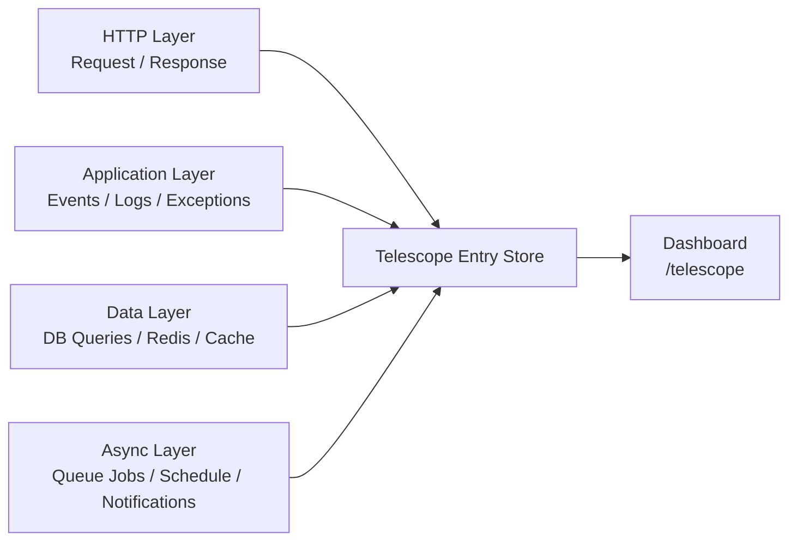

## What is Laravel Telescope?

[Laravel Telescope](https://github.com/laravel/telescope) is an official debugging and introspection tool for Laravel applications.
It records detailed entries for requests, exceptions, queries, jobs, logs, mail, notifications, cache operations, scheduled tasks, and more.

Telescope is a **local development tool**. For production monitoring, use [Laravel Pulse](/en/pulse) or [Laravel Nightwatch](/en/blog/nightwatch-introduction).

### Monitoring layers



---

## Installation

<Steps>
  <Step title="Install Telescope">
    ```shell
    composer require laravel/telescope
    ```
  </Step>

  <Step title="Publish assets and migrations">
    ```shell
    php artisan telescope:install
    ```
  </Step>

  <Step title="Run migrations">
    ```shell
    php artisan migrate
    ```
  </Step>
</Steps>

After installation, open the dashboard at `/telescope`.

## Local-only installation (recommended)

<Info>
  If your primary goal is local debugging, install Telescope with `--dev` and register providers only in the `local` environment.
</Info>

```shell
composer require laravel/telescope --dev

php artisan telescope:install
php artisan migrate
```

After `telescope:install`, remove `TelescopeServiceProvider` registration from `bootstrap/providers.php`.
Then register providers manually in `App\Providers\AppServiceProvider`:

```php
public function register(): void
{
    if ($this->app->environment('local') && class_exists(\Laravel\Telescope\TelescopeServiceProvider::class)) {
        $this->app->register(\Laravel\Telescope\TelescopeServiceProvider::class);
        $this->app->register(TelescopeServiceProvider::class);
    }
}
```

Also disable package auto-discovery in `composer.json`:

```json
{
  "extra": {
    "laravel": {
      "dont-discover": [
        "laravel/telescope"
      ]
    }
  }
}
```

---

## Available watchers

Watchers collect telemetry while requests or commands are processed.
Configure them in `config/telescope.php`.

<AccordionGroup>
  <Accordion title="Request Watcher">
    Records request, headers, session, and response data.  
    Use `size_limit` to restrict response payload size.
  </Accordion>

  <Accordion title="Query Watcher (high value)">
    Records SQL, bindings, and query duration.  
    Queries slower than **100ms** are tagged as `slow` by default, which is very useful for bottleneck detection.

    ```php
    Watchers\QueryWatcher::class => [
        'enabled' => env('TELESCOPE_QUERY_WATCHER', true),
        'slow' => 100,
    ],
    ```
  </Accordion>

  <Accordion title="Job Watcher">
    Records dispatched jobs and execution status.
  </Accordion>

  <Accordion title="Exception Watcher">
    Records reportable exceptions and stack traces.
  </Accordion>

  <Accordion title="Log Watcher">
    Records logs written by the application.  
    Default level is `error` and above; you can lower it to `debug` in configuration.
  </Accordion>

  <Accordion title="Command Watcher">
    Records Artisan command arguments, options, output, and exit code.
  </Accordion>

  <Accordion title="Event Watcher">
    Records dispatched event payloads and listeners (framework internal events are excluded).
  </Accordion>

  <Accordion title="Cache Watcher">
    Records cache hits, misses, updates, and forget operations.
  </Accordion>

  <Accordion title="Redis Watcher">
    Records Redis commands executed by your application.
  </Accordion>

  <Accordion title="Model Watcher">
    Records Eloquent model events and optionally hydration counts.
  </Accordion>

  <Accordion title="Notification Watcher">
    Records notifications sent by your application.
  </Accordion>

  <Accordion title="Mail Watcher">
    Shows sent mails and allows browser preview / `.eml` download.
  </Accordion>

  <Accordion title="HTTP Client Watcher">
    Records outgoing HTTP client requests.
  </Accordion>

  <Accordion title="Gate Watcher">
    Records authorization gate / policy checks and results.
  </Accordion>

  <Accordion title="Schedule Watcher">
    Records scheduled command execution and output.
  </Accordion>

  <Accordion title="View Watcher">
    Records rendered view names, paths, data, and composers.
  </Accordion>

  <Accordion title="Batch Watcher">
    Records queued batch metadata, including connection and job information.
  </Accordion>

  <Accordion title="Dump Watcher">
    Records variable dumps while the Telescope dump tab is open.
  </Accordion>
</AccordionGroup>

---

## Summary

| Task | Recommendation |
| --- | --- |
| Install | `composer require laravel/telescope --dev` |
| Ensure local-only isolation | Manual provider registration + `dont-discover` |
| Find DB bottlenecks quickly | Use Query Watcher slow-query tags (default 100ms) |

## Next steps

<Columns cols={2}>
  <Card title="Laravel Pulse" icon="chart-line" href="/en/pulse">
    Add a performance metrics dashboard for production.
  </Card>
  <Card title="Laravel Nightwatch" icon="moon" href="/en/blog/nightwatch-introduction">
    Use Nightwatch for real-time production monitoring.
  </Card>
</Columns>
