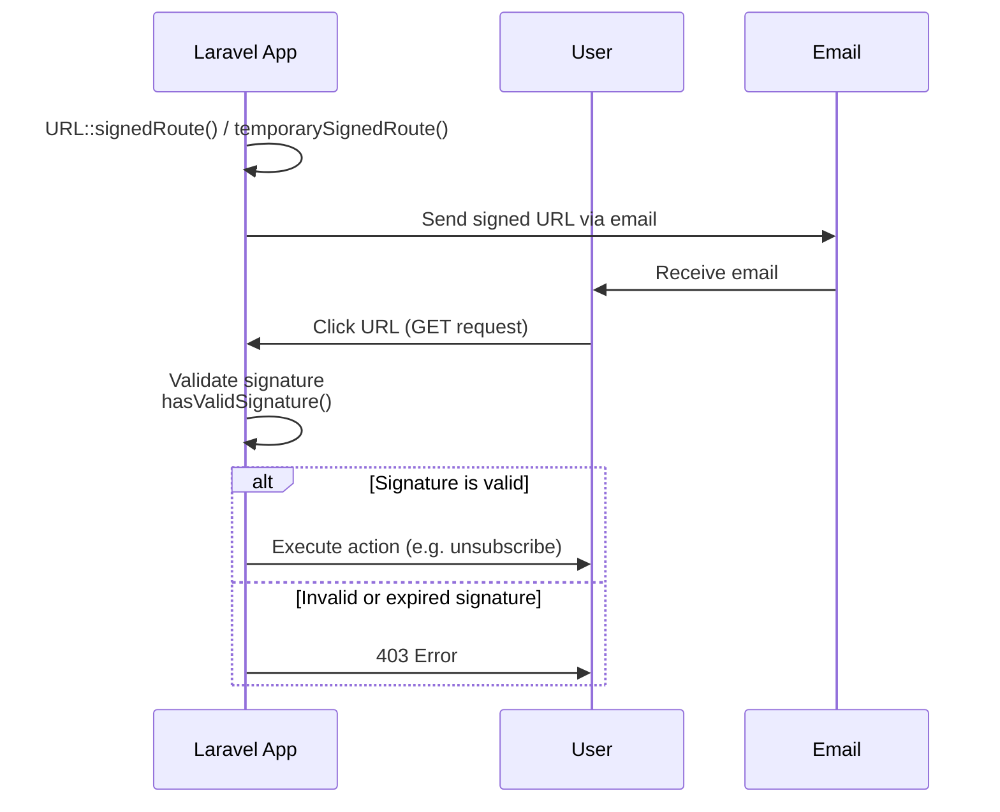

## Introduction

Laravel provides several helpers to assist you in generating URLs for your application. These helpers are primarily helpful when building links in your templates and API responses, or when generating redirect responses to another part of your application.

## The Basics

### Generating URLs

The `url` helper may be used to generate arbitrary URLs for your application. The generated URL will automatically use the scheme (HTTP or HTTPS) and host from the current request being handled by the application.

```php
$post = App\Models\Post::find(1);

echo url("/posts/{$post->id}");

// http://example.com/posts/1
```

To generate a URL with query string parameters, you may use the `query` method:

```php
echo url()->query('/posts', ['search' => 'Laravel']);

// https://example.com/posts?search=Laravel

echo url()->query('/posts?sort=latest', ['search' => 'Laravel']);

// http://example.com/posts?sort=latest&search=Laravel
```

Providing query string parameters that already exist in the path will overwrite their existing value:

```php
echo url()->query('/posts?sort=latest', ['sort' => 'oldest']);

// http://example.com/posts?sort=oldest
```

Arrays of values may also be passed as query parameters. These values will be properly keyed and encoded in the generated URL:

```php
echo $url = url()->query('/posts', ['columns' => ['title', 'body']]);

// http://example.com/posts?columns%5B0%5D=title&columns%5B1%5D=body

echo urldecode($url);

// http://example.com/posts?columns[0]=title&columns[1]=body
```

### Accessing the Current URL

If no path is provided to the `url` helper, an `Illuminate\Routing\UrlGenerator` instance is returned, allowing you to access information about the current URL:

```php
// Get the current URL without the query string...
echo url()->current();

// Get the current URL including the query string...
echo url()->full();
```

Each of these methods may also be accessed via the `URL` [facade](/docs/facades):

```php
use Illuminate\Support\Facades\URL;

echo URL::current();
```

### Accessing the Previous URL

You can access the previous URL via the `url` helper's `previous` and `previousPath` methods:

```php
// Get the full URL for the previous request...
echo url()->previous();

// Get the path for the previous request...
echo url()->previousPath();
```

Or, via the [session](/docs/session), you may access the previous URL as a fluent URI instance:

```php
use Illuminate\Http\Request;

Route::post('/users', function (Request $request) {
    $previousUri = $request->session()->previousUri();

    // ...
});
```

It is also possible to retrieve the route name for the previously visited URL via the session:

```php
$previousRoute = $request->session()->previousRoute();
```

## URLs for Named Routes

The `route` helper may be used to generate URLs to [named routes](/docs/routing#named-routes). Named routes allow you to generate URLs without being coupled to the actual URL defined on the route. Therefore, if the route's URL changes, no changes need to be made to your calls to the `route` function.

```php
Route::get('/post/{post}', function (Post $post) {
    // ...
})->name('post.show');
```

To generate a URL to this route, you may use the `route` helper:

```php
echo route('post.show', ['post' => 1]);

// http://example.com/post/1
```

The `route` helper may also be used to generate URLs for routes with multiple parameters:

```php
Route::get('/post/{post}/comment/{comment}', function (Post $post, Comment $comment) {
    // ...
})->name('comment.show');

echo route('comment.show', ['post' => 1, 'comment' => 3]);

// http://example.com/post/1/comment/3
```

Any additional array elements that do not correspond to the route's definition parameters will be added to the URL's query string:

```php
echo route('post.show', ['post' => 1, 'search' => 'rocket']);

// http://example.com/post/1?search=rocket
```

### Eloquent Models

You may pass Eloquent models as parameter values. The `route` helper will automatically extract the model's route key:

```php
echo route('post.show', ['post' => $post]);
```

### Signed URLs

Laravel allows you to easily create "signed" URLs to named routes. These URLs have a "signature" hash appended to the query string which allows Laravel to verify that the URL has not been modified since it was created. Signed URLs are especially useful for routes that are publicly accessible yet need a layer of protection against URL manipulation.

For example, you might use signed URLs to implement a public "unsubscribe" link that is emailed to your customers. To create a signed URL to a named route, use the `signedRoute` method of the `URL` facade:

```php
use Illuminate\Support\Facades\URL;

return URL::signedRoute('unsubscribe', ['user' => 1]);
```

You may exclude the domain from the signed URL hash by providing the `absolute` argument:

```php
return URL::signedRoute('unsubscribe', ['user' => 1], absolute: false);
```

If you would like to generate a temporary signed route URL that expires after a specified amount of time, you may use the `temporarySignedRoute` method:

```php
use Illuminate\Support\Facades\URL;

return URL::temporarySignedRoute(
    'unsubscribe', now()->plus(minutes: 30), ['user' => 1]
);
```

#### Signed URL Validation Flow



#### Validating Signed Route Requests

To verify that an incoming request has a valid signature, you should call the `hasValidSignature` method on the incoming `Illuminate\Http\Request` instance:

```php
use Illuminate\Http\Request;

Route::get('/unsubscribe/{user}', function (Request $request) {
    if (! $request->hasValidSignature()) {
        abort(401);
    }

    // ...
})->name('unsubscribe');
```

Sometimes, you may need to allow your application's frontend to append data to a signed URL. You can specify request query parameters that should be ignored when validating a signed URL using the `hasValidSignatureWhileIgnoring` method:

```php
if (! $request->hasValidSignatureWhileIgnoring(['page', 'order'])) {
    abort(401);
}
```

Instead of validating signed URLs using the incoming request instance, you may assign the `signed` (`Illuminate\Routing\Middleware\ValidateSignature`) [middleware](/docs/middleware) to the route. If the incoming request does not have a valid signature, the middleware will automatically return a `403` HTTP response:

```php
Route::post('/unsubscribe/{user}', function (Request $request) {
    // ...
})->name('unsubscribe')->middleware('signed');
```

If your signed URLs do not include the domain in the URL hash, you should provide the `relative` argument to the middleware:

```php
Route::post('/unsubscribe/{user}', function (Request $request) {
    // ...
})->name('unsubscribe')->middleware('signed:relative');
```

#### Responding to Invalid Signed Routes

When someone visits a signed URL that has expired, they will receive a generic error page for the `403` HTTP status code. You can customize this behavior by defining a custom "render" closure for the `InvalidSignatureException` exception in your application's `bootstrap/app.php` file:

```php
use Illuminate\Routing\Exceptions\InvalidSignatureException;

->withExceptions(function (Exceptions $exceptions): void {
    $exceptions->render(function (InvalidSignatureException $e) {
        return response()->view('errors.link-expired', status: 403);
    });
})
```

## URLs for Controller Actions

The `action` function generates a URL for the given controller action:

```php
use App\Http\Controllers\HomeController;

$url = action([HomeController::class, 'index']);
```

If the controller method accepts route parameters, you may pass an associative array of route parameters as the second argument:

```php
$url = action([UserController::class, 'profile'], ['id' => 1]);
```

## Fluent URI Objects

Laravel's `Uri` class provides a convenient and fluent interface for creating and manipulating URIs via objects.

```php
use App\Http\Controllers\UserController;
use Illuminate\Support\Uri;

// Generate a URI instance from the given string...
$uri = Uri::of('https://example.com/path');

// Generate URI instances to paths, named routes, or controller actions...
$uri = Uri::to('/dashboard');
$uri = Uri::route('users.show', ['user' => 1]);
$uri = Uri::signedRoute('users.show', ['user' => 1]);
$uri = Uri::temporarySignedRoute('user.index', now()->plus(minutes: 5));
$uri = Uri::action([UserController::class, 'index']);

// Generate a URI instance from the current request URL...
$uri = $request->uri();
```

Once you have a URI instance, you can fluently modify it:

```php
$uri = Uri::of('https://example.com')
    ->withScheme('http')
    ->withHost('test.com')
    ->withPort(8000)
    ->withPath('/users')
    ->withQuery(['page' => 2])
    ->withFragment('section-1');
```

## Default Values

For some applications, you may wish to specify request-wide default values for certain URL parameters. For example, imagine many of your routes define a `{locale}` parameter:

```php
Route::get('/{locale}/posts', function () {
    // ...
})->name('post.index');
```

It is cumbersome to always pass the `locale` every time you call the `route` helper. So, you may use the `URL::defaults` method to define a default value for this parameter that will always be applied during the current request. You may wish to call this method from a [route middleware](/docs/middleware#assigning-middleware-to-routes) so that you have access to the current request:

```php
<?php

namespace App\Http\Middleware;

use Closure;
use Illuminate\Http\Request;
use Illuminate\Support\Facades\URL;
use Symfony\Component\HttpFoundation\Response;

class SetDefaultLocaleForUrls
{
    /**
     * Handle an incoming request.
     *
     * @param  \Closure(\Illuminate\Http\Request): (\Symfony\Component\HttpFoundation\Response)  $next
     */
    public function handle(Request $request, Closure $next): Response
    {
        URL::defaults(['locale' => $request->user()->locale]);

        return $next($request);
    }
}
```

Once the default value for the `locale` parameter has been set, you are no longer required to pass its value when generating URLs via the `route` helper.

<Info>
Setting URL default values can interfere with Laravel's handling of implicit model bindings. Therefore, you should [prioritize your middleware](/docs/middleware#sorting-middleware) that set URL defaults to be executed before Laravel's own `SubstituteBindings` middleware. You can accomplish this using the `priority` middleware method in your application's `bootstrap/app.php` file:

```php
->withMiddleware(function (Middleware $middleware): void {
    $middleware->prependToPriorityList(
        before: \Illuminate\Routing\Middleware\SubstituteBindings::class,
        prepend: \App\Http\Middleware\SetDefaultLocaleForUrls::class,
    );
})
```
</Info>
