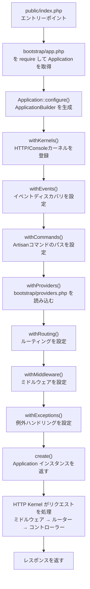

## Laravel 10以前との比較

Laravel 11では「Slim Application Skeleton」として、アプリケーション構造が大幅に刷新されました。最大の変化は、設定の分散をなくし `bootstrap/app.php` 一か所に集約したことです。

| 項目 | Laravel 10以前 | Laravel 11以降 |
|---|---|---|
| HTTPカーネル | `app/Http/Kernel.php` | 廃止（フレームワーク内に統合） |
| コンソールカーネル | `app/Console/Kernel.php` | 廃止（`routes/console.php` に移行） |
| 例外ハンドラー | `app/Exceptions/Handler.php` | 廃止（`bootstrap/app.php` に集約） |
| サービスプロバイダー | 5ファイル | `AppServiceProvider.php` 1ファイル |
| ルートファイル | `web.php` / `api.php` がデフォルト | `web.php` のみデフォルト、`api.php` はオプトイン |
| ブートストラップ | 設定が複数ファイルに分散 | `bootstrap/app.php` に集約 |
| デフォルトDB | MySQL/PostgreSQL | SQLite |

<Info>
  この変更は**新規プロジェクト向け**です。既存の Laravel 10 アプリケーションをアップグレードしても、古い構造はそのまま動作します。
</Info>

## 新しいディレクトリ・ファイル構成

### スケルトンのディレクトリ構成

```
laravel-app/
├── app/
│   ├── Http/
│   │   └── Controllers/
│   ├── Models/
│   │   └── User.php
│   └── Providers/
│       └── AppServiceProvider.php
├── bootstrap/
│   ├── app.php          ← アプリケーション設定の中心
│   ├── cache/
│   └── providers.php    ← サービスプロバイダー一覧
├── config/
├── database/
├── public/
│   └── index.php        ← エントリーポイント
├── resources/
├── routes/
│   ├── web.php          ← Webルート（デフォルト）
│   └── console.php      ← Artisanコマンドとスケジュール
├── storage/
└── tests/
```

### `bootstrap/app.php` — アプリ設定の中心

```php
<?php

use Illuminate\Foundation\Application;
use Illuminate\Foundation\Configuration\Exceptions;
use Illuminate\Foundation\Configuration\Middleware;

return Application::configure(basePath: dirname(__DIR__))
    ->withRouting(
        web: __DIR__.'/../routes/web.php',
        commands: __DIR__.'/../routes/console.php',
        health: '/up',
    )
    ->withMiddleware(function (Middleware $middleware): void {
        //
    })
    ->withExceptions(function (Exceptions $exceptions): void {
        //
    })->create();
```

このファイル1つで、ルーティング・ミドルウェア・例外ハンドリングを設定できます。Laravel 10 以前では `app/Http/Kernel.php`・`app/Console/Kernel.php`・`app/Exceptions/Handler.php` の3ファイルに分散していた設定が、ここに集約されています。

### `bootstrap/providers.php` — サービスプロバイダー一覧

```php
<?php

use App\Providers\AppServiceProvider;

return [
    AppServiceProvider::class,
];
```

このファイルはサービスプロバイダーの登録先です。Laravel 10 では `config/app.php` の `providers` 配列に記述していましたが、`bootstrap/providers.php` に分離されました。Laravel 11 のデフォルトでは `AppServiceProvider` のみです。

<Tip>
  `composer require` でパッケージをインストールすると、そのパッケージが `bootstrap/providers.php` を自動更新することがあります。`config/app.php` は参照されなくなったわけではありませんが、新規登録は `bootstrap/providers.php` が推奨場所になりました。
</Tip>

### `routes/` ディレクトリの変更

```
routes/
├── web.php      ← Webルート（デフォルトで読み込まれる）
└── console.php  ← Artisanコマンドとスケジュールを定義する
```

`api.php` と `channels.php` はデフォルトでは存在しません。必要に応じて Artisan コマンドで生成します。

```shell
# APIルートを追加する（api.php + Sanctumをインストール）
php artisan install:api

# ブロードキャストを追加する（channels.php + Reverb などをインストール）
php artisan install:broadcasting
```

`routes/console.php` ではスケジュールも定義できます。

```php
<?php

use Illuminate\Foundation\Inspiring;
use Illuminate\Support\Facades\Artisan;
use Illuminate\Support\Facades\Schedule;

Artisan::command('inspire', function () {
    $this->comment(Inspiring::quote());
})->purpose('Display an inspiring quote');

Schedule::command('emails:send')->daily();
```

### 廃止されたファイル

<AccordionGroup>
  <Accordion title="app/Http/Kernel.php の廃止">
    HTTP カーネルはフレームワーク内の `Illuminate\Foundation\Http\Kernel` に統合されました。ミドルウェアのカスタマイズは `bootstrap/app.php` の `withMiddleware()` で行います。

    ```php
    // Laravel 10 以前: app/Http/Kernel.php
    protected $middleware = [
        \Illuminate\Http\Middleware\TrustProxies::class,
        // ...
    ];

    protected $middlewareGroups = [
        'web' => [
            \App\Http\Middleware\EncryptCookies::class,
            // ...
        ],
    ];
    ```

    ```php
    // Laravel 11 以降: bootstrap/app.php
    ->withMiddleware(function (Middleware $middleware) {
        $middleware->web(append: [
            EnsureUserIsSubscribed::class,
        ]);

        $middleware->validateCsrfTokens(except: ['stripe/*']);
    })
    ```
  </Accordion>

  <Accordion title="app/Console/Kernel.php の廃止">
    コンソールカーネルの2つの役割が分離されました。Artisanコマンドは `app/Console/Commands/` に置き自動検出され、スケジュールは `routes/console.php` に記述します。

    ```php
    // Laravel 10 以前: app/Console/Kernel.php
    protected function schedule(Schedule $schedule): void
    {
        $schedule->command('emails:send')->daily();
    }
    ```

    ```php
    // Laravel 11 以降: routes/console.php
    use Illuminate\Support\Facades\Schedule;

    Schedule::command('emails:send')->daily();
    ```
  </Accordion>

  <Accordion title="app/Exceptions/Handler.php の廃止">
    例外ハンドラーはフレームワーク内の `Illuminate\Foundation\Exceptions\Handler` に統合されました。カスタマイズは `bootstrap/app.php` の `withExceptions()` で行います。

    ```php
    // Laravel 10 以前: app/Exceptions/Handler.php
    public function register(): void
    {
        $this->reportable(function (InvalidOrderException $e) {
            // ...
        });
    }
    ```

    ```php
    // Laravel 11 以降: bootstrap/app.php
    ->withExceptions(function (Exceptions $exceptions) {
        $exceptions->report(function (InvalidOrderException $e) {
            // ...
        });
    })
    ```
  </Accordion>
</AccordionGroup>

## `Application::configure()` の仕組み

### フレームワーク内部での実装

`Application::configure()` は `Illuminate\Foundation\Application` の静的メソッドです。

```php
// Illuminate\Foundation\Application より
public static function configure(?string $basePath = null)
{
    $basePath = match (true) {
        is_string($basePath) => $basePath,
        default => static::inferBasePath(),
    };

    return (new Configuration\ApplicationBuilder(new static($basePath)))
        ->withKernels()
        ->withEvents()
        ->withCommands()
        ->withProviders();
}
```

このメソッドは次の処理を行います。

1. `basePath` からアプリケーションのルートディレクトリを決定する
2. `Application` インスタンスを生成する
3. `ApplicationBuilder` でラップし、デフォルトの設定を適用する
4. `ApplicationBuilder` インスタンスを返す

重要なのは、`configure()` 内で **すでに `withKernels()` / `withEvents()` / `withCommands()` / `withProviders()` が呼ばれている** 点です。`bootstrap/app.php` でこれらを改めて呼ぶ必要はありません。

### メソッドチェーンで設定を行う流れ

```php
Application::configure(basePath: dirname(__DIR__))  // ApplicationBuilder を返す
    ->withRouting(...)       // ルーティングを設定し $this を返す
    ->withMiddleware(...)    // ミドルウェアを設定し $this を返す
    ->withExceptions(...)    // 例外ハンドリングを設定し $this を返す
    ->create();              // Application インスタンスを返す
```

`create()` の呼び出しで `ApplicationBuilder` から `Application` インスタンスが取り出され、`bootstrap/app.php` が `return` するのはこの `Application` インスタンスです。

## リクエストからアプリ起動までの流れ



`public/index.php` がエントリーポイントとなり、`bootstrap/app.php` を読み込んで `Application` を取得します。その後、HTTP Kernel がリクエストをミドルウェアのパイプラインに通し、ルーターがコントローラーにディスパッチします。

## `ApplicationBuilder` の主要メソッド深掘り

### `withRouting()` — ルーティング登録の内部処理

```php
public function withRouting(
    ?Closure $using = null,
    array|string|null $web = null,
    array|string|null $api = null,
    ?string $commands = null,
    ?string $channels = null,
    ?string $pages = null,
    ?string $health = null,
    string $apiPrefix = 'api',
    ?callable $then = null
)
```

内部では `AppRouteServiceProvider::loadRoutesUsing()` にコールバックを登録し、アプリケーションの booting 時に `AppRouteServiceProvider` を登録します。

```php
// withRouting() の内部処理（簡略版）
protected function buildRoutingCallback(...)
{
    return function () use ($web, $api, $pages, $health, $apiPrefix, $then) {
        if (is_string($api) || is_array($api)) {
            Route::middleware('api')->prefix($apiPrefix)->group($api);
        }

        if (is_string($health)) {
            Route::get($health, function () {
                Event::dispatch(new DiagnosingHealth);
                return response(View::file(...), status: 200);
            });
        }

        if (is_string($web) || is_array($web)) {
            Route::middleware('web')->group($web);
        }

        if (is_callable($then)) {
            $then($this->app);
        }
    };
}
```

**ポイント：**
- `api` ルートは `api` ミドルウェアグループと `/api` プレフィックスが自動的に適用される
- `health` に文字列を渡すとヘルスチェックエンドポイント（デフォルト `/up`）が自動登録される
- `health` のパスはメンテナンスモード中でも除外される（`PreventRequestsDuringMaintenance::except()` で設定）
- `web` より先に `api` が登録されることに注意。同じパスに対してWebとAPIのルートを定義すると、APIルートが優先される
- `pages` に文字列を渡すと [Laravel Folio](https://github.com/laravel/folio) のルーティングが有効になる

### `withMiddleware()` — ミドルウェアカスタマイズ

```php
public function withMiddleware(?callable $callback = null)
{
    $this->app->afterResolving(HttpKernel::class, function ($kernel) use ($callback) {
        $middleware = (new Middleware)
            ->redirectGuestsTo(fn () => route('login'));

        if (! is_null($callback)) {
            $callback($middleware);
        }

        $kernel->setGlobalMiddleware($middleware->getGlobalMiddleware());
        $kernel->setMiddlewareGroups($middleware->getMiddlewareGroups());
        $kernel->setMiddlewareAliases($middleware->getMiddlewareAliases());
        // ...
    });

    return $this;
}
```

`withMiddleware()` は `HttpKernel` が解決された**後**にコールバックを実行します。これは `afterResolving()` フックを使っているためです。コールバックに渡される `Middleware` オブジェクトには豊富なカスタマイズメソッドがあります。

```php
->withMiddleware(function (Middleware $middleware) {
    // グローバルミドルウェアを追加
    $middleware->append(MyGlobalMiddleware::class);

    // web グループにミドルウェアを追加
    $middleware->web(append: [EnsureUserIsSubscribed::class]);

    // api グループのミドルウェアを置き換え
    $middleware->api(replace: [
        OldMiddleware::class => NewMiddleware::class,
    ]);

    // CSRF 除外パスを設定
    $middleware->validateCsrfTokens(except: ['stripe/*', 'webhook/*']);

    // 未認証ユーザーのリダイレクト先を変更
    $middleware->redirectGuestsTo('/custom-login');

    // ミドルウェアの優先順位を設定
    $middleware->priority([
        \Illuminate\Session\Middleware\StartSession::class,
        \Illuminate\View\Middleware\ShareErrorsFromSession::class,
    ]);
})
```

### `withExceptions()` — 例外ハンドリングの設定

```php
public function withExceptions(?callable $using = null)
{
    $this->app->singleton(
        \Illuminate\Contracts\Debug\ExceptionHandler::class,
        \Illuminate\Foundation\Exceptions\Handler::class
    );

    if ($using !== null) {
        $this->app->afterResolving(
            \Illuminate\Foundation\Exceptions\Handler::class,
            fn ($handler) => $using(new Exceptions($handler)),
        );
    }

    return $this;
}
```

`withExceptions()` はフレームワークの `Handler` クラスをシングルトンとして登録した上で、コールバックを `afterResolving()` で設定します。コールバックには `Exceptions` ラッパーオブジェクトが渡されます。

```php
->withExceptions(function (Exceptions $exceptions) {
    // 特定の例外をレポートしない
    $exceptions->dontReport(MissedFlightException::class);

    // 特定の例外をカスタムレポート
    $exceptions->report(function (InvalidOrderException $e) {
        // Slack に通知など
    });

    // 特定の例外のHTTPレスポンスをカスタマイズ
    $exceptions->render(function (NotFoundHttpException $e, Request $request) {
        if ($request->is('api/*')) {
            return response()->json(['message' => 'Not Found'], 404);
        }
    });

    // スロットリング（同じ例外を連続でレポートしない）
    $exceptions->throttle(function (Throwable $e) {
        return Limit::perMinute(20);
    });
})
```

### `withProviders()` — サービスプロバイダー登録

```php
public function withProviders(array $providers = [], bool $withBootstrapProviders = true)
{
    RegisterProviders::merge(
        $providers,
        $withBootstrapProviders
            ? $this->app->getBootstrapProvidersPath()
            : null
    );

    return $this;
}
```

`withProviders()` は `Application::configure()` 内でデフォルト呼び出されるため、`bootstrap/providers.php` は自動的に読み込まれます。追加のプロバイダーを渡したい場合は `bootstrap/app.php` で明示的に呼ぶ必要があります。

```php
Application::configure(basePath: dirname(__DIR__))
    ->withProviders([
        // デフォルトのbootstrap/providers.phpに加えてプロバイダーを追加する
        App\Providers\CustomServiceProvider::class,
    ])
    ->withRouting(...)
    ->create();
```

<Warning>
  `withBootstrapProviders: false` を渡すと `bootstrap/providers.php` が読み込まれなくなります。特別な理由がない限り省略してください。
</Warning>

### その他の主要メソッド

| メソッド | 説明 |
|---|---|
| `withKernels()` | HTTP / Console カーネルをシングルトン登録する。`configure()` が自動呼び出し |
| `withEvents()` | イベントディスカバリを有効化する。`configure()` が自動呼び出し |
| `withCommands(array $commands)` | Artisan コマンドクラスまたはディレクトリを追加登録する |
| `withSchedule(callable $callback)` | スケジュールを `bootstrap/app.php` で定義する |
| `withBroadcasting(string $channels)` | ブロードキャストチャンネルファイルを登録する |
| `withBindings(array $bindings)` | コンテナバインディングを登録する |
| `withSingletons(array $singletons)` | シングルトンバインディングを登録する |
| `registered(callable $callback)` | サービスプロバイダー登録後に実行されるコールバックを追加する |
| `booting(callable $callback)` | booting 時に実行されるコールバックを追加する |
| `booted(callable $callback)` | booted 時に実行されるコールバックを追加する |
| `create()` | `Application` インスタンスを返す |

## 設計意図：なぜこうなっているか

### 「コードファースト」の設定

Laravel 10 以前の `app/Http/Kernel.php` には配列でミドルウェアを列挙するスタイルが使われていました。これは設定ファイルに近い書き方で、PHPの型システムや IDE のサポートが得られにくいという欠点がありました。

Laravel 11 では `withMiddleware(function (Middleware $middleware) { ... })` というコールバックスタイルに変わりました。これにより型補完が効き、条件分岐やループなどのロジックを使った動的な設定が自然に書けます。

### 「規約より設定」から「明示的な設定」へ

`api.php` をオプトインにしたのは、APIルートを使わないアプリケーションでも `api` ミドルウェアグループが常にロードされていたのを解消するためです。使わない機能はデフォルトで存在しない、という方針です。

### `afterResolving()` フックの活用

`withMiddleware()` や `withExceptions()` で `afterResolving()` を使っているのは、設定の順序問題を避けるためです。`ApplicationBuilder` のメソッドはアプリケーションが完全に起動する前に呼ばれますが、実際の処理（カーネルへの設定適用）はカーネルが最初に解決されたときに遅延実行されます。

## カスタマイズの実践例

### APIとWebを共存させる

```php
return Application::configure(basePath: dirname(__DIR__))
    ->withRouting(
        web: __DIR__.'/../routes/web.php',
        api: __DIR__.'/../routes/api.php',
        commands: __DIR__.'/../routes/console.php',
        health: '/up',
        apiPrefix: 'api/v1',  // デフォルトの /api から変更
    )
    ->withMiddleware(function (Middleware $middleware): void {
        //
    })
    ->withExceptions(function (Exceptions $exceptions): void {
        //
    })->create();
```

### ミドルウェアのカスタマイズ

```php
->withMiddleware(function (Middleware $middleware) {
    // Webルートに認証チェックミドルウェアを追加
    $middleware->web(append: [
        \App\Http\Middleware\EnsureEmailIsVerified::class,
    ]);

    // APIルートで特定のミドルウェアを除外
    $middleware->api(remove: [
        \Illuminate\Session\Middleware\StartSession::class,
    ]);

    // Webhook エンドポイントを CSRF から除外
    $middleware->validateCsrfTokens(except: [
        'webhook/*',
        'stripe/webhook',
    ]);

    // 特定のミドルウェアにエイリアスを設定
    $middleware->alias([
        'subscribed' => \App\Http\Middleware\EnsureUserIsSubscribed::class,
    ]);
})
```

### スケジュールを `bootstrap/app.php` に集約する

スケジュールは `routes/console.php` に書くこともできますが、`withSchedule()` を使うと `bootstrap/app.php` にまとめられます。

```php
use Illuminate\Console\Scheduling\Schedule;

return Application::configure(basePath: dirname(__DIR__))
    ->withRouting(
        web: __DIR__.'/../routes/web.php',
        commands: __DIR__.'/../routes/console.php',
        health: '/up',
    )
    ->withSchedule(function (Schedule $schedule) {
        $schedule->command('emails:send')->daily();
        $schedule->command('reports:generate')->weeklyOn(1, '8:00');
        $schedule->job(new PruneOldRecords)->daily();
    })
    ->withMiddleware(function (Middleware $middleware): void {
        //
    })
    ->withExceptions(function (Exceptions $exceptions): void {
        //
    })->create();
```

### 例外ハンドリングのカスタマイズ

```php
->withExceptions(function (Exceptions $exceptions) {
    // APIリクエストには常にJSONで返す
    $exceptions->render(function (Throwable $e, Request $request) {
        if ($request->is('api/*') || $request->wantsJson()) {
            $status = match (true) {
                $e instanceof NotFoundHttpException => 404,
                $e instanceof AuthenticationException => 401,
                $e instanceof AuthorizationException => 403,
                $e instanceof ValidationException => 422,
                default => 500,
            };

            return response()->json([
                'message' => $e->getMessage(),
            ], $status);
        }
    });

    // 本番環境のみSlackに通知
    if (app()->isProduction()) {
        $exceptions->report(function (Throwable $e) {
            app(SlackNotifier::class)->notify($e);
        })->stop();
    }
})
```

### コンテナバインディングを `bootstrap/app.php` で管理する

小規模なアプリケーションであれば、シンプルなバインディングを `AppServiceProvider` ではなく `bootstrap/app.php` に書くこともできます。

```php
return Application::configure(basePath: dirname(__DIR__))
    ->withRouting(...)
    ->withSingletons([
        \App\Contracts\PaymentGateway::class => \App\Services\StripeGateway::class,
        \App\Contracts\MailService::class => \App\Services\SendgridMailService::class,
    ])
    ->withMiddleware(...)
    ->withExceptions(...)
    ->create();
```

## 次のステップ

<Card title="サービスコンテナ" icon="box" href="/jp/service-container">
  `ApplicationBuilder` が内部で使っているサービスコンテナの仕組みを理解します。
</Card>
