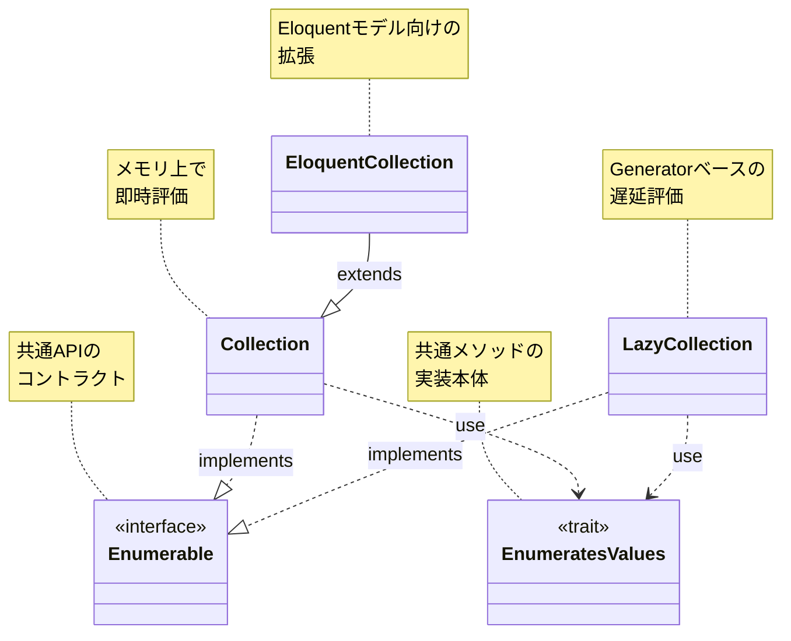

## このページの目的

このページは、`collect()` の使い方ではなく、Laravel本体の実装コードを読むための地図を提供します。

対象は、`Collection` のメソッド一覧はすでに知っていて、次に「なぜこの設計なのか」を理解したい人です。

## 歴史的変遷

Collectionの構造は、`LazyCollection` 導入時に大きく整理されました。

### Laravel 5.8 まで

- `Illuminate\Support\Collection`
- `Illuminate\Database\Eloquent\Collection`（`Collection` を継承）

この時点では `LazyCollection`・`Enumerable`・`EnumeratesValues` は存在しません。

- [5.8 の Collection.php](https://github.com/laravel/framework/blob/5.8/src/Illuminate/Support/Collection.php)
- [5.8 の Eloquent Collection.php](https://github.com/laravel/framework/blob/5.8/src/Illuminate/Database/Eloquent/Collection.php)

### Laravel 6.0 での変更

`LazyCollection` の追加に合わせて、共通APIを `Enumerable`（インターフェース）と `EnumeratesValues`（トレイト）へ分離する構造になりました。

- [6.x の LazyCollection.php](https://github.com/laravel/framework/blob/6.x/src/Illuminate/Support/LazyCollection.php)
- [6.x の Enumerable.php](https://github.com/laravel/framework/blob/6.x/src/Illuminate/Support/Enumerable.php)
- [6.x の EnumeratesValues.php](https://github.com/laravel/framework/blob/6.x/src/Illuminate/Support/Traits/EnumeratesValues.php)

## 現在の全体構造（Laravel 13）

> 参照: [laravel/framework v13.x](https://github.com/laravel/framework/tree/13.x/src/Illuminate)



- [Collection.php](https://github.com/laravel/framework/blob/13.x/src/Illuminate/Collections/Collection.php)
- [LazyCollection.php](https://github.com/laravel/framework/blob/13.x/src/Illuminate/Collections/LazyCollection.php)
- [EnumeratesValues.php](https://github.com/laravel/framework/blob/13.x/src/Illuminate/Collections/Traits/EnumeratesValues.php)
- [Enumerable.php](https://github.com/laravel/framework/blob/13.x/src/Illuminate/Collections/Enumerable.php)
- [Eloquent Collection.php](https://github.com/laravel/framework/blob/13.x/src/Illuminate/Database/Eloquent/Collection.php)

<Info>
  現在の実ファイルパスは `src/Illuminate/Collections/*` ですが、名前空間は `Illuminate\\Support` のまま維持されています。コードを読むときは「パス」と「namespace」を分けて確認してください。
</Info>

## PHPDoc と PHPStan スタイルの Generics

PHP本体にはGenericsがありません。
それでもCollection周辺では、PHPDocで強い型情報を表現しています。

主な目的は2つです。

- IDE補完を正確にする
- PHPStan / Larastan などの静的解析精度を上げる

### よく出る記法

```php
/**
 * @template TKey of array-key
 * @template-covariant TValue
 * @implements \Illuminate\Support\Enumerable<TKey, TValue>
 */
class Collection implements Enumerable
{
    /**
     * @use \Illuminate\Support\Traits\EnumeratesValues<TKey, TValue>
     */
    use EnumeratesValues;
}
```

| 記法 | 意味 |
|---|---|
| `@template TKey of array-key` | キー型を `int\|string` に制約 |
| `@template-covariant TValue` | 値型を共変として扱う（より具体的な型へ安全に置換しやすい） |
| `@implements ...<TKey, TValue>` | 実装しているインターフェースへ型引数を渡す |
| `@extends ...<TKey, TModel>` | 親クラス継承時の型引数を宣言 |
| `@use ...<TKey, TValue>` | トレイト適用時の型引数を宣言 |

### Eloquent Collectionでの見え方

```php
/**
 * @template TKey of array-key
 * @template TModel of \Illuminate\Database\Eloquent\Model
 * @extends \Illuminate\Support\Collection<TKey, TModel>
 */
class Collection extends BaseCollection
{
}
```

`TValue` が `TModel` に具体化されるので、`map()`・`filter()` などの型推論がEloquentモデル寄りに強化されます。

## 実装を読むときの順番

### 1. 入口として `Enumerable` を読む

まずは「何を提供する契約か」を掴みます。
ここでメソッド一覧を把握すると、後続の実装読みが速くなります。

### 2. `EnumeratesValues` で共通メソッドを追う

`map`・`filter`・`reduce` など、共通ロジックの多くはここにあります。
`Collection` と `LazyCollection` の差分だけを後で見ると、読み飛ばしが減ります。

### 3. `Collection` と `LazyCollection` の差分を見る

- `Collection`: 配列を保持して即時評価
- `LazyCollection`: `Generator` を使って遅延評価

同名メソッドでも、評価タイミングやメモリ特性が違います。

### 4. 最後に `Eloquent\Collection` を読む

`find`・`load`・`modelKeys` など、モデル集合向けの拡張に集中します。
基底の `Collection` を理解してから読むと意図が見えやすくなります。

<Tip>
  1メソッドを深掘りするときは、`Enumerable` の宣言 → `EnumeratesValues` の本体 → `Collection` / `LazyCollection` のオーバーライド有無、の順で追うと迷いません。
</Tip>

## 関連ページ

- [コレクション](/jp/collections)
- [コレクションの高階メッセージ](/jp/advanced/higher-order-messages)
- [Macroableトレイト](/jp/advanced/macroable)
