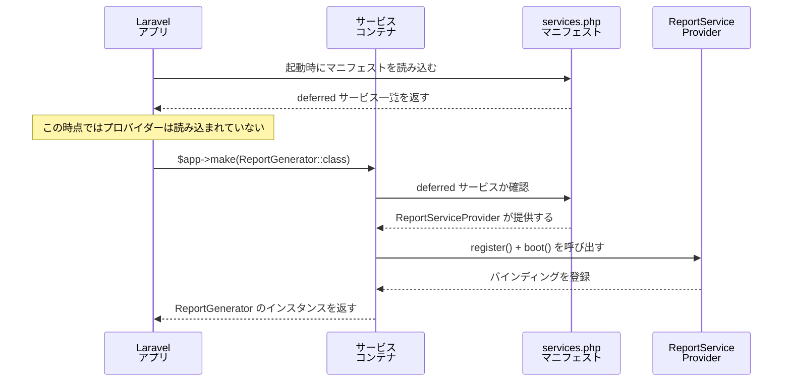

Laravelの起動時に登録されるサービスプロバイダーは、たとえその機能をリクエスト中に一度も使わなくても毎回読み込まれます。遅延サービスプロバイダー（Deferred Service Provider）はこの問題を解決し、サービスが実際に使われるまで読み込みを後回しにできます。

<Info>
  このページは[パッケージ開発の基礎](/jp/advanced/package-development)の知識を前提としています。サービスプロバイダーの基本的な仕組みを理解してから読むことをおすすめします。
</Info>

## なぜ遅延プロバイダーが必要か

通常のサービスプロバイダーはすべてのリクエストで `register()` と `boot()` が呼ばれます。メール送信、キュー、キャッシュなど、すべてのページで使わない機能まで毎回初期化するのは無駄です。

```php
// このプロバイダーはすべてのリクエストで register() が呼ばれる
class ReportServiceProvider extends ServiceProvider
{
    public function register(): void
    {
        // 重いレポートサービスを毎回バインドする
        $this->app->singleton(ReportGenerator::class, function ($app) {
            return new ReportGenerator(
                $app->make(PdfRenderer::class),
                $app->make(ChartRenderer::class),
                $app->make(DataExporter::class),
            );
        });
    }
}
```

このプロバイダーを遅延化すると、レポートを実際に生成するリクエストでのみ初期化されます。

---

## DeferrableProvider インターフェース

`Illuminate\Contracts\Support\DeferrableProvider` は `provides()` メソッドひとつを持つシンプルなインターフェースです。

```php
namespace Illuminate\Contracts\Support;

interface DeferrableProvider
{
    public function provides();
}
```

このインターフェースを実装するだけで、プロバイダーは遅延モードになります。

---

## 基本的な実装

遅延プロバイダーの実装は3ステップです。

<Steps>
  <Step title="DeferrableProvider を implements する">
    ```php
    use Illuminate\Contracts\Support\DeferrableProvider;
    use Illuminate\Support\ServiceProvider;

    class ReportServiceProvider extends ServiceProvider implements DeferrableProvider
    {
        // ...
    }
    ```
  </Step>

  <Step title="register() でサービスをバインドする">
    通常のプロバイダーと同様に `register()` にバインドを記述します。

    ```php
    public function register(): void
    {
        $this->app->singleton(ReportGenerator::class, function ($app) {
            return new ReportGenerator(
                $app->make(PdfRenderer::class),
                $app->make(ChartRenderer::class),
                $app->make(DataExporter::class),
            );
        });

        $this->app->singleton(ReportRepository::class, function ($app) {
            return new ReportRepository($app->make('db'));
        });
    }
    ```
  </Step>

  <Step title="provides() で登録したサービスを返す">
    `provides()` は `register()` でバインドした**すべてのサービス**を返す必要があります。Laravelはこのリストを元に「どのサービスを要求したときにこのプロバイダーを読み込むか」を判断します。

    ```php
    public function provides(): array
    {
        return [
            ReportGenerator::class,
            ReportRepository::class,
        ];
    }
    ```
  </Step>
</Steps>

---

## サービスマニフェストの仕組み

Laravel は起動時に `bootstrap/cache/services.php` というマニフェストファイルを生成します。このファイルに遅延プロバイダーが提供するサービスの一覧が保存されています。

```php
// bootstrap/cache/services.php の例（自動生成）
return [
    'providers' => [
        // bootstrap/providers.php と同じリスト
    ],
    'eager' => [
        // 即時読み込みのプロバイダー
        App\Providers\AppServiceProvider::class,
    ],
    'deferred' => [
        // サービス名 => プロバイダークラス のマッピング
        'App\Services\ReportGenerator' => ReportServiceProvider::class,
        'App\Repositories\ReportRepository' => ReportServiceProvider::class,
        'cache'     => Illuminate\Cache\CacheServiceProvider::class,
        'cache.store' => Illuminate\Cache\CacheServiceProvider::class,
        'queue'     => Illuminate\Queue\QueueServiceProvider::class,
    ],
    'when' => [],
];
```

このマニフェストにより、Laravelはファイルを読み込まずに「このサービスはどのプロバイダーが提供するか」を把握できます。実際のプロバイダーは対象サービスが初めて解決されたときだけ読み込まれます。

<Tip>
  プロバイダーを追加・変更した場合はマニフェストを再生成してください。
  ```shell
  php artisan optimize:clear
  # または
  php artisan clear-compiled
  ```
</Tip>

### 内部動作のフロー



---

## provides() メソッドの重要性

`provides()` に**登録漏れ**があると、そのサービスは永遠に解決されません。

```php
public function register(): void
{
    $this->app->singleton(ReportGenerator::class, fn ($app) => new ReportGenerator());

    // 追加したバインディング
    $this->app->singleton('report', fn ($app) => $app->make(ReportGenerator::class));
}

public function provides(): array
{
    return [
        ReportGenerator::class,
        'report',  // ← 文字列キーでバインドした場合も忘れずに記載する
    ];
}
```

`$bindings` / `$singletons` プロパティを使っている場合も同様に `provides()` に含めます。

```php
class AnalyticsServiceProvider extends ServiceProvider implements DeferrableProvider
{
    public $singletons = [
        AnalyticsClient::class => DefaultAnalyticsClient::class,
    ];

    public function provides(): array
    {
        // $singletons に列挙したキーをすべて返す
        return [
            AnalyticsClient::class,
        ];
    }
}
```

---

## 遅延プロバイダーの制約

遅延プロバイダーは**コンテナへのバインディング登録だけ**を目的としたプロバイダーに向いています。以下のようなことを `boot()` で行うプロバイダーは遅延にできません。

| 制約 | 理由 |
|------|------|
| ルート登録 | ルートはアプリ起動時に解決されるため、遅延では機能しない |
| グローバルミドルウェア登録 | リクエスト処理前に登録が必要 |
| イベントリスナー登録（常時必要なもの） | イベントが発火するより前に登録されていないと機能しない |
| Blade ディレクティブの追加 | ビューのコンパイル前に登録が必要 |

<Warning>
  遅延プロバイダーに `boot()` メソッドを書くことは可能ですが、その内容はサービスが解決されるまで実行されません。ルートやミドルウェアのような「常に必要な処理」を `boot()` に書くと、予期しない動作になります。
</Warning>

---

## when() メソッド — イベントトリガーによる登録

`when()` メソッドを使うと、特定のイベントが発火したときにプロバイダーを登録できます。これは、ジョブ処理系など特定のコンテキストでのみ必要なプロバイダーに使えます。

```php
class ReportServiceProvider extends ServiceProvider implements DeferrableProvider
{
    public function register(): void
    {
        $this->app->singleton(ReportGenerator::class, fn () => new ReportGenerator());
    }

    public function provides(): array
    {
        return [ReportGenerator::class];
    }

    /**
     * サービスのバインディング解決ではなく、
     * 指定したイベントが発火したときにもプロバイダーを読み込む。
     */
    public function when(): array
    {
        return [
            \App\Events\ReportRequested::class,
        ];
    }
}
```

`when()` に返したイベントが発火すると、サービスが直接解決されていなくてもプロバイダーが読み込まれます。

---

## パッケージ開発での活用

サードパーティパッケージとして配布するときも、遅延プロバイダーはユーザーのアプリケーションのパフォーマンスに貢献します。

### 推奨パターン

```php
namespace Acme\Analytics;

use Illuminate\Contracts\Support\DeferrableProvider;
use Illuminate\Support\ServiceProvider;

class AnalyticsServiceProvider extends ServiceProvider implements DeferrableProvider
{
    public function register(): void
    {
        $this->mergeConfigFrom(__DIR__.'/../config/analytics.php', 'analytics');

        $this->app->singleton(AnalyticsManager::class, function ($app) {
            return new AnalyticsManager($app->make('config')->get('analytics'));
        });

        $this->app->singleton('analytics', fn ($app) => $app->make(AnalyticsManager::class));
    }

    public function boot(): void
    {
        // boot() を使うのはパブリッシュの登録だけにする
        if ($this->app->runningInConsole()) {
            $this->publishes([
                __DIR__.'/../config/analytics.php' => config_path('analytics.php'),
            ], 'analytics-config');
        }
    }

    public function provides(): array
    {
        return [
            AnalyticsManager::class,
            'analytics',
        ];
    }
}
```

<Info>
  `mergeConfigFrom()` は設定のキャッシュ有無を内部でチェックしているため、遅延プロバイダーの `register()` の中で呼んでも安全です。ただし設定がキャッシュ済みの場合は何もしません。
</Info>

### `runningInConsole()` で Artisan コマンド登録を分離する

コマンド登録は Artisan 起動時のみ必要なので、`runningInConsole()` で条件分岐します。ただしコマンドを提供するプロバイダーを遅延にする場合は、コマンドクラスも `provides()` に含めるか、コマンド専用のプロバイダーを別に用意してください。

```php
public function boot(): void
{
    if ($this->app->runningInConsole()) {
        $this->commands([
            AnalyticsFlushCommand::class,
        ]);
    }
}
```

---

## Laravel コアでの使用例

Laravelのコアプロバイダーの多くは遅延プロバイダーです。毎リクエストで使わないサービスをすべて即時読み込みしないための設計です。

| プロバイダー | 提供するサービス |
|-------------|----------------|
| `CacheServiceProvider` | `cache`, `cache.store`, `RateLimiter` |
| `QueueServiceProvider` | `queue`, `queue.worker`, `queue.failer` |
| `MailServiceProvider` | `mail.manager`, `mailer` |
| `RedisServiceProvider` | `redis`, `redis.connection` |
| `HashServiceProvider` | `hash`, `hash.driver` |
| `ValidationServiceProvider` | `validator`, `validation.presence` |
| `TranslationServiceProvider` | `translator` |
| `BroadcastServiceProvider` | `Broadcast` |

API エンドポイントのみのアプリケーションでは、`MailServiceProvider` や `BroadcastServiceProvider` がリクエスト中に一度も読み込まれないこともあります。

---

## 遅延化すべきかの判断基準

<AccordionGroup>
  <Accordion title="遅延化に向いているサービス">
    - すべてのリクエストで使われるわけではないサービス（メール、レポート、外部 API クライアントなど）
    - 初期化に外部接続やファイル読み込みが必要なサービス
    - 重いオブジェクトグラフを持つサービス
    - CLI でのみ使うコマンドを提供するプロバイダー
  </Accordion>

  <Accordion title="遅延化に向いていないサービス">
    - ルートを登録するプロバイダー（`loadRoutesFrom` など）
    - 常時機能するミドルウェアや例外ハンドラーを登録するプロバイダー
    - Eloquent のグローバルスコープやオブザーバーを登録するプロバイダー
    - リクエストの大半で使われる軽量なサービス（遅延のオーバーヘッドの方が大きくなる場合）
  </Accordion>
</AccordionGroup>

---

## 関連ページ

<Columns cols={2}>
  <Card title="パッケージ開発の基礎" icon="box" href="/jp/advanced/package-development">
    サービスプロバイダーを核としたLaravelパッケージの開発方法を解説します。
  </Card>
  <Card title="パッケージのバージョン互換性管理" icon="layers" href="/jp/advanced/package-versioning">
    LaravelとPHPのメジャーバージョンアップに対応するパッケージのメンテナンス戦略を解説します。
  </Card>
</Columns>
