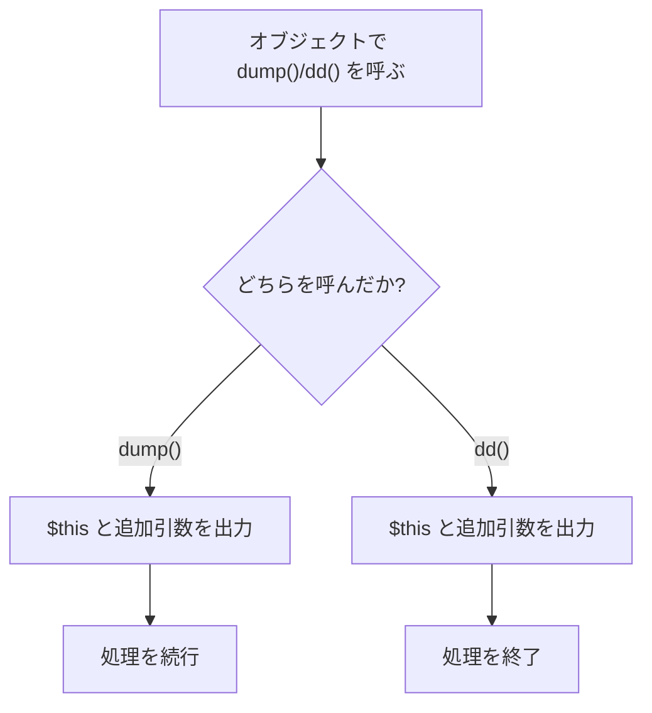

## Dumpableトレイトとは

`Illuminate\Support\Traits\Dumpable` は、任意のクラスに `dump()` と `dd()` を追加するための小さなトレイトです。Laravel 10で導入され、Collection・Eloquent Builder・Request などLaravelコアのデバッグ体験を統一するために広く使われています。

目的はシンプルです。オブジェクトを `var_dump` 相当で確認しながら、必要ならその場で処理を止めることです。



## 実装を確認する

実装はとてもシンプルで、`dump($this, ...$args)` と `dd($this, ...$args)` を呼び出しているだけです。

```php
trait Dumpable
{
    public function dump(...$args): static
    {
        dump($this, ...$args);
        return $this;
    }

    public function dd(...$args): never
    {
        dd($this, ...$args);
    }
}
```

<Info>
  Laravel 13 の実装は `src/Illuminate/Support/Traits/Dumpable.php` にあります。実際のシグネチャはPHPDocで `@return $this` と `@return never` を表現しています。
</Info>

## 自分のクラスで使う

`use Dumpable;` を追加するだけで、インスタンスメソッドとして `dump()` / `dd()` が使えます。

```php
use Illuminate\Support\Traits\Dumpable;

class UserData
{
    use Dumpable;
    
    public function __construct(
        public readonly string $name,
        public readonly string $email,
    ) {}
}

$user = new UserData('Taro', 'taro@example.com');

$user->dump(); // dumpして続行
$user->dd();   // dumpして終了
```

## チェーン中にデバッグを挟む

`dump()` は `static`（実装上は `$this`）を返すので、メソッドチェーンの途中で安全に使えます。

```php
$result = collect([1, 2, 3])
    ->map(fn ($n) => $n * 2)
    ->dump()  // ここで中身を確認
    ->filter(fn ($n) => $n > 2)
    ->values();
```

`dd()` に置き換えると、その地点で処理が止まるため、重い後続処理の前に状態を確認したいときに便利です。

## パッケージ開発での活用

独自の Value Object・DTO・Builder に `Dumpable` を入れておくと、利用者が追加ツールなしで状態確認できます。

<Steps>
  <Step title="Value Object / DTOに追加する">
    ```php
    use Illuminate\Support\Traits\Dumpable;

    final class InvoiceData
    {
        use Dumpable;

        public function __construct(
            public readonly string $number,
            public readonly int $total,
        ) {}
    }
    ```
  </Step>
  <Step title="Fluent Builderの途中で確認する">
    ```php
    $payload = (new PackageRequestBuilder)
        ->forUser($userId)
        ->withLocale('ja')
        ->dump('before send')
        ->toArray();
    ```
  </Step>
</Steps>

## 追加引数を渡す

`Dumpable` は内部で `dump($this, ...$args)` / `dd($this, ...$args)` を呼ぶため、文脈情報を一緒に出力できます。

```php
$user->dump('デバッグポイントA');
// $this と 'デバッグポイントA' が同時に出力される
```

これは複数箇所で `dump()` を使うときに有効です。どの地点で出力されたのかをすぐ判別できます。

## 関連トレイト

<Columns cols={3}>
  <Card title="tap() ヘルパー / Tappable" icon="hand-point-up" href="/jp/advanced/tap">
    副作用を挟みつつ値を返すパターンを学びます。
  </Card>
  <Card title="Conditionableトレイト" icon="git-branch" href="/jp/advanced/conditionable">
    条件付きでチェーン処理を分岐する設計を学びます。
  </Card>
  <Card title="Macroableトレイト" icon="puzzle-piece" href="/jp/advanced/macroable">
    既存クラスを拡張して独自メソッドを追加する方法を学びます。
  </Card>
</Columns>
