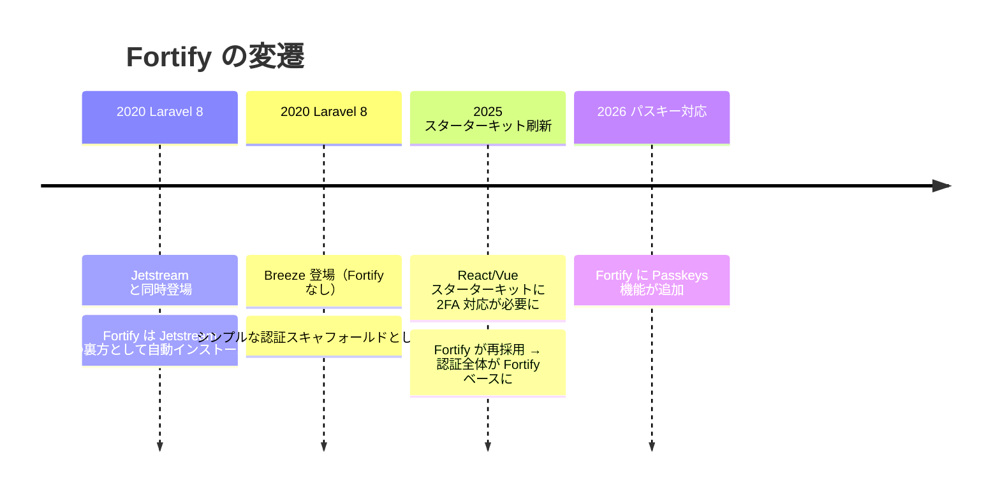

## Fortify とは

[Laravel Fortify](https://github.com/laravel/fortify) は、フロントエンドに依存しない認証バックエンド実装です。ログイン・登録・パスワードリセット・メール確認・2FA・パスキーに必要なルートとコントローラーをすべて提供します。

<Info>
  Fortify は UI を持ちません。スターターキットや独自の UI から Fortify のルートにリクエストを送ることで機能します。
</Info>

「フロントエンド非依存」という設計思想が重要です。Blade・Inertia（React/Vue/Svelte）・API など、どのフロントエンドスタックでも同じ認証バックエンドを再利用できます。これが Fortify が長く使われ続けている理由です。

## 歴史：Jetstream から現行スターターキットまで



### なぜ現行スターターキットでも Fortify が使われているのか

当初の React/Vue スターターキットは Fortify なしで実装されていました。しかし **二要素認証（2FA）への対応が必要になった際、Fortify がそのまま採用された**ことで、認証全体が Fortify ベースに切り替わりました。

Fortify は「フロントエンド非依存」として設計されているため、Inertia を使ったスターターキットとの相性が良く、現在も使われ続けています。

<Info>
  Fortify は現在、最も長く使われ続けている Laravel 公式認証パッケージです。Laravel 8 の 2020 年登場以来、Jetstream → 現行スターターキットと形を変えながら現役を続けています。
</Info>

## 現行スターターキットの構成

React/Vue スターターキットでは以下のファイルで Fortify が設定されています。

- `app/Providers/FortifyServiceProvider.php` — ビュー・アクション・レート制限の登録
- `config/fortify.php` — 有効にする機能と認証設定

### `config/fortify.php` の主要設定

```php
use Laravel\Fortify\Features;

return [
    'guard'    => 'web',
    'username' => 'email',
    'home'     => '/dashboard',

    'limiters' => [
        'login'      => 'login',
        'two-factor' => 'two-factor',
    ],

    'features' => [
        Features::registration(),
        Features::resetPasswords(),
        Features::emailVerification(),
        Features::twoFactorAuthentication([
            'confirm'         => true,
            'confirmPassword' => true,
        ]),
    ],
];
```

スターターキットではパスキー（`Features::passkeys()`）はデフォルトで有効になっていません。有効化するには `features` 配列に追加します。

## `FortifyServiceProvider` の設定

スターターキットの `FortifyServiceProvider` は 3 つの役割を担います。

### 1. アクションの設定

```php
private function configureActions(): void
{
    Fortify::resetUserPasswordsUsing(ResetUserPassword::class);
    Fortify::createUsersUsing(CreateNewUser::class);
}
```

`app/Actions/Fortify/` に配置されたクラスでユーザー作成とパスワードリセットのロジックをカスタマイズします。バリデーションやハッシュ処理はここに集約されています。

### 2. ビューの設定

```php
private function configureViews(): void
{
    Fortify::loginView(fn (Request $request) => Inertia::render('auth/login', [
        'canResetPassword' => Features::enabled(Features::resetPasswords()),
        'canRegister'      => Features::enabled(Features::registration()),
        'status'           => $request->session()->get('status'),
    ]));

    Fortify::resetPasswordView(fn (Request $request) => Inertia::render('auth/reset-password', [
        'email' => $request->email,
        'token' => $request->route('token'),
    ]));

    Fortify::requestPasswordResetLinkView(
        fn (Request $request) => Inertia::render('auth/forgot-password', [
            'status' => $request->session()->get('status'),
        ])
    );

    Fortify::verifyEmailView(
        fn (Request $request) => Inertia::render('auth/verify-email', [
            'status' => $request->session()->get('status'),
        ])
    );

    Fortify::registerView(fn () => Inertia::render('auth/register'));

    Fortify::twoFactorChallengeView(fn () => Inertia::render('auth/two-factor-challenge'));

    Fortify::confirmPasswordView(fn () => Inertia::render('auth/confirm-password'));
}
```

各ビューメソッドは Inertia コンポーネントを返すクロージャを受け取ります。`Features::enabled()` で機能フラグを確認してビューに渡しているのがポイントです。

<Info>
  Blade アプリでは `Inertia::render(...)` の代わりに `view('auth.login')` を返します。フロントエンドを変えても `FortifyServiceProvider` 側だけ修正すれば認証ロジックは変わりません。
</Info>

### 3. レート制限の設定

```php
private function configureRateLimiting(): void
{
    RateLimiter::for('two-factor', function (Request $request) {
        return Limit::perMinute(5)->by($request->session()->get('login.id'));
    });

    RateLimiter::for('login', function (Request $request) {
        $throttleKey = Str::transliterate(
            Str::lower($request->input(Fortify::username())) . '|' . $request->ip()
        );

        return Limit::perMinute(5)->by($throttleKey);
    });
}
```

- `login` リミッター: メールアドレスと IP アドレスの組み合わせで制限（ブルートフォース対策）
- `two-factor` リミッター: セッション内のログイン試行 ID で制限

`config/fortify.php` の `limiters` キーと一致するキーを `RateLimiter::for()` に登録します。

## 主な機能と登録されるルート

Fortify が登録する主なルートを機能別に整理します。

| 機能 | メソッド | ルート |
|---|---|---|
| ログイン | `GET` | `/login` |
| ログイン | `POST` | `/login` |
| ログアウト | `POST` | `/logout` |
| 登録 | `GET` | `/register` |
| 登録 | `POST` | `/register` |
| パスワードリセット要求 | `GET` / `POST` | `/forgot-password` |
| パスワードリセット | `GET` / `POST` | `/reset-password` |
| メール確認 | `GET` | `/email/verify` |
| メール確認リンク再送 | `POST` | `/email/verification-notification` |
| パスワード確認 | `GET` / `POST` | `/user/confirm-password` |
| 2FA 有効化 | `POST` | `/user/two-factor-authentication` |
| 2FA チャレンジ | `GET` / `POST` | `/two-factor-challenge` |
| パスキーログイン | `GET` / `POST` | `/passkeys/login` |
| パスキー管理 | `GET` / `POST` / `DELETE` | `/user/passkeys` |

`php artisan route:list --name=fortify` または単純に `php artisan route:list` で実際に登録されているルートを確認できます。

## 二要素認証（2FA）

スターターキットでは `Features::twoFactorAuthentication()` が有効化されています。`confirm` と `confirmPassword` はどちらも `true` に設定されています。

| オプション | 意味 |
|---|---|
| `confirm` | 有効化後に認証コードでの確認を要求する |
| `confirmPassword` | 2FA の設定変更前にパスワード確認を要求する |

2FA の設定画面から、ユーザーは以下の操作を行えます。

<Steps>
  <Step title="2FA を有効化する">
    `/user/two-factor-authentication` に POST リクエストを送信します。成功するとセッションに `two-factor-authentication-enabled` ステータスがセットされます。
  </Step>
  <Step title="QR コードを確認する">
    `/user/two-factor-qr-code` に GET リクエストを送ると、認証アプリに読み込む QR コードの SVG が返されます。
  </Step>
  <Step title="認証コードで確認する">
    `/user/confirmed-two-factor-authentication` に POST リクエストでコードを送信し、設定を完了します。
  </Step>
  <Step title="リカバリーコードを保存する">
    `/user/two-factor-recovery-codes` に GET リクエストを送り、リカバリーコードを取得して安全な場所に保存します。
  </Step>
</Steps>

## パスキー

パスキーは Fortify の機能として最近追加されました。WebAuthn を使ったパスワードレス認証で、Face ID・Touch ID・Windows Hello・ハードウェアセキュリティキーに対応しています。

### 有効化

`config/fortify.php` の `features` 配列に追加します。

```php
'features' => [
    Features::registration(),
    Features::resetPasswords(),
    Features::emailVerification(),
    Features::twoFactorAuthentication([
        'confirm'         => true,
        'confirmPassword' => true,
    ]),
    Features::passkeys([
        'confirmPassword' => true,
    ]),
],
```

次に、`User` モデルに `PasskeyUser` コントラクトと `PasskeyAuthenticatable` トレイトを追加します。

```php
use Illuminate\Foundation\Auth\User as Authenticatable;
use Laravel\Fortify\Contracts\PasskeyUser;
use Laravel\Fortify\PasskeyAuthenticatable;

class User extends Authenticatable implements PasskeyUser
{
    use PasskeyAuthenticatable;
}
```

WebAuthn 設定は `config/fortify.php` の `passkeys` キーで管理します。

```php
'passkeys' => [
    'relying_party_id'  => parse_url(config('app.url'), PHP_URL_HOST),
    'allowed_origins'   => [config('app.url')],
    'user_handle_secret' => config('app.key'),
    'timeout'           => 60000,
],
```

<Info>
  Fortify のパスキーは内部で `laravel/passkeys` Composer パッケージをラップしています。`laravel/passkeys` の設定ファイルを公開する必要はなく、`config/fortify.php` の `passkeys` キーが優先されます。
</Info>

パスキーの詳細な実装（`@laravel/passkeys` JS クライアント、React/Vue/Svelte ヘルパーなど）については、[パスキー初期調査](/jp/blog/passkeys-introduction)も参照してください。

## 関連ページ

<Card title="カスタム認証ガード" icon="shield" href="/jp/advanced/custom-auth-guard">
  Guard・StatefulGuard インターフェースを実装してカスタム認証ガードを作る方法を解説します。
</Card>

<Card title="公式ドキュメント: Laravel Fortify" icon="book-open" href="https://laravel.com/docs/fortify">
  インストール・全機能・カスタマイズの詳細は公式ドキュメントを参照してください。
</Card>
