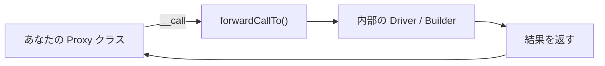

## ForwardsCallsトレイトとは

`Illuminate\Support\Traits\ForwardsCalls` は、あるオブジェクトへのメソッド委譲を共通化するトレイトです。Laravel本体では Eloquent や Mail などの「ラッパーオブジェクト」で使われています。

<Info>
  実装は `src/Illuminate/Support/Traits/ForwardsCalls.php` にあります。存在しないメソッドを転送したときは、呼び出し元クラス名を含む `BadMethodCallException` に整形して再スローします。
</Info>



## コアAPI

### `forwardCallTo($object, $method, $parameters)`

指定オブジェクトへメソッドをそのまま転送します。典型的には `__call()` から呼びます。

### `forwardDecoratedCallTo($object, $method, $parameters)`

Builder や Decorator でチェーンを維持したいときに使います。転送先メソッドの戻り値が「転送先オブジェクト自身」なら、「呼び出し元オブジェクト (`$this`)」に差し替えて返します。

### `__call()` / `__callStatic()` との組み合わせ

`ForwardsCalls` はマジックメソッドを提供しません。あなたのクラス側で `__call()`（必要なら `__callStatic()`）を実装し、その中で `forwardCallTo` 系メソッドを呼びます。

## 実際の使用例（Laravel内部）

<Steps>
  <Step title="Facadeは static proxy を提供する">
    `Illuminate\Support\Facades\Facade` は `__callStatic()` で root instance へ直接委譲します。Facade は static 呼び出しなので、`ForwardsCalls` ではなく直接転送する実装になっています。
  </Step>
  <Step title="Eloquent Builderは forwardCallTo を使う">
    `Illuminate\Database\Eloquent\Builder::__call()` は、未解決メソッドを内部 Query Builder へ `forwardCallTo($this->query, ...)` で渡し、最後に `$this` を返して fluent chain を維持します。
  </Step>
  <Step title="Relation / Mail / Eventは forwardDecoratedCallTo を使う">
    `Illuminate\Database\Eloquent\Relations\Relation`、`Illuminate\Mail\Message`、`Illuminate\Events\NullDispatcher` では `forwardDecoratedCallTo` が使われ、内部オブジェクトへ委譲しつつ外側APIのチェーンを保ちます。
  </Step>
</Steps>

## 基本的なプロキシ実装（`forwardCallTo`）

```php
use Illuminate\Support\Traits\ForwardsCalls;

class CourierProxy
{
    use ForwardsCalls;

    public function __construct(
        protected CourierDriver $driver
    ) {}

    public function __call(string $method, array $parameters): mixed
    {
        return $this->forwardCallTo($this->driver, $method, $parameters);
    }
}
```

この形なら、`CourierProxy` は `CourierDriver` の public API を透過的に公開できます。

## メソッドチェーン対応プロキシ（`forwardDecoratedCallTo`）

```php
use Illuminate\Database\Eloquent\Builder;
use Illuminate\Support\Traits\ForwardsCalls;

class QueryProxy
{
    use ForwardsCalls;

    public function __construct(
        protected Builder $query
    ) {}

    public function __call(string $method, array $parameters): static
    {
        $this->forwardDecoratedCallTo($this->query, $method, $parameters);

        return $this;
    }

    public function get(): \Illuminate\Support\Collection
    {
        return $this->query->get();
    }
}
```

```php
$users = (new QueryProxy(User::query()))
    ->where('active', true)
    ->orderByDesc('created_at')
    ->limit(10)
    ->get();
```

<Tip>
  手動で `return $this` を書くより、`forwardDecoratedCallTo` の「戻り値が転送先自身なら `$this` に置き換える」ルールを使うほうが安全です。
</Tip>

## BadMethodCallException の自動スロー

存在しないメソッドを呼ぶと、`ForwardsCalls` は呼び出し元クラス名を使って `BadMethodCallException` を投げ直します。

```php
try {
    (new CourierProxy($driver))->missingMethod();
} catch (\BadMethodCallException $e) {
    // 例: Call to undefined method App\Services\CourierProxy::missingMethod()
    report($e);
}
```

これにより、利用者は「どの外側APIで失敗したか」をすぐ特定できます。

## Macroableとの比較

| 観点 | `Macroable` | `ForwardsCalls` |
|---|---|---|
| 目的 | 既存クラスに新メソッドを追加 | 別オブジェクトへメソッド委譲 |
| 主な入口 | `macro()`, `mixin()` | `forwardCallTo()`, `forwardDecoratedCallTo()` |
| 適したケース | API拡張 | Proxy / Decorator / Adapter |

<Warning>
  「メソッドを増やしたい」のに `ForwardsCalls` を使うと、委譲先が持たないメソッドは常に失敗します。API拡張が目的なら `Macroable` を選んでください。
</Warning>

## パッケージ開発での活用例

### 1) Driver を切り替える Manager

```php
use Illuminate\Support\Traits\ForwardsCalls;

class SmsManager
{
    use ForwardsCalls;

    public function __construct(
        protected SmsDriver $driver
    ) {}

    public function via(string $name): static
    {
        $this->driver = app(SmsDriverFactory::class)->make($name);

        return $this;
    }

    public function __call(string $method, array $parameters): mixed
    {
        return $this->forwardCallTo($this->driver, $method, $parameters);
    }
}
```

### 2) 複数バックエンドを持つ Adapter

HTTP / Queue / WebSocket など異なるバックエンドを、1つの API に統一して委譲できます。

### 3) テスト用 Spy / Stub

実ドライバーの代わりに Spy を注入し、呼び出しは `forwardCallTo` でそのまま流して呼び出し回数や引数を検証できます。

## 関連ページ

<Columns cols={2}>
  <Card title="Macroableトレイト" icon="puzzle-piece" href="/jp/advanced/macroable">
    既存クラスに新しいメソッドを追加する拡張パターンを学びます。
  </Card>
  <Card title="Conditionableトレイト" icon="git-branch" href="/jp/advanced/conditionable">
    `when()` / `unless()` による条件分岐チェーンの設計を学びます。
  </Card>
</Columns>
