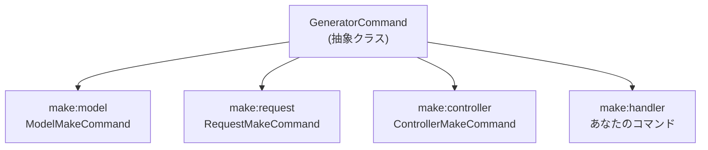

## GeneratorCommand とは

`Illuminate\Console\GeneratorCommand` は、Laravel のすべてのコード生成コマンドの基底となる抽象クラスです。`make:model`、`make:controller`、`make:request` などはすべてこのクラスを継承しています。



パッケージで独自の `make:xxx` コマンドを提供すると、ユーザーはクラスを手動で作成する代わりに `php artisan make:handler OrderHandler` のように実行するだけで正しい名前空間のファイルが生成されます。

<Info>
`GeneratorCommand` は公式ドキュメントにほとんど記載がなく、フレームワークのソースコードを直接読まないと分かりません。典型的な上級トピックです。
</Info>

## 最小限の実装

`GeneratorCommand` を継承したクラスに必要な実装は `getStub()` メソッドのみです。それ以外のプロパティはオプションですが、実際には以下を揃えます。

| メンバー | 種類 | 役割 |
|---|---|---|
| `$name` | プロパティ | コマンド名（例: `make:handler`） |
| `$description` | プロパティ | コマンドの説明文 |
| `$type` | プロパティ | 生成物の種類名。成功メッセージに使われる（例: `Handler`） |
| `getStub()` | メソッド（必須） | stub ファイルのパスを返す |
| `getDefaultNamespace()` | メソッド | 生成先のデフォルト名前空間を制御する |

`make:handler` コマンドを実装する例を示します。

```php
<?php

namespace Vendor\Package\Console\Commands;

use Illuminate\Console\GeneratorCommand;

class HandlerMakeCommand extends GeneratorCommand
{
    protected $name = 'make:handler';

    protected $description = 'Create a new handler class';

    protected $type = 'Handler';

    protected function getStub(): string
    {
        return __DIR__.'/stubs/handler.stub';
    }

    protected function getDefaultNamespace($rootNamespace): string
    {
        return $rootNamespace.'\Handlers';
    }
}
```

`getDefaultNamespace()` を設定すると、`php artisan make:handler OrderHandler` を実行したときに `App\Handlers\OrderHandler` クラスが `app/Handlers/OrderHandler.php` に生成されます。

## stub ファイルの作成

`getStub()` が返すパスに stub ファイルを配置します。stub はテンプレートとなる PHP ファイルで、プレースホルダーが名前空間とクラス名に置換されます。

<Tree>
  <Tree.Folder name="src" defaultOpen>
    <Tree.Folder name="Console" defaultOpen>
      <Tree.Folder name="Commands" defaultOpen>
        <Tree.File name="HandlerMakeCommand.php" />
        <Tree.Folder name="stubs" defaultOpen>
          <Tree.File name="handler.stub" />
        </Tree.Folder>
      </Tree.Folder>
    </Tree.Folder>
  </Tree.Folder>
</Tree>

stub ファイルの例:

```php handler.stub
<?php

namespace {{ namespace }};

class {{ class }}
{
    public function handle(): void
    {
        //
    }
}
```

`GeneratorCommand` は stub 内の以下のプレースホルダーを自動的に置換します。

| プレースホルダー | 置換後の値 | 代替表記 |
|---|---|---|
| `{{ namespace }}` | 生成クラスの名前空間 | `DummyNamespace` |
| `{{ class }}` | 生成クラス名 | `DummyClass` |
| `{{ rootNamespace }}` | アプリのルート名前空間 | `DummyRootNamespace` |

`{{ namespace }}` と `DummyNamespace` はどちらを使っても同じ結果になります。Laravel 組み込みの stub は両方の形式を含んでいましたが、新しく作る場合は `{{ namespace }}` 形式を推奨します。

## stub のカスタマイズを可能にする

ユーザーが stub を上書きできる仕組みを提供するには、`resolveStubPath()` パターンを使います。まずサービスプロバイダーの `boot()` で stub を公開します。

```php
public function boot(): void
{
    if ($this->app->runningInConsole()) {
        $this->publishes([
            __DIR__.'/../Console/Commands/stubs' => base_path('stubs'),
        ], 'stubs');
    }
}
```

次に `getStub()` でユーザーがカスタマイズした stub を優先的に使います。

```php
protected function getStub(): string
{
    return $this->resolveStubPath('/stubs/handler.stub');
}

protected function resolveStubPath(string $stub): string
{
    return file_exists($customPath = $this->laravel->basePath(trim($stub, '/')))
        ? $customPath
        : __DIR__.$stub;
}
```

`php artisan vendor:publish --tag=stubs` を実行したユーザーはプロジェクトルートの `stubs/handler.stub` を編集してテンプレートを変更できます。

<Tip>
`resolveStubPath()` は Laravel 組み込みの `RequestMakeCommand` でも使われているパターンです。パッケージを公開する場合はこのパターンを採用してください。
</Tip>

## サービスプロバイダーへの登録

コマンドはサービスプロバイダーの `boot()` メソッドで登録します。`runningInConsole()` で確認することで、Web リクエスト時の無駄なロードを防げます。

```php
<?php

namespace Vendor\Package;

use Illuminate\Support\ServiceProvider;
use Vendor\Package\Console\Commands\HandlerMakeCommand;

class PackageServiceProvider extends ServiceProvider
{
    public function boot(): void
    {
        if ($this->app->runningInConsole()) {
            $this->commands([
                HandlerMakeCommand::class,
            ]);

            $this->publishes([
                __DIR__.'/../Console/Commands/stubs' => base_path('stubs'),
            ], 'stubs');
        }
    }
}
```

パッケージの `composer.json` に `extra.laravel` を設定しておくと、ユーザーはサービスプロバイダーを手動登録しなくて済みます。

```json
"extra": {
    "laravel": {
        "providers": [
            "Vendor\\Package\\PackageServiceProvider"
        ]
    }
}
```

## 活用例

`GeneratorCommand` が活躍するユースケースをいくつか示します。

<AccordionGroup>
  <Accordion title="フォームリクエスト拡張">
    認証チェックやカスタムバリデーションロジックを含む独自の基底クラスを継承した Request を生成するコマンド。`getDefaultNamespace()` で `App\Http\Requests` を返します。
  </Accordion>
  <Accordion title="DTO ジェネレーター">
    Data Transfer Object のボイラープレートを生成するコマンド。readonly プロパティや `from()` ファクトリメソッドを含む stub を用意します。
  </Accordion>
  <Accordion title="Action クラス">
    単一責任の Action クラスを生成するコマンド。`App\Actions` 名前空間に `execute()` メソッドを持つクラスを生成します。
  </Accordion>
  <Accordion title="Livewire が同じ仕組みを使っている">
    `make:livewire` コマンドは `GeneratorCommand` を継承した `MakeCommand` クラスで実装されています。コンポーネントクラスと Blade ビューの 2 ファイルを同時生成するために `handle()` をオーバーライドしています。
  </Accordion>
</AccordionGroup>

## テスト

Orchestra Testbench を使って、コマンドが正しくファイルを生成することをテストします。

```php
<?php

namespace Tests\Feature\Console;

use Illuminate\Support\Facades\File;
use Orchestra\Testbench\TestCase;
use Vendor\Package\PackageServiceProvider;

class HandlerMakeCommandTest extends TestCase
{
    protected function getPackageProviders($app): array
    {
        return [PackageServiceProvider::class];
    }

    protected function tearDown(): void
    {
        File::deleteDirectory(app_path('Handlers'));

        parent::tearDown();
    }

    public function test_make_handler_creates_file(): void
    {
        $path = app_path('Handlers/OrderHandler.php');

        $this->artisan('make:handler', ['name' => 'OrderHandler'])
            ->assertSuccessful();

        $this->assertFileExists($path);
        $this->assertStringContainsString('namespace App\Handlers;', File::get($path));
        $this->assertStringContainsString('class OrderHandler', File::get($path));
    }

    public function test_make_handler_does_not_overwrite_existing_file(): void
    {
        $path = app_path('Handlers/OrderHandler.php');
        File::ensureDirectoryExists(dirname($path));
        File::put($path, '<?php // existing');

        $this->artisan('make:handler', ['name' => 'OrderHandler'])
            ->assertFailed();
    }
}
```

<Warning>
Generator コマンドは実際のファイルシステムに書き込みます。`tearDown()` で必ずクリーンアップしてください。テストが途中で失敗した場合でも確実に実行されます。
</Warning>

## 関連ページ

<Columns cols={2}>
  <Card title="Laravelパッケージ開発" icon="package" href="/jp/advanced/package-development">
    サービスプロバイダーを使ったパッケージ開発の基礎を確認します。
  </Card>
  <Card title="Orchestra TestbenchでLaravelパッケージをテストする" icon="flask-conical" href="/jp/advanced/package-testing">
    パッケージテストの基盤の作り方を確認します。
  </Card>
</Columns>

<Info>
Source: [Illuminate\Console\GeneratorCommand](https://github.com/laravel/framework/blob/master/src/Illuminate/Console/GeneratorCommand.php), [Illuminate\Foundation\Console\RequestMakeCommand](https://github.com/laravel/framework/blob/master/src/Illuminate/Foundation/Console/RequestMakeCommand.php)
</Info>
