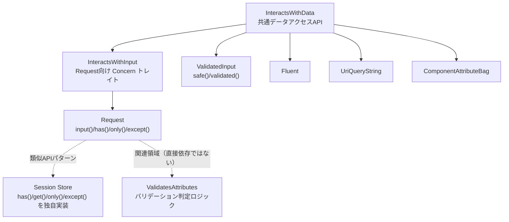

## InteractsWithDataトレイトとは

`Illuminate\Support\Traits\InteractsWithData` は、「配列ライクな入力データに対する共通API」をまとめたトレイトです。

このトレイト自体は `all()` と `data()` の2つだけを抽象メソッドとして要求し、実データの取得ロジックは各クラス側に委譲します。代わりに、以下のような高頻度メソッドをまとめて提供します。

- 存在判定: `has()`, `hasAny()`, `exists()`, `missing()`
- 空判定: `filled()`, `isNotFilled()`, `anyFilled()`
- 条件実行: `whenHas()`, `whenFilled()`, `whenMissing()`
- 抽出: `only()`, `except()`
- 型変換: `string()`, `boolean()`, `integer()`, `float()`, `date()`, `enum()`, `collect()`

## Request系メソッドとの関係

`request()` ヘルパーで取得する `Illuminate\Http\Request` は、`Concerns\InteractsWithInput` を通して `InteractsWithData` を取り込みます。

そのため、次のような日常的な入力アクセスはトレイト経由で提供されています。

```php
$search = request()->input('search');

if (request()->has('search')) {
    $filters = request()->only(['search', 'status']);
}

$payload = request()->except(['_token']);
```

`Request::get()` は `Request` クラス本体にある Symfony 互換メソッドです。Laravel 13 のソースコード上でも `@deprecated use ->input() instead` と明記されています。

```php
$legacy = request()->get('search');  // 互換目的のメソッド（推奨は input()）
```

## Laravelコアでの主な実装例

### 直接 `InteractsWithData` を use するクラス

| クラス | 用途 |
|---|---|
| `Illuminate\Http\Concerns\InteractsWithInput` | `Request` の入力アクセスAPI |
| `Illuminate\Support\ValidatedInput` | `validated()` / `safe()` の戻り値ラッパー |
| `Illuminate\Support\Fluent` | 設定値や任意属性のフルーエント操作 |
| `Illuminate\Support\UriQueryString` | `Uri` のクエリ文字列操作 |
| `Illuminate\View\ComponentAttributeBag` | Bladeコンポーネント属性の操作 |

### 近い責務を持つ関連実装

- `Illuminate\Session\Store` は `has()`, `get()`, `only()`, `except()` など似たAPIを独自実装しています
- `Illuminate\Validation\Concerns\ValidatesAttributes` はバリデーション判定ロジックを提供し、入力アクセスAPIそのものは `InteractsWithData` とは別責務で設計されています

## トレイトと主要クラスの関係



## パッケージ開発で自前クラスに組み込む

`InteractsWithData` は、パッケージ内で「入力配列を保持し、Laravel風の取得APIを提供したい」クラスに向いています。

<Steps>
  <Step title="データコンテナクラスを作る">
    ```php
    namespace Vendor\Package\Support;

    use Illuminate\Support\Arr;
    use Illuminate\Support\Traits\InteractsWithData;

    class OptionBag
    {
        use InteractsWithData;

        public function __construct(
            protected array $items = [],
        ) {}

        public function all($keys = null): array
        {
            if (! $keys) {
                return $this->items;
            }

            $result = [];

            $keyList = is_array($keys) ? $keys : [$keys];

            foreach ($keyList as $key) {
                Arr::set($result, $key, Arr::get($this->items, $key));
            }

            return $result;
        }

        protected function data($key = null, $default = null): mixed
        {
            return data_get($this->items, $key, $default);
        }
    }
    ```
  </Step>
  <Step title="型付きアクセサで安全に読む">
    ```php
    $options = new OptionBag([
        'feature.enabled' => 'true',
        'retry.max' => '5',
        'channels' => ['mail', 'slack'],
    ]);

    $enabled = $options->boolean('feature.enabled'); // true
    $retryMax = $options->integer('retry.max');      // 5
    $channels = $options->collect('channels');       // Collection
    $public = $options->except(['secret']);          // secret を除外
    ```
  </Step>
</Steps>

## 実践ユースケース

- 外部APIクライアントのオプションバッグ
- Webhookペイロードの正規化レイヤー
- パッケージの設定オーバーライド解決クラス

`all()` と `data()` だけ実装すれば、入力アクセスAPIを毎回自作せずに済むため、メンテナンスコストを下げられます。

## 関連ページ

- [Macroableトレイト](/jp/advanced/macroable)
- [Conditionableトレイト](/jp/advanced/conditionable)
- [tap() ヘルパーと Tappable トレイト](/jp/advanced/tap)
