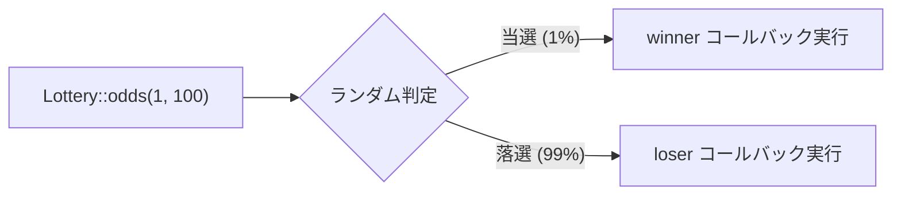

## Lotteryクラスとは

`Illuminate\Support\Lottery` は、確率ベースの操作を流れるようなAPIで表現できるユーティリティクラスです。「100リクエストに1回だけ処理を実行する」「一部のリクエストのみ詳細ログを記録する」といったパターンをシンプルに記述できます。

<Info>
  実装は `src/Illuminate/Support/Lottery.php` にあります。LaravelはこのクラスをSession GCやキャッシュロックのプルーンなど、フレームワーク内部でも活用しています。
</Info>



## 基本的な使い方

### 整数比率で確率を指定する

`Lottery::odds($chances, $outOf)` で「$outOf 回中 $chances 回当選」という確率を指定します。

```php
use Illuminate\Support\Lottery;

Lottery::odds(1, 100)           // 100回に1回
    ->winner(fn () => $this->runMaintenance())
    ->loser(fn () => null)
    ->choose();
```

### 小数で確率を指定する

`$outOf` を省略して `0.0`〜`1.0` の小数を渡すと、そのまま確率として使われます。

```php
Lottery::odds(0.01)             // 1% の確率
    ->winner(fn () => $this->sample())
    ->choose();
```

<Warning>
  小数指定のとき値が `1.0` を超えると `RuntimeException` が投げられます。
</Warning>

### コールバックなしで真偽値を返す

winner / loser を設定しない場合、`choose()` は当選なら `true`、落選なら `false` を返します。

```php
$shouldSample = Lottery::odds(1, 50)->choose(); // bool
```

### 複数回実行する

`choose($times)` に回数を渡すと結果の配列が返されます。

```php
$results = Lottery::odds(1, 2)
    ->winner(fn () => 'win')
    ->loser(fn () => 'lose')
    ->choose(10);

// 例: ['win', 'lose', 'win', 'win', 'lose', ...]
```

### Callable として渡す

`Lottery` インスタンスは `__invoke` を実装しているため、callable を受け取るAPIに直接渡せます。

```php
// DB::whenQueryingForLongerThan の第二引数として渡す例
DB::whenQueryingForLongerThan(
    Interval::seconds(5),
    Lottery::odds(1, 5)->winner(function ($connection) {
        // スロークエリを検知したとき 1/5 の確率でアラート送信
        Alert::send("Slow query on {$connection->getName()}");
    })
);
```

## 実践的なユースケース

### 1. キャッシュのプルーン（100回に1回だけ実行）

期限切れレコードの削除など、毎回実行する必要がないメンテナンス処理に最適です。

```php
Lottery::odds(1, 100)
    ->winner(fn () => Cache::store('database')->flush())
    ->choose();
```

### 2. テレメトリ・サンプリング（一部リクエストのみ詳細ログ）

全リクエストをログに残すとコストが高い場合、サンプリングに使えます。

```php
Lottery::odds(1, 20)
    ->winner(function () use ($request) {
        Log::channel('telemetry')->info('Request sampled', [
            'url'      => $request->url(),
            'duration' => microtime(true) - LARAVEL_START,
            'memory'   => memory_get_peak_usage(true),
        ]);
    })
    ->choose();
```

### 3. A/Bテスト的な振る舞い

ユーザーを確率的に2つのコードパスに振り分けます。

```php
$result = Lottery::odds(1, 2)
    ->winner(fn ($user) => $this->newCheckoutFlow($user))
    ->loser(fn ($user) => $this->legacyCheckoutFlow($user))
    ->choose();
```

### 4. Schedulerの補助として定期タスクをランダム実行

複数サーバーで重複実行を避けつつ、あるタスクをランダムに実行したいときに使えます。

```php
// app/Console/Kernel.php
$schedule->call(function () {
    Lottery::odds(1, 3)
        ->winner(fn () => Artisan::call('cache:prune-stale-tags'))
        ->choose();
})->everyMinute();
```

## Laravelフレームワーク内での確率的パターン

Laravelはフレームワーク内部でも確率的なメンテナンス処理を広く使っています。一部の実装は `Lottery` クラスが追加される前に書かれたため `random_int()` を直接使っていますが、同じ思想に基づいています。

<Steps>
  <Step title="Session: ガーベジコレクション">
    `Illuminate\Session\Middleware\StartSession::configHitsLottery()` は `config/session.php` の `lottery` 設定を使い、`random_int` で確率判定してGCを実行します。

    ```php
    // config/session.php
    'lottery' => [2, 100], // 100リクエストに2回

    // StartSession 内部 (random_int を直接使用)
    protected function configHitsLottery(array $config): bool
    {
        return random_int(1, $config['lottery'][1]) <= $config['lottery'][0];
    }
    ```
  </Step>
  <Step title="DatabaseLock: 期限切れロックのプルーン">
    `Illuminate\Cache\DatabaseLock::acquire()` はロック取得のたびに同じ比率パターンで期限切れロックを削除します。

    ```php
    // config/cache.php (database ドライバー)
    'lock_lottery' => [2, 100], // 100回に2回プルーン実行

    // DatabaseLock::acquire() 内部 (random_int を直接使用)
    if (random_int(1, $this->lottery[1]) <= $this->lottery[0]) {
        $this->pruneExpiredLocks();
    }
    ```
  </Step>
  <Step title="DB::whenQueryingForLongerThan — Lottery クラスを渡す例">
    `Lottery` インスタンスは callable として渡せるため、スロークエリ検知コールバックに直接使えます。

    ```php
    DB::whenQueryingForLongerThan(
        Interval::seconds(5),
        Lottery::odds(1, 5)->winner(function ($connection) {
            Log::warning("Slow query on {$connection->getName()}");
        })
    );
    ```
  </Step>
</Steps>

<Tip>
  Session や DatabaseLock が `random_int()` を直接使っているのに対し、`Lottery` クラスを使うと `alwaysWin()` / `alwaysLose()` / `fix()` でテスト時に結果を制御できるメリットがあります。パッケージ開発では `Lottery` クラスを選ぶとテスタビリティが向上します。
</Tip>

## テスト時の利用

ランダム性があるコードのテストには、`Lottery` が提供するテスト用APIを使います。

### `Lottery::alwaysWin()` — 常に当選させる

```php
public function test_maintenance_runs_on_win(): void
{
    $ranMaintenance = false;

    Lottery::alwaysWin(function () use (&$ranMaintenance) {
        Lottery::odds(1, 100)
            ->winner(function () use (&$ranMaintenance) {
                $ranMaintenance = true;
            })
            ->choose();
    });

    $this->assertTrue($ranMaintenance);
}
```

### `Lottery::alwaysLose()` — 常に落選させる

```php
public function test_maintenance_skipped_on_lose(): void
{
    $ranMaintenance = false;

    Lottery::alwaysLose(function () use (&$ranMaintenance) {
        Lottery::odds(1, 100)
            ->winner(function () use (&$ranMaintenance) {
                $ranMaintenance = true;
            })
            ->choose();
    });

    $this->assertFalse($ranMaintenance);
}
```

### `Lottery::fix()` — 結果をシーケンスで固定する

複数回の呼び出し結果を `true`/`false` の配列で制御できます。

```php
public function test_alternating_results(): void
{
    Lottery::fix([true, false, true, false]);

    $results = Lottery::odds(1, 100)
        ->winner(fn () => 'winner')
        ->loser(fn () => 'loser')
        ->choose(4);

    $this->assertSame(['winner', 'loser', 'winner', 'loser'], $results);

    Lottery::determineResultNormally(); // テスト後は必ず元に戻す
}
```

<Warning>
  `alwaysWin()` / `alwaysLose()` / `fix()` はグローバルな静的プロパティを変更します。テストの `tearDown()` で必ず `Lottery::determineResultNormally()` を呼んでください。
</Warning>

```php
protected function tearDown(): void
{
    Lottery::determineResultNormally();

    parent::tearDown();
}
```

### `Lottery::setResultFactory()` — カスタムファクトリを注入する

より細かい制御が必要な場合は、カスタムファクトリを使います。

```php
Lottery::setResultFactory(function ($chances, $outOf) {
    // 常に当選させるカスタムロジック
    return true;
});

// テスト後はリセット
Lottery::determineResultNormally();
```

## パッケージ開発での活用

### サービスプロバイダーでの登録

パッケージのサービスプロバイダーにメンテナンス処理を組み込む場合、`Lottery` を使って負荷を分散させます。

```php
use Illuminate\Support\Lottery;
use Illuminate\Support\ServiceProvider;

class AcmeServiceProvider extends ServiceProvider
{
    public function boot(): void
    {
        $this->app->booted(function () {
            Lottery::odds(1, 100)
                ->winner(fn () => $this->pruneExpiredRecords())
                ->choose();
        });
    }

    protected function pruneExpiredRecords(): void
    {
        $this->app['db']->table('acme_logs')
            ->where('expires_at', '<', now())
            ->delete();
    }
}
```

### 設定値からオッズを読み込む

確率を設定ファイルから変更可能にすると、ユーザーが調整しやすくなります。

```php
$lottery = config('acme.prune_lottery', [1, 100]);

Lottery::odds(...$lottery)
    ->winner(fn () => $this->pruneExpiredRecords())
    ->choose();
```

```php
// config/acme.php
return [
    // [当選数, 試行数] = 100リクエストに1回プルーン実行
    'prune_lottery' => [1, 100],
];
```

### Middleware でのサンプリング

```php
use Illuminate\Support\Lottery;

class SampleTelemetryMiddleware
{
    public function handle(Request $request, Closure $next): Response
    {
        $response = $next($request);

        Lottery::odds(1, 50)
            ->winner(fn () => $this->recordTelemetry($request, $response))
            ->choose();

        return $response;
    }
}
```

## API リファレンス

| メソッド | 説明 |
|---|---|
| `Lottery::odds($chances, $outOf)` | Lotteryインスタンスを生成する静的ファクトリ |
| `->winner(callable $callback)` | 当選時のコールバックを設定 |
| `->loser(callable $callback)` | 落選時のコールバックを設定 |
| `->choose($times = null)` | Lotteryを実行。`$times` を指定すると配列を返す |
| `Lottery::alwaysWin($callback)` | テスト用: 常に当選 |
| `Lottery::alwaysLose($callback)` | テスト用: 常に落選 |
| `Lottery::fix($sequence)` | テスト用: 結果をシーケンスで固定 |
| `Lottery::determineResultNormally()` | テスト用固定をリセット |
| `Lottery::setResultFactory(callable)` | カスタム判定ロジックを注入 |

## 関連ページ

<Columns cols={2}>
  <Card title="Macroableトレイト" icon="puzzle-piece" href="/jp/advanced/macroable">
    既存クラスに新しいメソッドを追加する拡張パターンを学びます。
  </Card>
  <Card title="Conditionableトレイト" icon="git-branch" href="/jp/advanced/conditionable">
    `when()` / `unless()` による条件分岐チェーンの設計を学びます。
  </Card>
</Columns>
