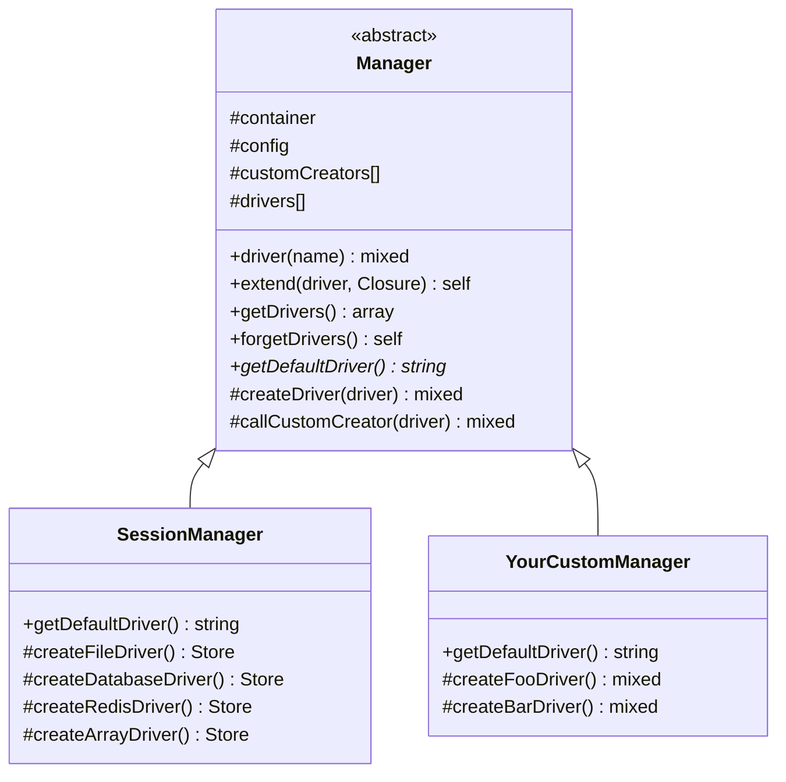

## Manager とは

`Illuminate\Support\Manager` は Laravel 4.0 の頃から存在する抽象クラスです。キャッシュ・セッション・メールなど、複数の「ドライバー」を切り替えて使えるシステムを簡単に構築するための基盤を提供します。

「ドライバー」とは、同じインターフェースを持ちながら内部実装が異なるバックエンドのことです。たとえばセッションなら `file`・`cookie`・`database`・`redis` といったドライバーがあり、設定ファイルの `driver` キーで切り替えます。



## フレームワーク内での利用状況

`Manager` という名前が付いていても `Illuminate\Support\Manager` を継承して**いない**クラスが存在します。

| クラス | `Manager` を継承しているか |
|---|---|
| `Illuminate\Session\SessionManager` | ✅ 継承している |
| `Illuminate\Cache\CacheManager` | ❌ 継承していない(独自実装) |
| `Illuminate\Queue\QueueManager` | ❌ 継承していない(独自実装) |
| `Laravel\Socialite\SocialiteManager` | ✅ 継承している |

継承していないクラスも `extend()` で拡張する基本的な考え方は同じです。そのため、`Manager` パターンを理解することがフレームワーク全体の動作理解につながります。

## 基本的な仕組み

### driver() — ドライバーを取得する

`driver()` を呼ぶと、次の手順でドライバーが解決されます。

```mermaid
flowchart TD
    A["driver(name) を呼ぶ"] --> B{drivers[] に<br>キャッシュがあるか?}
    B -- はい --> C["キャッシュされた<br>インスタンスを返す"]
    B -- いいえ --> D{customCreators[]<br>に登録があるか?}
    D -- はい --> E["callCustomCreator()<br>でインスタンスを生成"]
    D -- いいえ --> F{"createXxxDriver()<br>メソッドが存在するか?"}
    F -- はい --> G["createXxxDriver()<br>を呼ぶ"]
    F -- いいえ --> H["InvalidArgumentException<br>をスロー"]
    E --> I["drivers[] にキャッシュして返す"]
    G --> I
```

実際のソースコードを見ると、ドライバー名から `Str::studly()` でメソッド名を組み立てています。

```php
// Illuminate\Support\Manager::createDriver() より
protected function createDriver($driver)
{
    if (isset($this->customCreators[$driver])) {
        return $this->callCustomCreator($driver);
    }

    $method = 'create'.Str::studly($driver).'Driver';

    if (method_exists($this, $method)) {
        return $this->$method();
    }

    throw new InvalidArgumentException("Driver [$driver] not supported.");
}
```

つまり `file` ドライバーなら `createFileDriver()` が、`my-custom` ドライバーなら `createMyCustomDriver()` が呼ばれます。

### extend() — カスタムドライバーを登録する

`extend()` にドライバー名とクロージャを渡すことで、独自のドライバーを登録できます。クロージャの引数はコンテナインスタンスです。

```php
use Illuminate\Support\Facades\Session;

Session::extend('redis-cluster', function ($app) {
    return new RedisClusterSessionHandler(
        $app->make('redis'),
        $app['config']['session'],
    );
});
```

`extend()` はクロージャを `$this` にバインドするため、クロージャ内で Manager のプロパティやメソッドにアクセスできます。

```php
// Illuminate\Support\Manager::extend() より
public function extend($driver, Closure $callback)
{
    try {
        $callback = $callback->bindTo($this, static::class) ?? throw new RuntimeException;
    } catch (Throwable) {
        $callback = $callback->bindTo(null, static::class);
    }

    $this->customCreators[$driver] = $callback;

    return $this;
}
```

### __call — デフォルトドライバーへの委譲

Manager クラスには `__call` が実装されており、Manager 自身に存在しないメソッド呼び出しはデフォルトドライバーに自動的に委譲されます。

```php
public function __call($method, $parameters)
{
    return $this->driver()->$method(...$parameters);
}
```

これにより `SessionManager::get('key')` のように Manager を直接使いつつ、実際の処理はドライバーに任せるという流れが実現しています。

## SessionManager の実装例

`Illuminate\Session\SessionManager` を見ると、`Manager` の使い方が具体的にわかります。

```php
namespace Illuminate\Session;

use Illuminate\Support\Manager;

class SessionManager extends Manager
{
    // 必須: デフォルトドライバーを返す
    public function getDefaultDriver()
    {
        return $this->config->get('session.driver');
    }

    // file ドライバーの生成
    protected function createFileDriver()
    {
        return $this->createNativeDriver();
    }

    // database ドライバーの生成
    protected function createDatabaseDriver()
    {
        $table = $this->config->get('session.table');
        $lifetime = $this->config->get('session.lifetime');

        return $this->buildSession(new DatabaseSessionHandler(
            $this->getDatabaseConnection(), $table, $lifetime, $this->container
        ));
    }

    // redis ドライバーの生成
    protected function createRedisDriver()
    {
        $handler = $this->createCacheHandler('redis');
        // ...
        return $this->buildSession($handler);
    }
}
```

## 自作パッケージで Manager を使う

### 基本的な実装

通知サービスを例に、`Manager` を継承したカスタムクラスを作ります。

<Steps>
  <Step title="Manager を継承したクラスを作る">
    ```php
    namespace App\Notifications;

    use Illuminate\Support\Manager;

    class NotificationManager extends Manager
    {
        public function getDefaultDriver(): string
        {
            return $this->config->get('notifications.driver', 'slack');
        }

        protected function createSlackDriver(): SlackNotifier
        {
            return new SlackNotifier(
                $this->config->get('notifications.slack'),
            );
        }

        protected function createEmailDriver(): EmailNotifier
        {
            return new EmailNotifier(
                $this->config->get('notifications.email'),
            );
        }

        protected function createLogDriver(): LogNotifier
        {
            return new LogNotifier(
                $this->container->make('log'),
            );
        }
    }
    ```
  </Step>
  <Step title="サービスプロバイダーで登録する">
    ```php
    namespace App\Providers;

    use App\Notifications\NotificationManager;
    use Illuminate\Support\ServiceProvider;

    class NotificationServiceProvider extends ServiceProvider
    {
        public function register(): void
        {
            $this->app->singleton(NotificationManager::class, function ($app) {
                return new NotificationManager($app);
            });
        }
    }
    ```
  </Step>
  <Step title="カスタムドライバーを追加する">
    ```php
    // AppServiceProvider::boot() などで

    $manager = app(NotificationManager::class);

    $manager->extend('teams', function ($app) {
        return new TeamsNotifier(
            $app['config']['notifications.teams'],
        );
    });
    ```
  </Step>
  <Step title="使用する">
    ```php
    $manager = app(NotificationManager::class);

    // デフォルトドライバーを使う
    $manager->send('メッセージ');

    // 特定のドライバーを指定する
    $manager->driver('email')->send('メッセージ');

    // 一度解決したドライバーはキャッシュされる
    $manager->driver('slack'); // 同じインスタンスが返る
    ```
  </Step>
</Steps>

## MultipleInstanceManager

`Illuminate\Support\MultipleInstanceManager` は Laravel 10 で追加されたクラスです。`Manager` がドライバーの「種類」を管理するのに対し、`MultipleInstanceManager` は名前付きの「インスタンス」を複数管理できます。

### Manager との違い

| | `Manager` | `MultipleInstanceManager` |
|---|---|---|
| 管理単位 | ドライバーの種類 (`file`, `redis` など) | 名前付きインスタンス (`mailer1`, `mailer2` など) |
| 設定の持ち方 | 1つのデフォルトドライバー | インスタンスごとに設定を持つ |
| 主な用途 | セッション、キャッシュなど | メール、ログなど複数接続が必要なもの |
| 取得メソッド | `driver()` | `instance()` |

### 必須メソッド

`MultipleInstanceManager` を継承する場合は、3つのメソッドを実装する必要があります。

```php
// ソースコードより
abstract public function getDefaultInstance();
abstract public function setDefaultInstance($name);
abstract public function getInstanceConfig($name);
```

`getInstanceConfig()` は名前に対応する設定配列を返します。設定には必ず `driver`（または `$driverKey` で指定したキー）が含まれている必要があります。

### 解決フロー

```mermaid
flowchart TD
    A["instance(name) を呼ぶ"] --> B["name が null なら<br>getDefaultInstance() を使用"]
    B --> C{instances[] に<br>キャッシュがあるか?}
    C -- はい --> D["キャッシュされた<br>インスタンスを返す"]
    C -- いいえ --> E["getInstanceConfig(name) で設定を取得"]
    E --> F{設定に driver<br>キーがあるか?}
    F -- いいえ --> G["RuntimeException をスロー"]
    F -- はい --> H{customCreators[]<br>に登録があるか?}
    H -- はい --> I["callCustomCreator(config) で生成"]
    H -- いいえ --> J["createXxxDriver(config) を呼ぶ"]
    I --> K["instances[] にキャッシュして返す"]
    J --> K
```

### 自作パッケージでの実装例

複数の SMS ゲートウェイに同時対応するパッケージを例にします。

```php
namespace App\Sms;

use Illuminate\Support\MultipleInstanceManager;

class SmsManager extends MultipleInstanceManager
{
    // デフォルトインスタンス名
    public function getDefaultInstance(): string
    {
        return $this->config->get('sms.default', 'primary');
    }

    public function setDefaultInstance($name): void
    {
        $this->config->set('sms.default', $name);
    }

    // インスタンス名に対応する設定を返す
    public function getInstanceConfig($name): array
    {
        return $this->config->get("sms.gateways.{$name}");
    }

    // twilio ドライバーの生成 (設定配列が渡される)
    protected function createTwilioDriver(array $config): TwilioSmsGateway
    {
        return new TwilioSmsGateway(
            $config['account_sid'],
            $config['auth_token'],
        );
    }

    // vonage ドライバーの生成
    protected function createVonageDriver(array $config): VonageSmsGateway
    {
        return new VonageSmsGateway(
            $config['api_key'],
            $config['api_secret'],
        );
    }
}
```

対応する設定ファイル:

```php
// config/sms.php
return [
    'default' => 'primary',

    'gateways' => [
        'primary' => [
            'driver' => 'twilio',
            'account_sid' => env('TWILIO_ACCOUNT_SID'),
            'auth_token' => env('TWILIO_AUTH_TOKEN'),
        ],
        'backup' => [
            'driver' => 'vonage',
            'api_key' => env('VONAGE_API_KEY'),
            'api_secret' => env('VONAGE_API_SECRET'),
        ],
        'marketing' => [
            'driver' => 'twilio',
            'account_sid' => env('TWILIO_MARKETING_SID'),
            'auth_token' => env('TWILIO_MARKETING_TOKEN'),
        ],
    ],
];
```

使用時は `instance()` で名前を指定します。

```php
$sms = app(SmsManager::class);

// デフォルトインスタンス (primary = twilio) を使う
$sms->send('+81901234xxxx', '確認コード: 123456');

// 名前でインスタンスを指定する
$sms->instance('backup')->send('+81901234xxxx', '確認コード: 123456');

// マーケティング用のインスタンスを使う
$sms->instance('marketing')->send('+81901234xxxx', 'キャンペーンのお知らせ');
```

<Tip>
  `MultipleInstanceManager` は `Manager` と同じように `extend()` でカスタムドライバーを追加できます。また `__call` も実装されているため、インスタンス自体に存在しないメソッドはデフォルトインスタンスに委譲されます。
</Tip>

## ドライバーキャッシュの管理

### Manager のキャッシュ操作

```php
// 全ドライバーを取得
$drivers = $manager->getDrivers();

// 全ドライバーのキャッシュをクリア
$manager->forgetDrivers();
```

### MultipleInstanceManager のキャッシュ操作

```php
// 特定のインスタンスを削除する
$manager->forgetInstance('backup');

// デフォルトインスタンスを削除する
$manager->forgetInstance();

// 複数のインスタンスを一括削除する
$manager->forgetInstance(['primary', 'backup']);

// インスタンスを削除してキャッシュも消す
$manager->purge('backup');
```

## まとめ

- `Manager` はドライバーの「種類」を管理する。`createXxxDriver()` メソッドを実装し、`extend()` で拡張する
- `MultipleInstanceManager` はドライバーの「インスタンス」を名前ごとに管理する。複数の接続設定が必要なパッケージに適している
- `Manager` という名前のクラスがすべて `Illuminate\Support\Manager` を継承しているわけではない。`CacheManager` や `QueueManager` は独自実装

<Card title="Macroableトレイト" icon="puzzle-piece" href="/jp/advanced/macroable">
  既存クラスに独自メソッドを追加するMacroableトレイトの使い方を学びます。
</Card>
