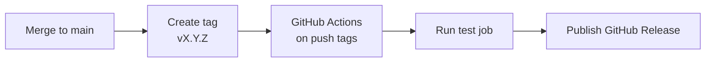

あなたがLaravelパッケージを長く保守するなら、変更履歴とリリース手順を先に整備してください。リリース管理を仕組み化すると、破壊的変更の周知漏れとリリース作業の属人化を防げます。

<Info>
  このページは[Laravelパッケージ開発](/jp/advanced/package-development)の姉妹ページです。Laravel/PHP互換性の戦略は[パッケージのバージョン互換性管理](/jp/advanced/package-versioning)を参照してください。
</Info>

## CHANGELOG.md の書き方

CHANGELOGは「何が、いつ、どのバージョンで変わったか」を利用者が確認する一次情報です。フォーマットは[Keep a Changelog](https://keepachangelog.com/ja/1.1.0/)を採用すると、カテゴリ構成をチームで統一できます。

### 基本ルール

- `## [x.y.z] - YYYY-MM-DD` 形式でバージョンを見出しにする
- `Added / Changed / Deprecated / Removed / Fixed / Security` を使う
- Compareリンクを末尾に置いて差分を追えるようにする
- まだ未リリースの変更は `## [Unreleased]` に積む

```markdown
# CHANGELOG

All notable changes to this project will be documented in this file.

The format is based on [Keep a Changelog](https://keepachangelog.com/en/1.1.0/),
and this project adheres to [Semantic Versioning](https://semver.org/spec/v2.0.0.html).

## [Unreleased]

### Added
- Add `Package::warmCache()` for preloading metadata.

## [2.1.0] - 2026-05-10

### Added
- Add Laravel 13 support.

### Changed
- Improve default cache key generation for tagged cache stores.

### Deprecated
- Deprecate `Package::legacyHandle()` and schedule removal in v3.0.

### Fixed
- Fix null handling in `Package::resolveTenant()`.

## [2.0.0] - 2026-03-01

### Removed
- Drop Laravel 11 support.

### Security
- Harden signed URL validation against malformed host headers.

[Unreleased]: https://github.com/vendor/package/compare/v2.1.0...HEAD
[2.1.0]: https://github.com/vendor/package/compare/v2.0.0...v2.1.0
[2.0.0]: https://github.com/vendor/package/releases/tag/v2.0.0
```

<Tip>
  リリースノートはCHANGELOGの該当バージョンをそのまま使ってください。履歴の情報源を1つに集約すると、README・GitHub Releases・SNS告知で内容がずれにくくなります。
</Tip>

## セマンティックバージョニング（SemVer）

[Semantic Versioning](https://semver.org/spec/v2.0.0.html)では `MAJOR.MINOR.PATCH` を次の基準で使います。

- **MAJOR**: 後方互換性を壊す変更（Breaking change）
- **MINOR**: 後方互換性を保った機能追加
- **PATCH**: 後方互換性を保ったバグ修正

### Laravelパッケージでの判断例

Laravel 13対応は、変更内容で扱いが変わります。

| 変更 | 推奨バージョン |
|---|---|
| 既存Laravel 12対応を維持しつつ `^13.0` を追加 | MINOR |
| Laravel 11/12サポートを打ち切って `^13.0` のみにする | MAJOR |
| Laravel 13でのみ発生する不具合修正 | PATCH |

Laravel本体のアップグレード内容は[Upgrade Guide](https://laravel.com/docs/13.x/upgrade)で必ず確認してください。最新版のリリース状況は[laravel/framework releases](https://github.com/laravel/framework/releases)で確認できます。あなたのパッケージが利用するAPIにBreaking changeがある場合、互換性ポリシーの再設計が必要です。

<Warning>
  PHP最低要件の引き上げや公開APIの削除は、利用者から見るとBreaking changeです。Laravelメジャー対応の作業と同時でも、MAJORリリースとして扱ってください。
</Warning>

## GitタグとGitHub Releases

まずGitタグを打ち、タグをoriginにpushします。

```bash
git tag v2.1.0
git push origin v2.1.0
```

次にGitHubのRelease作成画面で、タグ `v2.1.0` を選択して公開します。本文にはCHANGELOGの `## [2.1.0]` セクションを貼り付けてください。

<Steps>
  <Step title="リリース対象コミットをmainにマージする">
    テストがすべて通っている状態で `main` にマージしてください。
  </Step>
  <Step title="Gitタグを作成してpushする">
    `vX.Y.Z` 形式のタグを作成し、`origin` へpushします。
  </Step>
  <Step title="GitHub Releaseを公開する">
    タイトルはタグ名、本文はCHANGELOGの該当項目を使います。
  </Step>
</Steps>

## GitHub Actions による自動リリース

`push: tags:` をトリガーにすると、タグ作成を起点にGitHub Releasesを自動公開できます。`softprops/action-gh-release` を使うと、`CHANGELOG.md` の内容を直接本文に流用できます。



```yaml
name: release

on:
  push:
    tags:
      - "v*.*.*"

permissions:
  contents: write

jobs:
  test:
    runs-on: ubuntu-latest
    steps:
      - uses: actions/checkout@v4
      - uses: shivammathur/setup-php@v2
        with:
          php-version: "8.3"
      - run: composer install --no-interaction --prefer-dist
      - run: vendor/bin/pest

  release:
    needs: test
    runs-on: ubuntu-latest
    steps:
      - uses: actions/checkout@v4
      - name: Publish GitHub Release
        uses: softprops/action-gh-release@v2
        with:
          generate_release_notes: true
```

<Info>
  `release` ジョブに `needs: test` を設定すると、テスト失敗時に公開を止められます。手動リリースでも自動リリースでも、このゲートは必ず維持してください。
</Info>

## Breaking changes の扱い方

Breaking changeは段階的に移行できる設計にしてください。まず非推奨化し、次のMAJORで削除すると、利用者の移行コストを下げられます。

### 1. 非推奨化をコードで示す

```php
<?php

namespace Vendor\Package;

class Client
{
    /**
     * @deprecated Use handle() instead. Will be removed in v3.0.
     */
    public function legacyHandle(array $payload): array
    {
        trigger_error(
            'Client::legacyHandle() is deprecated. Use Client::handle().',
            E_USER_DEPRECATED
        );

        return $this->handle($payload);
    }

    public function handle(array $payload): array
    {
        return $payload;
    }
}
```

### 2. 移行ガイドをドキュメント化する

`UPGRADE.md` または専用ページで、あなたが利用者に実施してほしい変更を手順化してください。

```markdown
## Upgrading from v2 to v3

- Replace `legacyHandle()` with `handle()`.
- Update PHP to 8.3+.
- Update Laravel constraint to `^13.0`.
```

### 3. メジャーバージョン間の移行ノートを残す

MAJORを上げるときは、CHANGELOGの `Removed` と移行ガイドを相互リンクしてください。利用者は「何が削除されたか」と「どう直すか」を1回で追えます。

## 関連ページ

<Columns cols={3}>
  <Card title="Laravelパッケージ開発" icon="box" href="/jp/advanced/package-development">
    サービスプロバイダーを中心にした実装の基礎を確認します。
  </Card>
  <Card title="パッケージのバージョン互換性管理" icon="git-branch" href="/jp/advanced/package-versioning">
    Laravel/PHP互換性とSemVer運用の判断基準を整理します。
  </Card>
  <Card title="Orchestra TestbenchでLaravelパッケージをテストする" icon="flask-conical" href="/jp/advanced/package-testing">
    リリース前に必要なテスト戦略と実装方法を確認します。
  </Card>
</Columns>
